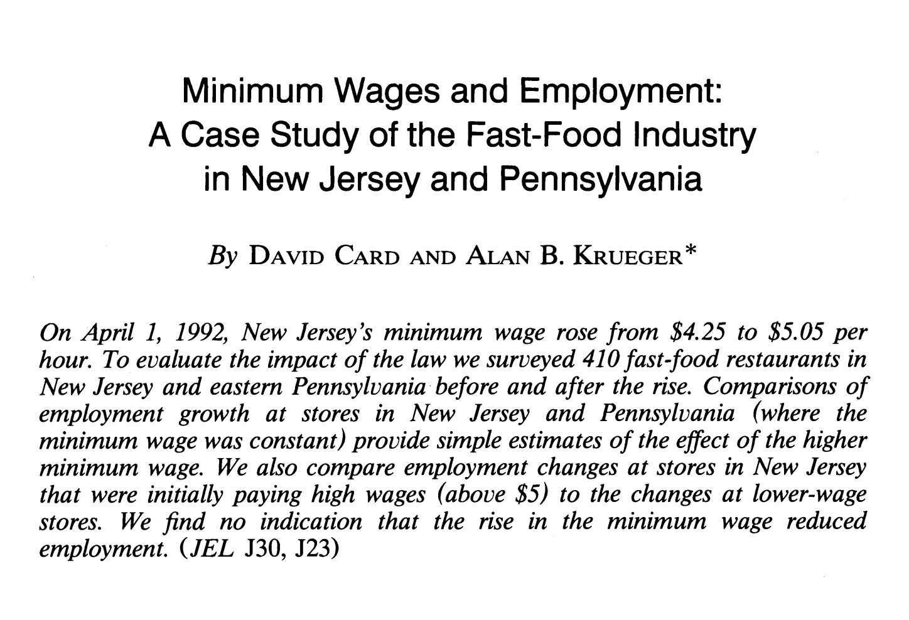
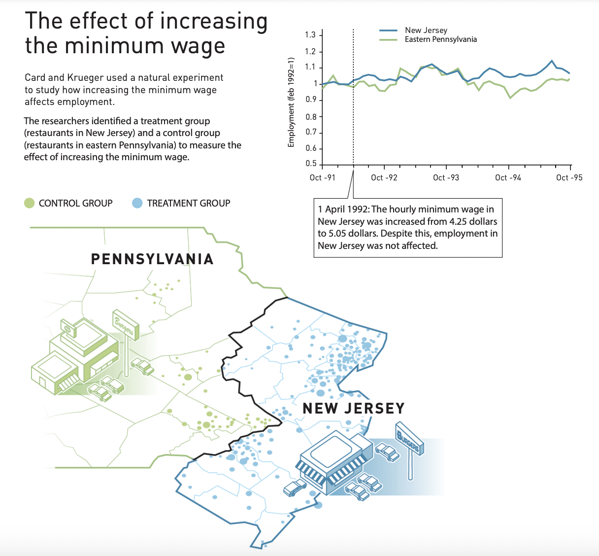
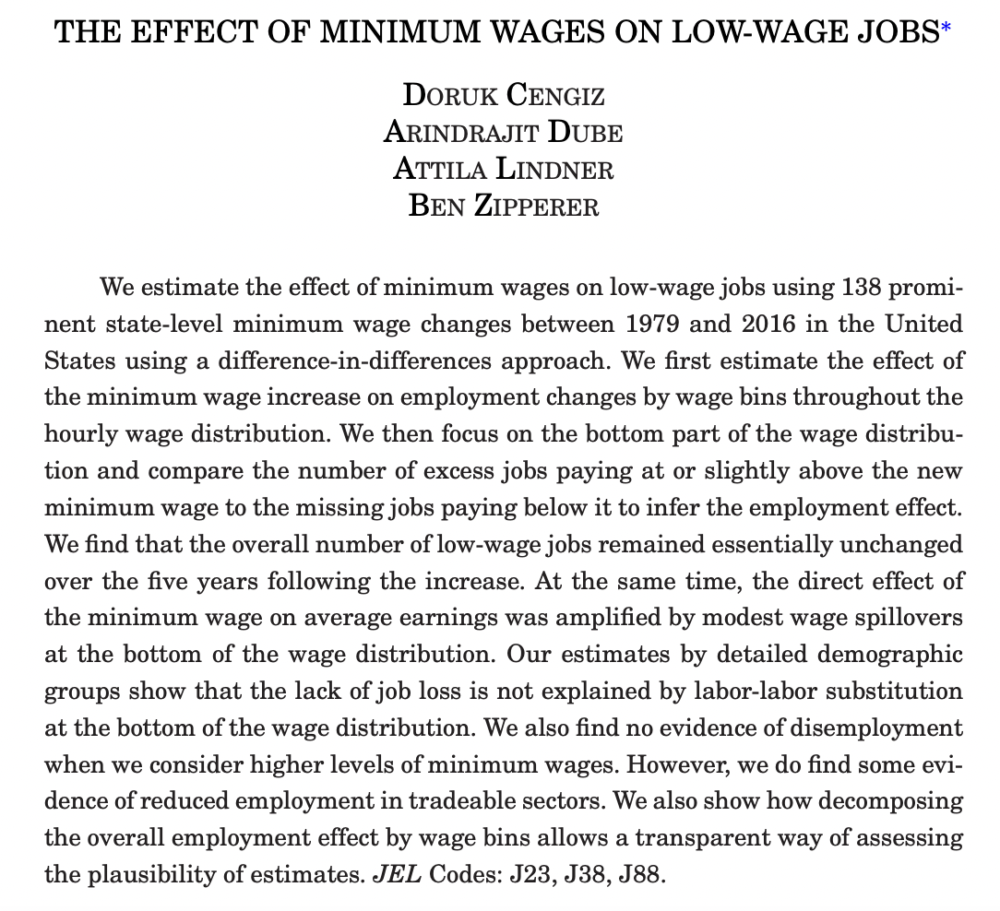
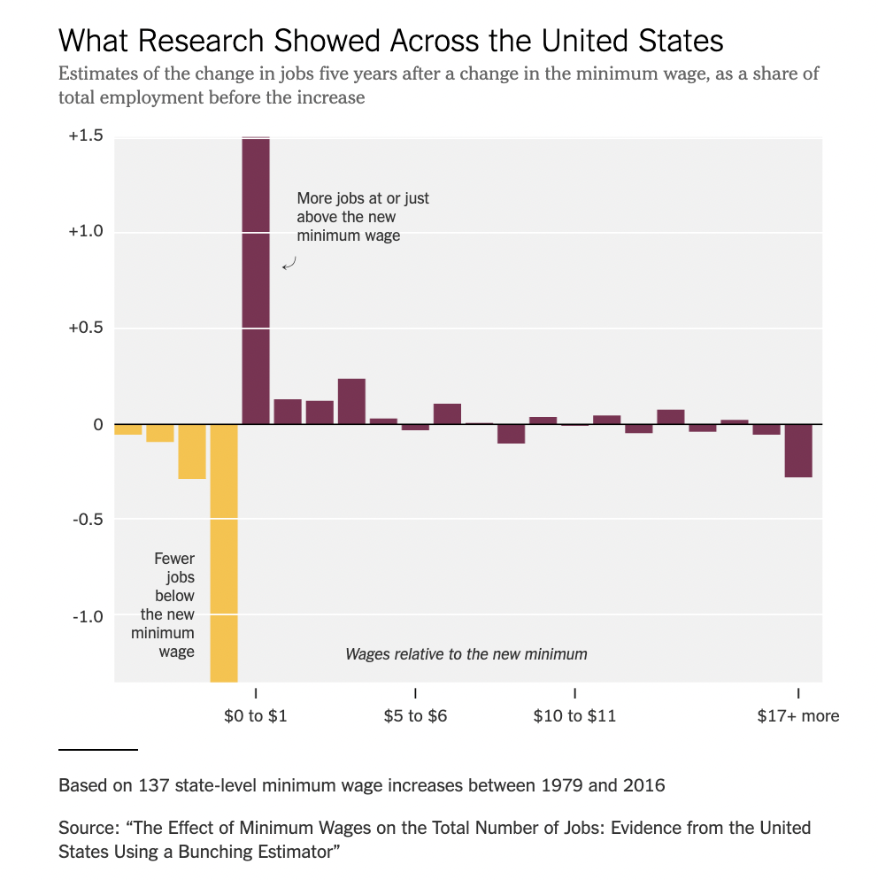
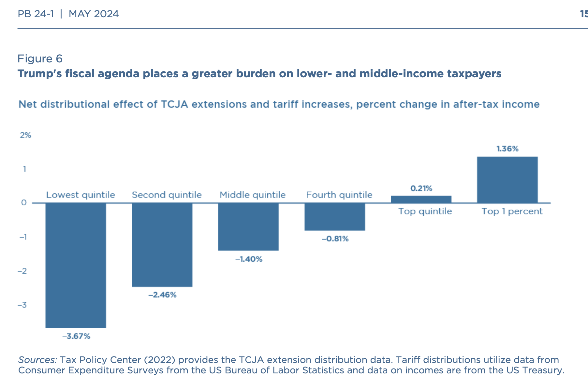

<style>

.center2 {
  margin: 0;
  position: absolute;
  top: 50%;
  left: 50%;
  -ms-transform: translate(-50%, -50%);
  transform: translate(-50%, -50%);
}

</style>

```{r setup, include = FALSE}
knitr::opts_chunk$set(echo = FALSE)
knitr::opts_chunk$set(warning = FALSE)
knitr::opts_chunk$set(message = FALSE)
knitr::opts_chunk$set(out.width = "70%")
knitr::opts_chunk$set(fig.align="center")

options(htmltools.dir.version = FALSE)
library(knitr)
library(tidyverse)
library(xaringanExtra)
library(ggplot2)
library(plotly)
library(googlesheets4)
library(dplyr)
library(knitr)
library(rtweet)

# set default options
opts_chunk$set(
  echo = FALSE,
  warnings = FALSE,
  collapse = TRUE,
  fig.width = 7.252,
  fig.height = 4,
  dpi = 300
)
# set engines
knitr::knit_engines$set("markdown")
xaringanExtra::use_tile_view()
xaringanExtra::use_panelset()
xaringanExtra::use_clipboard()
xaringanExtra::use_webcam()
xaringanExtra::use_broadcast()
xaringanExtra::use_share_again()
xaringanExtra::style_share_again(
  share_buttons = c("twitter", "linkedin", "pocket")
)

# Demand and supply plot functions
source("~/Dropbox/Clases/Micro-II/microII_plots.R")

# Ensure Xaringan opens in RStudio Viewer instead of browser
options(servr.daemon = TRUE)
# xaringan::inf_mr()
```

Interview to Mike Johnson (R) Speaker of the U.S. House of Representatives

- **Reporter**: Republican ran on lowering prices. What would you say if costs go up because of tariffs?

- **MJ**: I'm not gonna predict, um, the outcome, um -- first of all, which tariffs will be enacted and how it will affect prices we'll have to see

.center[
<video width="700" height="400" controls>
  <source src="tariffs.mp4" type="video/mp4">
  Your browser does not support the video tag.
</video>
]


---
# Introduction 

--

- Can we actually predict how certain policies will affect prices and quantities?

- Can we make qualitative and quantitative statements about this policies?

- Who benefits? Who looses?

- Are markets always working fine?

---
.center2[
# Evaluating the Gains and Losses from Government Policies—Consumer and Producer Surplus
]

---
## Consumer and Producer Surplus 

- In an unregulated, competitive market, consumers and producers buy and sell at the prevailing market price.

---
## Consumer and Producer Surplus 

- In an unregulated, competitive market, consumers and producers buy and sell at the prevailing market price.

```{r surplus01}
eq_P = 5
eq_Q = 8
set.seed(13)
plot_data <- 
  generate_supply_demand_data(
    eq_P = 5, eq_Q = 8,
    demand_elasticity = "inelastic", 
    supply_elasticity = "inelastic"
  )

supply_data <- plot_data$formulas$supply
demand_data <- plot_data$formulas$demand

plot_data <- plot_data$data

plot_supply_demand(plot_data, show_demand = F, show_supply = F, show_equilibrium = F) 
```

---
## Consumer and Producer Surplus 

- In an unregulated, competitive market, consumers and producers buy and sell at the prevailing market price.

```{r surplus02}
plot_supply_demand(plot_data, show_demand = T, show_supply = F) 
```

$$Q_d = 11.8 - 0.855 \cdot P$$

---
## Consumer and Producer Surplus 

- In an unregulated, competitive market, consumers and producers buy and sell at the prevailing market price.

```{r surplus03}
plot_supply_demand(plot_data, show_demand = F, show_supply = T) 
```

$$Q_s = 0.0155 + 0.623 \cdot P$$

---
## Consumer and Producer Surplus 

- In an unregulated, competitive market, consumers and producers buy and sell at the prevailing market price.

```{r surplus04}
plot_supply_demand(plot_data, show_demand = T, show_supply = T, show_equilibrium = F) 
```

$$Q_d = 11.8 - 0.855 \cdot P$$
$$Q_s = 0.0155 + 0.623 \cdot P$$


---
## Consumer and Producer Surplus 

- In an unregulated, competitive market, consumers and producers buy and sell at the prevailing market price.

```{r surplus05-1}
plot_supply_demand(plot_data) 
```

$$Q^* = 8, \; P^* = 5$$


---
## Consumer and Producer Surplus 

- For each consumer $i$: $WTP_i \geq P$ or $WTP_i \leq P$

```{r surplus05}
# Define reference points to highlight
highlight_Qs <- c(1)

# Get closest matching points
highlight_points <- filter_closest_Q_values(plot_data, highlight_Qs)

plot_supply_demand(plot_data, show_supply = F) +
  # Add equilibrium price
  geom_hline(yintercept = plot_data$eq_P[1], linetype = "dashed") +
  # Add highlight points
  geom_point(
    data = highlight_points,
    aes(x = Q, y = Demand), 
    size = 2.5, color = "black"
  ) +
  # Add vertical dashed lines from x-axis to the points
  geom_segment(
    data = highlight_points, 
    aes(x = Q, xend = Q, y = 0, yend = Demand), 
    linetype = "dashed", color = "gray50", alpha = .3
  ) +
  # Add horizontal dashed lines from y-axis to the points
  geom_segment(
    data = highlight_points, 
    aes(x = 0, xend = Q, y = Demand, yend = Demand), 
    linetype = "dashed", color = "gray50", alpha = .3
  ) 
```

---
## Consumer and Producer Surplus 

- For each consumer $i$: $WTP_i \geq P$ or $WTP_i \leq P$

```{r surplus06}
# Define reference points to highlight
highlight_Qs <- c(1, 3)

# Get closest matching points
highlight_points <- filter_closest_Q_values(plot_data, highlight_Qs)

plot_supply_demand(plot_data, show_supply = F) +
  # Add equilibrium price
  geom_hline(yintercept = plot_data$eq_P[1], linetype = "dashed") +
  # Add highlight points
  geom_point(
    data = highlight_points,
    aes(x = Q, y = Demand), 
    size = 2.5, color = "black"
  ) +
  # Add vertical dashed lines from x-axis to the points
  geom_segment(
    data = highlight_points, 
    aes(x = Q, xend = Q, y = 0, yend = Demand), 
    linetype = "dashed", color = "gray50", alpha = .3
  ) +
  # Add horizontal dashed lines from y-axis to the points
  geom_segment(
    data = highlight_points, 
    aes(x = 0, xend = Q, y = Demand, yend = Demand), 
    linetype = "dashed", color = "gray50", alpha = .3
  ) 
```

---
## Consumer and Producer Surplus 

- For each consumer $i$: $WTP_i \geq P$ or $WTP_i \leq P$

```{r surplus07}
# Define reference points to highlight
highlight_Qs <- c(1, 3, 6, 11)

# Get closest matching points
highlight_points <- filter_closest_Q_values(plot_data, highlight_Qs)

plot_supply_demand(plot_data, show_supply = F) +
  # Add equilibrium price
  geom_hline(yintercept = plot_data$eq_P[1], linetype = "dashed") +
  # Add highlight points
  geom_point(
    data = highlight_points,
    aes(x = Q, y = Demand), 
    size = 2.5, color = "black"
  ) +
  # Add vertical dashed lines from x-axis to the points
  geom_segment(
    data = highlight_points, 
    aes(x = Q, xend = Q, y = 0, yend = Demand), 
    linetype = "dashed", color = "gray50", alpha = .3
  ) +
  # Add horizontal dashed lines from y-axis to the points
  geom_segment(
    data = highlight_points, 
    aes(x = 0, xend = Q, y = Demand, yend = Demand), 
    linetype = "dashed", color = "gray50", alpha = .3
  ) 
```

---
## Consumer and Producer Surplus 

- Net benefit to consumer $i$: $WTP_i - P$

```{r surplus08}
# Define reference points to highlight
highlight_Qs <- c(1, 3, 6, 11)

# Get closest matching points
highlight_points <- filter_closest_Q_values(plot_data, highlight_Qs)

plot_supply_demand(plot_data, show_supply = F) +
  # Add equilibrium price
  geom_hline(yintercept = plot_data$eq_P[1], linetype = "dashed") +
  # Add vertical dashed lines from equilibrium to the points
  geom_segment(
    data = highlight_points, 
    aes(x = Q, xend = Q, y = plot_data$eq_P[1], yend = Demand), 
    linetype = "dashed", color = yellow_chapter, alpha = 1, lwd = .7
  ) +
  # Add highlight points
  geom_point(
    data = highlight_points,
    aes(x = Q, y = Demand), 
    size = 2.5, color = "black"
  ) 
```

---
## Consumer and Producer Surplus 

- **Consumer surplus**: total net benefit to consumers 

```{r surplus09}
# Define the coordinates of the consumer surplus triangle manually
consumer_surplus <- tibble(
  x = c(0, 0, plot_data$eq_Q[1]),  
  y = c(plot_data$eq_P[1], max(plot_data$Demand), plot_data$eq_P[1])  
)

# Compute the centroid for better label placement
lab_consur_x <- mean(consumer_surplus$x)
lab_consur_y <- mean(consumer_surplus$y)  # Adjust label position slightly above the centroid

# Plot with consumer surplus shading and label
plot_supply_demand(plot_data, show_supply = FALSE) +
  geom_polygon(
    data = consumer_surplus,
    aes(x = x, y = y),
    fill = yellow_chapter, alpha = 0.4  # Yellow shading with transparency
  ) +
  geom_hline(yintercept = plot_data$eq_P[1], linetype = "dashed") +
  geom_text(
    aes(x = lab_consur_x, y = lab_consur_y),
    label = "Consumer\nSurplus", fontface = "italic", size = 3, color = "black"
  )
```

$$\sum_i WTP_i - P \quad \forall \; WTP_i \geq P$$
---
## Consumer and Producer Surplus 

- For each producer $i$: $WTS_i \geq P$ or $WTS_i \leq P$

```{r surplus10}
# Define reference points to highlight
highlight_Qs <- c(1, 3, 6, 11)

# Get closest matching points
highlight_points <- filter_closest_Q_values(plot_data, highlight_Qs)

plot_supply_demand(plot_data, show_demand = F) +
  # Add equilibrium price
  geom_hline(yintercept = plot_data$eq_P[1], linetype = "dashed") +
  # Add highlight points
  geom_point(
    data = highlight_points,
    aes(x = Q, y = Supply), 
    size = 2.5, color = "black"
  ) +
  # Add vertical dashed lines from x-axis to the points
  geom_segment(
    data = highlight_points, 
    aes(x = Q, xend = Q, y = 0, yend = Supply), 
    linetype = "dashed", color = "gray50", alpha = .3
  ) +
  # Add horizontal dashed lines from y-axis to the points
  geom_segment(
    data = highlight_points, 
    aes(x = 0, xend = Q, y = Supply, yend = Supply), 
    linetype = "dashed", color = "gray50", alpha = .3
  ) 
```

---
## Consumer and Producer Surplus 

- Net benefit to producer $i$: $P - WTS_i$

```{r surplus11}
# Define reference points to highlight
highlight_Qs <- c(1, 3, 6, 11)

# Get closest matching points
highlight_points <- filter_closest_Q_values(plot_data, highlight_Qs)

plot_supply_demand(plot_data, show_demand = F) +
  # Add equilibrium price
  geom_hline(yintercept = plot_data$eq_P[1], linetype = "dashed") +
  # Add vertical dashed lines from equilibrium to the points
  geom_segment(
    data = highlight_points, 
    aes(x = Q, xend = Q, y = plot_data$eq_P[1], yend = Supply), 
    linetype = "dashed", color = green_chapter, alpha = 1, lwd = .7
  ) +
  # Add highlight points
  geom_point(
    data = highlight_points,
    aes(x = Q, y = Supply), 
    size = 2.5, color = "black"
  ) 
```

---
## Consumer and Producer Surplus 

- **Producer surplus**: the benefit that lower-cost producers enjoy by selling at the market price 

```{r surplus12}
# Define the coordinates of the triangle manually
producer_surplus <- tibble(
  x = c(0, 0, plot_data$eq_Q[1]),  # Adjust these values as needed
  y = c(plot_data$eq_P[1], min(plot_data$Supply), plot_data$eq_P[1])  # Adjust these values as needed
)

# Compute the centroid for better label placement
lab_prodsur_x <- mean(producer_surplus$x)
lab_prodsur_y <- mean(producer_surplus$y)  # Adjust label position slightly above the centroid


# Plot with manually defined triangle
plot_supply_demand(plot_data, show_demand = FALSE) +
  geom_polygon(
    data = producer_surplus,
    aes(x = x, y = y),
    fill = green_chapter, alpha = 0.4  # Yellow shading with transparency
  ) +
  geom_hline(yintercept = plot_data$eq_P[1], linetype = "dashed") +
  geom_text(
    aes(x = lab_prodsur_x, y = lab_prodsur_y),
    label = "Producer\nSurplus", fontface = "italic", size = 3, color = "black"
  )
```

$$\sum_i P - WTS_i \quad \forall \; WTS_i \leq P$$

---
## Consumer and Producer Surplus 

```{r surplus13}
plot_supply_demand(plot_data) +
  # Consumer surplus
  geom_polygon(
    data = consumer_surplus,
    aes(x = x, y = y),
    fill = yellow_chapter, alpha = 0.4  # Yellow shading with transparency
  ) +
  geom_text(
    aes(x = lab_consur_x, y = lab_consur_y),
    label = "Consumer\nSurplus", fontface = "italic", size = 3, color = "black"
  ) +
  # Producer surplus
  geom_polygon(
    data = producer_surplus,
    aes(x = x, y = y),
    fill = green_chapter, alpha = 0.4  # Yellow shading with transparency
  ) +
  geom_text(
    aes(x = lab_prodsur_x, y = lab_prodsur_y),
    label = "Producer\nSurplus", fontface = "italic", size = 3, color = "black"
  )
```

.pull-left[
Consumer surplus $\approx (8 \times (12-5)) / 2 = 28$
]


.pull-left[
Producer surplus $\approx (8 \times (5)) / 2 = 20$
]

---
## Welfare

Gains and losses to consumers and producers.

--

Together, consumer and producer surplus
measure the welfare benefit of a competitive
market.

--

Welfare allows us to evaluate quantitatively policies and market structures.

---
## Welfare: Example - Price controls

```{r price-controls01}
# Define price ceiling
p_max <- 3

plot_price_control <- 
plot_supply_demand(plot_data)

plot_price_control
```

---
## Welfare: Example - Price controls

```{r price-controls02}
# Define price ceiling
p_max <- 3

plot_price_control <- 
plot_price_control +
  # Horizontal line with price control
  geom_hline(yintercept = p_max, alpha = .7) +
  # Price control label with LaTeX-style annotation
  annotate(
    geom = "text",
    x = 0, y = p_max, 
    label = expression(P[max]),  # Using LaTeX-style notation
    size = 3, hjust = 0, vjust = -0.75, color = "black"
  )

plot_price_control
```

Price of a good has been regulated to be no higher than $P_{max} = 3$

---
## Welfare: Example - Price controls

```{r price-controls03}
p_max <- 3
# supply: supply_data "P = 0.02 + 0.62Q"
# demand: demand_data "P = 11.84 - 0.86Q"
Q_s_pmax <- ((p_max - supply_data$intercept)/supply_data$slope) # Q supplied at P_{max}
Q_d_pmax <- abs((p_max - demand_data$intercept)/demand_data$slope) # Q demanded at P = 3

P_d_pmax <- demand_data$intercept - Q_s_pmax*demand_data$slope

Q_s_pmax_rounded <- round(Q_s_pmax, 1)
Q_d_pmax_rounded <- round(Q_d_pmax, 1)

plot_price_control <- 
plot_price_control +
  # Vertical line Q_s(P_max)
  geom_segment(
    aes(x = Q_s_pmax, xend = Q_s_pmax, y = 0, yend = P_d_pmax),
    linetype = "dashed", color = "gray50"
  ) +
  # Label Q_s(P_max)
  annotate(
    "text", x = Q_s_pmax, y = 0,  # Slightly shift Q* inside the x-axis
    label = bquote(Q["s"](P[max]) == .(Q_s_pmax_rounded)),  # Proper LaTeX-style notation
    size = 2.75, hjust = -.075, vjust = -.1
  ) 

plot_price_control
```

At $P_{max} = 3$, the supply equals $\approx 4.8$

---
## Welfare: Example - Price controls

```{r price-controls04}
p_max <- 3
# supply: supply_data "P = 0.02 + 0.62Q"
# demand: demand_data "P = 11.84 - 0.86Q"
Q_s_pmax <- ((p_max - supply_data$intercept)/supply_data$slope) # Q supplied at P_{max}
Q_d_pmax <- abs((p_max - demand_data$intercept)/demand_data$slope) # Q demanded at P = 3

P_d_pmax <- demand_data$intercept - Q_s_pmax*demand_data$slope

Q_s_pmax_rounded <- round(Q_s_pmax, 1)
Q_d_pmax_rounded <- round(Q_d_pmax, 1)

plot_price_control <- 
plot_price_control +
  # Vertical line Q_d(P_max)
  geom_segment(
    aes(x = Q_d_pmax, xend = Q_d_pmax, y = 0, yend = p_max),
    linetype = "dashed", color = "gray50"
  ) +
  # Label Q_d(P_max)
  annotate(
    "text", x = Q_d_pmax, y = 0,  # Slightly shift Q* inside the x-axis
    label = bquote(Q["d"](P[max]) == .(Q_d_pmax_rounded)),  # Proper LaTeX-style notation
    size = 2.75, hjust = -.075, vjust = -.1
  ) 

plot_price_control
```

At $P_{max} = 3$, the demand equals $\approx 10.3$

---
## Welfare: Example - Price controls

```{r price-controls05}
p_max <- 3
# supply: supply_data "P = 0.02 + 0.62Q"
# demand: demand_data "P = 11.84 - 0.86Q"
Q_s_pmax <- ((p_max - supply_data$intercept)/supply_data$slope) # Q supplied at P_{max}
Q_d_pmax <- abs((p_max - demand_data$intercept)/demand_data$slope) # Q demanded at P = 3

P_d_pmax <- demand_data$intercept - Q_s_pmax*demand_data$slope

Q_s_pmax_rounded <- round(Q_s_pmax, 1)
Q_d_pmax_rounded <- round(Q_d_pmax, 1)

plot_price_control <- 
plot_price_control +
  # Bracket-like Shortage Segment
  geom_segment(
    aes(x = Q_s_pmax, xend = Q_d_pmax, y = p_max - 0.5, yend = p_max - 0.5),
    color = "red", size = 1
  ) +
  # Small vertical brackets
  geom_segment(
    aes(x = Q_s_pmax, xend = Q_s_pmax, y = p_max - 0.7, yend = p_max - 0.3),
    color = "red", size = 1
  ) +
  geom_segment(
    aes(x = Q_d_pmax, xend = Q_d_pmax, y = p_max - 0.7, yend = p_max - 0.3),
    color = "red", size = 1
  ) +
  # Label for Shortage
  annotate(
    "text", x = (Q_s_pmax + Q_d_pmax) / 2, y = p_max - 1,
    label = "Shortage", color = "red", size = 3, fontface = "italic"
  )

plot_price_control
```

At $P_{max} = 3$, **shortage** or **excess demand** $\approx 5.5$

---
## Welfare: Example - Price controls

**Change in Consumer Surplus**: Some consumers are worse off as a result of the policy, and others are better off.

---
## Welfare: Example - Price controls

Recall, net benefit to consumer $i$: $WTP_i - P_{max}$

```{r price-controls06}
# Define reference points to highlight
highlight_Qs <- c(1, 3, 6)

# Get closest matching points
highlight_points <- filter_closest_Q_values(plot_data, highlight_Qs)

plot_price_control +
  # Add vertical dashed lines from equilibrium to the points
  geom_segment(
    data = highlight_points, 
    aes(x = Q, xend = Q, y = p_max, yend = Demand), 
    linetype = "dashed", color = yellow_chapter, alpha = 1, lwd = .7
  ) +
  # Add highlight points
  geom_point(
    data = highlight_points,
    aes(x = Q, y = Demand), 
    size = 2.5, color = "black"
  ) 
```

---
## Welfare: Example - Price controls

Recall, net benefit to consumer $i$: $WTP_i - P_{max} \;$ and initial Consumer Surplus

```{r price-controls07}
plot_price_control +
  # Consumer surplus
  geom_polygon(
    data = consumer_surplus,
    aes(x = x, y = y),
    fill = yellow_chapter, alpha = 0.4  # Yellow shading with transparency
  ) +
  geom_text(
    aes(x = lab_consur_x, y = lab_consur_y),
    label = "Initial\nConsumer\nSurplus", fontface = "italic", size = 3, color = "black"
  )
```

---
## Welfare: Example - Price controls

**Change in Consumer Surplus**

```{r price-controls08}
# Define reference points to highlight
highlight_Qs <- c(1, 3, Q_s_pmax)

# Get closest matching points
highlight_points <- filter_closest_Q_values(plot_data, highlight_Qs)

plot_price_control +
  # Add vertical dashed lines from equilibrium to the points
  geom_segment(
    data = highlight_points, 
    aes(x = Q, xend = Q, y = p_max, yend = Demand), 
    linetype = "dashed", color = yellow_chapter, alpha = 1, lwd = .7
  ) +
  # Add highlight points
  geom_point(
    data = highlight_points,
    aes(x = Q, y = Demand), 
    size = 2.5, color = "black"
  ) 
```

- Better off: purchase the good (they are lucky or are willing to wait in line) 

---
## Welfare: Example - Price controls

**Change in Consumer Surplus**

```{r price-controls09}
added_consumer_surplus <- 
  tibble(
    x = c(0, 0, Q_s_pmax, Q_s_pmax),
    y = c(3, 5, 5, 3)
  )

plot_price_control +
  # Consumer surplus
  geom_polygon(
    data = added_consumer_surplus,
    aes(x = x, y = y),
    fill = yellow_chapter, alpha = 0.8  # Yellow shading with transparency
  ) +
  geom_text(
    aes(x = mean(added_consumer_surplus$x), y = mean(added_consumer_surplus$y)),
    label = "Added\nConsumer\nSurplus", fontface = "italic", size = 2, color = "black"
  )
```

- Better off: purchase the good (they are lucky or are willing to wait in line) 

---
## Welfare: Example - Price controls

**Change in Consumer Surplus**

```{r price-controls10}
# Define reference points to highlight
highlight_Qs <- c(Q_s_pmax, 6.5, 8)

# Get closest matching points
highlight_points <- filter_closest_Q_values(plot_data, highlight_Qs)

plot_price_control +
  # Add vertical dashed lines from equilibrium to the points
  geom_segment(
    data = highlight_points, 
    aes(x = Q, xend = Q, y = eq_P, yend = Demand), 
    linetype = "dashed", color = "#ff6961", alpha = 1, lwd = .7
  ) +
  # Add highlight points
  geom_point(
    data = highlight_points,
    aes(x = Q, y = Demand), 
    size = 2.5, color = "black"
  ) 
```


- Worse off: rationed out of the market since $Q_s (P_{max}) < Q*$ 

---
## Welfare: Example - Price controls

**Change in Consumer Surplus**

```{r price-controls11}
loss_consumer_surplus <- 
  tibble(
    x = c(Q_s_pmax, Q_s_pmax, eq_Q),
    y = c(eq_P, highlight_points$Demand[1], eq_P)
  )


plot_price_control +
  # Loss in consumer surplus
  geom_polygon(
    data = loss_consumer_surplus,
    aes(x = x, y = y),
    fill = "#ff6961", alpha = 0.8  # Yellow shading with transparency
  ) +
  geom_text(
    aes(x = mean(loss_consumer_surplus$x), y = mean(loss_consumer_surplus$y)),
    label = "Lost\nConsumer\nSurplus", fontface = "italic", size = 2, color = "black"
  )
```


- Worse off: rationed out of the market since $Q_s (P_{max}) < Q*$ 

---
## Welfare: Example - Price controls

**Change in Consumer Surplus**: Added - Lost

```{r price-controls12}
plot_delta_cs <- 
plot_price_control +
  # Initial consumer surplus
  geom_polygon(
    data = consumer_surplus,
    aes(x = x, y = y),
    fill = yellow_chapter, alpha = 0.4  # Yellow shading with transparency
  ) +
  geom_text(
    aes(x = mean(consumer_surplus$x), y = mean(consumer_surplus$y)),
    label = "Initial\nConsumer\nSurplus", fontface = "italic", size = 2, color = "black"
  ) +
  # Consumer surplus lost
  geom_polygon(
    data = loss_consumer_surplus,
    aes(x = x, y = y),
    fill = "#ff6961", alpha = 0.8  # Yellow shading with transparency
  ) +
  geom_text(
    aes(x = mean(loss_consumer_surplus$x), y = mean(loss_consumer_surplus$y)),
    label = "Lost\nConsumer\nSurplus", fontface = "italic", size = 2, color = "black"
  ) +
  # Consumer surplus added
  geom_polygon(
    data = added_consumer_surplus,
    aes(x = x, y = y),
    fill = yellow_chapter, alpha = 0.8  # Yellow shading with transparency
  ) +
  geom_text(
    aes(x = mean(added_consumer_surplus$x), y = mean(added_consumer_surplus$y)),
    label = "Added\nConsumer\nSurplus", fontface = "italic", size = 2, color = "black"
  )

plot_delta_cs
```

$$\Delta CS \approx \textit{Added CS} - \textit{Lost CS}$$

---
## Welfare: Example - Price controls

**Change in Consumer Surplus**: Added - Lost

```{r price-controls13}
plot_delta_cs
```

$$\Delta CS \approx [(4.8)*(5-3)] - [(8-4.8)*(7.7-5)/2]$$
---
## Welfare: Example - Price controls

**Change in Consumer Surplus**: Added - Lost

```{r price-controls14}
plot_delta_cs
```

$$\Delta CS \approx (9.6) - (4.3) \approx 5.3 > 0$$

---
## Welfare: Example - Price controls

**Change in Producer Surplus**: Producers with low production costs will stay in the market, but will receive a lower price for their output, while other producers will leave the market.

---
## Welfare: Example - Price controls

Recall, net benefit to producer $i$: $P_{max} - WTS_i$

```{r price-controls15}
# Define reference points to highlight
highlight_Qs <- c(1, 3, 6)

# Get closest matching points
highlight_points <- filter_closest_Q_values(plot_data, highlight_Qs)

plot_price_control +
  # Add vertical dashed lines from equilibrium to the points
  geom_segment(
    data = highlight_points, 
    aes(x = Q, xend = Q, y = p_max, yend = Supply), 
    linetype = "dashed", color = green_chapter, alpha = 1, lwd = .7
  ) +
  # Add highlight points
  geom_point(
    data = highlight_points,
    aes(x = Q, y = Supply), 
    size = 2.5, color = "black"
  ) 
```

---
## Welfare: Example - Price controls

Recall, net benefit to producer $i$: $P_{max} - WTS_i  \;$ and initial Consumer Surplus

```{r price-controls16}
plot_price_control +
  # Consumer surplus
  geom_polygon(
    data = producer_surplus,
    aes(x = x, y = y),
    fill = green_chapter, alpha = 0.4  # Yellow shading with transparency
  ) +
  geom_text(
    aes(x = mean(producer_surplus$x), y = mean(producer_surplus$y)),
    label = "Initial\nProducer\nSurplus", fontface = "italic", size = 3, color = "black"
  )
```

---
## Welfare: Example - Price controls

**Change in Producer Surplus**

```{r price-controls17}
# Define reference points to highlight
highlight_Qs <- c(1, 3)

# Get closest matching points
highlight_points <- filter_closest_Q_values(plot_data, highlight_Qs)

plot_price_control +
  # Add vertical dashed lines from equilibrium to the points
  geom_segment(
    data = highlight_points, 
    aes(x = Q, xend = Q, y = eq_P, yend = Supply), 
    linetype = "dashed", color = green_chapter, alpha = 1, lwd = .7
  ) +
  # Add highlight points
  geom_point(
    data = highlight_points,
    aes(x = Q, y = Supply), 
    size = 2.5, color = "black"
  ) 
```

- Worse off: Producers with low production costs will stay in the market, but will receive a lower price for their output

---
## Welfare: Example - Price controls

**Change in Producer Surplus**

```{r price-controls18}
lost_supplier_surplus1 <- 
  tibble(
    x = c(0, 0, Q_s_pmax, Q_s_pmax),
    y = c(3, 5, 5, 3)
  )

plot_price_control +
  # Producer surplus
  geom_polygon(
    data = lost_supplier_surplus1,
    aes(x = x, y = y),
    fill = green_chapter, alpha = 0.8  # Yellow shading with transparency
  ) +
  geom_text(
    aes(x = mean(lost_supplier_surplus1$x), y = mean(lost_supplier_surplus1$y)),
    label = "Lost\nProducer\nSurplus", fontface = "italic", size = 2, color = "black"
  )
```

- Worse off: Producers with low production costs will stay in the market, but will receive a lower price for their output

---
## Welfare: Example - Price controls

**Change in Producer Surplus**

```{r price-controls19}
# Define reference points to highlight
highlight_Qs <- c(Q_s_pmax, 6.25)

# Get closest matching points
highlight_points <- filter_closest_Q_values(plot_data, highlight_Qs)

plot_price_control +
  # Add vertical dashed lines from equilibrium to the points
  geom_segment(
    data = highlight_points, 
    aes(x = Q, xend = Q, y = eq_P, yend = Supply), 
    linetype = "dashed", color = "#B39EB5", alpha = 1, lwd = .7
  ) +
  # Add highlight points
  geom_point(
    data = highlight_points,
    aes(x = Q, y = Supply), 
    size = 2.5, color = "black"
  ) 
```

- Worse off: Other producers will leave the market.

---
## Welfare: Example - Price controls

**Change in Producer Surplus**

```{r price-controls20}
lost_supplier_surplus2 <- 
  tibble(
    x = c(Q_s_pmax, Q_s_pmax, eq_Q),
    y = c(p_max, eq_P, eq_P)
  )

plot_price_control +
  # Consumer surplus
  geom_polygon(
    data = lost_supplier_surplus2,
    aes(x = x, y = y),
    fill = "#B39EB5", alpha = 0.8  # Yellow shading with transparency
  ) +
  geom_text(
    aes(x = mean(lost_supplier_surplus2$x), y = mean(lost_supplier_surplus2$y)),
    label = "Lost\nProducer\nSurplus", fontface = "italic", size = 2, color = "black"
  )
```

- Worse off: Other producers will leave the market.

---
## Welfare: Example - Price controls

**Change in Producer Surplus: ** - Lost #1 - Lost #2

```{r price-controls21}
plot_delta_ps <- 
  plot_price_control +
    # Initial consumer surplus
    geom_polygon(
      data = producer_surplus,
      aes(x = x, y = y),
      fill = green_chapter, alpha = 0.4  # Yellow shading with transparency
    ) +
    # Producer surplus
    geom_polygon(
      data = lost_supplier_surplus1,
      aes(x = x, y = y),
      fill = green_chapter, alpha = 0.8  # Yellow shading with transparency
    ) +
    geom_text(
      aes(x = mean(lost_supplier_surplus1$x), y = mean(lost_supplier_surplus1$y)),
      label = "Lost\nProducer\nSurplus", fontface = "italic", size = 1.5, color = "black"
    ) +
    # Consumer surplus
    geom_polygon(
      data = lost_supplier_surplus2,
      aes(x = x, y = y),
      fill = "#B39EB5", alpha = 0.8  # Yellow shading with transparency
    ) +
    geom_text(
      aes(x = mean(lost_supplier_surplus2$x), y = mean(lost_supplier_surplus2$y)),
      label = "Lost\nProducer\nSurplus", fontface = "italic", size = 1, color = "black"
    )
    
plot_delta_ps
```

$$\Delta PS = - \textit{Lost #1} - \textit{Lost #2}$$
---
## Welfare: Example - Price controls

**Change in Producer Surplus: ** - Lost #1 - Lost #2

```{r price-controls22}
plot_delta_ps
```

$$\Delta PS \approx - [(4.8)*(5-3)] - [(8-4.8)*(5-3)/2]$$

---
## Welfare: Example - Price controls

**Change in Producer Surplus:** - Lost #1 - Lost #2

```{r price-controls23}
plot_delta_ps
```

$$\Delta PS \approx - (9.6) - (3.2)  \approx  - 12.8$$

---
## Welfare: Example - Price controls

**Change in Producer Surplus:** Producers clearly lose as a result of price controls

```{r price-controls24}
plot_delta_ps
```

---
## Welfare: Example - Price controls

Is the loss to producers from price controls offset by the gain to consumers?

--

**Deadweight loss**: Net loss of total (consumer plus producer) surplus.

--

```{r price-controls25}
plot_price_control
```

---
## Welfare: Example - Price controls

Is the loss to producers from price controls offset by the gain to consumers?

**Deadweight loss**: Net loss of total (consumer plus producer) surplus.


```{r price-controls26}
plot_price_control +
  # Lost producer surplus
  geom_polygon(
    data = lost_supplier_surplus2,
    aes(x = x, y = y),
    fill = "#B39EB5", alpha = 0.8  # Yellow shading with transparency
  ) +
  geom_text(
    aes(x = mean(lost_supplier_surplus2$x), y = mean(lost_supplier_surplus2$y)),
    label = "Lost\nProducer\nSurplus", fontface = "italic", size = 2, color = "black"
  ) +
  # Loss in consumer surplus
  geom_polygon(
    data = loss_consumer_surplus,
    aes(x = x, y = y),
    fill = "#ff6961", alpha = 0.8  # Yellow shading with transparency
  ) +
  geom_text(
    aes(x = mean(loss_consumer_surplus$x), y = mean(loss_consumer_surplus$y)),
    label = "Lost\nConsumer\nSurplus", fontface = "italic", size = 2, color = "black"
  )
```

---
## Welfare: Example - Price controls

Is the loss to producers from price controls offset by the gain to consumers?

**Deadweight loss**: Net loss of total (consumer plus producer) surplus.

```{r price-controls27}
plot_price_control +
  # Added consumer surplus
  geom_polygon(
    data = added_consumer_surplus,
    aes(x = x, y = y),
    fill = yellow_chapter, alpha = 0.8  # Yellow shading with transparency
  ) +
  geom_text(
    aes(x = mean(added_consumer_surplus$x), y = mean(added_consumer_surplus$y)),
    label = "Added\nConsumer\nSurplus", fontface = "italic", size = 2, color = "black"
  ) 
  # # Lost producer surplus 1
  # geom_polygon(
  #   data = lost_supplier_surplus1,
  #   aes(x = x, y = y),
  #   fill = "#B39EB5", alpha = 0.8  # Yellow shading with transparency
  # ) +
  # geom_text(
  #   aes(x = mean(lost_supplier_surplus1$x), y = mean(lost_supplier_surplus1$y)),
  #   label = "Lost\nProducer\nSurplus", fontface = "italic", size = 2, color = "black"
  # ) 
```

---
## Welfare: Example - Price controls

Is the loss to producers from price controls offset by the gain to consumers?

**Deadweight loss**: Net loss of total (consumer plus producer) surplus.

```{r price-controls28}
plot_price_control +
  # Lost producer surplus 1
  geom_polygon(
    data = lost_supplier_surplus1,
    aes(x = x, y = y),
    fill = "#B39EB5", alpha = 0.8  # Yellow shading with transparency
  ) +
  geom_text(
    aes(x = mean(lost_supplier_surplus1$x), y = mean(lost_supplier_surplus1$y)),
    label = "Lost\nProducer\nSurplus", fontface = "italic", size = 2, color = "black"
  )
```

---
## Welfare: Example - Price controls

Is the loss to producers from price controls offset by the gain to consumers?

**Deadweight loss**: Net loss of total (consumer plus producer) surplus.

```{r price-controls29}
plot_price_control +
  geom_polygon(
    data = lost_supplier_surplus1,
    aes(x = x, y = y),
    fill = "#FF954F", alpha = 0.8  # Yellow shading with transparency
  ) +
  geom_text(
    aes(x = mean(lost_supplier_surplus1$x), y = mean(lost_supplier_surplus1$y)),
    label = "A", fontface = "bold", size = 3, color = "black"
  )
```

---
## Welfare: Example - Price controls

Is the loss to producers from price controls offset by the gain to consumers?

**Deadweight loss**: Net loss of total (consumer plus producer) surplus.

```{r price-controls30}
plot_price_control +
  geom_polygon(
    data = lost_supplier_surplus1,
    aes(x = x, y = y),
    fill = "#FF954F", alpha = 0.8  # Yellow shading with transparency
  ) +
  geom_text(
    aes(x = mean(lost_supplier_surplus1$x), y = mean(lost_supplier_surplus1$y)),
    label = "A", fontface = "bold", size = 3, color = "black"
  ) +
  # Lost producer surplus
  geom_polygon(
    data = lost_supplier_surplus2,
    aes(x = x, y = y),
    fill = "#B39EB5", alpha = 0.8  # Yellow shading with transparency
  ) +
  geom_text(
    aes(x = mean(lost_supplier_surplus2$x), y = mean(lost_supplier_surplus2$y)),
    label = "C", fontface = "bold", size = 3, color = "black"
  ) +
  # Loss in consumer surplus
  geom_polygon(
    data = loss_consumer_surplus,
    aes(x = x, y = y),
    fill = "#ff6961", alpha = 0.8  # Yellow shading with transparency
  ) +
  geom_text(
    aes(x = mean(loss_consumer_surplus$x), y = mean(loss_consumer_surplus$y)),
    label = "B", fontface = "bold", size = 3, color = "black"
  )
  
```

---
## Welfare: Example - Price controls

Is the loss to producers from price controls offset by the gain to consumers?

**Deadweight loss** $= \Delta CS + \Delta PS$

```{r price-controls31}
plot_price_control +
  geom_polygon(
    data = lost_supplier_surplus1,
    aes(x = x, y = y),
    fill = "#FF954F", alpha = 0.8  # Yellow shading with transparency
  ) +
  geom_text(
    aes(x = mean(lost_supplier_surplus1$x), y = mean(lost_supplier_surplus1$y)),
    label = "A", fontface = "bold", size = 3, color = "black"
  ) +
  # Lost producer surplus
  geom_polygon(
    data = lost_supplier_surplus2,
    aes(x = x, y = y),
    fill = "#B39EB5", alpha = 0.8  # Yellow shading with transparency
  ) +
  geom_text(
    aes(x = mean(lost_supplier_surplus2$x), y = mean(lost_supplier_surplus2$y)),
    label = "C", fontface = "bold", size = 3, color = "black"
  ) +
  # Loss in consumer surplus
  geom_polygon(
    data = loss_consumer_surplus,
    aes(x = x, y = y),
    fill = "#ff6961", alpha = 0.8  # Yellow shading with transparency
  ) +
  geom_text(
    aes(x = mean(loss_consumer_surplus$x), y = mean(loss_consumer_surplus$y)),
    label = "B", fontface = "bold", size = 3, color = "black"
  )
  
```

---
## Welfare: Example - Price controls

Is the loss to producers from price controls offset by the gain to consumers? **No.**

**Deadweight loss** $= (A - B) + (-A-C) = - B -C$

```{r price-controls32}
plot_price_control +
  # Lost producer surplus
  geom_polygon(
    data = lost_supplier_surplus2,
    aes(x = x, y = y),
    fill = "#B39EB5", alpha = 0.8  # Yellow shading with transparency
  ) +
  geom_text(
    aes(x = mean(lost_supplier_surplus2$x), y = mean(lost_supplier_surplus2$y)),
    label = "C", fontface = "bold", size = 3, color = "black"
  ) +
  # Loss in consumer surplus
  geom_polygon(
    data = loss_consumer_surplus,
    aes(x = x, y = y),
    fill = "#ff6961", alpha = 0.8  # Yellow shading with transparency
  ) +
  geom_text(
    aes(x = mean(loss_consumer_surplus$x), y = mean(loss_consumer_surplus$y)),
    label = "B", fontface = "bold", size = 3, color = "black"
  )
  
```

---
.center2[
## Recall: Which type of market are we studying?
]

---
## Welfare: Is the producer always the one losing?

--

No. Consumers can also be worse off. 
--
It will depend on the **Demand (price) elasticity**: how much consumers’ demand for a good will change if the price changes.
 
--

$$\varepsilon = - \frac{\% \textit{change in demand}}{\%  \textit{change in price}} = - \frac{100 (\frac{\Delta Q}{Q})}{100 (\frac{\Delta P}{P})}$$

--

Which functional form for the demand function allow us to estimate price elasticity? 
--
 Logaritmic function.

$$ln(Q) = ln(P) \Rightarrow \frac{d ln (Q)}{d Q} = \frac{d ln (P)}{d P} \iff \frac{ \frac{1}{Q}}{d Q} = \frac{\frac{1}{P}}{d P} \iff \frac{d Q}{Q} = \frac{d P}{P}$$

---
## Welfare: Is the producer always the one losing?

No. Consumers can also be worse off. It will depend on the **Demand (price) elasticity**.

```{r price-controls33}
p_max <- 3

plot_data_inel <- 
  generate_supply_demand_data(
    demand_intercept = 35, demand_slope = 3,
    supply_intercept = 0.0155, supply_slope = 0.623
  )

plot_data_inel <- plot_data_inel$data

eq_P <- plot_data_inel$eq_P[1]
eq_Q <- plot_data_inel$eq_Q[1]

plot_supply_demand(plot_data_inel) 
```

$$Q_d = 35 - 3 \cdot P ,\quad Q_s = 0.0155 + 0.623 \cdot P$$

---
## Welfare: Is the producer always the one losing?

No. Consumers can also be worse off. It will depend on the **Demand (price) elasticity**.

```{r price-controls34}
# Define the coordinates of the consumer surplus triangle manually
consumer_surplus <- tibble(
  x = c(0, 0, plot_data_inel$eq_Q[1]),  
  y = c(plot_data_inel$eq_P[1], max(plot_data_inel$Demand), plot_data_inel$eq_P[1])  
)

# Define the coordinates of the triangle manually
producer_surplus <- tibble(
  x = c(0, 0, plot_data_inel$eq_Q[1]),  # Adjust these values as needed
  y = c(plot_data_inel$eq_P[1], min(plot_data_inel$Supply), plot_data_inel$eq_P[1])  # Adjust these values as needed
)

plot_supply_demand(plot_data_inel) +
  # Consumer surplus
  geom_polygon(
    data = consumer_surplus,
    aes(x = x, y = y),
    fill = yellow_chapter, alpha = 0.4  # Yellow shading with transparency
  ) +
  geom_text(
    aes(x = mean(consumer_surplus$x), y = mean(consumer_surplus$y)),
    label = "Consumer\nSurplus", fontface = "italic", size = 3, color = "black"
  ) +
  # Producer surplus
  geom_polygon(
    data = producer_surplus,
    aes(x = x, y = y),
    fill = green_chapter, alpha = 0.4  # Yellow shading with transparency
  ) +
  geom_text(
    aes(x = mean(producer_surplus$x), y = mean(producer_surplus$y)),
    label = "Producer\nSurplus", fontface = "italic", size = 3, color = "black"
  )
```


---
## Welfare: Is the producer always the one losing?

No. Consumers can also be worse off. It will depend on the **Demand (price) elasticity**.

```{r price-controls35}
p_max <- 3

plot_data_inel <- 
  generate_supply_demand_data(
    demand_intercept = 35, demand_slope = 3,
    supply_intercept = 0.0155, supply_slope = 0.623
  )

supply_data <- plot_data_inel$formulas$supply
demand_data <- plot_data_inel$formulas$demand

plot_data_inel <- plot_data_inel$data

plot_price_control <-
plot_supply_demand(plot_data_inel) +
  # Horizontal line with price control
  geom_hline(yintercept = p_max, alpha = .7) +
  # Price control label with LaTeX-style annotation
  annotate(
    geom = "text",
    x = 0, y = p_max, 
    label = expression(P[max]),  # Using LaTeX-style notation
    size = 3, hjust = 0, vjust = -0.75, color = "black"
  )

# supply: supply_data "P = 0.02 + 0.62Q"
# demand: demand_data "P = 11.84 - 0.86Q"
Q_s_pmax <- ((p_max - supply_data$intercept)/supply_data$slope) # Q supplied at P_{max}
Q_d_pmax <- abs((p_max - demand_data$intercept)/demand_data$slope) # Q demanded at P = 3

P_d_pmax <- demand_data$intercept - Q_s_pmax*demand_data$slope

Q_s_pmax_rounded <- round(Q_s_pmax, 1)
Q_d_pmax_rounded <- round(Q_d_pmax, 1)

plot_price_control <- 
  plot_price_control +
  # Vertical line Q_s(P_max)
  geom_segment(
    aes(x = Q_s_pmax, xend = Q_s_pmax, y = 0, yend = P_d_pmax),
    linetype = "dashed", color = "gray50"
  ) +
  # Label Q_s(P_max)
  annotate(
    "text", x = Q_s_pmax, y = 0,  # Slightly shift Q* inside the x-axis
    label = bquote(Q["s"](P[max]) == .(Q_s_pmax_rounded)),  # Proper LaTeX-style notation
    size = 2.75, hjust = -.075, vjust = -.1
  ) 

plot_price_control <- 
  plot_price_control +
  # Vertical line Q_d(P_max)
  geom_segment(
    aes(x = Q_d_pmax, xend = Q_d_pmax, y = 0, yend = p_max),
    linetype = "dashed", color = "gray50"
  ) +
  # Label Q_d(P_max)
  annotate(
    "text", x = Q_d_pmax, y = 0,  # Slightly shift Q* inside the x-axis
    label = bquote(Q["d"](P[max]) == .(Q_d_pmax_rounded)),  # Proper LaTeX-style notation
    size = 2.75, hjust = -.075, vjust = -.1
  ) 

plot_price_control <- 
  plot_price_control +
  # Bracket-like Shortage Segment
  geom_segment(
    aes(x = Q_s_pmax, xend = Q_d_pmax, y = p_max - 0.5, yend = p_max - 0.5),
    color = "red", size = 1
  ) +
  # Small vertical brackets
  geom_segment(
    aes(x = Q_s_pmax, xend = Q_s_pmax, y = p_max - 0.7, yend = p_max - 0.3),
    color = "red", size = 1
  ) +
  geom_segment(
    aes(x = Q_d_pmax, xend = Q_d_pmax, y = p_max - 0.7, yend = p_max - 0.3),
    color = "red", size = 1
  ) +
  # Label for Shortage
  annotate(
    "text", x = (Q_s_pmax + Q_d_pmax) / 2, y = p_max - 1,
    label = "Shortage", color = "red", size = 3, fontface = "italic"
  )

plot_price_control
```

---
## Welfare: Is the producer always the one losing?

No. Consumers can also be worse off. It will depend on the **Demand (price) elasticity**.

```{r price-controls36}
p_max <- 3

plot_data_inel <- 
  generate_supply_demand_data(
    demand_intercept = 35, demand_slope = 3,
    supply_intercept = 0.0155, supply_slope = 0.623
  )

supply_data <- plot_data_inel$formulas$supply
demand_data <- plot_data_inel$formulas$demand

plot_data_inel <- plot_data_inel$data

eq_P <- plot_data_inel$eq_P[1]
eq_Q <- plot_data_inel$eq_Q[1]

Q_s_pmax <- ((p_max - supply_data$intercept)/supply_data$slope) # Q supplied at P_{max}
Q_d_pmax <- abs((p_max - demand_data$intercept)/demand_data$slope) # Q demanded at P = 3

P_d_pmax <- demand_data$intercept - Q_s_pmax*demand_data$slope

Q_s_pmax_rounded <- round(Q_s_pmax, 1)
Q_d_pmax_rounded <- round(Q_d_pmax, 1)

lost_supplier_surplus1 <- 
  tibble(
    x = c(0, 0, Q_s_pmax, Q_s_pmax),
    y = c(p_max, eq_P, eq_P, p_max)
  )

lost_supplier_surplus2 <- 
  tibble(
    x = c(Q_s_pmax, Q_s_pmax, eq_Q),
    y = c(p_max, eq_P, eq_P)
  )

loss_consumer_surplus <- 
  tibble(
    x = c(Q_s_pmax, Q_s_pmax, eq_Q),
    y = c(eq_P, P_d_pmax, eq_P)
  )

plot_price_control +
  geom_polygon(
    data = lost_supplier_surplus1,
    aes(x = x, y = y),
    fill = "#FF954F", alpha = 0.8  # Yellow shading with transparency
  ) +
  geom_text(
    aes(x = mean(lost_supplier_surplus1$x), y = mean(lost_supplier_surplus1$y)),
    label = "A", fontface = "bold", size = 3, color = "black"
  ) +
  # Lost producer surplus
  geom_polygon(
    data = lost_supplier_surplus2,
    aes(x = x, y = y),
    fill = "#B39EB5", alpha = 0.8  # Yellow shading with transparency
  ) +
  geom_text(
    aes(x = mean(lost_supplier_surplus2$x), y = mean(lost_supplier_surplus2$y)),
    label = "C", fontface = "bold", size = 3, color = "black"
  ) +
  # Loss in consumer surplus
  geom_polygon(
    data = loss_consumer_surplus,
    aes(x = x, y = y),
    fill = "#ff6961", alpha = 0.8  # Yellow shading with transparency
  ) +
  geom_text(
    aes(x = mean(loss_consumer_surplus$x), y = mean(loss_consumer_surplus$y)),
    label = "B", fontface = "bold", size = 3, color = "black"
  )
```

---
.center2[
# The Efficiency of a Competitive Market
]

---
## The Efficiency of a Competitive Market

To evaluate a market outcome, we often ask whether it achieves **economic efficiency**: maximization of aggregate consumer and producer surplus.

--

- Price controls create a **deadweight loss** $\Rightarrow$ **efficiency cost**

--

- A market is efficient if it maximises the total surplus of the economy

--

```{r efficiency01, out.width="35%"}
knitr::include_graphics("imgs/economix.png")
```

---
.center2[
## Even competitive markets are not always efficient
]

---
## Market Failures

**Market failures**: Situation were prices fail to provide proper signals to consumers and producers.

--

$\Rightarrow$ unregulated competitive market is inefficient

--

.pull-left[
1. **Externalities**: Action taken by either a producer or a consumer which affects other producers or consumers but is not accounted for by the market price.

```{r efficiency02}

```
]

--

.pull-left[
2. **Imperfect information**: Consumers lack information on the nature or quality of a product and cannot make decisions maximizing their utility.

```{r efficiency03}
knitr::include_graphics("https://www.economist.com/cdn-cgi/image/width=1424,quality=80,format=auto/sites/default/files/images/print-edition/20190928_FND002_0.jpg")
```
]

---
.center2[
# Minimum Prices
]

---
## Minimum Prices

--

```{r minimum-prices01}
eq_P = 12
eq_Q = 7
set.seed(12)
plot_data <- 
  generate_supply_demand_data(
    eq_P = eq_P, eq_Q = eq_Q, 
    demand_elasticity = "very_inelastic",
    supply_elasticity = "inelastic"
  )

supply_data <- plot_data$formulas$supply
demand_data <- plot_data$formulas$demand

plot_data <- plot_data$data

plot_min_price <- plot_supply_demand(plot_data) 

plot_min_price
```

$$Q_d = 24.2 - 1.74 \cdot P ,\quad Q_s = 5.64 + 0.909 \cdot P$$

---
## Minimum Prices

```{r minimum-prices02}
p_min <- 15

plot_min_price <- 
plot_min_price +
  # Horizontal line with minimum price
  geom_hline(yintercept = p_min, alpha = .7) +
  # Minimum price label with LaTeX-style annotation
  annotate(
    geom = "text",
    x = 0, y = p_min, 
    label = expression(P[min]),  # Using LaTeX-style notation
    size = 3, hjust = 0, vjust = -0.75, color = "black"
  )

plot_min_price
```

Price of a good/service has been regulated to be above the market-clearing price, $P_{min} = 15$

---
## Minimum Prices

```{r minimum-prices03, out.width="70%"}
knitr::include_graphics("https://i.ytimg.com/vi/-1qju6V1jLM/maxresdefault.jpg")
```

---
## Minimum Prices

```{r minimum-prices04}
eq_P = 12
eq_Q = 7
set.seed(12)
plot_data <- 
  generate_supply_demand_data(
    eq_P = eq_P, eq_Q = eq_Q, 
    demand_elasticity = "very_inelastic",
    supply_elasticity = "inelastic"
  )

supply_data <- plot_data$formulas$supply
demand_data <- plot_data$formulas$demand

plot_data <- plot_data$data

Q_s_pmin <- ((p_min - supply_data$intercept)/supply_data$slope) # Q supplied at P_{min}
Q_d_pmin <- abs((p_min - demand_data$intercept)/demand_data$slope) # Q demanded at P = 3

P_d_pmin <- demand_data$intercept - Q_s_pmin*demand_data$slope
P_s_pmin <- supply_data$intercept + Q_s_pmin*supply_data$slope

Q_s_pmin_rounded <- round(Q_s_pmin, 1)
Q_d_pmin_rounded <- round(Q_d_pmin, 1)

plot_min_price <- 
  plot_min_price +
  # Vertical line Q_s(p_min)
  geom_segment(
    aes(x = Q_s_pmin, xend = Q_s_pmin, y = 0, yend = P_s_pmin),
    linetype = "dashed", color = "gray50"
  ) +
  # Label Q_s(p_min)
  annotate(
    "text", x = Q_s_pmin, y = 0,  # Slightly shift Q* inside the x-axis
    label = bquote(Q["s"](P[min]) == .(Q_s_pmin_rounded)),  # Proper LaTeX-style notation
    size = 2.75, hjust = -.075, vjust = -.1
  ) 

plot_min_price
```

At $P_{min} = 15$, the supply equals $\approx 10.3$

---
## Minimum Prices

```{r minimum-prices05}
plot_min_price <- 
  plot_min_price +
  # Vertical line Q_d(p_min)
  geom_segment(
    aes(x = Q_d_pmin, xend = Q_d_pmin, y = 0, yend = p_min),
    linetype = "dashed", color = "gray50"
  ) +
  # Label Q_d(p_min)
  annotate(
    "text", x = Q_d_pmin, y = 0,  # Slightly shift Q* inside the x-axis
    label = bquote(Q["d"](P[min]) == .(Q_d_pmin_rounded)),  # Proper LaTeX-style notation
    size = 2.75, hjust = -.075, vjust = -1.5
  ) 

plot_min_price
```

At $P_{min} = 15$, the demand equals $\approx 5.3$

---
## Minimum Prices

```{r minimum-prices06}
plot_min_price <- 
  plot_min_price +
  # Bracket-like Shortage Segment
  geom_segment(
    aes(x = Q_s_pmin, xend = Q_d_pmin, y = p_min + 0.5, yend = p_min + 0.5),
    color = "red", size = 1
  ) +
  # Label for Shortage
  annotate(
    "text", x = (Q_s_pmin + Q_d_pmin) / 2, y = p_min + 1.5,
    label = "Excess supply", color = "red", size = 3, fontface = "italic"
  )

plot_min_price
```

At $P_{min} = 15$, the excess supply.

---
## Minimum Prices

**Change in Consumer Surplus**

```{r minimum-prices07}
delta_surplus_a <- 
  tibble(
    x = c(0, 0, Q_d_pmin, Q_d_pmin),
    y = c(eq_P, p_min, p_min, eq_P)
  )

delta_surplus_b <- tibble(
  x = c(Q_d_pmin, Q_d_pmin, eq_Q),  
  y = c(eq_P, p_min, eq_P)  
)

delta_surplus_c <- tibble(
  x = c(Q_d_pmin, Q_d_pmin, eq_Q),  
  y = c(Q_s_pmin, eq_P, eq_P)  
)

delta_surplus_d <- 
  tibble(
    x = c(Q_d_pmin, Q_d_pmin, Q_s_pmin, Q_s_pmin),
    y = c(0, Q_s_pmin, p_min, 0)
  )

surplus_change_min_price <- 
plot_min_price +
  geom_polygon(
    data = delta_surplus_a,
    aes(x = x, y = y),
    fill = "#FF954F", alpha = 0.8  # Yellow shading with transparency
  ) +
  geom_text(
    aes(x = mean(delta_surplus_a$x), y = mean(delta_surplus_a$y)),
    label = "A", fontface = "bold", size = 3, color = "black"
  ) +
  geom_polygon(
    data = delta_surplus_c,
    aes(x = x, y = y),
    fill = "#B39EB5", alpha = 0.8  # Yellow shading with transparency
  ) +
  geom_text(
    aes(x = mean(delta_surplus_c$x), y = mean(delta_surplus_c$y)),
    label = "C", fontface = "bold", size = 3, color = "black"
  ) +
  geom_polygon(
    data = delta_surplus_b,
    aes(x = x, y = y),
    fill = "#ff6961", alpha = 0.8  # Yellow shading with transparency
  ) +
  geom_text(
    aes(x = mean(delta_surplus_b$x), y = mean(delta_surplus_b$y)),
    label = "B", fontface = "bold", size = 3, color = "black"
  )

surplus_change_min_price
```

**A**: Consumers who still purchase the good must now pay a higher price and so suffer a loss of surplus.

---
## Minimum Prices

**Change in Consumer Surplus**

```{r minimum-prices08}
surplus_change_min_price
```

**B**: Consumers who have dropped out of the market because of the higher price.

---
## Minimum Prices

**Change in Consumer Surplus**

```{r minimum-prices09}
surplus_change_min_price
```

Consumers are worst off: $\Delta CS = -A -B$.

---
## Minimum Prices

**Change in Producer Surplus**

```{r minimum-prices10}
surplus_change_min_price
```

**A**: Producers who sell receive a higher price for the units they sell $\rightarrow$ in an increase of surplus.

*Transfer from consumers to producers*

---
## Minimum Prices

**Change in Producer Surplus**

```{r minimum-prices11}
surplus_change_min_price
```

**C**: Drop in sales.

---
## Minimum Prices

**Change in Producer Surplus**

```{r minimum-prices11-1}
surplus_change_min_price +
  geom_polygon(
    data = delta_surplus_d,
    aes(x = x, y = y),
    fill = yellow_chapter, alpha = 0.3  # Yellow shading with transparency
  ) +
  geom_text(
    aes(x = mean(delta_surplus_d$x), y = mean(delta_surplus_d$y)),
    label = "D", fontface = "bold", size = 3, color = "black"
  )
```

**D**: Cost of producing the quantity $Q_d (P_{min}) - Q_s (P_{min})$

---
## Minimum Prices

**Change in Producer Surplus**

```{r minimum-prices12}
surplus_change_min_price +
  geom_polygon(
    data = delta_surplus_d,
    aes(x = x, y = y),
    fill = yellow_chapter, alpha = 0.3  # Yellow shading with transparency
  ) +
  geom_text(
    aes(x = mean(delta_surplus_d$x), y = mean(delta_surplus_d$y)),
    label = "D", fontface = "bold", size = 3, color = "black"
  )
```

If producers supply $Q_s (P_{min})$, they are worst off: $\Delta PS = A -C - D$

---
## Minimum Prices: Minimum wages

--

```{r minimum-prices13}
eq_P = 12
eq_Q = 7
set.seed(12)
plot_data <- 
  generate_supply_demand_data(
    eq_P = eq_P, eq_Q = eq_Q, 
    demand_elasticity = "very_inelastic",
    supply_elasticity = "inelastic"
  )

supply_data <- plot_data$formulas$supply
demand_data <- plot_data$formulas$demand

plot_data <- plot_data$data

Q_s_pmin <- ((p_min - supply_data$intercept)/supply_data$slope) # Q supplied at P_{min}
Q_d_pmin <- abs((p_min - demand_data$intercept)/demand_data$slope) # Q demanded at P = 3

P_d_pmin <- demand_data$intercept - Q_s_pmin*demand_data$slope
P_s_pmin <- supply_data$intercept + Q_s_pmin*supply_data$slope

Q_s_pmin_rounded <- round(Q_s_pmin, 1)
Q_d_pmin_rounded <- round(Q_d_pmin, 1)

plot_min_price <- 
  plot_supply_demand(plot_data) +
  # Horizontal line with minimum price
  geom_hline(yintercept = p_min, alpha = .7) +
  # Minimum price label with LaTeX-style annotation
  annotate(
    geom = "text",
    x = 0, y = p_min, 
    label = expression(P[min]),  # Using LaTeX-style notation
    size = 3, hjust = 0, vjust = -0.75, color = "black"
  ) +
  # Vertical line Q_s(p_min)
  geom_segment(
    aes(x = Q_s_pmin, xend = Q_s_pmin, y = 0, yend = P_s_pmin),
    linetype = "dashed", color = "gray50"
  ) +
  # Label Q_s(p_min)
  annotate(
    "text", x = Q_s_pmin, y = 0,  # Slightly shift Q* inside the x-axis
    label = bquote(Q["s"](P[min]) == .(Q_s_pmin_rounded)),  # Proper LaTeX-style notation
    size = 2.75, hjust = -.075, vjust = -.1
  ) +
  # Vertical line Q_d(p_min)
  geom_segment(
    aes(x = Q_d_pmin, xend = Q_d_pmin, y = 0, yend = p_min),
    linetype = "dashed", color = "gray50"
  ) +
  # Label Q_d(p_min)
  annotate(
    "text", x = Q_d_pmin, y = 0,  # Slightly shift Q* inside the x-axis
    label = bquote(Q["d"](P[min]) == .(Q_d_pmin_rounded)),  # Proper LaTeX-style notation
    size = 2.75, hjust = -.075, vjust = -1.5
  ) +
  # Bracket-like Shortage Segment
  geom_segment(
    aes(x = Q_s_pmin, xend = Q_d_pmin, y = p_min + 0.5, yend = p_min + 0.5),
    color = "red", size = 1
  ) 

plot_min_price <- 
plot_min_price +
  labs(x = "Working hours", y = "Wage") +
  # Label for Shortage
  annotate(
    "text", x = (Q_s_pmin + Q_d_pmin) / 2, y = p_min + 1.5,
    label = "Unemployment", color = "red", size = 3, fontface = "italic"
  )

plot_min_price
```

$$\textit{Working Hours}_d = 24.2 - 1.74 \cdot w ,\quad \textit{Working Hours}_s = 5.64 + 0.909 \cdot w$$

---
## Minimum Prices: Minimum wages

```{r minimum-prices14}
delta_surplus_a <- 
  tibble(
    x = c(0, 0, Q_d_pmin, Q_d_pmin),
    y = c(eq_P, p_min, p_min, eq_P)
  )

delta_surplus_b <- tibble(
  x = c(Q_d_pmin, Q_d_pmin, eq_Q),  
  y = c(eq_P, p_min, eq_P)  
)

delta_surplus_c <- tibble(
  x = c(Q_d_pmin, Q_d_pmin, eq_Q),  
  y = c(Q_s_pmin, eq_P, eq_P)  
)

delta_surplus_d <- 
  tibble(
    x = c(Q_d_pmin, Q_d_pmin, Q_s_pmin, Q_s_pmin),
    y = c(0, Q_s_pmin, p_min, 0)
  )

surplus_change_min_price <- 
  plot_min_price +
  geom_polygon(
    data = delta_surplus_a,
    aes(x = x, y = y),
    fill = "#FF954F", alpha = 0.8  # Yellow shading with transparency
  ) +
  geom_text(
    aes(x = mean(delta_surplus_a$x), y = mean(delta_surplus_a$y)),
    label = "A", fontface = "bold", size = 3, color = "black"
  ) +
  geom_polygon(
    data = delta_surplus_c,
    aes(x = x, y = y),
    fill = "#B39EB5", alpha = 0.8  # Yellow shading with transparency
  ) +
  geom_text(
    aes(x = mean(delta_surplus_c$x), y = mean(delta_surplus_c$y)),
    label = "C", fontface = "bold", size = 3, color = "black"
  ) +
  geom_polygon(
    data = delta_surplus_b,
    aes(x = x, y = y),
    fill = "#ff6961", alpha = 0.8  # Yellow shading with transparency
  ) +
  geom_text(
    aes(x = mean(delta_surplus_b$x), y = mean(delta_surplus_b$y)),
    label = "B", fontface = "bold", size = 3, color = "black"
  )  +
  geom_polygon(
    data = delta_surplus_d,
    aes(x = x, y = y),
    fill = yellow_chapter, alpha = 0.3  # Yellow shading with transparency
  ) +
  geom_text(
    aes(x = mean(delta_surplus_d$x), y = mean(delta_surplus_d$y)),
    label = "D", fontface = "bold", size = 3, color = "black"
  )

surplus_change_min_price
```

---
## Minimum wages: What happens in reality?

--
Difficult question, as in the real world we cannot make a lab-experiment to increase the minimum wage.

--
However, economics have come with ways to tackle these questions.

See for instance the work on natural experiments from the [2021 Nobel Laureates: David Card, Joshua Angrist and Guido Imbens](https://www.nobelprize.org/prizes/economic-sciences/2021/press-release/).

--

```{r minimum-prices15, out.width="60%"}

```

---
## Minimum wages: What happens in reality?

```{r minimum-prices16, out.width="55%"}

```

---
## Minimum wages: What happens in reality?

```{r minimum-prices17, out.width="55%"}

```

---
## Minimum wages: What happens in reality?

```{r minimum-prices18, out.width="55%"}

```

---
.center2[
# Price Supports and Production Quotas
]

---
## Price supports

The government sets the market price of a good above the free-market level and buys up whatever output is needed to maintain that price.

--

```{r price-supports01}
set.seed(13)
# Generate base supply and demand data
plot_data_shifted <- generate_supply_demand_data(
  eq_P = 5, eq_Q = 8,
  demand_elasticity = "inelastic", 
  supply_elasticity = "inelastic",
  shift_demand = 3.5,  # Shift demand right
)

# Extract supply and demand equations
supply_data <- plot_data_shifted$formulas$supply
demand_data <- plot_data_shifted$formulas$demand

# Extract data for plotting
plot_data <- plot_data_shifted$data

# Plot the supply and demand without shifted curves
plot_supply_demand(
  plot_data, 
  show_shifted_demand = F, 
  show_shifted_supply = F
)
```

$$Q_d = 11.8 - 0.855 \cdot P ,\quad Q_s = 0.0155 + 0.623 \cdot P$$

Market price: $P^*=5$.

---
## Price supports

The government sets the market price of a good above the free-market level and buys up whatever output is needed to maintain that price.

```{r price-supports02}
# Plot the supply and demand without shifted curves
plot_support_price <- 
plot_supply_demand(
  plot_data, 
  show_shifted_demand = T, 
  show_shifted_supply = F
)

plot_support_price
```

Support price: $P^{*'}=6.5$.

---
## Price supports

The government sets the market price of a good above the free-market level and buys up whatever output is needed to maintain that price.

```{r price-supports03}
# Reference prices and quantities
eq_P <- round(plot_data$eq_P[1], 1)
eq_Q <- round(plot_data$eq_Q[1], 1)

p_support <- round(plot_data$eq_P_ne[1], 1)
eq_Q_psupport <- round(plot_data$eq_Q_ne[1], 1)
Q_d_p_support <- round(demand_data$intercept - p_support*demand_data$slope, 1)

plot_support_price <- 
plot_support_price +
  # Vertical line Q_s(p_min)
  geom_segment(
    aes(x = Q_d_p_support, xend = Q_d_p_support, y = 0, yend = p_support),
    linetype = "dashed", color = "gray50"
  ) +
  # Label Q_s(p_min)
  annotate(
    "text", x = Q_d_p_support, y = 0,  # Slightly shift Q* inside the x-axis
    label = bquote(Q["s"](P[s]) == .(Q_d_p_support)),  # Proper LaTeX-style notation
    size = 2.75, hjust = -.075, vjust = -1.5
  ) +
  # Bracket-like Q_s Segment
  geom_segment(
    aes(x = Q_d_p_support, xend = eq_Q_psupport, y = p_support + 0.5, yend = p_support + 0.5),
    color = "red", size = 1
  ) +
  # Label for Q_s
  annotate(
    "text", x = (Q_d_p_support + eq_Q_psupport) / 2, y = p_support + 1,
    label = expression(Q["s"]), color = "red", size = 3, fontface = "italic"
  )

plot_support_price
```

At $P^{*'}=6.5$, $Q_s (P_{s}) = 6.3$. Thus, the government buys $Q_s = Q^{*'} - Q_s (P_{s}) = 10.4 - 6.3 = 4.1$.

---
## Price supports

**Change in Consumer Surplus**: $\Delta CS = -A -B$

```{r price-supports04}
delta_surplus_a <- 
  tibble(
    x = c(0,0,Q_d_p_support,Q_d_p_support),
    y = c(eq_P, p_support, p_support, eq_P)
  )

delta_surplus_b <- 
  tibble(
    x = c(Q_d_p_support, Q_d_p_support, eq_Q),
    y = c(eq_P, p_support, eq_P)
  )

delta_surplus_d <- 
  tibble(
    x = c(Q_d_p_support, eq_Q_psupport, eq_Q),
    y = c(p_support, p_support, eq_P)
  )

surplus_change_min_price <- 
plot_support_price +
  geom_polygon(
    data = delta_surplus_a,
    aes(x = x, y = y),
    fill = "#FF954F", alpha = 0.8  # Yellow shading with transparency
  ) +
  geom_text(
    aes(x = mean(delta_surplus_a$x), y = mean(delta_surplus_a$y)),
    label = "A", fontface = "bold", size = 3, color = "black"
  ) +
  geom_polygon(
    data = delta_surplus_b,
    aes(x = x, y = y),
    fill = "#ff6961", alpha = 0.8  # Yellow shading with transparency
  ) +
  geom_text(
    aes(x = mean(delta_surplus_b$x), y = mean(delta_surplus_b$y)),
    label = "B", fontface = "bold", size = 3, color = "black"
  ) 

surplus_change_min_price
```

**A**: Consumers who purchase the good must pay the higher price
**B**: Consumers who consume less or out of the market

---
## Price supports

**Change in Producer Surplus**: $\Delta PS = A + B + D$

```{r price-supports05}
surplus_change_min_price <- 
surplus_change_min_price +
  geom_polygon(
    data = delta_surplus_d,
    aes(x = x, y = y),
    fill = "#B39EB5", alpha = 0.8  # Yellow shading with transparency
  ) +
  geom_text(
    aes(x = mean(delta_surplus_d$x), y = mean(delta_surplus_d$y)),
    label = "D", fontface = "bold", size = 3, color = "black"
  )

surplus_change_min_price
```

**A**: Transfer from consumers to producers
**B**: Extra payoff for price above the market price
**D**: Payoff from sell to government

---
## Price supports

**Cost to Govt.**: $Q_s \cdot P_s$

```{r price-supports06}
cost_govt <- 
  tibble(
    x = c(Q_d_p_support, Q_d_p_support, eq_Q_psupport, eq_Q_psupport),
    y = c(0, p_support, p_support, 0)
  )

surplus_change_min_price <- 
surplus_change_min_price +
  geom_polygon(
    data = cost_govt,
    aes(x = x, y = y),
    fill = "grey", alpha = 0.5  # Yellow shading with transparency
  ) +
  geom_text(
    aes(x = mean(cost_govt$x), y = mean(cost_govt$y)),
    label = "Cost to Govt.", size = 3, color = "black"
  ) 

surplus_change_min_price
```

---
## Price supports

**Total change in welfare**: $\Delta CS + \Delta PS - \textit{Cost. to Govt.} = D - Q_s \cdot P_s$

```{r price-supports07}
surplus_change_min_price
```

Used in agricultural sector. What do you think is the elasticity of such goods?

---
## Production quotas

Governments can also increase the price of a good by reducing supply by decree -by setting quotas on how much firms can produce.

--

```{r production-quotas01}
set.seed(13)
# Generate base supply and demand data
plot_data_shifted <- generate_supply_demand_data(
  eq_P = 5, eq_Q = 8,
  demand_elasticity = "inelastic", 
  supply_elasticity = "inelastic",
  shift_demand = 3.5,  # Shift demand right
)

# Extract supply and demand equations
supply_data <- plot_data_shifted$formulas$supply
demand_data <- plot_data_shifted$formulas$demand

# Extract data for plotting
plot_data <- plot_data_shifted$data

# Plot the supply and demand without shifted curves
plot_q_quota <- 
plot_supply_demand(
  plot_data, 
  show_shifted_demand = F, 
  show_shifted_supply = F
)

plot_q_quota
```

$$Q_d = 11.8 - 0.855 \cdot P ,\quad Q_s = 0.0155 + 0.623 \cdot P$$

---
## Production quotas

Governments can also increase the price of a good by reducing supply by decree -by setting quotas on how much firms can produce.

```{r production-quotas02}
q_quota <- 4
p_quota <- round(demand_data$intercept - demand_data$slope*q_quota, 1)
p_s_quota <- round(supply_data$intercept + supply_data$slope*q_quota, 1)

plot_q_quota <- 
plot_q_quota +
  geom_vline(xintercept = q_quota, lwd = 1, color = red_chapter) +
  annotate(
    "text", y = Inf, x = q_quota, label = "S'", color = red_chapter, 
    fontface = "italic", size = 3.5, vjust = 1, hjust = -.75
  ) +
  geom_segment(aes(x = 0, xend = q_quota, y = p_quota, yend = p_quota), linetype = "dashed", color = "gray50") +
  annotate("text", x = 0, y = p_quota,  
           label = bquote(P^"*'" == .(p_quota)), 
           size = 2.75, hjust = 0, vjust = -0.75) +
  annotate("text", x = q_quota, y = 0,  
           label = bquote(Q^"*'" == .(q_quota)), 
           size = 2.75, hjust = -.2, vjust = -.1)

plot_q_quota
```


---
## Production quotas

**Change in Consumer Surplus**: $\Delta CS = -A - B$

**Change in Producer Surplus**: $\Delta PS = A - C$

```{r production-quotas03}
delta_surplus_a <- 
  tibble(
    x = c(0, 0, q_quota, q_quota),
    y = c(eq_P, p_quota, p_quota, eq_P)
  )

delta_surplus_b <- 
  tibble(
    x = c(q_quota, q_quota, eq_Q),
    y = c(eq_P, p_quota, eq_P)
  )

delta_surplus_c <- 
  tibble(
    x = c(q_quota, q_quota, eq_Q),
    y = c(p_s_quota, eq_P, eq_P)
  )

plot_q_quota <- 
plot_q_quota +
  geom_polygon(
    data = delta_surplus_a,
    aes(x = x, y = y),
    fill = "#FF954F", alpha = 0.8  # Yellow shading with transparency
  ) +
  geom_text(
    aes(x = mean(delta_surplus_a$x), y = mean(delta_surplus_a$y)),
    label = "A", fontface = "bold", size = 3, color = "black"
  ) +
  geom_polygon(
    data = delta_surplus_b,
    aes(x = x, y = y),
    fill = "#ff6961", alpha = 0.8  # Yellow shading with transparency
  ) +
  geom_text(
    aes(x = mean(delta_surplus_b$x), y = mean(delta_surplus_b$y)),
    label = "B", fontface = "bold", size = 3, color = "black"
  ) +
  geom_polygon(
    data = delta_surplus_c,
    aes(x = x, y = y),
    fill = "#B39EB5", alpha = 0.8  # Yellow shading with transparency
  ) +
  geom_text(
    aes(x = mean(delta_surplus_c$x), y = mean(delta_surplus_c$y)),
    label = "C", fontface = "bold", size = 3, color = "black"
  )  

plot_q_quota
```

Make an interpretation of which consumers/producers are being represented in each polygon.

---
## Production quotas

**Deadweight loss**: $\Delta W= -B-C$

```{r production-quotas04}
plot_q_quota
```

---
## Production quotas: Taxi medallions or permits.

```{r production-quotas05, out.width="50%"}

```


---
.center2[
# Import Quotas and Tariffs 
]

---
## Import quotas

Many countries impose import quotas to raise domestic prices above world levels, boosting local industry profits.

--

```{r import-quotas01}
eq_P = 8
eq_Q = 10

set.seed(13)
# Generate base supply and demand data
plot_data <- generate_supply_demand_data(
  eq_P = eq_P, eq_Q = eq_Q,
  demand_elasticity = "inelastic", 
  supply_elasticity = "inelastic"
)

# Extract supply and demand equations
supply_data <- plot_data$formulas$supply
demand_data <- plot_data$formulas$demand

# Extract data for plotting
plot_data <- plot_data$data

# Plot the supply and demand without shifted curves
plot_imp_quota <- 
plot_supply_demand(
  plot_data, 
  show_shifted_demand = F, 
  show_shifted_supply = F,
  show_equilibrium = T
)

p_w <- 5
Q_s_p_w <- round((p_w - supply_data$intercept)/supply_data$slope, 1)
Q_d_p_w <- abs(round((p_w - demand_data$intercept)/demand_data$slope, 1))

plot_imp_quota
```

$$Q_d = 16.6 - 0.855 \cdot P ,\quad Q_s = 1.77 + 0.623 \cdot P$$

---
## Import quotas

Without a quota or tariff, a country imports a good if its world price is lower than the domestic price without imports.

```{r import-quotas02}
plot_imp_quota <- 
plot_imp_quota +
  # World price
  geom_segment(aes(x = 0, xend = Q_d_p_w, y = p_w, yend = p_w), linetype = "dashed", color = "black") +
  annotate("text", x = 0, y = p_w,  
         label = bquote(P["w"] == .(p_w)), 
         size = 2.75, hjust = 0, vjust = -0.75) +
  # Q_d(P_w)
  geom_segment(aes(x = Q_d_p_w, xend = Q_d_p_w, y = 0, yend = p_w), linetype = "dashed", color = "black") +
  annotate("text", x = Q_d_p_w, y = 0,  
           label = bquote(Q["d"] == .(Q_d_p_w)), 
           size = 2.75, hjust = -.2, vjust = -.1) +
  # Q_s(P_w)
  geom_segment(aes(x = Q_s_p_w, xend = Q_s_p_w, y = 0, yend = p_w), linetype = "dashed", color = "black") +
  annotate("text", x = Q_s_p_w, y = 0,  
           label = bquote(Q["s"] == .(Q_s_p_w)), 
           size = 2.75, hjust = -.2, vjust = -.1)

plot_imp_quota
```

Global market with $P_w = 5$, at which $Q_s = 5.2$ and $Q_d = 12.3$.

---
## Import quotas

Without a quota or tariff, a country imports a good if its world price is lower than the domestic price without imports.

```{r import-quotas03}
plot_imp_quota <- 
plot_imp_quota +
  # Bracket-like Q_s Segment
  geom_segment(
    aes(x = Q_s_p_w, xend = Q_d_p_w, y = p_w - 1, yend = p_w - 1),
    color = "red", size = 1
  ) +
  # Label for Q_s
  annotate(
    "text", x = (Q_d_p_w + Q_s_p_w) / 2, y = p_w - 1.75,
    label = "Imports", color = "red", size = 3, fontface = "italic"
  )

plot_imp_quota
```

Global market with $P_w = 5$, at which $Q_s = 5.2$ and $Q_d = 12.3$. Thus, imports are $Q_d - Q_s = 8.3$.

---
## Import quotas

The government eliminates imports by imposing a quota of zero: forbidding any importation of the good.

```{r import-quotas04}
delta_surplus_a <- 
  tibble(
    x = c(0, 0, eq_Q, Q_s_p_w),
    y = c(p_w, eq_P, eq_P, p_w)
  )

delta_surplus_b <- 
  tibble(
    x = c(Q_s_p_w, eq_Q, eq_Q),
    y = c(p_w, eq_P, p_w)
  )

delta_surplus_c <- 
  tibble(
    x = c(eq_Q, eq_Q, Q_d_p_w),
    y = c(p_w, eq_P, p_w)
  )

plot_imp_quota <- 
  plot_imp_quota +
  geom_polygon(
    data = delta_surplus_a,
    aes(x = x, y = y),
    fill = "#FF954F", alpha = 0.8  # Yellow shading with transparency
  ) +
  geom_text(
    aes(x = mean(delta_surplus_a$x), y = mean(delta_surplus_a$y)),
    label = "A", fontface = "bold", size = 3, color = "black"
  ) +
  geom_polygon(
    data = delta_surplus_b,
    aes(x = x, y = y),
    fill = "#ff6961", alpha = 0.8  # Yellow shading with transparency
  ) +
  geom_text(
    aes(x = mean(delta_surplus_b$x), y = mean(delta_surplus_b$y)),
    label = "B", fontface = "bold", size = 3, color = "black"
  ) +
  geom_polygon(
    data = delta_surplus_c,
    aes(x = x, y = y),
    fill = "#B39EB5", alpha = 0.8  # Yellow shading with transparency
  ) +
  geom_text(
    aes(x = mean(delta_surplus_c$x), y = mean(delta_surplus_c$y)),
    label = "C", fontface = "bold", size = 3, color = "black"
  )  

plot_imp_quota
```

Prices and quantities change to the local market equilibrium.

---
## Import quotas

**Change in Consumer Surplus**: $\Delta CS = -A-B-C$

```{r import-quotas05}
plot_imp_quota
```

Prices and quantities change to the local market equilibrium.

---
## Import quotas

**Change in Producer Surplus**: $\Delta PS = A$

```{r import-quotas06}
plot_imp_quota
```

Prices and quantities change to the local market equilibrium.

---
## Import quotas

**Change in Welfare results in a Deadweight Loss**: $\Delta W= -B-C$

```{r import-quotas07}
plot_imp_quota
```

Prices and quantities change to the local market equilibrium.

---
## Import tariff

More often, government policy is designed to reduce but not eliminate imports. Impose of tariffs: taxes on imported goods.

--

```{r import-tariffs01}
eq_P = 20
eq_Q = 5

set.seed(123)
# Generate base supply and demand data
plot_data <- generate_supply_demand_data(
  eq_P = eq_P, eq_Q = eq_Q,
  demand_elasticity = "very_inelastic", 
  supply_elasticity = "very_inelastic"
)

# Extract supply and demand equations
supply_data <- plot_data$formulas$supply
demand_data <- plot_data$formulas$demand

# Extract data for plotting
plot_data <- plot_data$data

# Plot the supply and demand without shifted curves
plot_imp_tariff <- 
plot_supply_demand(
  plot_data, 
  show_shifted_demand = F, 
  show_shifted_supply = F,
  show_equilibrium = T
)

p_w <- 10
Q_s_p_w <- round((p_w - supply_data$intercept)/supply_data$slope, 1)
Q_d_p_w <- abs(round((p_w - demand_data$intercept)/demand_data$slope, 1))

plot_imp_tariff 
```

$$Q_d = 32.5 - 2.51 \cdot P ,\quad Q_s = -1.30 + 4.26 \cdot P$$

---
## Import tariff

More often, government policy is designed to reduce but not eliminate imports. Impose of tariffs: taxes on imported goods.

```{r import-tariffs02}
plot_imp_tariff <- 
plot_imp_tariff +
  # World price
  geom_segment(aes(x = 0, xend = Q_d_p_w, y = p_w, yend = p_w), linetype = "dashed", color = "black") +
  annotate("text", x = 0, y = p_w,  
         label = bquote(P["w"] == .(p_w)), 
         size = 2.75, hjust = 0, vjust = -0.75) +
  # Q_d(P_w)
  geom_segment(aes(x = Q_d_p_w, xend = Q_d_p_w, y = 0, yend = p_w), linetype = "dashed", color = "black") +
  annotate("text", x = Q_d_p_w, y = 0,  
           label = bquote(Q["d"] == .(Q_d_p_w)), 
           size = 2.75, hjust = -.2, vjust = -.1) +
  # Q_s(P_w)
  geom_segment(aes(x = Q_s_p_w, xend = Q_s_p_w, y = 0, yend = p_w), linetype = "dashed", color = "black") +
  annotate("text", x = Q_s_p_w, y = 0,  
           label = bquote(Q["s"] == .(Q_s_p_w)), 
           size = 2.75, hjust = -.2, vjust = -.1)
  

plot_imp_tariff
```

Global market with $P_w = 10$, at which $Q_s = 2.7$ and $Q_d = 9$. Thus, imports are $Q_d - Q_s = 6.3$.

---
## Import tariff

More often, government policy is designed to reduce but not eliminate imports. Impose of tariffs: taxes on imported goods.

```{r import-tariffs03, out.width="55%"}

```

---
## Import tariff

More often, government policy is designed to reduce but not eliminate imports. Impose of tariffs: taxes on imported goods.

```{r import-tariffs04}
tariff <- .50
p_tarif <- p_w*(1 + tariff)
Q_s_p_tariff <- round((p_tarif - supply_data$intercept)/supply_data$slope, 1)
Q_d_p_tariff <- abs(round((p_tarif - demand_data$intercept)/demand_data$slope, 1))

plot_imp_tariff <- 
plot_imp_tariff +
  # Tariff price
  geom_segment(aes(x = 0, xend = Q_d_p_tariff, y = p_tarif, yend = p_tarif), linetype = "dashed", color = "grey75") +
  annotate("text", x = 0, y = p_tarif,  
           label = bquote(P["tariff"] == .(p_tarif)), 
           size = 2.75, hjust = 0, vjust = -0.75) +
  # Tariff
  geom_segment(aes(x = 1, xend = 1, y = p_w + 0.5, yend = p_tarif - 0.5)) +
  annotate("text", x = 1, y = (p_w + p_tarif)/2,  
           label = expression("T" == P["w"] (0.5)), 
           size = 2.75, hjust = -0.2)
  

plot_imp_tariff
```

Suppose a 50% tariff on imports. Thus, local price increases to $P_{tariff} = 15$.

---
## Import tariff

More often, government policy is designed to reduce but not eliminate imports. Impose of tariffs: taxes on imported goods.

```{r import-tariffs05}
plot_imp_tariff <- 
  plot_imp_tariff +
  # Q_d(P_tariff)
  geom_segment(aes(x = Q_d_p_tariff, xend = Q_d_p_tariff, y = 0, yend = p_tarif), linetype = "dashed", color = "grey75") +
  annotate("text", x = Q_d_p_tariff, y = 0,  
           label = bquote(Q["dT"] == .(Q_d_p_tariff)), 
           size = 2.5, hjust = -.2, vjust = -.1) +
  # Q_s(P_tariff)
  geom_segment(aes(x = Q_s_p_tariff, xend = Q_s_p_tariff, y = 0, yend = p_tarif), linetype = "dashed", color = "grey75") +
  annotate("text", x = Q_s_p_tariff, y = 0,  
           label = bquote(Q["sT"] == .(Q_s_p_tariff)), 
           size = 2.75, hjust = -.2, vjust = -.1)

plot_imp_tariff
```

At $P_{tariff} = 15$, $Q_{sT} = 3.8$ and $Q_{dT} = 7$. 

---
## Import tariff

More often, government policy is designed to reduce but not eliminate imports. Impose of tariffs: taxes on imported goods.

```{r import-tariffs06}
plot_imp_tariff <- 
plot_imp_tariff +
  # Bracket-like Q_s Segment
  geom_segment(
    aes(x = Q_s_p_tariff, xend = Q_d_p_tariff, y = p_w - 1, yend = p_w - 1),
    color = "red", size = 1
  ) +
  # Label for Q_s
  annotate(
    "text", x = (Q_d_p_tariff + Q_s_p_tariff) / 2, y = p_w - 1.75,
    label = "Imports", color = "red", size = 3, fontface = "italic"
  )

plot_imp_tariff
```

At $P_{tariff} = 15$, $Q_{sT} = 3.8$ and $Q_{dT} = 7$. Thus imports with tariffs are reduced to $Q_{dT} - Q_{sT} = 3.2$.

---
## Import tariff

**Change in Consumer Surplus**: $\Delta CS = -A - B - C$

```{r import-tariffs07}
delta_surplus_a <- 
  tibble(
    x = c(0, 0, Q_s_p_tariff, Q_s_p_w),
    y = c(p_w, p_tarif, p_tarif, p_w)
  )

delta_surplus_b <- 
  tibble(
    x = c(Q_s_p_w, Q_s_p_tariff, Q_s_p_tariff),
    y = c(p_w, p_tarif, p_w)
  )

delta_surplus_c <- 
  tibble(
    x = c(Q_d_p_tariff, Q_d_p_tariff, Q_d_p_w),
    y = c(p_w, p_tarif, p_w)
  )

delta_surplus_d <- 
  tibble(
    x = c(Q_s_p_tariff, Q_s_p_tariff, Q_d_p_tariff, Q_d_p_tariff),
    y = c(p_w, p_tarif, p_tarif, p_w)
  )

plot_imp_tariff <- 
  plot_imp_tariff +
  geom_polygon(
    data = delta_surplus_a,
    aes(x = x, y = y),
    fill = "#FF954F", alpha = 0.8  # Yellow shading with transparency
  ) +
  geom_text(
    aes(x = mean(delta_surplus_a$x), y = mean(delta_surplus_a$y)),
    label = "A", fontface = "bold", size = 3, color = "black"
  ) +
  geom_polygon(
    data = delta_surplus_b,
    aes(x = x, y = y),
    fill = "#ff6961", alpha = 0.8  # Yellow shading with transparency
  ) +
  geom_text(
    aes(x = mean(delta_surplus_b$x), y = mean(delta_surplus_b$y)),
    label = "B", fontface = "bold", size = 3, color = "black"
  ) +
  geom_polygon(
    data = delta_surplus_c,
    aes(x = x, y = y),
    fill = "#B39EB5", alpha = 0.8  # Yellow shading with transparency
  ) +
  geom_text(
    aes(x = mean(delta_surplus_c$x), y = mean(delta_surplus_c$y)),
    label = "C", fontface = "bold", size = 3, color = "black"
  )  

plot_imp_tariff
```

---
## Import tariff

**Change in Consumer Surplus**: $\Delta CS = -A - B - C - D$

```{r import-tariffs08}
plot_imp_tariff <- 
plot_imp_tariff +
  geom_polygon(
    data = delta_surplus_d,
    aes(x = x, y = y),
    fill = "grey75", alpha = 0.6  # Yellow shading with transparency
  ) +
  geom_text(
    aes(x = mean(delta_surplus_d$x), y = mean(delta_surplus_d$y)),
    label = "D", fontface = "bold", size = 3, color = "black"
  )  

plot_imp_tariff
```

---
## Import tariff

**Change in Producer Surplus**: $\Delta PS = A$
```{r import-tariffs09}
plot_imp_tariff
```

---
## Import tariff

**Government revenue**: $D$
```{r import-tariffs10}
plot_imp_tariff
```

---
## Import tariff

**Change in Welfare results in a Deadweight Loss**: $\Delta W= -B-C$
```{r import-tariffs11}
plot_imp_tariff
```

---
.center2[
# The Impact of a Tax or Subsidy
]

---
## The Impact of a Tax

--

- What happens to the price of a good if the government imposed a $1 tax on every widget sold?

--

- Who would pay the tax? Consumers? Producers?

--

.center[
### It depends!
]

---
## The Impact of a Tax

How a tax on a product affects consumers, producers, price, and quantity.

```{r taxes01, warning=F}
eq_P = 30
eq_Q = 15

set.seed(123)
# Generate base supply and demand data
plot_data <- generate_supply_demand_data(
  eq_P = eq_P, eq_Q = eq_Q,
  demand_elasticity = "inelastic", 
  supply_elasticity = "inelastic"
)

# Extract supply and demand equations
supply_data <- plot_data$formulas$supply
demand_data <- plot_data$formulas$demand

# Extract data for plotting
plot_data <- plot_data$data

# Plot the supply and demand without shifted curves
plot_tax <- 
  plot_supply_demand(
    plot_data, 
    show_shifted_demand = F, 
    show_shifted_supply = F,
    show_equilibrium = T
  ) +
  scale_x_continuous(breaks = seq(0, 60, 3)) +
  scale_y_continuous(limits = c(15, 45))


Q_tax <- eq_Q*.75
p_s_tax <- round(supply_data$intercept + supply_data$slope*Q_tax, 1)
p_d_tax <- round(demand_data$intercept - demand_data$slope*Q_tax, 1)

tax <- p_d_tax - p_s_tax

plot_tax 
```

$$Q_d = 39.7 - 0.644 \cdot P ,\quad Q_s = 16.6 + 0.894 \cdot P$$

---
## The Impact of a Tax

How a tax on a product affects consumers, producers, price, and quantity.

```{r taxes02}
plot_tax <- 
  plot_tax +
  # Quantity at tax
  geom_segment(aes(x = Q_tax, xend = Q_tax, y = 15, yend = p_d_tax), linetype = "dashed", color = "grey75") + 
  annotate("text", x = Q_tax, y = 15,  
           label = bquote(Q["tax"] == .(Q_tax)), 
           size = 2.75, hjust = -.2, vjust = 0) +
  # Price faced by demand 
  geom_segment(aes(x = 0, xend = Q_tax, y = p_d_tax, yend = p_d_tax), linetype = "dashed", color = "grey75") +
  annotate("text", x = 0, y = p_d_tax,  
           label = bquote(P["d"] == .(p_d_tax)), 
           size = 2.75, hjust = 0, vjust = -.2) +
  # Price faced by supply 
  geom_segment(aes(x = 0, xend = Q_tax, y = p_s_tax, yend = p_s_tax), linetype = "dashed", color = "grey75") +
  annotate("text", x = 0, y = p_s_tax,  
           label = bquote(P["s"] == .(p_s_tax)), 
           size = 2.75, hjust = 0, vjust = -.2) +
  # Tax (lump-sum)
  geom_segment(aes(x = Q_tax - 1, xend = Q_tax - 1, y = p_s_tax + 0.5, yend = p_d_tax - 0.5)) +
  annotate("text", x = Q_tax - 3, y = eq_P,  
           label = bquote("Tax" == .(tax)), 
           size = 2.75, hjust = .75)

plot_tax
```

Suppose a 13.7 tax per unit (lump-sum). At such tax, $P_d = 30.6$, $P_s = 16.9$, and $Q_{tax} = 20$.

---
## The Impact of a Tax

How a tax on a product affects consumers, producers, price, and quantity.

```{r taxes03}
delta_surplus_a <- 
  tibble(
    x = c(0, 0, Q_tax, Q_tax),
    y = c(eq_P, p_d_tax, p_d_tax, eq_P)
  )

delta_surplus_b <- 
  tibble(
    x = c(Q_tax, Q_tax, eq_Q),
    y = c(eq_P, p_d_tax, eq_P)
  )

delta_surplus_c <- 
  tibble(
    x = c(Q_tax, Q_tax, eq_Q),
    y = c(eq_P, p_s_tax, eq_P)
  )

delta_surplus_d <- 
  tibble(
    x = c(0, 0, Q_tax, Q_tax),
    y = c(p_s_tax, eq_P, eq_P, p_s_tax)
  )

plot_tax <- 
plot_tax +
  geom_polygon(
    data = delta_surplus_a,
    aes(x = x, y = y),
    fill = "#FF954F", alpha = 0.8  # Yellow shading with transparency
  ) +
  geom_text(
    aes(x = mean(delta_surplus_a$x), y = mean(delta_surplus_a$y)),
    label = "A", fontface = "bold", size = 3, color = "black"
  ) +
  geom_polygon(
    data = delta_surplus_b,
    aes(x = x, y = y),
    fill = "#ff6961", alpha = 0.8  # Yellow shading with transparency
  ) +
  geom_text(
    aes(x = mean(delta_surplus_b$x), y = mean(delta_surplus_b$y)),
    label = "B", fontface = "bold", size = 3, color = "black"
  ) +
  geom_polygon(
    data = delta_surplus_c,
    aes(x = x, y = y),
    fill = "#B39EB5", alpha = 0.8  # Yellow shading with transparency
  ) +
  geom_text(
    aes(x = mean(delta_surplus_c$x), y = mean(delta_surplus_c$y)),
    label = "C", fontface = "bold", size = 3, color = "black"
  ) +
  geom_polygon(
    data = delta_surplus_d,
    aes(x = x, y = y),
    fill = yellow_chapter, alpha = 0.8  # Yellow shading with transparency
  ) +
  geom_text(
    aes(x = mean(delta_surplus_d$x), y = mean(delta_surplus_d$y)),
    label = "D", fontface = "bold", size = 3, color = "black"
  ) 

plot_tax
```

$$\Delta CS = - A - B$$


---
## The Impact of a Tax

How a tax on a product affects consumers, producers, price, and quantity.

```{r taxes04}
plot_tax
```

$$\Delta PS = - D - C$$

---
## The Impact of a Tax 

How a tax on a product affects consumers, producers, price, and quantity.

```{r taxes05}
plot_tax
```

$$\textit{Govt. Earnings} = A + D$$

---
## The Impact of a Tax 

How a tax on a product affects consumers, producers, price, and quantity.

```{r taxes06}
plot_tax
```

$$\Delta W = -B -C $$

---
## The Impact of a Tax 

Guess what? The impact of the tax depends on elasticities.

---
## The Impact of a Tax 

Suppose demand is relatively more inelastic.

```{r taxes07}
eq_P = 30
eq_Q = 15

set.seed(123)
# Generate base supply and demand data
plot_data <- generate_supply_demand_data(
  eq_P = eq_P, eq_Q = eq_Q,
  demand_elasticity = "very_inelastic", 
  supply_elasticity = "elastic"
)

# Extract supply and demand equations
supply_data <- plot_data$formulas$supply
demand_data <- plot_data$formulas$demand

# Extract data for plotting
plot_data <- plot_data$data

# Plot the supply and demand without shifted curves
plot_tax <- 
  plot_supply_demand(
    plot_data, 
    show_shifted_demand = F, 
    show_shifted_supply = F,
    show_equilibrium = T
  ) +
  scale_x_continuous(breaks = seq(0, 60, 3))


Q_tax <- eq_Q*.75
p_s_tax <- round(supply_data$intercept + supply_data$slope*Q_tax, 1)
p_d_tax <- round(demand_data$intercept - demand_data$slope*Q_tax, 1)

tax <- p_d_tax - p_s_tax

plot_tax <- 
  plot_tax +
  # Quantity at tax
  geom_segment(aes(x = Q_tax, xend = Q_tax, y = 0, yend = p_d_tax), linetype = "dashed", color = "grey75") + 
  annotate("text", x = Q_tax, y = 0,  
           label = bquote(Q["tax"] == .(Q_tax)), 
           size = 2.75, hjust = -.2, vjust = 0) +
  # Price faced by demand 
  geom_segment(aes(x = 0, xend = Q_tax, y = p_d_tax, yend = p_d_tax), linetype = "dashed", color = "grey75") +
  annotate("text", x = 0, y = p_d_tax,  
           label = bquote(P["d"] == .(p_d_tax)), 
           size = 2.75, hjust = 0, vjust = -.2) +
  # Price faced by supply 
  geom_segment(aes(x = 0, xend = Q_tax, y = p_s_tax, yend = p_s_tax), linetype = "dashed", color = "grey75") +
  annotate("text", x = 0, y = p_s_tax,  
         label = bquote(P["s"] == .(p_s_tax)), 
         size = 2.75, hjust = 0, vjust = -.2) +
  # Tax (lump-sum)
  geom_segment(aes(x = Q_tax - 1, xend = Q_tax - 1, y = p_s_tax + 0.5, yend = p_d_tax - 0.5)) +
  annotate("text", x = Q_tax - 3, y = eq_P*1.1,  
           label = bquote("Tax" == .(tax)), 
           size = 2.75, hjust = .75)

plot_tax
```

$$Q_d = 67.6 - 2.51 \cdot P ,\quad Q_s = 23.5 + 0.436 \cdot P$$

---
## The Impact of a Tax 

Suppose demand is relatively more inelastic. **The burden of the tax falls mostly on buyers.**

```{r taxes08}
delta_surplus_a <- 
  tibble(
    x = c(0, 0, Q_tax, Q_tax),
    y = c(eq_P, p_d_tax, p_d_tax, eq_P)
  )

delta_surplus_b <- 
  tibble(
    x = c(Q_tax, Q_tax, eq_Q),
    y = c(eq_P, p_d_tax, eq_P)
  )

delta_surplus_c <- 
  tibble(
    x = c(Q_tax, Q_tax, eq_Q),
    y = c(eq_P, p_s_tax, eq_P)
  )

delta_surplus_d <- 
  tibble(
    x = c(0, 0, Q_tax, Q_tax),
    y = c(p_s_tax, eq_P, eq_P, p_s_tax)
  )

plot_tax +
  geom_polygon(
    data = delta_surplus_a,
    aes(x = x, y = y),
    fill = "#FF954F", alpha = 0.8  # Yellow shading with transparency
  ) +
  geom_text(
    aes(x = mean(delta_surplus_a$x), y = mean(delta_surplus_a$y)),
    label = "A", fontface = "bold", size = 3, color = "black"
  ) +
  geom_polygon(
    data = delta_surplus_b,
    aes(x = x, y = y),
    fill = "#ff6961", alpha = 0.8  # Yellow shading with transparency
  ) +
  geom_text(
    aes(x = mean(delta_surplus_b$x), y = mean(delta_surplus_b$y)),
    label = "B", fontface = "bold", size = 3, color = "black"
  ) +
  geom_polygon(
    data = delta_surplus_c,
    aes(x = x, y = y),
    fill = "#B39EB5", alpha = 0.8  # Yellow shading with transparency
  ) +
  geom_text(
    aes(x = mean(delta_surplus_c$x), y = mean(delta_surplus_c$y)),
    label = "C", fontface = "bold", size = 3, color = "black"
  ) +
  geom_polygon(
    data = delta_surplus_d,
    aes(x = x, y = y),
    fill = yellow_chapter, alpha = 0.8  # Yellow shading with transparency
  ) +
  geom_text(
    aes(x = mean(delta_surplus_d$x), y = mean(delta_surplus_d$y)),
    label = "D", fontface = "bold", size = 3, color = "black"
  ) 
```

E.g. Cigarettes 

---
## The Impact of a Tax 

Suppose supply is relatively more inelastic.

```{r taxes09, message=FALSE}
eq_P = 30
eq_Q = 15

set.seed(12)
# Generate base supply and demand data
plot_data <- generate_supply_demand_data(
  eq_P = eq_P, eq_Q = eq_Q,
  supply_elasticity = "very_inelastic", 
  demand_elasticity = "inelastic"
)

# Extract supply and demand equations
supply_data <- plot_data$formulas$supply
demand_data <- plot_data$formulas$demand

# Extract data for plotting
plot_data <- plot_data$data

# Plot the supply and demand without shifted curves
plot_tax <- 
  plot_supply_demand(
    plot_data, 
    show_shifted_demand = F, 
    show_shifted_supply = F,
    show_equilibrium = T
  ) +
  scale_x_continuous(breaks = seq(0, 32, 2))


Q_tax <- eq_Q*.75
p_s_tax <- round(supply_data$intercept + supply_data$slope*Q_tax, 1)
p_d_tax <- round(demand_data$intercept - demand_data$slope*Q_tax, 1)

tax <- p_d_tax - p_s_tax

plot_tax <- 
  plot_tax +
  # Quantity at tax
  geom_segment(aes(x = Q_tax, xend = Q_tax, y = 0, yend = p_d_tax), linetype = "dashed", color = "grey75") + 
  annotate("text", x = Q_tax, y = 0,  
           label = bquote(Q["tax"] == .(Q_tax)), 
           size = 2.75, hjust = -.2, vjust = 0) +
  # Price faced by demand 
  geom_segment(aes(x = 0, xend = Q_tax, y = p_d_tax, yend = p_d_tax), linetype = "dashed", color = "grey75") +
  annotate("text", x = 0, y = p_d_tax,  
           label = bquote(P["d"] == .(p_d_tax)), 
           size = 2.75, hjust = 0, vjust = -.2) +
  # Price faced by supply 
  geom_segment(aes(x = 0, xend = Q_tax, y = p_s_tax, yend = p_s_tax), linetype = "dashed", color = "grey75") +
  annotate("text", x = 0, y = p_s_tax,  
           label = bquote(P["s"] == .(p_s_tax)), 
           size = 2.75, hjust = 0, vjust = -.2) +
  # Tax (lump-sum)
  geom_segment(aes(x = Q_tax - 1, xend = Q_tax - 1, y = p_s_tax + 0.5, yend = p_d_tax - 0.5)) +
  annotate("text", x = Q_tax - 3, y = eq_P*.9,  
           label = bquote("Tax" == .(tax)), 
           size = 2.75, hjust = .75)

plot_tax
```

$$Q_d = 38.0 - 0.535 \cdot P ,\quad Q_s = -35.4 + 4.36 \cdot P$$

---
## The Impact of a Tax 

Suppose supply is relatively more inelastic. **The burden of the tax falls mostly on sellers.**

```{r taxes10}
delta_surplus_a <- 
  tibble(
    x = c(0, 0, Q_tax, Q_tax),
    y = c(eq_P, p_d_tax, p_d_tax, eq_P)
  )

delta_surplus_b <- 
  tibble(
    x = c(Q_tax, Q_tax, eq_Q),
    y = c(eq_P, p_d_tax, eq_P)
  )

delta_surplus_c <- 
  tibble(
    x = c(Q_tax, Q_tax, eq_Q),
    y = c(eq_P, p_s_tax, eq_P)
  )

delta_surplus_d <- 
  tibble(
    x = c(0, 0, Q_tax, Q_tax),
    y = c(p_s_tax, eq_P, eq_P, p_s_tax)
  )

plot_tax +
  geom_polygon(
    data = delta_surplus_a,
    aes(x = x, y = y),
    fill = "#FF954F", alpha = 0.8  # Yellow shading with transparency
  ) +
  geom_text(
    aes(x = mean(delta_surplus_a$x), y = mean(delta_surplus_a$y)),
    label = "A", fontface = "bold", size = 3, color = "black"
  ) +
  geom_polygon(
    data = delta_surplus_b,
    aes(x = x, y = y),
    fill = "#ff6961", alpha = 0.8  # Yellow shading with transparency
  ) +
  geom_text(
    aes(x = mean(delta_surplus_b$x), y = mean(delta_surplus_b$y)),
    label = "B", fontface = "bold", size = 3, color = "black"
  ) +
  geom_polygon(
    data = delta_surplus_c,
    aes(x = x, y = y),
    fill = "#B39EB5", alpha = 0.8  # Yellow shading with transparency
  ) +
  geom_text(
    aes(x = mean(delta_surplus_c$x), y = mean(delta_surplus_c$y)),
    label = "C", fontface = "bold", size = 3, color = "black"
  ) +
  geom_polygon(
    data = delta_surplus_d,
    aes(x = x, y = y),
    fill = yellow_chapter, alpha = 0.8  # Yellow shading with transparency
  ) +
  geom_text(
    aes(x = mean(delta_surplus_d$x), y = mean(delta_surplus_d$y)),
    label = "D", fontface = "bold", size = 3, color = "black"
  ) 
```

E.g. Housing 

---
## The Impact of a Tax 

**Tax incidence**: What fraction of the tax is “passed through” to consumers in the form of higher prices?

--

.pull-left[

$$\textit{Pass-through}_{consumers} = \frac{\varepsilon_S}{\varepsilon_S - \varepsilon_D}$$

If $\varepsilon_D \rightarrow 0$

$$\Rightarrow \textit{Pass-through}_{consumers} = 1$$
]

--

.pull-left[

$$\textit{Pass-through}_{suppliers} = \frac{-\varepsilon_D}{\varepsilon_S - \varepsilon_D}$$

If $\varepsilon_S \rightarrow 0$

$$\Rightarrow \textit{Pass-through}_{suppliers} = 1$$
]

---
## The Impact of a Subsidy 

Pretty much the same of a tax. In fact, a **negative tax**.

```{r taxes11}
eq_P = 30
eq_Q = 15

set.seed(123)
# Generate base supply and demand data
plot_data <- generate_supply_demand_data(
  eq_P = eq_P, eq_Q = eq_Q,
  demand_elasticity = "inelastic", 
  supply_elasticity = "inelastic"
)

# Extract supply and demand equations
supply_data <- plot_data$formulas$supply
demand_data <- plot_data$formulas$demand

# Extract data for plotting
plot_data <- plot_data$data

# Plot the supply and demand without shifted curves
plot_tax <- 
  plot_supply_demand(
    plot_data, 
    show_shifted_demand = F, 
    show_shifted_supply = F,
    show_equilibrium = T
  ) +
  scale_x_continuous(breaks = seq(0, 60, 3)) +
  scale_y_continuous(limits = c(15, 45))


Q_tax <- eq_Q*1.25
p_s_tax <- round(supply_data$intercept + supply_data$slope*Q_tax, 1)
p_d_tax <- round(demand_data$intercept - demand_data$slope*Q_tax, 1)

tax <- abs(p_d_tax - p_s_tax)

plot_tax <- 
  plot_tax +
  # Quantity at tax
  geom_segment(aes(x = Q_tax, xend = Q_tax, y = 15, yend = p_s_tax), linetype = "dashed", color = "grey75") + 
  annotate("text", x = Q_tax, y = 15,  
           label = bquote(Q["subsidy"] == .(Q_tax)), 
           size = 2.75, hjust = -.2, vjust = 0) +
  # Price faced by demand 
  geom_segment(aes(x = 0, xend = Q_tax, y = p_d_tax, yend = p_d_tax), linetype = "dashed", color = "grey75") +
  annotate("text", x = 0, y = p_d_tax,  
           label = bquote(P["d"] == .(p_d_tax)), 
           size = 2.75, hjust = 0, vjust = -.2) +
  # Price faced by supply 
  geom_segment(aes(x = 0, xend = Q_tax, y = p_s_tax, yend = p_s_tax), linetype = "dashed", color = "grey75") +
  annotate("text", x = 0, y = p_s_tax,  
           label = bquote(P["s"] == .(p_s_tax)), 
           size = 2.75, hjust = 0, vjust = -.2) +
  # Tax (lump-sum)
  geom_segment(aes(x = Q_tax + 1, xend = Q_tax + 1, y = p_s_tax + 0.5, yend = p_d_tax - 0.5)) +
  annotate("text", x = Q_tax - 3, y = eq_P,  
           label = bquote("Subsidy" == .(tax)), 
           size = 2.75, hjust = -1.5)

plot_tax 
```


---
.center2[
# Summary
]

---
## Summary

- **Supply and demand models** help analyze government policies like price controls, subsidies, tariffs, and quotas.

--

- **Consumer and producer surplus** are used to measure gains and losses from policies, which can be significant in cases like price controls and airline regulation.

--

- **Taxes and subsidies** do not fully transfer to prices; instead, their burden is shared between producers and consumers based on elasticity.

--

- **Government intervention** often causes deadweight loss, leading to overall inefficiency, especially in cases like price supports and import quotas.

--

- **Not all intervention is bad**—it can serve objectives beyond efficiency, such as addressing externalities and market failures.

--

- **Policy design must consider trade-offs** between economic efficiency and broader social goals.

---
## Beyond efficiency

```{r piie, out.width="60%"}

```

.center[
[Peterson Institute for International Economics (2024)](https://www.piie.com/sites/default/files/2024-05/pb24-1.pdf)
]

---
.center2[
# TD
]

---
## TD: A tax on gasoline

How a $1-per-gallon tax would affect the price and consumption of gasoline?

--

Setting: market conditions during 2015–2016 in the US

- $3 per gallon on average 
- 140 billion gallons per year (bg/yr)

--

$$Q_d = 209 - 23 \cdot P \quad \quad Q_s = 83 + 19 \cdot P$$  
--

Government must receive $1.00/gallon

--

$$Q_d = 209 - 23 \cdot P_d \\ \quad Q_s = 83 + 19 \cdot P_s \\ Q_s = Q_d \\ P_d - P_s = 1$$

---
## TD: A tax on gasoline

$$209 - 23 \cdot P_d = 83 + 19 \cdot P_s$$

--

Note that $P_d = 1 + P_s$

--

$$\Rightarrow 209 - 23 \cdot (1 + P_s) = 83 + 19 \cdot P_s$$
--

$$\Rightarrow 209 - 23 + - 23 \cdot P_s = 83 + 19 \cdot P_s$$

--

$$\Rightarrow 42 \cdot P_s = 103$$
--

$$\Rightarrow P_s \approx 2.45$$

--

Then, $P_s = 2.45$ and $P_s = 3.45$.

$$Q_d = 209 - 23 \cdot 3.45 = 129.65 \\ Q_s = 83 + 19 \cdot 2.45 = 129.55$$

--

- What is the government revenue?
- What is the deadweight loss?