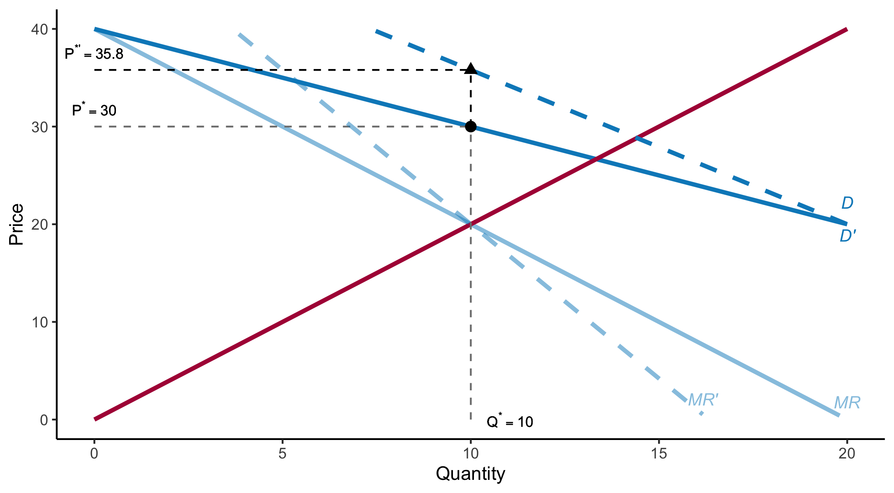

<style>

.center2 {
  margin: 0;
  position: absolute;
  top: 50%;
  left: 50%;
  -ms-transform: translate(-50%, -50%);
  transform: translate(-50%, -50%);
}

</style>

```{r setup, include = FALSE}
knitr::opts_chunk$set(echo = FALSE)
knitr::opts_chunk$set(warning = FALSE)
knitr::opts_chunk$set(message = FALSE)
knitr::opts_chunk$set(out.width = "70%")
knitr::opts_chunk$set(fig.align="center")

options(htmltools.dir.version = FALSE)
library(knitr)
library(tidyverse)
library(xaringanExtra)
library(ggplot2)
library(plotly)
library(googlesheets4)
library(dplyr)
library(knitr)
library(rtweet)

# set default options
opts_chunk$set(
  echo = FALSE,
  warnings = FALSE,
  collapse = TRUE,
  fig.width = 7.252,
  fig.height = 4,
  dpi = 300
)
# set engines
knitr::knit_engines$set("markdown")
xaringanExtra::use_tile_view()
xaringanExtra::use_panelset()
xaringanExtra::use_clipboard()
xaringanExtra::use_webcam()
xaringanExtra::use_broadcast()
xaringanExtra::use_share_again()
xaringanExtra::style_share_again(
  share_buttons = c("twitter", "linkedin", "pocket")
)

# Demand and supply plot functions
source("~/Dropbox/Clases/Micro-II/microII_plots.R")

# Ensure Xaringan opens in RStudio Viewer instead of browser
options(servr.daemon = TRUE)
# xaringan::inf_mr()
```

```{r plotting-functions}
source("microII_plots.R")
source("chapter10_plots.R")
```

.center2[
# Introduction 
]

---
## Introduction 

```{r}

```

---
## Introduction 

```{r}

```

---
## Introduction 

```{r}

```

---
.center2[
# Monopoly
]

---
## Monopoly

Market with only one seller.
--
 The monopolist *is* the market and completely controls the amount of output offered for sale.
 
How to choose how much to sell and at what price?

--

- **Marginal Revenue (MR)**: Change in revenue resulting from a one-unit increase in output.

- **Marginal Costs (MC)**: Increase in cost resulting from the production of one extra unit of output.
 
---
## Monopoly: Revenues

Demand curve:
$$P = a -bQ$$
--

Revenue (not profit):

$$\textit{Revenue} = P \cdot Q$$
--

$$\Rightarrow \textit{Revenue} = (a-bQ) \cdot Q = aQ -bQ^2 $$  

--

.pull-left[
### Average Revenue
$$\textit{Average Revenue} = \frac{\textit{Revenue}}{Q} =  a -bQ = P $$ 
]

--
.pull-right[
### Marginal Revenue
$$\textit{Marginal Revenue} = \frac{d \textit{Revenue}}{dQ} =  a -2bQ$$ 

]

---
## Revenue

| Price (P) | Quantity (Q) | Total Revenue (R) | Marginal Revenue (MR) | Average Revenue (AR) |
|-----------|-------------|-------------------|----------------------|---------------------|
| **6**  | **0**  | **0**  | **—**  | **—**  |

---
## Revenue

| Price (P) | Quantity (Q) | Total Revenue (R) | Marginal Revenue (MR) | Average Revenue (AR) |
|-----------|-------------|-------------------|----------------------|---------------------|
| 6  | 0  | 0  | —  | —  |
| **5**  | **1**  | **5**  | **5**  | **5**  |

---
## Revenue

| Price (P) | Quantity (Q) | Total Revenue (R) | Marginal Revenue (MR) | Average Revenue (AR) |
|-----------|-------------|-------------------|----------------------|---------------------|
| 6  | 0  | 0  | —  | —  |
| 5  | 1  | 5  | 5  | 5  |
| **4**  | **2**  | **8**  | **3**  | **4**  |

---
## Revenue

| Price (P) | Quantity (Q) | Total Revenue (R) | Marginal Revenue (MR) | Average Revenue (AR) |
|-----------|-------------|-------------------|----------------------|---------------------|
| 6  | 0  | 0  | —  | —  |
| 5  | 1  | 5  | 5  | 5  |
| 4  | 2  | 8  | 3  | 4  |
| **3**  | **3**  | **9**  | **1**  | **3**  |

---
## Revenue

| Price (P) | Quantity (Q) | Total Revenue (R) | Marginal Revenue (MR) | Average Revenue (AR) |
|-----------|-------------|-------------------|----------------------|---------------------|
| 6  | 0  | 0  | —  | —  |
| 5  | 1  | 5  | 5  | 5  |
| 4  | 2  | 8  | 3  | 4  |
| 3  | 3  | 9  | 1  | 3  |
| **2**  | **4**  | **8**  | **−1**  | **2**  |

---
## Revenue 

| Price (P) | Quantity (Q) | Total Revenue (R) | Marginal Revenue (MR) | Average Revenue (AR) |
|-----------|-------------|-------------------|----------------------|---------------------|
| 6  | 0  | 0  | —  | —  |
| 5  | 1  | 5  | 5  | 5  |
| 4  | 2  | 8  | 3  | 4  |
| 3  | 3  | 9  | 1  | 3  |
| 2  | 4  | 8  | −1  | 2  |
| **1**  | **5**  | **5**  | **−3**  | **1**  |

---
## Monopoly: Revenues

```{r marginal-revenue1}
plot_data <- 
generate_monopoly_data(
  demand_intercept = 6, demand_slope = 1
)

plot_monopoly(plot_data$data, show_marginal_revenue = F)
```

$$P = 6 - Q$$

---
## Monopoly: Revenues

```{r marginal-revenue2}
plot_monopoly(plot_data$data)
```

$$P = 6 - Q \quad \Rightarrow \textit{MR} = 6 - 2Q$$


---
## Monopolist's Output Decision

$$max_Q \; \Pi(Q) = R(Q) - C(Q)$$ 
--

$$\Rightarrow \frac{d\Pi(Q)}{dQ} = \frac{dR(Q)}{dQ} - \frac{dC(Q)}{dQ} = 0$$ 
--
$$\frac{dR(Q)}{dQ} = \frac{dC(Q)}{dQ}$$ 
--
$$MR = MC$$ 

---
## Monopolist's Output Decision

```{r monop-max01}
plot_data <- 
generate_monopoly_data(
  demand_intercept = 40, demand_slope = 1,
  cost_a = 50, cost_b = 0, cost_c = 1, cost_d = 0 
)

plot_data <- plot_data$data

plot_monopoly(
  plot_data,
  show_marginal_revenue = F,
  show_average_cost = F,
  show_marginal_cost = F,
  show_eq_q = F, show_eq_p = F
)
```

$$P = 40 - Q$$

---
## Monopolist's Output Decision

```{r monop-max02}
plot_monopoly(
  plot_data,
  show_demand = T,
  show_marginal_revenue = T,
  show_average_cost = F,
  show_marginal_cost = F,
  show_eq_q = F, show_eq_p = F
)
```

$$MR = 40 - 2Q$$

---
## Monopolist's Output Decision

```{r monop-max03}
plot_monopoly(
  plot_data,
  show_demand = F,
  show_marginal_revenue = F,
  show_average_cost = F,
  show_marginal_cost = F,
  show_eq_q = F, show_eq_p = F
)
```

$$C(Q) = 50 + Q^2$$

---
## Monopolist's Output Decision

```{r monop-max04}
plot_monopoly(
  plot_data,
  show_demand = F,
  show_marginal_revenue = F,
  show_average_cost = T,
  show_marginal_cost = F,
  show_eq_q = F, show_eq_p = F
)
```

$$C(Q) = 50 + Q^2 \quad \Rightarrow AC = 50/Q + Q$$

---
## Monopolist's Output Decision

```{r monop-max05}
plot_monopoly(
  plot_data,
  show_demand = F,
  show_marginal_revenue = F,
  show_average_cost = F,
  show_marginal_cost = T,
  show_eq_q = F, show_eq_p = F
)
```

$$C(Q) = 50 + Q^2 \quad \Rightarrow MC = 2Q$$

---
## Monopolist's Output Decision

```{r monop-max06}
plot_monopoly(
  plot_data,
  show_demand = F,
  show_marginal_revenue = T,
  show_average_cost = F,
  show_marginal_cost = T,
  show_eq_q = F, show_eq_p = F
)
```

$$Q^* \textit{such that} \quad MR = MC$$

---
## Monopolist's Output Decision

```{r monop-max07}
plot_monopoly(
  plot_data,
  show_demand = F,
  show_marginal_revenue = T,
  show_average_cost = F,
  show_marginal_cost = T,
  show_eq_q = T, show_eq_p = F
)
```

$$Q^* \textit{such that} \quad 40 -2Q = 2Q$$

---
## Monopolist's Output Decision

```{r monop-max08}
plot_monopoly(
  plot_data,
  show_demand = F,
  show_marginal_revenue = T,
  show_average_cost = F,
  show_marginal_cost = T,
  show_eq_q = T, show_eq_p = F
)
```

$$Q^* = 10$$

---
## Monopolist's Output Decision

```{r monop-max09}
plot_monop <- 
plot_monopoly(
  plot_data,
  show_demand = T,
  show_marginal_revenue = T,
  show_average_cost = F,
  show_marginal_cost = T,
  show_eq_q = T, show_eq_p = T
)

plot_monop
```

$$P^* = 40 - Q^* = 40- 10 = 30$$

---
## Monopolist's Output Decision

```{r monop-max10}
plot_monopoly(
  plot_data,
  show_demand = T,
  show_marginal_revenue = T,
  show_average_cost = T,
  show_marginal_cost = T,
  show_eq_q = T, show_eq_p = T
) +
  geom_segment(aes(x = 0, xend = 10, y = 15, yend = 15), linetype = "dashed", color = "gray50")  +
      annotate(
        "text",  
        x = 0, y = 15,  
        label = expression(AC == 15),  
        fontface = "italic", size = 3, vjust = -.75 
      )

```

$$AC(Q^*) = 50/10 + 10 = 15$$

---
## Monopolist's Output Decision

```{r monop-max11}
plot_monopoly(
  plot_data,
  show_demand = T,
  show_marginal_revenue = T,
  show_average_cost = T,
  show_marginal_cost = T,
  show_eq_q = T, show_eq_p = T
) +
  # Dashed reference line at AC = 15
  geom_segment(aes(x = 0, xend = 10, y = 15, yend = 15), 
               linetype = "dashed", color = "gray50")  +
  # Label for AC = 15
  annotate(
    "text",  
    x = 0, y = 15,  
    label = expression(AC == 15),  
    fontface = "italic", size = 3, vjust = -.75 
  ) +
  # Rectangle shading (Profit Area)
  geom_rect(
    aes(xmin = 0, xmax = 10, ymin = 15, ymax = 30),  # Define corners
    fill = green_chapter,  # Rectangle fill color
    alpha = 0.4,  # Transparency
    color = NA  # No border
  ) +
  annotate(
    "text",  
    x = 5, y = (30+15)/2,  
    label = "Profits",  
    fontface = "italic", size = 3, alpha = .5
  )
```

$$\Pi(Q^*) = 30 \times 10 - (50 + 10^2) = 300 - 150 = 150$$

---
## Monopolist's Output Decision

```{r monop-max12}
plot_data <- 
  plot_data |> 
  mutate(
    Revenue = Q*Demand,
    Cost = Average_Cost*Q,
    Profit = Revenue - Cost
  )

# Initialize ggplot
plot_monop_rev <- ggplot() +
  labs(x = "Quantity", y = "$") +
  theme_classic() +
  scale_x_continuous(limits = c(0, 20)) +
  scale_y_continuous(limits = c(0, 450))

plot_monop_rev <- plot_monop_rev +
  # Revenue
  geom_line(
    data = plot_data,
    aes(Q, Revenue), lwd = 1.2, color = blue_chapter
  ) +
  annotate(
    "text", x = 20, y = 400, label = "R", 
    color = blue_chapter, fontface = "italic", size = 3.5, hjust = -1
  )
plot_monop_rev

```

$$ R = P \cdot Q \quad \Rightarrow \; R(Q) = (40-Q) Q = 40Q - Q^2 $$

---
## Monopolist's Output Decision

```{r monop-max13}
plot_monop_rev <- 
  plot_monop_rev +
  # Costs
  geom_line(
    data = plot_data,
    aes(Q, Cost), lwd = 1.2, color = red_chapter
  ) +
  annotate(
    "text", x = 20, y = 450, label = "C", 
    color = red_chapter, fontface = "italic", size = 3.5, vjust = -.25
  )
plot_monop_rev
```

$$ C(Q) = 50 + Q^2 $$

---
## Monopolist's Output Decision

```{r monop-max14}
plot_monop_rev <- 
  plot_monop_rev +
  # Profit
  geom_line(
    data = plot_data,
    aes(Q, Profit), lwd = 1.2, color = "#800080"
  ) +
  annotate(
    "text", x = 19.5, y = 0, label = "Profit", 
    color = "#800080", fontface = "italic", size = 3.5, vjust = -.25
  )
plot_monop_rev
```

$$ \Pi (Q) = R(Q) - C(Q) = [40Q - Q^2] - [50 + Q^2] = 40Q - 2Q^2 - 50$$

---
## Monopolist's Output Decision

```{r monop-max15}
plot_monop_rev <- plot_monop_rev +
  geom_segment(aes(x = 10, xend = 10, y = 0, yend = 150), linetype = "dashed", color = "gray50") +
  # Annotate with dynamic value of eq_Q_rounded
  annotate(
    "text",
    x = 10, y = 0,  
    label = bquote(Q^"*" == .(10)),  # Using bquote for dynamic value
    fontface = "italic", size = 3, hjust = -0.2
  )

plot_monop_rev
```

$$ \Pi (10) = 40 \times 10 - 2 \times (10)^2 - 50 = 400 - 200 -50 = 150$$

---
## Monopolist's Output Decision

```{r monop-max16}
plot_monop_rev
```

$$ \Pi (11) = 40 \times 11 - 2 \times (11)^2 - 50 = 440 - 242 -50 = 148$$

---
## Monopolist's Output Decision

```{r monop-max17}
plot_monop_rev
```

$$ \Pi (9) = 40 \times 9 - 2 \times (9)^2 - 50 = 360 - 162 -50 = 148$$

---
## Rule of Thumb for Pricing

Most firm managers have limited knowledge of their average and marginal revenue curves.
--

$$MR = \frac{dR}{dQ} = \frac{d(PQ)}{dQ} = \underbrace{P}_{\textit{Extra unit at price P}} + \underbrace{Q \cdot \frac{dP}{dQ}}_{\textit{Extra unit reduces price, reducing revenue per unit}}$$


--
$$MR = P + Q \cdot \frac{dP}{dQ} = P + P \cdot \frac{Q}{P} \cdot \frac{dP}{dQ}$$

--
Recall: $\varepsilon_D = \frac{P}{Q} \cdot \frac{dQ}{dP} \quad \Rightarrow 1/\varepsilon_D = \frac{Q}{P} \cdot \frac{dP}{dQ}$

--

$$\Rightarrow MR = P + P \cdot (1/\varepsilon_D) \quad \& \quad MR =MC \quad \Rightarrow MC = P + P \cdot (1/\varepsilon_D)$$

--

$$\Rightarrow \underbrace{\frac{P - MC}{P}}_{\textit{Markup}}  = \underbrace{- (1/\varepsilon_D)}_{\textit{Inverse elasticity of D}} \quad \Rightarrow \quad P = \frac{MC}{1 + (1/\varepsilon_D)}$$


---
## Elasticities (detour)

**(Price) Elasticity of demand**: Percentage change in quantity demanded of a good resulting from a 1-percent increase in its price.

--

$$\varepsilon_D = \frac{\% \Delta Q}{\% \Delta P}$$

--

Suppose $Q_2 > Q_1$ and $P_2 < P_1$:

$$\varepsilon_D = \frac{Q_2-Q_1}{Q_1} / \frac{P_2-P_1}{P_1}$$

--

Define $\Delta Q = Q_2-Q_1$ and $\Delta P = P_2-P_1$

$$\varepsilon_D = \frac{\Delta Q}{Q_1} / \frac{\Delta P}{P_1} = \frac{P_1 \cdot \Delta Q }{Q_1 \cdot \Delta P}$$

--

If we are interested in hypothetically predicting the change from a given point $(P_1 = P, Q_1 = Q)$

$$ \varepsilon_D = \frac{P}{Q} \cdot \frac{\Delta Q }{\Delta P} < 0$$

---
## Rule of Thumb for Pricing

Recall that the demand curve has different elasticities at each point.

```{r pricing-rule-01}
plot_data <- 
  generate_monopoly_data(
    demand_intercept = 40, demand_slope = 1,
    cost_a = 50, cost_b = 0, cost_c = 1 
  )

plot_data <- plot_data$data

plot <- 
plot_monopoly(
  plot_data,
  show_marginal_revenue = F,
  show_average_cost = F,
  show_marginal_cost = F,
  show_eq_q = F, show_eq_p = F
) 

plot
```

$$\underbrace{P = 40 - Q}_{\textit{Inverse Demand}} \quad \iff \quad \underbrace{Q = 40 -P}_{\textit{Direct Demand}}$$

---
## Rule of Thumb for Pricing

Recall that the demand curve has different elasticities at each point.

```{r pricing-rule-02}
plot
```

$$dQ/dP = -1$$

---
## Rule of Thumb for Pricing

Recall that the demand curve has different elasticities at each point.

```{r pricing-rule-03}
q <- 1
p <- 40-q
elas <- (p/q)*(-1)

plot <- plot +
  # At Q == 1, P = 39
  geom_point(
    aes(x = q, y = p), size = 2.5
  ) +
  # P/Q (dQ/dP) = 39/1 (-1) = -39
  # Annotate with dynamic value of eq_Q_rounded
  annotate(
    "text",
    x = q, y = p,  
    label = bquote(epsilon[D] == .(elas)),  # Dynamic LaTeX-style expression
    fontface = "italic", size = 3, hjust = -0.35
  )

plot
```

At $Q=1, P=39 \quad \Rightarrow \varepsilon_D =  \frac{39}{1} \cdot (-1) = -39$

---
## Rule of Thumb for Pricing

Recall that the demand curve has different elasticities at each point.

```{r pricing-rule-04}
q <- 10
p <- 40-q
elas <- (p/q)*(-1)

plot <- plot +
  geom_point(
    aes(x = q, y = p), size = 2.5
  ) +
  # Annotate with dynamic value of eq_Q_rounded
  annotate(
    "text",
    x = q, y = p,  
    label = bquote(epsilon[D] == .(elas)),  # Dynamic LaTeX-style expression
    fontface = "italic", size = 3, hjust = -0.35
  )

plot
```

At $Q=10, P=30 \quad \Rightarrow \varepsilon_D =  \frac{30}{10} \cdot (-1) = -3$

---
## Rule of Thumb for Pricing

Recall that the demand curve has different elasticities at each point.

```{r pricing-rule-05}
q <- 20
p <- 40-q
elas <- (p/q)*(-1)

plot <- plot +
  geom_point(
    aes(x = q, y = p), size = 2.5
  ) +
  # Annotate with dynamic value of eq_Q_rounded
  annotate(
    "text",
    x = q, y = p,  
    label = bquote(epsilon[D] == .(elas)),  # Dynamic LaTeX-style expression
    fontface = "italic", size = 3, hjust = -0.35
  )

plot
```

At $Q=20, P=20 \quad \Rightarrow \varepsilon_D =  \frac{20}{20} \cdot (-1) = -1$

---
## Rule of Thumb for Pricing

Recall that the demand curve has different elasticities at each point.

```{r pricing-rule-06}
q <- 30
p <- 40-q
elas <- (p/q)*(-1)
elas <- round(elas, 2)

plot <- plot +
  geom_point(
    aes(x = q, y = p), size = 2.5
  ) +
  # Annotate with dynamic value of eq_Q_rounded
  annotate(
    "text",
    x = q, y = p,  
    label = bquote(epsilon[D] == .(elas)),  # Dynamic LaTeX-style expression
    fontface = "italic", size = 3, hjust = -0.35
  )

plot
```

At $Q=30, P=10 \quad \Rightarrow \varepsilon_D =  \frac{10}{30} \cdot (-1) = -1/3$

---
## Rule of Thumb for Pricing

Recall that the demand curve has different elasticities at each point.

```{r pricing-rule-06-1}
q <- 0
p <- 40-q
elas <- (p/q)*(-1)
elas <- round(elas, 2)

plot <- plot +
  geom_point(
    aes(x = q, y = p), size = 2.5
  ) +
  # Annotate with dynamic value of eq_Q_rounded
  annotate(
    "text",
    x = q, y = p,  
    label = bquote(epsilon[D] == .(elas)),  # Dynamic LaTeX-style expression
    fontface = "italic", size = 3, hjust = -0.35
  )

plot
```

At $Q=0, P=40 \quad \Rightarrow \varepsilon_D =  \frac{40}{0} \cdot (-1) = - \infty$

---
## Rule of Thumb for Pricing

Recall that the demand curve has different elasticities at each point.

```{r pricing-rule-06-}
q <- 40
p <- 40-q
elas <- (p/q)*(-1)
elas <- round(elas, 2)

plot <- plot +
  geom_point(
    aes(x = q, y = p), size = 2.5
  ) +
  # Annotate with dynamic value of eq_Q_rounded
  annotate(
    "text",
    x = q, y = p,  
    label = bquote(epsilon[D] == .(elas)),  # Dynamic LaTeX-style expression
    fontface = "italic", size = 3, hjust = -0.35
  )

plot
```

At $Q=40, P=0 \quad \Rightarrow \varepsilon_D =  \frac{0}{40} \cdot (-1) = 0$

---
## Rule of Thumb for Pricing

Recall that the demand curve has different elasticities at each point.

```{r pricing-rule-07}
q <- 20
p <- 40-q
elas <- (p/q)*(-1)

plot <- plot +
  geom_point(
    aes(x = q, y = p), size = 2.5
  ) +
  # Annotate with dynamic value of eq_Q_rounded
  annotate(
    "text",
    x = q, y = p,  
    label = bquote(epsilon[D] == .(elas)),  # Dynamic LaTeX-style expression
    fontface = "italic", size = 3, hjust = -0.35
  )

plot
```
Recall Arc-Elasticity: Elasticity across the demand curve $\varepsilon_\bar{D} = \frac{dQ}{dP} \cdot \frac{\bar{P}}{\bar{Q}}$

---
## Rule of Thumb for Pricing

Recall that the demand curve has different elasticities at each point.

```{r pricing-rule-08}
plot
```

In the example, $\bar{P}=$ `r round(mean(plot_data$Demand))` and $\bar{Q}$ `r round(mean(plot_data$Q))`. Thus $\varepsilon_\bar{D} = -1 \cdot \frac{20}{20} = -1$


---
## Rule of Thumb for Pricing

Recall that the demand curve has different elasticities at each point.

.pull-left[
- $|\varepsilon_D | > 1$ **Elastic**: A 1% increase in price reduces quantity demanded by more than 1%.

- $|\varepsilon_D | = 1$ **Unitary**: A 1% change in price leads to a 1% change in quantity demanded.

- $|\varepsilon_D | < 1$ **Inelastic**: A 1% increase in price reduces quantity demanded by less than 1%.
]

.pull-right[
```{r pricing-rule-09, out.width="100%"}
plot
```
]

--

Monopolist will never produce a quantity of output that is on the inelastic portion of the demand curve. 

---
## Rule of Thumb for Pricing

$$P = \frac{MC}{1 + (1/\varepsilon_D)}$$

Suposse $MC = 9$

--

.pull-left[
### Elastic 
$$|\varepsilon_D| > 1$$
For instance,  $\varepsilon_D = -4$
$$P = \frac{9}{1 + (-1/4)} = 9/0.75 = 12$$

$$Markup = (12-9)/9 = 3/9 = 1/3 $$

However, as $\varepsilon_D \rightarrow \infty \Rightarrow P = MC$

]

--

.pull-right[
### Inelastic
$$|\varepsilon_D| < 1$$
For instance,  $\varepsilon_D = -1/2$
$$P = \frac{9}{1 + (-2)} =  \frac{9}{-1} = -1$$ 
$$Markup = (-1-9)/9 = -10/9$$
Not possible.
]


---
## Monopolist's Supply Curve 

--

Does not exist.
--
 A monopolistic market has no supply curve.
--
 In other words, there is no one-to- one relationship between price and the quantity produced. 
 
--

Depending on how demand shifts, a monopolist might supply several different quantities at the same price, or the same quantity at different prices.

 
---
## Monopolist's Supply 

Depending on how demand shifts, a monopolist might supply several different quantities at the same price, or the same quantity at different prices.


```{r monop-supply01}
generate_monopoly_shift <- function(
    demand_intercept, demand_slope, 
    cost_a, cost_b, cost_c, 
    shift_type = "same_quantity" # "same_quantity" or "same_price"
) {
  
  # Define original demand and marginal revenue
  demand <- function(Q) { pmax(0, demand_intercept - demand_slope * Q) }
  marginal_revenue <- function(Q) { pmax(0, demand_intercept - 2 * demand_slope * Q) }
  
  # Define cost functions
  total_cost <- function(Q) { cost_a + cost_b * Q + cost_c * Q^2 }
  marginal_cost <- function(Q) { pmax(0, cost_b + 2 * cost_c * Q) }
  average_cost <- function(Q) { ifelse(Q == 0, NA, (cost_a / Q) + cost_b + cost_c * Q) }
  
  # Monopoly Equilibrium: MR = MC
  eq_Q <- (demand_intercept - cost_b) / (2 * demand_slope + 2 * cost_c)
  eq_P <- demand(eq_Q)
  
  # Random slope factors
  new_slope_factor <- round(runif(1, .5, 2), 2)
  
  # Compute New Demand and MR Shifted
  if (shift_type == "same_quantity") {
    b_prime <- new_slope_factor * demand_slope  # Adjust slope
    a_prime <- 20 + 20 * b_prime  # Solving for a'
    
    demand_shifted <- function(Q) { pmax(0, a_prime - b_prime * Q) }
    marginal_revenue_shifted <- function(Q) { pmax(0, a_prime - 2 * b_prime * Q) }
    
    # Compute new equilibrium Q' and P' (Monopoly equilibrium for new demand)
    eq_Q_shifted <- (a_prime - cost_b) / (2 * b_prime + 2 * cost_c)
    eq_P_shifted <- demand_shifted(eq_Q_shifted)
    
  } else if (shift_type == "same_price") {
    b_prime <- new_slope_factor * demand_slope  # Adjust slope
    a_prime <- 30 + b_prime * q_target  # Ensuring same P*
    
    demand_shifted <- function(Q) { pmax(0, a_prime - b_prime * Q) }
    marginal_revenue_shifted <- function(Q) { pmax(0, a_prime - 2 * b_prime * Q) }
    
    # Compute new equilibrium Q' and P' (Monopoly equilibrium for new demand)
    eq_Q_shifted <- (a_prime - cost_b) / (2 * b_prime + 2 * cost_c)
    eq_P_shifted <- demand_shifted(eq_Q_shifted)
  }
  
  # Generate values for plotting
  Q_vals <- seq(0, eq_Q * 2, length.out = 100)
  
  # Create data tibble
  plot_data <- tibble(
    Q = Q_vals,
    Demand = demand(Q_vals),
    Marginal_Revenue = marginal_revenue(Q_vals),
    Demand_Shifted = demand_shifted(Q_vals),
    Marginal_Revenue_Shifted = marginal_revenue_shifted(Q_vals),
    Marginal_Cost = marginal_cost(Q_vals),
    eq_Q = eq_Q,
    eq_P = eq_P,
    eq_Q_shifted = eq_Q_shifted,
    eq_P_shifted = eq_P_shifted
  ) |> 
    mutate(
      Marginal_Revenue_Shifted = if_else(Marginal_Revenue_Shifted == 0, NA_real_, Marginal_Revenue_Shifted),
      Marginal_Revenue = if_else(Marginal_Revenue == 0, NA_real_, Marginal_Revenue),
    )
  
  return(plot_data)
}

plot_monopoly_shift <- function(
    plot_data, show_shift = TRUE, show_marginal_cost = TRUE,
    show_eq_q = TRUE, show_eq_p = TRUE
) {
  
  # Extract equilibrium values
  eq_Q_monopoly <- plot_data$eq_Q[1]
  eq_P_monopoly <- plot_data$eq_P[1]
  eq_Q_rounded <- round(eq_Q_monopoly, 1)
  eq_P_rounded <- round(eq_P_monopoly, 1)
  
  # Extract new equilibrium values after shift
  eq_Q_shifted <- plot_data$eq_Q_shifted[1]
  eq_P_shifted <- plot_data$eq_P_shifted[1]
  eq_Q_shifted_rounded <- round(eq_Q_shifted, 1)
  eq_P_shifted_rounded <- round(eq_P_shifted, 1)
  
  # Extract values at max Q for labeling
  demand_label <- plot_data |> filter(Demand == min(Demand)) |> slice(1)
  
  q_max <- round(demand_label$Q)
  mr_max <- round(max((plot_data |> filter(Marginal_Revenue > 0))$Q), 1)
  p_max <- round((plot_data |> filter(Demand == max(Demand)))$Demand + 1)
  p_min <- round((plot_data |> filter(Demand == min(Demand)))$Demand + 1)
  
  p <- ggplot() +
    labs(x = "Quantity", y = "Price") +
    theme_classic() +
    scale_x_continuous(limits = c(0, max(plot_data$Q))) +
    scale_y_continuous(limits = c(0, max(plot_data$Demand))) +
    
    # Demand Curve
    geom_line(data = plot_data, aes(x = Q, y = Demand), color = blue_chapter, size = 1.2) +
    annotate("text", x = q_max, y = p_min, label = "D", 
             color = blue_chapter, fontface = "italic", size = 3.5, vjust = -0.5) +
    
    # Marginal Revenue Curve
    geom_line(data = plot_data, aes(x = Q, y = Marginal_Revenue), color = blue_chapter, size = 1.2, alpha = .5) +
    annotate("text", x = q_max, y = 0, label = "MR", 
             color = blue_chapter, alpha = .5, fontface = "italic", size = 3.5, vjust = -0.95)
  
  # Add Marginal Cost Curve (Only if Cost Parameters Exist)
  if (show_marginal_cost && !all(is.na(plot_data$Marginal_Cost))) {
    p <- p + 
      geom_line(data = plot_data, aes(x = Q, y = Marginal_Cost), color = red_chapter, size = 1.2) +
      annotate(
        "text", label = "MC",
        x = (plot_data |> filter(round(Marginal_Cost) == p_max))$Q, y = (plot_data |> filter(round(Marginal_Cost) == p_max))$Marginal_Cost, 
        color = red_chapter, fontface = "italic", size = 3.5, hjust = -0.5
      )
  }
  
  if (show_eq_q && !is.na(eq_Q_monopoly)) {
    p <- p +
      geom_segment(aes(x = eq_Q_monopoly, xend = eq_Q_monopoly, y = 0, yend = eq_P_monopoly), linetype = "dashed", color = "gray50") +
      # Annotate with dynamic value of eq_Q_rounded
      annotate(
        "text",
        x = eq_Q_monopoly, y = 0,  
        label = bquote(Q^"*" == .(eq_Q_rounded)),  # Using bquote for dynamic value
        fontface = "italic", size = 3, hjust = -0.35
      )
  }
  
  if (show_eq_p && !is.na(eq_P_monopoly)) {
    p <- p +
      geom_segment(aes(x = 0, xend = eq_Q_monopoly, y = eq_P_monopoly, yend = eq_P_monopoly), linetype = "dashed", color = "gray50") +
      # Annotate with dynamic value of eq_P_rounded
      annotate(
        "text",  
        x = 0, y = eq_P_monopoly,  
        label = bquote(P^"*" == .(eq_P_rounded)),  # Using bquote for dynamic value
        fontface = "italic", size = 3, vjust = -.75  # Adjust size and alignment
      )
  }
  
  if (show_eq_q == T & show_eq_p == T & !is.na(eq_Q_monopoly) & !is.na(eq_P_monopoly)) {
    p <- p +
      geom_point(aes(x = eq_Q_monopoly, y = eq_P_monopoly), size = 2.5)
  } 
  
  # Add shifted demand and MR if enabled
  if (show_shift) {
    p <- 
      p +
      geom_line(data = plot_data, aes(x = Q, y = Demand_Shifted), color = blue_chapter, linetype = "dashed", size = 1.2) +
      annotate("text", x = q_max, y = p_min, label = "D'", 
               color = blue_chapter, fontface = "italic", size = 3.5, vjust = 2.2) +
      geom_line(data = plot_data, aes(x = Q, y = Marginal_Revenue_Shifted), color = blue_chapter, linetype = "dashed", size = 1.2, alpha = .5) +
      annotate("text", 
               x = (plot_data |> filter(Marginal_Revenue_Shifted == min(Marginal_Revenue_Shifted, na.rm = T)))$Q, 
               y = (plot_data |> filter(Marginal_Revenue_Shifted == min(Marginal_Revenue_Shifted, na.rm = T)))$Marginal_Revenue_Shifted, label = "MR'", 
               color = blue_chapter, alpha = .5, fontface = "italic", size = 3.5, vjust = -0.75) +
      geom_segment(aes(x = 0, xend = eq_Q_shifted, y = eq_P_shifted, yend = eq_P_shifted), linetype = "dashed", color = "black") +
      annotate("text", x = 0, y = eq_P_shifted, label = bquote(P^"*'" == .(eq_P_shifted_rounded)), fontface = "italic", size = 3, vjust = -0.75) +
      geom_segment(aes(x = eq_Q_shifted, xend = eq_Q_shifted, y = eq_P, yend = eq_P_shifted), linetype = "dashed", color = "black") +
      geom_point(aes(x = eq_Q_shifted, y = eq_P_shifted), size = 2.5, shape = 17)
  }
  
  return(p)
}
```

```{r monop-supply02}
set.seed(12345) 
plot_data1 <- generate_monopoly_shift(40, 1, 50, 0, 1, shift_type = "same_quantity")

plot_monopoly_shift(plot_data1, show_shift = F)
```

---
## Monopolist's Supply 

Depending on how demand shifts, a monopolist might supply several different quantities at the same price, or the same quantity at different prices.

```{r monop-supply03}
# set.seed(12345) 
# plot_data1 <- generate_monopoly_shift(40, 1, 50, 0, 1, shift_type = "same_quantity")
# plot_monopoly_shift(plot_data1, show_shift = T)


```

---
## Monopolist's Supply 

Depending on how demand shifts, a monopolist might supply several different quantities at the same price, or the same quantity at different prices.

```{r monop-supply04}
plot_monopoly_shift(plot_data1, show_shift = F)
```

---
## The effect of taxes 

Under monopoly, price can sometimes rise by more than the amount of the tax.

--

```{r monop-tax01}
a <- 100
b <- 0.5

plot_data <- 
tibble(
  Q = seq(1,40),
  Demand = a*(Q^-b),
  Revenue = a*(Q^-b)*Q,
  Marginal_Revenue = round(a*(1-b)*(Q^(-b)), 1),
  Marginal_Cost = 10,
  eq_Q_monopoly = round((a*(1-b)/Marginal_Cost)^(1/b), 1),
  eq_P_monopoly = round(a*(eq_Q_monopoly^-b), 1),
  Marginal_Cost_tax = 15,
  eq_Q_monopoly_tax = round((a*(1-b)/Marginal_Cost_tax)^(1/b), 1),
  eq_P_monopoly_tax = round(a*(eq_Q_monopoly_tax^-b), 1)
)

plot <- 
plot_monopoly(plot_data, show_marginal_revenue = T) +
  scale_y_continuous(limits = c(0, 50)) 

plot
```

$$ P = a \cdot Q^{-b} \quad \Rightarrow R = P \cdot Q = a \cdot Q^{1-b} \quad \Rightarrow MR = a \cdot (1-b)  \cdot Q^{-b} $$

---
## The effect of taxes 

Under monopoly, price can sometimes rise by more than the amount of the tax.


```{r monop-tax02}
plot
```

Suposse $a=100$, $b=0.5$, and $MC =10$. Then, $Q^*$ such that $MR=MC$, then $P^* = P(Q^*)$.

---
## The effect of taxes 

Under monopoly, price can sometimes rise by more than the amount of the tax.

```{r monop-tax03}
plot <- plot +
  # Add the taxed marginal cost curve
  geom_line(data = plot_data, aes(x = Q, y = Marginal_Cost_tax), 
            color = red_chapter, size = 1.2, alpha = .5) +
  # Properly formatted label using bquote
  annotate(
    "text", 
    label = bquote(MC^"'" == MC + tau),  
    x = 40, y = 15, alpha = .5,
    color = red_chapter, fontface = "italic", size = 3.5, vjust = 1.5
  ) +
  # Add tax bracket
  geom_segment(
    aes(x = 0, xend = 0, y = 10, yend =15)
  ) +
  annotate(
    "text", 
    label = bquote(tau == 5),  
    x = 0, y = 12.5, fontface = "italic", size = 3, hjust = -0.3
  ) 

plot
```

Suppose a $5 tax per unit to the monopolist.

---
## The effect of taxes 

Under monopoly, price can sometimes rise by more than the amount of the tax.

```{r monop-tax04}
plot <- plot +
  geom_segment(aes(x = plot_data$eq_Q_monopoly_tax[1], xend = plot_data$eq_Q_monopoly_tax[1], y = 0, yend = plot_data$eq_P_monopoly_tax[1]), linetype = "dashed", color = "gray50") + 
  # Annotate with dynamic value of eq_Q_rounded
  annotate(
    "text",
    x = plot_data$eq_Q_monopoly_tax[1], y = 0,  
    label = bquote(Q^"'*" == .(plot_data$eq_Q_monopoly_tax[1])),  # Using bquote for dynamic value
    fontface = "italic", size = 3, hjust = -0.2
  )

plot
```

At $MC' = MC + \tau \Rightarrow MC' = 10 + 5 = 15$, we have $MR(Q'^*) = 15 \quad \Rightarrow Q'^* = 11.11$

---
## The effect of taxes 

Under monopoly, price can sometimes rise by more than the amount of the tax.

```{r monop-tax05}
plot <- plot +
  geom_segment(aes(x = 0, xend = plot_data$eq_Q_monopoly_tax[1], y = plot_data$eq_P_monopoly_tax[1], yend = plot_data$eq_P_monopoly_tax[1]), linetype = "dashed", color = "gray50") +
  # Annotate with dynamic value of eq_Q_rounded
  annotate(
    "text",
    x = 0, y = plot_data$eq_P_monopoly_tax[1],  
    label = bquote(P^"'*" == .(plot_data$eq_P_monopoly_tax[1])),  # Using bquote for dynamic value
    fontface = "italic", size = 3, vjust = -0.5
  ) +
  geom_point(
    aes(x = plot_data$eq_Q_monopoly_tax[1], y = plot_data$eq_P_monopoly_tax[1]), size = 2.5, shape = 17
  )

plot
```

Then $P'^* = P(Q'^*) = P(11.11) = 30$

---
## The effect of taxes 

Under monopoly, price can sometimes rise by more than the amount of the tax.

```{r monop-tax06}
plot <- plot +
  # Add Price change bracket
  geom_segment(
    aes(x = 0, xend = 0, y = 21, yend =29)
  ) +
  annotate(
    "text", 
    label = bquote(Delta ["P"] == 10),  
    x = 0, y = (21 + 29)/2, fontface = "italic", size = 3, hjust = -0.2
  ) 

plot
```

$\Delta MC = \tau = 5$, while $\Delta P = 30 -20 = 10$. 

---
.center2[
# Monopoly Power
]

---
## Monopoly Power

Pure monopoly is rare.
--
 Markets in which several firms compete with one another are much more common.
 
--

- **Market demand curve**
- **Firm demand curve**

---
## Monopoly Power

Suppose that four firms produce toothbrushes and have the market demand curve $Q = 50,000 - 20,000P$

```{r monop-power01}

```

--

These four firms are producing an aggregate of 20,000 toothbrushes per day (5000 each per day) and selling them at $1.50 each. What is the elasticity at this point?

---
## Monopoly Power

Firm A must assess its own demand curve, not just the market’s, before lowering prices to boost sales.

--

```{r monop-power02}

```

The firm’s demand curve $D_A$ is much more elastic than the market demand curve. What is the $D_A$ elasticity here?

---
## Monopoly Power

Firm A must assess its own demand curve, not just the market’s, before lowering prices to boost sales.

```{r monop-power03}

```

Raising the price from 1.50 to 1.60, the firm expects sales to drop from 5000 to 3000 as consumers switch to competitors.

--
 If all firms raise prices, sales would fall only to 4500.

---
## Monopoly Power

Firm A must assess its own demand curve, not just the market’s, before lowering prices to boost sales.

```{r monop-power04}

```

Lowering its price from 1.50 to 1.40, Firm A expects sales to rise to 7000 but won’t capture the entire market as some consumers prefer competitors, who may also cut prices.

---
## Monopoly Power

**Firm A is likely to face a demand curve which is more elastic than the market demand curve, but which is not infinitely elastic like the demand curve facing a perfectly competitive firm**

```{r monop-power05}

```


---
## Measuring Monopoly Power

- Competitive firm: price equals marginal cost 
- Firm with monopoly power: price exceeds marginal cost

--

**Lerner Index of Monopoly Power**: Measure of monopoly power calculated as excess of price over marginal cost as a fraction of price

$$L=(P-MC)/P \in [0,1]$$
- when $L \rightarrow 1$ greater degree of monopoly power
- when $L \rightarrow 0$ closer to a competitive market

--
$$L=(P-MC)/P = -1/\varepsilon_d$$

where $\varepsilon_d$ represents the elasticity of the firm’s demand curve.

---
## Pricing with Monopoly Power

Rule of thumb: $P = MC / [1 + (1/\varepsilon_d)]$. But, $\varepsilon_d =$ elasticity of demand for the firm, not the elasticity of market demand, $\varepsilon_{\bar{d}}$.

```{r pricing-monopoly-power01}
plot_data <- 
  generate_monopoly_data(
    demand_intercept = 40, demand_slope = 2,
    cost_a = 10, cost_b = 0, cost_c = 1/2, cost_d = 0
  )

eq_Q <- round(plot_data$data$eq_Q_monopoly[1], 1)
eq_P <- round(plot_data$data$eq_P_monopoly[1], 1)

elasticity_eq <- -2*(eq_P/eq_Q)
elasticity_arc <- -2*mean(plot_data$data$Demand)/mean(plot_data$data$Q)

p_MR_MC <- plot_data$formulas$marginal_revenue$intercept - plot_data$formulas$marginal_revenue$slope*eq_Q
p_MR_MC <- round(p_MR_MC, 1)

plot1 <- 
  plot_monopoly(plot_data$data, show_average_cost = F) +
  geom_segment(
    aes(x = 0, xend = eq_Q, y = p_MR_MC, yend = p_MR_MC),
    linetype = "dashed", color = "grey"
  ) +
  annotate(
    "text",  
    x = 0.25, y = p_MR_MC,  
    label = bquote(MC == .(p_MR_MC)),  # Using bquote for dynamic value
    fontface = "italic", size = 3, vjust = 1.2  # Adjust size and alignment
  ) +
  # Markup
  geom_segment(
    aes(x = .5, xend = .5, y = p_MR_MC + 1, yend = eq_P - 1),
    hjust = -1
  ) +
  annotate(
    "text", x = 0, y = (p_MR_MC + eq_P)/2,
    label =  bquote(P^"*" - "MC" == .(eq_P-p_MR_MC)), size = 3, hjust = -.3, fontface = "italic"
  )

plot1 +
  scale_x_continuous(limits = c(0, 50))
```

Markup: $(P-MC)/P = 16/24 = 0.66 = -(1/\varepsilon_d)$. Then, $\varepsilon_d = -1/0.66 \approx -1.5$.

---
## Pricing with Monopoly Power

Rule of thumb: $P = MC / [1 + (1/\varepsilon_d)]$. But, $\varepsilon_d =$ elasticity of demand for the firm, not the elasticity of market demand, $\varepsilon_{\bar{d}}$.

```{r pricing-monopoly-power02}
plot_data <- 
  generate_monopoly_data(
    demand_intercept = 40, demand_slope = .5,
    cost_a = 10, cost_b = 0, cost_c = 1/2, cost_d = 0
  )

eq_Q <- round(plot_data$data$eq_Q_monopoly[1], 1)
eq_P <- round(plot_data$data$eq_P_monopoly[1], 1)

elasticity_eq <- -2*(eq_P/eq_Q)
elasticity_arc <- -2*mean(plot_data$data$Demand)/mean(plot_data$data$Q)

p_MR_MC <- plot_data$formulas$marginal_revenue$intercept - plot_data$formulas$marginal_revenue$slope*eq_Q
p_MR_MC <- round(p_MR_MC, 1)

plot2 <- 
  plot_monopoly(plot_data$data, show_average_cost = F) +
  geom_segment(
    aes(x = 0, xend = eq_Q, y = p_MR_MC, yend = p_MR_MC),
    linetype = "dashed", color = "grey"
  ) +
  annotate(
    "text",  
    x = 0.25, y = p_MR_MC,  
    label = bquote(MC == .(p_MR_MC)),  # Using bquote for dynamic value
    fontface = "italic", size = 3, vjust = 1.2  # Adjust size and alignment
  ) +
  # Markup
  geom_segment(
    aes(x = .5, xend = .5, y = p_MR_MC + 1, yend = eq_P - 1),
    hjust = -1
  ) +
  annotate(
    "text", x = 0, y = (p_MR_MC + eq_P)/2,
    label =  bquote(P^"*" - "MC" == .(eq_P-p_MR_MC)), size = 3, hjust = -.3, fontface = "italic"
  )

plot2  +
  scale_x_continuous(limits = c(0, 50))
```

Markup: $(P-MC)/P = 10/30 = 0.33 = -(1/\varepsilon_d)$. Then, $\varepsilon_d = -1/0.33 \approx -3$.

---
## Pricing with Monopoly Power

**Monopoly power is the ability to price above marginal cost**, with the markup inversely related to demand elasticity.

.pull-left[
```{r pricing-monopoly-power03, out.width="100%"}
plot1 +
  scale_x_continuous(limits = c(0, 50))
```
]

.pull-right[
```{r pricing-monopoly-power04, out.width="100%"}
plot2 +
  scale_x_continuous(limits = c(0, 50))
```
]

.center[
### The less elastic its demand curve, the more monopoly power a firm has.
]

---
.center2[
# Sources of Monopoly Power
]

---
## Sources of Monopoly Power

Monopoly power depends on a firm’s demand elasticity.
--
 So, why do some firms (e.g., supermarkets) face more elastic demand than others (e.g., designer clothing brands)?
 
--

### 1. Elasticity of Market Demand

### 2. Number of firms

### 3. Interactions among firms

---
### 1. Elasticity of Market Demand

- A pure monopolist’s demand curve **is** the market demand curve.
- If demand is highly elastic, even a monopolist will have **limited** pricing power.
- Market elasticity sets a **lower bound** on firm-level elasticity.
- Example: OPEC vs. coffee markets—OPEC had strong monopoly power due to inelastic oil demand, whereas coffee producers faced more elastic demand, limiting price control.

.center[
```{r out.width="50%"}
knitr::include_graphics("https://c7.alamy.com/compfr/2pn83tc/les-prix-du-petrole-montent-en-fleche-en-reponse-a-la-baisse-surprise-de-la-production-annoncee-par-opec-cartel-guardian-article-principal-sur-l-energie-5-avril-2023-royaume-uni-2pn83tc.jpg")
```
]


---
### 2. Number of Firms

- More firms = **less monopoly power** for each firm.
- Key factor: **market concentration**—if a few firms dominate, they may retain power.
- High market share by a few firms allows pricing influence, **but competition and new entrants** reduce this power.
- Firms often **create barriers to entry** (e.g., patents, government licensing, scale economies) to **maintain power**.

.pull-left[
```{r out.width="60%"}

```
]

.pull-right[
```{r out.width="120%"}
knitr::include_graphics("imgs/no_firms_2.png")
```
]

---
### 3. Interactions Among Firms

- Monopoly power also depends on **competition vs. cooperation**:
  - **Aggressive competition** → Less pricing power.
  - **Collusion (explicit or implicit)** → More pricing power.
- Even with few firms, **intense price wars** can drive prices close to competitive levels.
- **Market power changes over time** as new firms enter, demand shifts, or firms adjust strategies.

.center[
```{r}

```

]

---
.center2[
# The Social Costs of Monopoly Power
]

---
## The Social Costs of Monopoly Power

--

.pull-left[
### Competitive Market

$$P^*_C = MC$$

$$Q^*_C(P^*_C)$$


]

--

.pull-right[
### Monopoly (Power)

$$P^*_M > MC$$

$$Q^*_M(P^*_M) < Q^*_C(P^*_C)$$
]

--

Key Questions:

- Is consumer welfare higher or lower under monopoly?

- Do producers benefit more, and at whose expense?

- How significant is the deadweight loss to society?

---
## The Social Costs of Monopoly Power

Suppose $Q = 40 - 1.8 \cdot P$

--

```{r monop-welfare01}
plot_data <- 
  generate_monopoly_data(
    demand_intercept = 40, demand_slope = 1.8,
    cost_a = 0, cost_b = 0, cost_c = 1/16, cost_d = 1/24,
  )

p_c <- 18.76
q_c <- 11.78  

plot_monopoly(
  plot_data$data,
  show_marginal_revenue = F,
  show_average_cost = F,
  show_marginal_cost = F,
  show_eq_q = F, show_eq_p = F
)
```

---
## The Social Costs of Monopoly Power

Suppose $C(Q) = \frac{1}{16} Q^2 + \frac{1}{24} Q^3$. Thus, $MC = \frac{1}{8} Q + \frac{1}{8} Q^2$. 

```{r monop-welfare02}
plot_monopoly(
  plot_data$data,
  show_marginal_revenue = F,
  show_average_cost = F,
  show_marginal_cost = T,
  show_eq_q = F, show_eq_p = F
)
```

---
## The Social Costs of Monopoly Power

We assume that the competitive market and the monopolist have the same cost curves. 

```{r monop-welfare03}
plot_monopoly(
  plot_data$data,
  show_marginal_revenue = F,
  show_average_cost = F,
  show_marginal_cost = T,
  show_eq_q = F, show_eq_p = F
)
```

---
## The Social Costs of Monopoly Power

Competitive market equilibrium: $Q^*_C \approx 11.8$ and $P^*_C \approx 18.8$

```{r monop-welfare04}
plot_monopoly(
  plot_data$data,
  show_marginal_revenue = F,
  show_average_cost = F,
  show_marginal_cost = T,
  show_eq_q = F, show_eq_p = F
) +
  geom_segment(
    aes(x = 0, xend = q_c, y = p_c, yend = p_c),
    linetype = "dashed", color = "grey"
  ) +
  geom_segment(
    aes(x = q_c, xend = q_c, y = 0, yend = p_c),
    linetype = "dashed", color = "grey"
  ) +
  annotate("text", x = q_c, y = 0,  
           label = bquote(Q["c"] == .(q_c)), 
           size = 2.75, hjust = -.2, vjust = -.1) +
  annotate("text", x = 0, y = p_c,  
           label = bquote(P["c"] == .(p_c)), 
           size = 2.75, hjust = 0, vjust = -0.75) +
  geom_point(
    aes(q_c, p_c), size = 2.5, shape = 17
  )
```

---
## The Social Costs of Monopoly Power

With monopoly power, firms maximize profits such that $MR = MC$.

```{r monop-welfare05}
plot_monopoly(
  plot_data$data,
  show_marginal_revenue = T,
  show_average_cost = F,
  show_marginal_cost = T,
  show_eq_q = F, show_eq_p = F
) +
  geom_segment(
    aes(x = 0, xend = q_c, y = p_c, yend = p_c),
    linetype = "dashed", color = "grey"
  ) +
  geom_segment(
    aes(x = q_c, xend = q_c, y = 0, yend = p_c),
    linetype = "dashed", color = "grey"
  ) +
  annotate("text", x = q_c, y = 0,  
           label = bquote(Q["c"] == .(q_c)), 
           size = 2.75, hjust = -.2, vjust = -.1) +
  annotate("text", x = 0, y = p_c,  
           label = bquote(P["c"] == .(p_c)), 
           size = 2.75, hjust = 0, vjust = -0.75) +
  geom_point(
    aes(q_c, p_c), size = 2.5, shape = 17
  )
```

---
## The Social Costs of Monopoly Power

With monopoly power, firms set $P^*_M \approx 24.9$ and $Q^*_M \approx 8.4$

```{r monop-welfare06}
plot_monop_welfare <- 
plot_monopoly(
  plot_data$data,
  show_marginal_revenue = T,
  show_average_cost = F,
  show_marginal_cost = T,
  show_eq_q = T, show_eq_p = T
) +
  geom_segment(
    aes(x = 0, xend = q_c, y = p_c, yend = p_c),
    linetype = "dashed", color = "grey"
  ) +
  geom_segment(
    aes(x = q_c, xend = q_c, y = 0, yend = p_c),
    linetype = "dashed", color = "grey"
  ) +
  annotate("text", x = q_c, y = 0,  
           label = bquote(Q["c"] == .(q_c)), 
           size = 2.75, hjust = -.2, vjust = -.1) +
  annotate("text", x = 0, y = p_c,  
           label = bquote(P["c"] == .(p_c)), 
           size = 2.75, hjust = 0, vjust = -0.75) +
  geom_point(
    aes(q_c, p_c), size = 2.5, shape = 17
  )

plot_monop_welfare
```

---
## The Social Costs of Monopoly Power

Welfare analysis.

```{r monop-welfare07}
surplus_a <- 
  tibble(
    x = c(0, 0 , plot_data$data$eq_Q_monopoly[1], plot_data$data$eq_Q_monopoly[1]),
    y = c(p_c, plot_data$data$eq_P_monopoly[1], plot_data$data$eq_P_monopoly[1], p_c)
  )

surplus_b <- 
  tibble(
    x = c(plot_data$data$eq_Q_monopoly[1], plot_data$data$eq_Q_monopoly[1], q_c),
    y = c(p_c, plot_data$data$eq_P_monopoly[1], p_c)
  )

surplus_c <- 
  tibble(
    x = c(plot_data$data$eq_Q_monopoly[1], plot_data$data$eq_Q_monopoly[1], q_c),
    y = c(10, p_c, p_c)
  )

plot_monop_welfare <- 
plot_monop_welfare +
  geom_polygon(
    data = surplus_a,
    aes(x = x, y = y),
    fill = "#FF954F", alpha = 0.8  # Yellow shading with transparency
  ) +
  geom_text(
    aes(x = mean(surplus_a$x), y = mean(surplus_a$y)),
    label = "A", fontface = "bold", size = 3, color = "black"
  ) 

plot_monop_welfare
```

Rectangle A is?

--
 Loss in consumer surplus and increase in producer surplus. The transfer.
 
---
## The Social Costs of Monopoly Power

Welfare analysis.

```{r monop-welfare08}
plot_monop_welfare <- 
  plot_monop_welfare +
  # Loss in consumer surplus
  geom_polygon(
    data = surplus_b,
    aes(x = x, y = y),
    fill = "#ff6961", alpha = 0.8  # Yellow shading with transparency
  ) +
  geom_text(
    aes(x = mean(surplus_b$x), y = mean(surplus_b$y)),
    label = "B", fontface = "bold", size = 3, color = "black"
  ) 

plot_monop_welfare
```

Triangle B is?

--
 Loss in consumer surplus. The consumers that are not anymore in the market.
 
---
## The Social Costs of Monopoly Power

Welfare analysis.

```{r monop-welfare09}
plot_monop_welfare <- 
  plot_monop_welfare +
  # Lost producer surplus
  geom_polygon(
    data = surplus_c,
    aes(x = x, y = y),
    fill = "#B39EB5", alpha = 0.8  # Yellow shading with transparency
  ) +
  geom_text(
    aes(x = mean(surplus_c$x), y = mean(surplus_c$y)),
    label = "C", fontface = "bold", size = 3, color = "black"
  ) 

plot_monop_welfare
```

Triangle C is?

--
 Loss in producer surplus. The (potential) producer that could not enter the market (if it was competitive).
 
---
## The Social Costs of Monopoly Power

Welfare analysis: **Monopoly power creates deadweight loss**

```{r monop-welfare10}
plot_monop_welfare
```

$$\Delta W = \Delta CS +  \Delta PS = -A-B + A-C =-B-C $$

---
## The Social Costs of Monopoly Power

The social costs of monopoly power extend beyond deadweight loss.

--


**Rent Seeking**: Spending money in socially unproductive efforts to acquire, maintain, or exercise monopoly.

--

```{r rent-seeking, out.width="50%"}
knitr::include_graphics("https://npr.brightspotcdn.com/dims3/default/strip/false/crop/8256x5504+0+0/resize/1600/quality/85/format/webp/?url=http%3A%2F%2Fnpr-brightspot.s3.amazonaws.com%2F53%2F5c%2Ff9bbb3dc48acbddc521db560c8d7%2Fgettyimages-2198395777.jpg")
```

Possible implications for political systems and regimes.

---
## The Social Costs of Monopoly Power

Beyond democracy, monopoly power could even affect the very lives of individuals.

--

```{r}
knitr::include_graphics("https://imagenes.elpais.com/resizer/v2/HCVCHHPPNBFRPKIKF4364DIFQA.jpg?auth=2616569c1666528150ded889ab9cd16f68f5759561a03da80d51fc701052a8b1&width=1960&height=1103&focal=2775%2C1216")
```


---
## The Social Costs of Monopoly Power

Beyond democracy, monopoly power could even affect the very lives of individuals.

```{r}

```


---
## Price Regulation

Price regulation under competitive markets generated deadweight loss.
--
 What about under markets where there is monopoly power?
 
--

```{r monop-pricereg01}
plot_monop_pricereg <- 
  plot_monopoly(
    plot_data$data,
    show_marginal_revenue = T,
    show_average_cost = F,
    show_marginal_cost = T,
    show_eq_q = T, show_eq_p = T
  ) +
  geom_segment(
    aes(x = 0, xend = q_c, y = p_c, yend = p_c),
    linetype = "dashed", color = "grey"
  ) +
  geom_segment(
    aes(x = q_c, xend = q_c, y = 0, yend = p_c),
    linetype = "dashed", color = "grey"
  ) +
  annotate("text", x = q_c, y = 0,  
           label = bquote(Q["c"] == .(q_c)), 
           size = 2.75, hjust = -.2, vjust = -.1) +
  annotate("text", x = 0, y = p_c,  
           label = bquote(P["c"] == .(p_c)), 
           size = 2.75, hjust = 0, vjust = -0.75) +
  geom_point(
    aes(q_c, p_c), size = 2.5, shape = 17
  )

plot_monop_pricereg
```

---
## Price Regulation

Suppose price is regulated to be no higher than $P_{reg}=21$.

```{r monop-pricereg02}
p_reg <- 21
q_reg <- (plot_data$formulas$demand$intercept - p_reg)/plot_data$formulas$demand$slope
q_reg <- round(q_reg, 2)

plot_monop_pricereg +
  geom_segment(
    aes(x = 0, xend = q_reg, y = p_reg, yend = p_reg)
  ) 

```

---
## Price Regulation

At $P_{reg}=21$, $Q_D(P_{reg}) \approx 10.5$.

```{r monop-pricereg03}
plot_monop_pricereg +
  geom_segment(
    aes(x = 0, xend = q_reg, y = p_reg, yend = p_reg)
  ) +
  geom_segment(
    aes(x = q_reg, xend = q_reg, y = 0, yend = p_reg),
    linetype = "dotted"
  )
```

---
## Price Regulation

Note that for any quantity less or equal than $Q_D(P_{reg}) \approx 10.5$, the firm's Marginal Revenue is exactly $P_{reg}=21$.

```{r monop-pricereg04}
plot_monop_pricereg <- 
plot_monop_pricereg +
    geom_segment(
    aes(x = 0, xend = q_reg, y = p_reg, yend = p_reg),
    color = blue_chapter, lwd=1, alpha = .8, linetype = "dashed"
  ) +
  geom_segment(
    aes(x = q_reg, xend = q_reg, y = 0, yend = p_reg),
    linetype = "dotted"
  )

plot_monop_pricereg
```

---
## Price Regulation

Firm's new MR curve has three parts: 

.left-column[ 
1. Flat Segment: 

$MR = P_{reg} \; for \; Q \leq Q_D(P_{reg})$

2. Vertical Jump: MR shifts at 

$Q_D(P_{reg})$

3. Original MR Curve: 

For $Q > Q_D(P_{reg})$
]

.right-column[
```{r monop-pricereg05, out.width="100%"}
plot_monop_pricereg <- 
plot_monop_pricereg +
   geom_segment(
    aes(
      x = q_reg, xend = q_reg, 
      y = plot_data$formulas$marginal_revenue$intercept - 
        plot_data$formulas$marginal_revenue$slope*q_reg, 
      yend = p_reg
    ),
    color = blue_chapter, lwd=1, alpha = .8, linetype = "dashed"
  ) +
  geom_segment(
    aes(
      x = q_reg, 
      xend = (plot_data$formulas$marginal_revenue$intercept)/plot_data$formulas$marginal_revenue$slope, 
      y = plot_data$formulas$marginal_revenue$intercept - 
        plot_data$formulas$marginal_revenue$slope*q_reg, 
      yend = 0
    ),
    color = blue_chapter, lwd=1, alpha = .8, linetype = "dashed"
  )
plot_monop_pricereg
```
]

---
## Price Regulation

Firm's new MR curve has three parts. But the optimality condition is the same: profits are maximized at $MR = MC$. Then $P'^*_M = 21$ and $Q'^*_M = 10.5$ 

```{r monop-pricereg06}
plot_monop_pricereg +
      geom_point(aes(x = q_reg, y = p_reg), size = 2.5, shape = 15)
```

---
## Price Regulation

Does this policy increase welfare compared to a monopoly?

```{r monop-pricereg07}
plot_monop_pricereg +
      geom_point(aes(x = q_reg, y = p_reg), size = 2.5, shape = 15)
```

---
## Price Regulation

What happens if the regulator further reduces the price?

```{r monop-pricereg08}
plot_monop_pricereg <- 
  plot_monopoly(
    plot_data$data,
    show_marginal_revenue = T,
    show_average_cost = F,
    show_marginal_cost = T,
    show_eq_q = T, show_eq_p = T
  ) +
  geom_segment(
    aes(x = 0, xend = q_c, y = p_c, yend = p_c),
    linetype = "dashed", color = "grey"
  ) +
  geom_segment(
    aes(x = q_c, xend = q_c, y = 0, yend = p_c),
    linetype = "dashed", color = "grey"
  ) +
  annotate("text", x = q_c, y = 0,  
           label = bquote(Q["c"] == .(q_c)), 
           size = 2.75, hjust = -.2, vjust = -.1) +
  annotate("text", x = 0, y = p_c,  
           label = bquote(P["c"] == .(p_c)), 
           size = 2.75, hjust = 0, vjust = -0.75) +
  geom_point(
    aes(q_c, p_c), size = 2.5, shape = 17
  )

plot_monop_pricereg
```

--

Reduces output and creates shortage.

---
## Price Regulation

If the regulator reduces the price at or below the lowest point in the AC, the monopoly does not produce at all.

```{r monop-pricereg09}
plot_monop_pricereg
```

---
## Natural Monopoly

Firm that can produce the entire output of the market at a cost lower than what it would be if there were several firms.

--

Example: **SNCF**

```{r}
knitr::include_graphics("https://www.francetvinfo.fr/pictures/eP9Rzv9T0qZYKeIUxMXrxx8zczA/0x378:4032x2646/2656x1494/filters:format(avif):quality(50)/2023/06/01/6478c45a58c1c_photo-3-amaury-cornu-hans-lucas-afp.jpg")
```

---
## Natural Monopoly

Firm that can produce the entire output of the market at a cost lower than what it would be if there were several firms.

Example: **SNCF**

.pull-left[
1. High Fixed Costs & Economies of Scale

- Building and maintaining railway tracks, stations, and signaling systems requires massive upfront investment.

- Once built, the cost per passenger or freight unit decreases as more people use the service.

- Example: If SNCF doubles the number of passengers, its total costs do not double, making additional trips cheaper per passenger.
]

.pull-right[
2. Declining Average & Marginal Costs

- Since most railway costs are fixed (tracks, maintenance), the average cost per train trip falls as more people use the service.

- Marginal costs (the cost of adding one more train) remain relatively low compared to the infrastructure investment.
]

---
## Regulating the Price of a Natural Monopoly

Suppose the following demand for train services (one specific route) $Q = 40 - 3.6 \cdot P$.

```{r natural-monopoly01}
plot_data <- 
  generate_monopoly_data(
    demand_intercept = 40, demand_slope = 3.6,
    cost_a = 0, cost_b = 30, cost_c = -3, cost_d = 1/9,
  )

plot_monopoly(
  plot_data$data, 
  show_average_cost = F,
  show_marginal_cost = F,
  show_eq_p = F, show_eq_q = F
)
```

---
## Regulating the Price of a Natural Monopoly

A firm is a natural monopoly because it has economies of scale (declining average and marginal costs) over its entire output range.

```{r natural-monopoly02}
plot_monopoly(
  plot_data$data, 
  show_average_cost = T,
  show_marginal_cost = T,
  show_eq_p = F, show_eq_q = F
)
```

---
## Regulating the Price of a Natural Monopoly

Since the firm has monopoly power, it sets the price choosing a quantity that maximizes its profits (namely, $MR=MC$).

```{r natural-monopoly03}
plot_natural_monop <- 
plot_monopoly(
  plot_data$data, 
  show_average_cost = T,
  show_marginal_cost = T,
  show_eq_p = T, show_eq_q = T
)

plot_natural_monop
```

---
## Regulating the Price of a Natural Monopoly

In a competitive market we would have $P_C=MC$. In this example, $P_C \approx 3.3$ and $Q_C \approx 10.2$.

```{r natural-monopoly04}
# plot_data$data |> 
#   filter(
#     round(Demand) == round(Marginal_Cost)
#   )

q_c <- 10.2
p_c <- 40-(3.6*q_c)

plot_natural_monop <- 
plot_natural_monop +
  geom_segment(aes(x = q_c, xend = q_c, y = 0, yend = p_c), linetype = "dashed", color = "grey") +
  geom_segment(aes(x = 0, xend = q_c, y = p_c, yend = p_c), linetype = "dashed", color = "grey") +
  annotate("text", x = q_c, y = 0,  
           label = bquote(Q["c"] == .(q_c)), 
           size = 2.75, hjust = -.2, vjust = -.1) +
  annotate("text", x = 0, y = p_c,  
           label = bquote(P["c"] == .(p_c)), 
           size = 2.75, hjust = 0, vjust = -0.75) +
  geom_point(
    aes(q_c, p_c), size = 2.5, shape = 17
  )

plot_natural_monop
```

---
## Regulating the Price of a Natural Monopoly

If the regulator sets $P_{reg} = P_C \approx 3.3$. However, the price would not cover average cost and the firm would go out of business.

```{r natural-monopoly05}
plot_natural_monop
```


---
## Regulating the Price of a Natural Monopoly

Setting the price at $P_r$ ensures the highest possible output while keeping the firm operational, with zero excess profit.

```{r natural-monopoly06}
# plot_data$data |>
#   filter(
#     round(Demand) == round(Average_Cost)
#   )

q_ac <- 7.2
p_ac <- 40-(3.6*q_ac)

plot_natural_monop <- 
plot_natural_monop +
  geom_segment(aes(x = q_ac, xend = q_ac, y = 0, yend = p_ac), linetype = "dashed", color = "grey") +
  geom_segment(aes(x = 0, xend = q_ac, y = p_ac, yend = p_ac), linetype = "dashed", color = "grey") +
  annotate("text", x = q_ac, y = 0,  
           label = bquote(Q["r"] == .(q_ac)), 
           size = 2.75, hjust = -.2, vjust = -.1) +
  annotate("text", x = 0, y = p_ac,  
           label = bquote(P["r"] == .(p_ac)), 
           size = 2.75, hjust = 0, vjust = -0.75) +
  geom_point(
    aes(q_ac, p_ac), size = 2.5, shape = 15
  )

plot_natural_monop
```


---
.center2[
# Monopsony
]


---
## Monopsony

- **Monopsony**: Market with a single buyer.

--

- **Oligopsony**: Market with a few buyers.

--

- **Monopsony power**: a buyer’s ability to affect the price of a good.
--
 It enables the buyer to purchase a good for less than the price that would prevail in a competitive market.

--

Sounds familiar?


---
## Monopsony: Marginal value

- **Marginal value (MV)**: Additional benefit derived from purchasing
one more unit of a good.
  - **Marginal utility**: Additional satisfaction obtained from consuming one additional unit of a good.
  - Recall that an individual demand curve determines marginal value as a function of the quantity purchased

--

```{r utility01, out.width="60%"}
utility <- 
tibble(
  q = seq(1,10),
  U = 10*log(q),
  dU = 10*(1/q),
)

plot_utility <- 
utility |> 
  ggplot() +
  theme_chapter +
  geom_line(
    aes(q, U), lwd = 1.25, color = blue_chapter, label = "Utility"
  ) +
  labs(x = "Quantity", y = "'Utils'") +
  coord_cartesian(xlim = c(1,10), clip = "off") +
  # Manually add label
  annotate(
    "text", 
    x = Inf, y = Inf,  # Adjust position
    label = "U(q) = 10*log(q)", 
    color = blue_chapter,
    fontface = "italic", 
    size = 3, 
    vjust = 7,
    hjust = 1  # Adjust alignment
  )

plot_utility
```

$$U(q) = 10 \cdot log(q)$$

---
## Monopsony: Marginal value

- **Marginal value (MV)**: Additional benefit derived from purchasing
one more unit of a good.
  - **Marginal utility**: Additional satisfaction obtained from consuming one additional unit of a good.
  - Recall that an individual demand curve determines marginal value as a function of the quantity purchased

  
```{r utility02, out.width="60%"}
plot_utility +
  geom_line(
    aes(q, dU), lwd = 1.25, color = blue_chapter, alpha = .5
  )  +
  # Manually add label
  annotate(
    "text", 
    x = Inf, y = -Inf,  # Adjust position
    label = "U'(q) = 10*(1/q)", 
    color = blue_chapter,  alpha = .5,
    fontface = "italic", 
    size = 3, 
    vjust = -7,
    hjust = 1  # Adjust alignment
  )
```
  
$$\Rightarrow U'(q) = 10 \cdot (1/q)$$

---
## Monopsony: Marginal value

- **Marginal value (MV)**: Additional benefit derived from purchasing
one more unit of a good.
  - **Marginal utility**: Additional satisfaction obtained from consuming one additional unit of a good.
  - Recall that an individual demand curve determines marginal value as a function of the quantity purchased

  
```{r utility03, out.width="60%"}
plot_utility +
  geom_line(
    aes(q, dU), lwd = 1.25, color = blue_chapter, alpha = .5
  )  +
  # Manually add label
  annotate(
    "text", 
    x = Inf, y = -Inf,  # Adjust position
    label = "U'(q) = 10*(1/q)", 
    color = blue_chapter,  alpha = .5,
    fontface = "italic", 
    size = 3, 
    vjust = -7,
    hjust = 1  # Adjust alignment
  )
```

**The MV represents the demand curve for the good**. An individual’s demand curve slopes downward because the additional benefit from purchasing one more unit decreases as the total quantity bought rises.

---
## Monopsony: Marginal expenditure

If Expenditure is:

$$Expenditure = E = P(Q)Q$$

--

.pull-left[
### Average Expenditure (AE)

Price paid per unit of a good

$$AE  = \frac{\textit{E}}{Q} =  P(Q) $$ 
]

--
.pull-right[
### Marginal Revenue

Additional cost of buying one more unit of a good

  $$ME = \frac{d \textit{E}}{dQ} = \frac{d P(Q)Q}{dQ} = P(Q) + Q \cdot \frac{\Delta P}{\Delta Q}$$ 

]


--

For sure sounds familiar.

---
## Benchmark: Competitive Buyer

Let's assume we are in a competitive market.
--
 If $MV=D$, in this case the $MV = 6-P$.

```{r competitive-buyer01}
plot_data <- 
generate_monopoly_data(
  demand_intercept = 6, demand_slope = 1
)

plot_competitive_buyer <- 
plot_monopoly(plot_data$data, show_marginal_revenue = F) +
  scale_x_continuous(breaks = seq(0,6), limits = c(0,6)) +
  scale_y_continuous(breaks = seq(0,6), limits = c(0,6))

plot_competitive_buyer
```


---
## Benchmark: Competitive Buyer

The competitive buyer takes market price $P^* = 3$ as given. Thus, $E = 3 \cdot Q$.

```{r competitive-buyer02}
plot_competitive_buyer
```

---
## Benchmark: Competitive Buyer

The competitive buyer takes market price $P^* = 3$ as given. Thus, $E = 3 \cdot Q$ and $ME = AE = 3$.

```{r competitive-buyer03}
p <- 3

plot_competitive_buyer <- 
plot_competitive_buyer +
  geom_segment(
    aes(x = 0, xend = 6, y = p, ymax = p), lwd = 1.2, color = red_chapter
  ) +
  annotate(
    "text", 
    x = 6, y = p, color = red_chapter,
    label = "ME = AE", size = 3,
    hjust = -0.35
  ) +
  annotate(
    "text", 
    x = 0, y = p,
    label = bquote(P^"*" == .(p)), size = 3,
    vjust = -0.5
  )

plot_competitive_buyer
```

---
## Benchmark: Competitive Buyer

The competitive buyer should buy $Q^*$ such that $MV = ME$. In this case, $Q^* = 3$.

```{r competitive-buyer04}
p <- 3
q <- 6-p

plot_competitive_buyer <- 
plot_competitive_buyer +
  geom_segment(
    aes(x = q, xend = q, y = 0, yend = p), linetype = "dashed", color = "grey"
  ) +
  annotate(
    "text",
    x = q, y = 0,
    label = bquote(Q^"*" == .(p)), size = 3,
    hjust = -0.5
  ) +
  geom_point(
    aes(q,p), size = 2.5
  )

plot_competitive_buyer
```


---
## Benchmark: Competitive Buyer vs. Competitive Seller

.pull-left[
### Competitive Buyer
```{r competitive-buyer05, out.width="100%"}
plot_competitive_buyer
```
]

--

.pull-left[
### Competitive Seller
```{r competitive-buyer06, out.width="100%"}
plot_data <- 
  generate_monopoly_data(
    demand_intercept = 3, demand_slope = 1,
    cost_a = 0, cost_b = 0, cost_c = 1/2, cost_d = 0,
    q_range = 5
  )

p <- 3
q <- 1*p

plot_monopoly(
  plot_data$data, 
  show_marginal_revenue = F,
  show_demand = F,
  show_average_cost = F,
  show_eq_q = F, show_eq_p = F
) +
  theme_chapter +
  coord_cartesian(clip = "off") +
  scale_x_continuous(breaks = seq(0,6), limits = c(0,6)) +
  scale_y_continuous(breaks = seq(0,6), limits = c(0,6)) +
  geom_segment(
    aes(x = 0, xend = 6, y = p, ymax = p), lwd = 1.2, color = blue_chapter
  ) +
  annotate(
    "text", 
    x = 6, y = p, color = blue_chapter,
    label = "MR = AR", size = 3,
    hjust = -0.1
  ) +
  annotate(
    "text", 
    x = 0, y = p,
    label = bquote(P^"*" == .(p)), size = 3,
    vjust = -0.5
  ) +
  geom_segment(
    aes(x = q, xend = q, y = 0, yend = p), linetype = "dashed", color = "grey"
  ) +
  annotate(
    "text",
    x = q, y = 0,
    label = bquote(Q^"*" == .(p)), size = 3,
    hjust = -0.5
  ) +
  geom_point(
    aes(q,p), size = 2.5
  )
```
]

---
## Monopsonist's Purchase Decision

$V$: Value to the buyer of the purchase

$E$: Expenditure

--

Net benefit from a purchase:
$$NB = V-E$$

--

$$max_Q NB $$ 
--

$$\Rightarrow  \frac{d NB}{dQ} = \frac{dV}{dQ} - \frac{dE}{dQ} = 0$$

$$\Rightarrow MV = ME$$


---
## Monopsonist's Purchase Decision

Suppose $D = P_D(Q) = 40 - Q$. If the buyer is the *only buyer*, then $MV = D$.

```{r monopson-max01}
plot_data <- 
  generate_monopoly_data(
    demand_intercept = 40, demand_slope = 1,
    cost_a = 0, cost_b = 10, cost_c = 1/3, cost_d = 0 
  )

# Supply: P_s(Q) = 2 + (.75)*Q
# Expenditure: E = P_s(Q) x Q = 2*Q + (.75)*(Q^2)
# Marginal expenditure: ME = 2 + (1.5)*Q
expenditure_data <- 
  tibble(
    Q = plot_data$data$Q
  ) |> 
  mutate(
    S = 2 + .75*Q,
    ME = 2 + 1.5*Q
  )

plot_monopsony <- 
plot_monopoly(
  plot_data$data,
  show_marginal_revenue = F,
  show_average_cost = F,
  show_marginal_cost = F,
  show_eq_q = F, show_eq_p = F
)

plot_monopsony
```

---
## Monopsonist's Purchase Decision

Suppose $S = P_s(Q) = 2 + (3/4) \cdot Q$.
--
 Then $E = P_s(Q) \cdot Q = 2 \cdot Q + (3/4) \cdot Q^2$. Note = $AE = E/Q = S$
 
```{r monopson-max02}
# Add supply curve
plot_monopsony <- 
plot_monopsony +
  geom_line(
    data = expenditure_data,
    aes(Q, S), lwd = 1.2, color = red_chapter
  ) +
  annotate(
    "text", label = "S = AE",
    x = 40, y = 29, 
    color = red_chapter, fontface = "italic", size = 3.5
  )

plot_monopsony
```
 
---
## Monopsonist's Purchase Decision

In a competitive market, $P_c^*$ and $Q_c^*$ would be such that $D = S$. In this case, $P_c^* = 18.3$ and $Q_c^* = 21.7$.
 
```{r monopson-max04}
# Add competitive market eq.
q_c <- 21.7
p_c <- 40-q_c

plot_monopsony <- 
  plot_monopsony +
  geom_segment(aes(x = q_c, xend = q_c, y = 0, yend = p_c), linetype = "dashed", color = "grey") +
  geom_segment(aes(x = 0, xend = q_c, y = p_c, yend = p_c), linetype = "dashed", color = "grey") +
  annotate("text", x = q_c, y = 0,  
           label = bquote(Q["c"] == .(q_c)), 
           size = 2.75, hjust = -.2, vjust = -.1) +
  annotate("text", x = 0, y = p_c,  
           label = bquote(P["c"] == .(p_c)), 
           size = 2.75, hjust = 0, vjust = -0.75) +
  geom_point(
    aes(q_c, p_c), size = 2.5
  )

plot_monopsony
```
 
---
## Monopsonist's Purchase Decision

However, here the single buyer has market power. So the buyer is not interested in the $AE$, but the $ME$.


```{r monopson-max05}
plot_monopsony <- 
  plot_monopsony +
  geom_line(
    data = expenditure_data,
    aes(Q, ME), lwd = 1.2, color = red_chapter, alpha = .3
  ) +
  annotate(
    "text", label = "ME",
    x = 27.5, y = 41, 
    color = red_chapter, fontface = "italic", size = 3.5, alpha = .3
  )

plot_monopsony
```


---
## Monopsonist's Purchase Decision

Then it will set $Q_m^*$ would be such that $ME = MV$. In this case, $Q_m^* = 15.2$.

```{r monopson-max06}
# Add monopsonic market eq.
q_m <- 15.2
mv_m <- 40-q_m
p_m <- 2 + .75*q_m

plot_monopsony <- 
  plot_monopsony +
  geom_segment(aes(x = q_m, xend = q_m, y = 0, yend = mv_m), linetype = "dashed", color = "black") +
  # geom_segment(aes(x = 0, xend = q_m, y = p_m, yend = p_m), linetype = "dashed", color = "black") +
  annotate("text", x = q_m, y = 0,  
           label = bquote(Q["m"] == .(q_m)), 
           size = 2.75, hjust = -.2, vjust = -.1) 
  # annotate("text", x = 0, y = p_m,  
  #          label = bquote(P["m"] == .(p_m)), 
  #          size = 2.75, hjust = 0, vjust = -0.75) +
  # geom_point(
  #   aes(q_m, p_m), size = 2.5
  # )

plot_monopsony
```

---
## Monopsonist's Purchase Decision

The buyer's $MV$ for the good at this quantity is $MV(Q_m^*) = 40 - 15.2 = 24.8$.

```{r monopson-max07}
plot_monopsony
```


---
## Monopsonist's Purchase Decision

The buyer's $MV$ for the good at this quantity is $MV(Q_m^*) = 40 - 15.2 = 24.8$. However, that is not the price that the buyer will be paying. Which one is it?
--
 $P_s(Q_m^*) = 2 + .75 \cdot (15.2) = 13.4$.

```{r monopson-max08}
plot_monopsony <- 
  plot_monopsony +
  # geom_segment(aes(x = q_m, xend = q_m, y = 0, yend = p_m), linetype = "dashed", color = "black") +
  geom_segment(aes(x = 0, xend = q_m, y = p_m, yend = p_m), linetype = "dashed", color = "black") +
  # annotate("text", x = q_m, y = 0,  
  #          label = bquote(Q["m"] == .(q_m)), 
  #          size = 2.75, hjust = -.2, vjust = -.1) 
  annotate("text", x = 0, y = p_m,
           label = bquote(P["m"] == .(p_m)),
           size = 2.75, hjust = 0, vjust = -0.75) +
  geom_point(
    aes(q_m, p_m), size = 2.5
  )

plot_monopsony
```

---
## Monopsonist's Purchase Decision

Note $P_m^* < P_c^*$ and $Q_m^* < Q_c^*$.

```{r monopson-max09}
plot_monopsony
```

---
## Monopsony and monopoly

.pull-left[
### Monopsony

```{r monopson-max10, out.width="100%"}
plot_monopsony
```

A monopsonist reduces purchases to push prices below marginal value.
]

.pull-right[
### Monopoly

```{r monopson-max11, out.width="100%"}
plot_monop
```

A monopolist restricts output to raise prices above marginal cost.
]

Both create inefficiencies by setting quantities lower than competitive levels.

---
.center2[
# Monopsony Power
]

---
## Sources of Monopsony Power

Markets with a few firms competing as buyers are more common than pure monopsony, giving each firm some degree of monopsony power.

--

### 1. Elasticity of Market Supply

### 2. Number of buyers

### 3. Interactions among buyers


---
### 1. Elasticity of Market Supply


.pull-left[
### Elastic supply

```{r monop-elasticity01, out.width="100%"}
plot_data <- 
  generate_monopoly_data(
    demand_intercept = 40, demand_slope = 1,
    cost_a = 0, cost_b = 10, cost_c = 1/3, cost_d = 0 
  )

# Supply: P_s(Q) = 2 + (.75)*Q
# Expenditure: E = P_s(Q) x Q = 2*Q + (.75)*(Q^2)
# Marginal expenditure: ME = 2 + (1.5)*Q

slope <- 0.2

expenditure_data <- 
  tibble(
    Q = plot_data$data$Q
  ) |> 
  mutate(
    S = 10 + slope*Q,
    ME = 10 + 2*slope*Q
  )

plot_monopsony_2 <- 
plot_monopoly(
  plot_data$data,
  show_marginal_revenue = F,
  show_average_cost = F,
  show_marginal_cost = F,
  show_eq_q = F, show_eq_p = F
)

########
# Add supply curve
plot_monopsony_2 <- 
plot_monopsony_2 +
  geom_line(
    data = expenditure_data,
    aes(Q, S), lwd = 1.2, color = red_chapter
  ) +
  annotate(
    "text", label = "S = AE",
    x = 40, y = 19, 
    color = red_chapter, fontface = "italic", size = 3.5
  )

########
# Add competitive market eq.

q_c <- 25
p_c <- 40-q_c

plot_monopsony_2 <- 
  plot_monopsony_2 +
  geom_segment(aes(x = q_c, xend = q_c, y = 0, yend = p_c), linetype = "dashed", color = "grey") +
  geom_segment(aes(x = 0, xend = q_c, y = p_c, yend = p_c), linetype = "dashed", color = "grey") +
  annotate("text", x = q_c, y = 0,  
           label = bquote(Q["c"] == .(q_c)), 
           size = 2.75, hjust = -.2, vjust = -.1) +
  annotate("text", x = 0, y = p_c,  
           label = bquote(P["c"] == .(p_c)), 
           size = 2.75, hjust = 0, vjust = -0.75) +
  geom_point(
    aes(q_c, p_c), size = 2.5
  )

########
plot_monopsony_2 <- 
  plot_monopsony_2 +
  geom_line(
    data = expenditure_data,
    aes(Q, ME), lwd = 1.2, color = red_chapter, alpha = .3
  ) +
  annotate(
    "text", label = "ME",
    x = 40, y = 28, 
    color = red_chapter, fontface = "italic", size = 3.5, alpha = .3
  )

########
# Add monopsonic market eq.
q_m <- 21.4
mv_m <- 40-q_m
p_m <- 2 + .75*q_m

plot_monopsony_2 <- 
  plot_monopsony_2 +
  geom_segment(aes(x = q_m, xend = q_m, y = 0, yend = mv_m), linetype = "dashed", color = "black") +
  # geom_segment(aes(x = 0, xend = q_m, y = p_m, yend = p_m), linetype = "dashed", color = "black") +
  annotate("text", x = q_m, y = 0,  
           label = bquote(Q["m"] == .(q_m)), 
           size = 2.75, hjust = -.2, vjust = -.1) 
  # annotate("text", x = 0, y = p_m,  
  #          label = bquote(P["m"] == .(p_m)), 
  #          size = 2.75, hjust = 0, vjust = -0.75) +
  # geom_point(
  #   aes(q_m, p_m), size = 2.5
  # )

plot_monopsony_2 <- 
  plot_monopsony_2 +
  # geom_segment(aes(x = q_m, xend = q_m, y = 0, yend = p_m), linetype = "dashed", color = "black") +
  geom_segment(aes(x = 0, xend = q_m, y = p_m, yend = p_m), linetype = "dashed", color = "black") +
  # annotate("text", x = q_m, y = 0,  
  #          label = bquote(Q["m"] == .(q_m)), 
  #          size = 2.75, hjust = -.2, vjust = -.1) 
  annotate("text", x = 0, y = p_m,
           label = bquote(P["m"] == .(p_m)),
           size = 2.75, hjust = 0, vjust = -0.75) +
  geom_point(
    aes(q_m, p_m), size = 2.5
  )

plot_monopsony_2
```

Marginal expenditure and average expenditure do not differ by much
]

.pull-right[
### Inelastic supply

```{r monop-elasticity02, out.width="100%"}

```

Big difference between the actual price and marginal expenditure.

]

---
## The Social Costs of Monopsony Power
  
Welfare analysis.

```{r monopson-welfare01}
plot_data <- 
  generate_monopoly_data(
    demand_intercept = 40, demand_slope = 1,
    cost_a = 0, cost_b = 10, cost_c = 1/3, cost_d = 0 
  )

# Supply: P_s(Q) = 2 + (.75)*Q
# Expenditure: E = P_s(Q) x Q = 2*Q + (.75)*(Q^2)
# Marginal expenditure: ME = 2 + (1.5)*Q
expenditure_data <- 
  tibble(
    Q = plot_data$data$Q
  ) |> 
  mutate(
    S = 2 + .75*Q,
    ME = 2 + 1.5*Q
  )

plot_monopsony <- 
  plot_monopoly(
    plot_data$data,
    show_marginal_revenue = F,
    show_average_cost = F,
    show_marginal_cost = F,
    show_eq_q = F, show_eq_p = F
  )

# Add supply curve
plot_monopsony <- 
  plot_monopsony +
  geom_line(
    data = expenditure_data,
    aes(Q, S), lwd = 1.2, color = red_chapter
  ) +
  annotate(
    "text", label = "S = AE",
    x = 40, y = 29, 
    color = red_chapter, fontface = "italic", size = 3.5
  )

# Add competitive market eq.
q_c <- 21.7
p_c <- 40-q_c

plot_monopsony <- 
  plot_monopsony +
  geom_segment(aes(x = q_c, xend = q_c, y = 0, yend = p_c), linetype = "dashed", color = "grey") +
  geom_segment(aes(x = 0, xend = q_c, y = p_c, yend = p_c), linetype = "dashed", color = "grey") +
  annotate("text", x = q_c, y = 0,  
           label = bquote(Q["c"] == .(q_c)), 
           size = 2.75, hjust = -.2, vjust = -.1) +
  annotate("text", x = 0, y = p_c,  
           label = bquote(P["c"] == .(p_c)), 
           size = 2.75, hjust = 0, vjust = -0.75) +
  geom_point(
    aes(q_c, p_c), size = 2.5
  )


plot_monopsony <- 
  plot_monopsony +
  geom_line(
    data = expenditure_data,
    aes(Q, ME), lwd = 1.2, color = red_chapter, alpha = .3
  ) +
  annotate(
    "text", label = "ME",
    x = 27.5, y = 41, 
    color = red_chapter, fontface = "italic", size = 3.5, alpha = .3
  )

# Add monopsonic market eq.
q_m <- 15.2
mv_m <- 40-q_m
p_m <- 2 + .75*q_m

plot_monopsony <- 
  plot_monopsony +
  geom_segment(aes(x = q_m, xend = q_m, y = 0, yend = mv_m), linetype = "dashed", color = "black") +
  # geom_segment(aes(x = 0, xend = q_m, y = p_m, yend = p_m), linetype = "dashed", color = "black") +
  annotate("text", x = q_m, y = 0,  
           label = bquote(Q["m"] == .(q_m)), 
           size = 2.75, hjust = -.2, vjust = -.1) 
# annotate("text", x = 0, y = p_m,  
#          label = bquote(P["m"] == .(p_m)), 
#          size = 2.75, hjust = 0, vjust = -0.75) +
# geom_point(
#   aes(q_m, p_m), size = 2.5
# )

plot_monopsony <- 
  plot_monopsony +
  # geom_segment(aes(x = q_m, xend = q_m, y = 0, yend = p_m), linetype = "dashed", color = "black") +
  geom_segment(aes(x = 0, xend = q_m, y = p_m, yend = p_m), linetype = "dashed", color = "black") +
  # annotate("text", x = q_m, y = 0,  
  #          label = bquote(Q["m"] == .(q_m)), 
  #          size = 2.75, hjust = -.2, vjust = -.1) 
  annotate("text", x = 0, y = p_m,
           label = bquote(P["m"] == .(p_m)),
           size = 2.75, hjust = 0, vjust = -0.75) +
  geom_point(
    aes(q_m, p_m), size = 2.5
  )

plot_monopsony

surplus_a <- 
  tibble(
    x = c(0, 0, q_m, q_m),
    y = c(p_m, p_c, p_c, p_m)
  )

surplus_b <- 
  tibble(
    x = c(q_m, q_m, q_c),
    y = c(p_c, mv_m, p_c)
  )

surplus_c <- 
  tibble(
    x = c(q_m, q_m, q_c),
    y = c(p_m, p_c, p_c)
  )
```

---
## The Social Costs of Monopsony Power
  
Rectangle A is? Loss in producer surplus and increase in consumer surplus. The transfer.

```{r monopson-welfare02}
plot_monopsony_welfare <- 
plot_monopsony +
  geom_polygon(
    data = surplus_a,
    aes(x = x, y = y),
    fill = "#FF954F", alpha = 0.8  # Yellow shading with transparency
  ) +
  geom_text(
    aes(x = mean(surplus_a$x), y = mean(surplus_a$y)),
    label = "A", fontface = "bold", size = 3, color = "black"
  ) 

plot_monopsony_welfare
```

---
## The Social Costs of Monopsony Power
  
Triangle B is? Loss in consumer surplus as the buyer buys less.

```{r monopson-welfare03}
plot_monopsony_welfare <- 
  plot_monopsony_welfare +
  # Loss in consumer surplus
  geom_polygon(
    data = surplus_b,
    aes(x = x, y = y),
    fill = "#ff6961", alpha = 0.8  # Yellow shading with transparency
  ) +
  geom_text(
    aes(x = mean(surplus_b$x), y = mean(surplus_b$y)),
    label = "B", fontface = "bold", size = 3, color = "black"
  ) 

plot_monopsony_welfare
```

---
## The Social Costs of Monopsony Power
  
Triangle C is? Loss in producer surplus as these producers leave the market.

```{r monopson-welfare04}
plot_monopsony_welfare <- 
  plot_monopsony_welfare +
  # Lost producer surplus
  geom_polygon(
    data = surplus_c,
    aes(x = x, y = y),
    fill = "#B39EB5", alpha = 0.8  # Yellow shading with transparency
  ) +
  geom_text(
    aes(x = mean(surplus_c$x), y = mean(surplus_c$y)),
    label = "C", fontface = "bold", size = 3, color = "black"
  ) 

plot_monopsony_welfare
```


---
## The Social Costs of Monopsony Power

$$\Delta W = \Delta CS +  \Delta PS = -A-B + A-C =-B-C $$

```{r monopson-welfare05}
plot_monopsony_welfare
```


---
.center2[
# Limiting Market Power: Antitrust Laws
]


---
.center2[
# Summary
]

---
## Summary

1. **Market Power**: Sellers or buyers influence prices.

--

2. **Types of Power**: 
   - **Monopoly**: Sellers set prices above marginal cost.
   - **Monopsony**: Buyers pay below marginal value.
   
--

3. **Determinants**:
   - Number of firms: More competition reduces monopoly power.
   - Number of buyers: More buyers reduce monopsony power.
   - Elasticity: Less elastic demand/supply increases power.

--

4. **Social Costs**:
   - Both monopoly and monopsony reduce output, causing deadweight loss.
   - Rent-seeking can add inefficiencies.

--

5. **Regulation**:
   - Economies of scale sometimes justify monopolies.
   - Antitrust laws limit excessive market power.

---
.center2[
# TD
]

---

```{r}

```

---

```{r}

```

