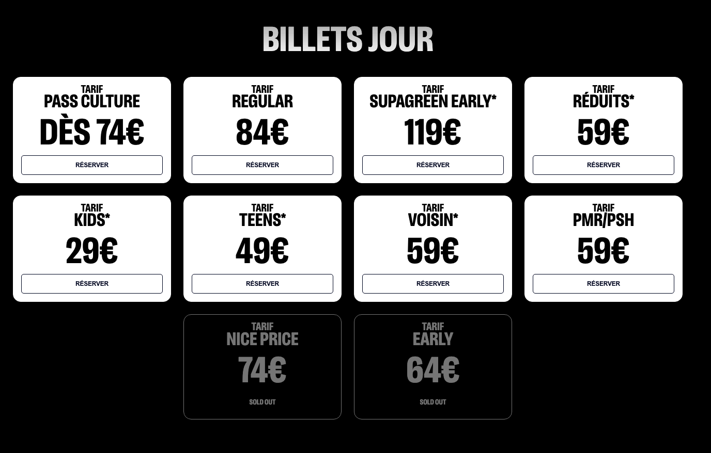
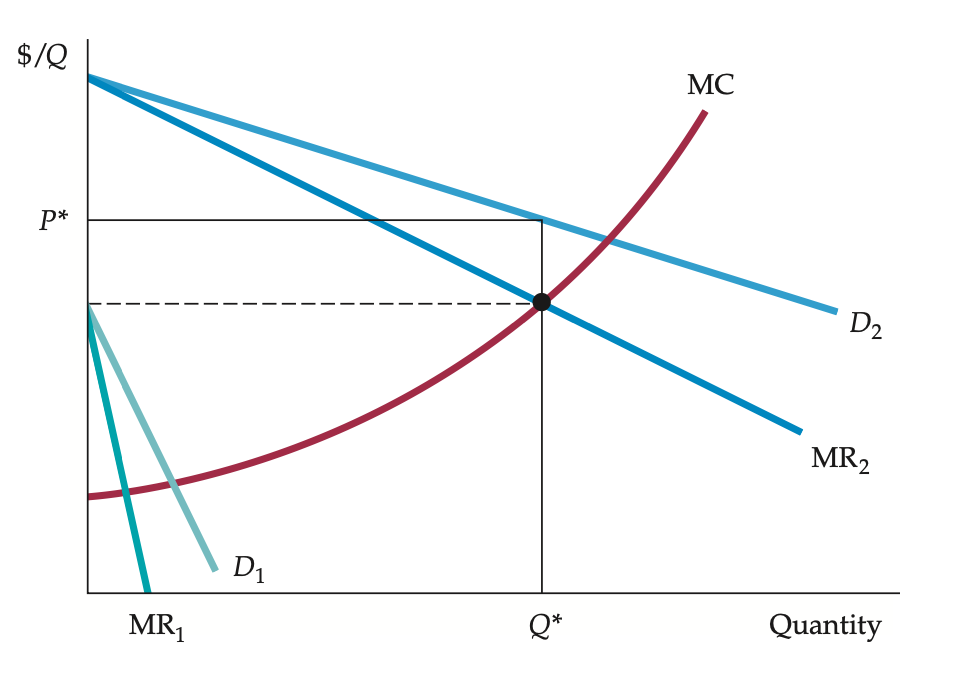
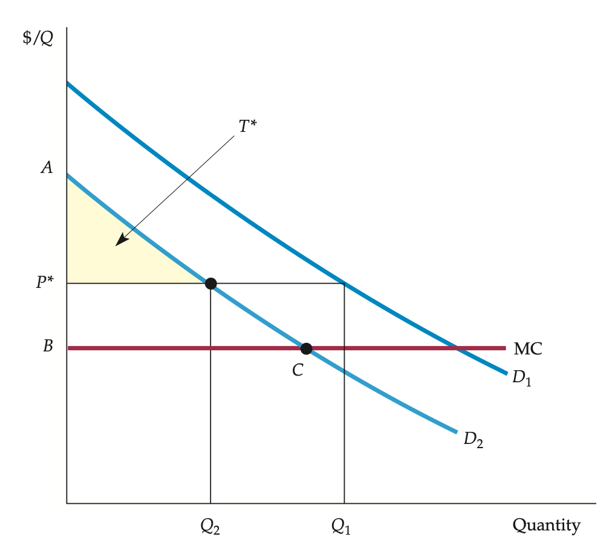

<style>

.center2 {
  margin: 0;
  position: absolute;
  top: 50%;
  left: 50%;
  -ms-transform: translate(-50%, -50%);
  transform: translate(-50%, -50%);
}

</style>

```{r setup, include = FALSE}
knitr::opts_chunk$set(echo = FALSE)
knitr::opts_chunk$set(warning = FALSE)
knitr::opts_chunk$set(message = FALSE)
knitr::opts_chunk$set(out.width = "70%")
knitr::opts_chunk$set(fig.align="center")

options(htmltools.dir.version = FALSE)
library(knitr)
library(tidyverse)
library(xaringanExtra)
library(ggplot2)
library(plotly)
library(googlesheets4)
library(dplyr)
library(knitr)
library(rtweet)

# set default options
opts_chunk$set(
  echo = FALSE,
  warnings = FALSE,
  collapse = TRUE,
  fig.width = 7.252,
  fig.height = 4,
  dpi = 300
)
# set engines
knitr::knit_engines$set("markdown")
xaringanExtra::use_tile_view()
xaringanExtra::use_panelset()
xaringanExtra::use_clipboard()
xaringanExtra::use_webcam()
xaringanExtra::use_broadcast()
xaringanExtra::use_share_again()
xaringanExtra::style_share_again(
  share_buttons = c("twitter", "linkedin", "pocket")
)

# Ensure Xaringan opens in RStudio Viewer instead of browser
options(servr.daemon = TRUE)
# xaringan::inf_mr()
```

```{r plotting-functions}
source("microII_plots.R")
source("chapter11_plots.R")
```

.center2[
# Introduction 
]

---
## Introduction 

.pull-left[
```{r, out.width="65%"}
knitr::include_graphics("https://res.cloudinary.com/shotgun/image/upload/v1734627385/production/artworks/WLG25_Shotgun_2-3_io20dt.png")
```
]

.pull-right[
```{r, out.width="70%"}

```
]

---
## Introduction 

```{r, out.width="85%"}
knitr::include_graphics("https://i.ytimg.com/vi/q_YFIY4L0EI/maxresdefault.jpg")
```

---
## Introduction

.center2[
### Firms with monopoly power must worry about the characteristics of demand
]

---
## Introduction 

```{r, out.width="85%"}

```

---
## Introduction 

```{r, out.width="85%"}

```

---
.center2[
# Capturing Consumer Surplus 
]

---
## Capturing Consumer Surplus 

--

A firm faces the following (hypothetical) demand curve: $P(Q) = 40 - 1.8Q$. 

```{r capturing-cs01}
plot_data <- 
  generate_monopoly_data(
    demand_intercept = 40, demand_slope = 1.8,
    cost_a = 0, cost_b = 0, cost_c = 1/16, cost_d = 1/24,
  )

p_c <- 18.76
q_c <- 11.78  

plot_monopoly(
  plot_data$data,
  show_marginal_revenue = F,
  show_average_cost = F,
  show_marginal_cost = F,
  show_eq_q = F, show_eq_p = F
)
```

What is the MR?
--
 $MR = 40-3.6Q$
 
---
## Capturing Consumer Surplus 

Suppose $C(Q) = \frac{1}{16} Q^2 + \frac{1}{24} Q^3$. 

```{r capturing-cs01-01}
plot_monopoly(
  plot_data$data,
  show_marginal_revenue = F,
  show_average_cost = F,
  show_marginal_cost = F,
  show_eq_q = F, show_eq_p = F
)
```

What is the MC?
--
 $MC = \frac{1}{8} Q + \frac{1}{8} Q^2$. 
 
---
## Capturing Consumer Surplus 

With market power, the firm would choose $Q^*$ such that $MC=MR$.

```{r capturing-cs02}
plot_monopoly(
  plot_data$data,
  show_marginal_revenue = T,
  show_average_cost = F,
  show_marginal_cost = T,
  show_eq_q = F, show_eq_p = F
)
```

---
## Capturing Consumer Surplus 

With market power, the firm would choose $Q^*$ such that $MC=MR$. Thus, $Q^* = 8.4$. 

```{r capturing-cs03}
plot_monopoly(
  plot_data$data,
  show_marginal_revenue = T,
  show_average_cost = F,
  show_marginal_cost = T,
  show_eq_q = T, show_eq_p = F
)
```

---
## Capturing Consumer Surplus 

With market power, the firm would choose $Q^*$ such that $MC=MR$. Thus, $Q^* = 8.4$. At $P(Q^*) \approx 25$. 

```{r capturing-cs04}
plot_capturing_cs <- 
plot_monopoly(
  plot_data$data,
  show_marginal_revenue = T,
  show_average_cost = F,
  show_marginal_cost = T,
  show_eq_q = T, show_eq_p = T
)

plot_capturing_cs
```

---
## Capturing Consumer Surplus 

Some consumers are willing to pay more than $P^*$. 

```{r capturing-cs05}
plot_capturing_cs
```

Raising prices would reduce sales. This would lead to fewer customers and lower profits.

---
## Capturing Consumer Surplus 

Some potential customers won’t buy at $P^*$, but many would pay more than the firm’s marginal cost.

```{r capturing-cs06}
plot_capturing_cs
```

This suggests missed sales opportunities at lower prices.

---
## Capturing Consumer Surplus 

The firm might charge different prices to different customers, according to where the customers are along the demand curve.

```{r capturing-cs07}
plot_capturing_cs
```

---
## Capturing Consumer Surplus 

Pricing strategies have one thing in common: means of capturing consumer surplus and transferring it to the producer.

```{r capturing-cs08}
plot_capturing_cs
```

---
.center2[
# Price Discrimination
]

---
## Price Discrimination

Practice of charging different prices to different consumers for similar goods.

--

Price discrimination can take three broad forms:

### First-degree

### Second-degree

### Third-degree

---
## First-degree Price Discrimination

A firm ideally wants to charge each customer their maximum willingness to pay, known as their **reservation price**. 
--


This strategy, called perfect first-degree price discrimination, maximizes revenue by tailoring prices to individual customers.
 
--

Is it profitable?
--
 We need to know the profit that the firm earns when it charges only the single price $P^*$.

---
## First-degree Price Discrimination

We need to know the profit that the firm earns when it charges only the single price $P^*$.

--

```{r 1st-d-price-disc01}
plot_capturing_cs
```

---
## First-degree Price Discrimination

Pricing $P^*$. 

Profit: $\Pi = R - C \; \Rightarrow \; \Delta \Pi = \Delta R - \Delta C = MR - MC$. 


```{r 1st-d-price-disc02}
plot_capturing_cs
```

---
## First-degree Price Discrimination

Pricing $P^*$. 

Close to $Q=0 \quad  \Rightarrow \Delta \Pi = MR-MC = 40-0 = 40$.

```{r 1st-d-price-disc03}
marginal_profits <- 
  tibble(
    q = seq(0, 8.4, by = .01),
  ) |> 
  mutate(
    mr = 40 - plot_data$formulas$marginal_revenue$slope*q,
    mc = plot_data$formulas$marginal_cost$linear*q + plot_data$formulas$marginal_cost$quadratic*(q^2)
  )

# Marginal Profit close to zero
plot_capturing_cs +
  geom_segment(
    data = marginal_profits |> filter(q == .01),
    aes(x = q, y = mc, yend = mr),
    color = yellow_chapter, alpha = .75, lwd = 2
  ) 
```


---
## First-degree Price Discrimination

Pricing $P^*$. 

When $Q=2.5 \quad  \Rightarrow \Delta \Pi = MR-MC \approx 31-1 = 30$.

```{r 1st-d-price-disc04}
# Marginal Profit close to zero
plot_capturing_cs +
  geom_segment(
    data = marginal_profits |> filter(q == 2.5),
    aes(x = q, y = mc, yend = mr),
    color = yellow_chapter, alpha = .75, lwd = 2
  ) 
```

---
## First-degree Price Discrimination

Pricing $P^*$. 

When $Q=5 \quad  \Rightarrow \Delta \Pi = MR-MC \approx 22-3.75 = 18.25$.

```{r 1st-d-price-disc05}
# Marginal Profit close to zero
plot_capturing_cs +
  geom_segment(
    data = marginal_profits |> filter(q == 5),
    aes(x = q, y = mc, yend = mr),
    color = yellow_chapter, alpha = .75, lwd = 2
  ) 
```

---
## First-degree Price Discrimination

Pricing $P^*$. 

When $Q=Q^*\approx8.4 \quad  \Rightarrow \Delta \Pi = MR-MC \approx 9.83-9.83 = 0$.

```{r 1st-d-price-disc06}
# Marginal Profit close to zero
plot_capturing_cs +
  geom_segment(
    data = marginal_profits |> filter(q == 8.38),
    aes(x = q, y = mc, yend = mr),
    color = yellow_chapter, alpha = .75, lwd = 2
  ) 
```

---
## First-degree Price Discrimination

Pricing $P^*$. 

**Variable profit**: $\sum_{Q=0}^{Q^*} MR(Q) - MC(Q)$

```{r 1st-d-price-disc07}
# Create the polygon data frame by stacking MR and MC values
marginal_profit_area <- bind_rows(
  marginal_profits |> select(q, y = mr), 
  marginal_profits |> select(q, y = mc) |> arrange(desc(q))
)

# Plot with the marginal profit area highlighted
plot_capturing_cs +
  geom_polygon(
    data = marginal_profit_area,
    aes(x = q, y = y),
    fill = yellow_chapter, alpha = 0.5
  )
```

---
## First-degree Price Discrimination

Pricing $P^*$. 

**Consumer surplus**: $\sum_{Q=0}^{Q^*} P(Q) - P^*$

```{r 1st-d-price-disc08}
cs <- 
  tibble(
    x = c(0,0,8.4),
    y = c(24.9, 40, 24.9)
  )

plot_capturing_cs +
  geom_polygon(
    data = cs,
    aes(x = x, y = y),
    fill = green_chapter, alpha = 0.5 
  )
```

---
## First-degree Price Discrimination

**Perfect Price Discrimination**: Each consumer is charged exactly what she is willing
to pay.

--

Is the MR informative for the firm under such pricing situation?

--

The revenue from each additional unit sold equals its price, as shown by the demand curve.

--

The additional profit, $\Delta \Pi$, from producing and selling an incremental unit is now the difference between demand, $P(Q)$, and marginal cost, $MC(Q)$.

---
## First-degree Price Discrimination

**Perfect Price Discrimination**: Each consumer is charged exactly what she is willing
to pay.

Close to $Q=0 \quad  \Rightarrow \Delta \Pi = AR(Q)-MC(Q) = 40-0 = 40$.

```{r 1st-d-price-disc09}
marginal_profits_ppd <- 
  tibble(
    q = seq(0, 13, by = .1),
  ) |> 
  mutate(
    mr = 40 - plot_data$formulas$demand$slope*q,
    mc = plot_data$formulas$marginal_cost$linear*q + plot_data$formulas$marginal_cost$quadratic*(q^2),
    m_profit = mr-mc
  ) |> 
  filter(m_profit >= 0)

# Marginal Profit close to zero
plot_capturing_cs +
  geom_segment(
    data = marginal_profits_ppd |> filter(q == 0),
    aes(x = q, y = mc, yend = mr),
    color = orange_chapter, alpha = .75, lwd = 2
  ) 
```

---
## First-degree Price Discrimination

**Perfect Price Discrimination**: Each consumer is charged exactly what she is willing
to pay.

When $Q=5 \quad  \Rightarrow \Delta \Pi = AR(Q)-MC(Q) = 31-3.75 = 27.25$.

```{r 1st-d-price-disc10}
# Marginal Profit close to zero
plot_capturing_cs +
  geom_segment(
    data = marginal_profits_ppd |> filter(q == 5),
    aes(x = q, y = mc, yend = mr),
    color = orange_chapter, alpha = .75, lwd = 2
  ) 
```

---
## First-degree Price Discrimination

**Perfect Price Discrimination**: Each consumer is charged exactly what she is willing
to pay.

When $Q=8.4 \quad  \Rightarrow \Delta \Pi = AR(Q)-MC(Q) \approx 24.9- 9.9 = 15$.

```{r 1st-d-price-disc11}
# Marginal Profit close to zero
plot_capturing_cs +
  geom_segment(
    data = marginal_profits_ppd |> filter(q == 8.4),
    aes(x = q, y = mc, yend = mr),
    color = orange_chapter, alpha = .75, lwd = 2
  ) 
```

---
## First-degree Price Discrimination

**Perfect Price Discrimination**: Each consumer is charged exactly what she is willing
to pay.

**Variable profit**: $\sum_{Q=0}^{Q^*} AR(Q) - MC(Q)$

```{r 1st-d-price-disc12}
# Create the polygon data frame by stacking MR and MC values
marginal_profit_area <- bind_rows(
  marginal_profits_ppd |> select(q, y = mr), 
  marginal_profits_ppd |> select(q, y = mc) |> arrange(desc(q))
)

# Plot with the marginal profit area highlighted
plot_capturing_cs +
  geom_polygon(
    data = marginal_profit_area,
    aes(x = q, y = y),
    fill = orange_chapter, alpha = 0.5
  ) +
  geom_point(
    aes(x = 11.75, y = 18.75), size = 2.5
  ) 
```

---
## First-degree Price Discrimination

**Perfect Price Discrimination**: Each consumer is charged exactly what she is willing
to pay.

The firm increases production as long as demand exceeds marginal cost, stopping at output  $Q^{**} \approx 11.7$  to maximize profit.

```{r 1st-d-price-disc13}
# Plot with the marginal profit area highlighted
plot_capturing_cs +
  geom_polygon(
    data = marginal_profit_area,
    aes(x = q, y = y),
    fill = orange_chapter, alpha = 0.5
  ) +
  geom_point(
    aes(x = 11.75, y = 18.75), size = 2.5
  ) 
```

---
## First-degree Price Discrimination

**Perfect Price Discrimination**: Each consumer is charged exactly what she is willing
to pay.

1) The firm's profit has increased.

```{r 1st-d-price-disc14}
# Plot with the marginal profit area highlighted
plot_capturing_cs +
  geom_polygon(
    data = marginal_profit_area,
    aes(x = q, y = y),
    fill = orange_chapter, alpha = 0.5
  ) +
  geom_point(
    aes(x = 11.75, y = 18.75), size = 2.5
  ) 
```

---
## First-degree Price Discrimination

**Perfect Price Discrimination**: Each consumer is charged exactly what she is willing to pay.

2) Since each customer pays their maximum willingness to pay, the firm captures all consumer surplus.

```{r 1st-d-price-disc15}
# Plot with the marginal profit area highlighted
plot_capturing_cs +
  geom_polygon(
    data = marginal_profit_area,
    aes(x = q, y = y),
    fill = orange_chapter, alpha = 0.5
  ) +
  geom_point(
    aes(x = 11.75, y = 18.75), size = 2.5
  ) 
```

---
## First-degree Price Discrimination

Perfect first-degree price discrimination is almost never possible.

--

1) Impractical to charge each and every customer a different price

2) Firms usually do not know the reservation price of each customer

--

**Imperfect Price Discrimination**: charging a few different prices based on estimates of customers’ reservation prices

--

Examples:

 - Professionals (i.e. doctors, lawyers, architects)
 - Salesperson
 - Universities

---
## First-degree Price Discrimination

**Imperfect Price Discrimination**: charging a few different prices based on estimates of customers’ reservation prices

```{r 1st-d-price-disc16}
imperfect_pd <- 
  tibble(
    p = c(38, 35, 30, 22, 18.75)
  ) |> 
  mutate(
    q = (40 - p)/plot_data$formulas$demand$slope
  )

plot_imperfect_pd <- 
plot_capturing_cs +
  geom_segment(
    aes(x = 0, xend = imperfect_pd$q[1], y = imperfect_pd$p[1], yend = imperfect_pd$p[1]), linetype = "dashed", color = "gray50"
  ) +
  # Annotate with dynamic value of eq_Q_rounded
  annotate(
    "text",
    x = imperfect_pd$q[1], y = imperfect_pd$p[1],  
    label = bquote(P[1]),  # Using bquote for dynamic value
    fontface = "italic", size = 3, hjust = -0.85
  )

plot_imperfect_pd 
```

---
## First-degree Price Discrimination

**Imperfect Price Discrimination**: charging a few different prices based on estimates of customers’ reservation prices

```{r 1st-d-price-disc17}
plot_imperfect_pd <- 
plot_imperfect_pd +
  geom_segment(
    aes(x = 0, xend = imperfect_pd$q[2], y = imperfect_pd$p[2], yend = imperfect_pd$p[2]), linetype = "dashed", color = "gray50"
  ) +
  # Annotate with dynamic value of eq_Q_rounded
  annotate(
    "text",
    x = imperfect_pd$q[2], y = imperfect_pd$p[2],  
    label = bquote(P[2]),  # Using bquote for dynamic value
    fontface = "italic", size = 3, hjust = -0.85
  )

plot_imperfect_pd 
```

---
## First-degree Price Discrimination

**Imperfect Price Discrimination**: charging a few different prices based on estimates of customers’ reservation prices

```{r 1st-d-price-disc18}
plot_imperfect_pd <- 
plot_imperfect_pd +
  geom_segment(
    aes(x = 0, xend = imperfect_pd$q[3], y = imperfect_pd$p[3], yend = imperfect_pd$p[3]), linetype = "dashed", color = "gray50"
  ) +
  # Annotate with dynamic value of eq_Q_rounded
  annotate(
    "text",
    x = imperfect_pd$q[3], y = imperfect_pd$p[3],  
    label = bquote(P[3]),  # Using bquote for dynamic value
    fontface = "italic", size = 3, hjust = -0.85
  )

plot_imperfect_pd 
```

---
## First-degree Price Discrimination

**Imperfect Price Discrimination**: charging a few different prices based on estimates of customers’ reservation prices

```{r 1st-d-price-disc19}
plot_imperfect_pd <- 
plot_imperfect_pd +
  geom_segment(
    aes(x = 0, xend = imperfect_pd$q[4], y = imperfect_pd$p[4], yend = imperfect_pd$p[4]), linetype = "dashed", color = "gray50"
  ) +
  # Annotate with dynamic value of eq_Q_rounded
  annotate(
    "text",
    x = imperfect_pd$q[4], y = imperfect_pd$p[4],  
    label = bquote(P[4]),  # Using bquote for dynamic value
    fontface = "italic", size = 3, hjust = -0.85
  )

plot_imperfect_pd 
```

---
## First-degree Price Discrimination

**Imperfect Price Discrimination**: charging a few different prices based on estimates of customers’ reservation prices

```{r 1st-d-price-disc20}
plot_imperfect_pd <- 
plot_imperfect_pd +
  geom_segment(
    aes(x = 0, xend = imperfect_pd$q[5], y = imperfect_pd$p[5], yend = imperfect_pd$p[5]), linetype = "dashed", color = "gray50"
  ) +
  # Annotate with dynamic value of eq_Q_rounded
  annotate(
    "text",
    x = imperfect_pd$q[5], y = imperfect_pd$p[5],  
    label = bquote(P[5]),  # Using bquote for dynamic value
    fontface = "italic", size = 3, hjust = -0.85
  )

plot_imperfect_pd 
```

---
## First-degree Price Discrimination

**Imperfect Price Discrimination**: charging a few different prices based on estimates of customers’ reservation prices

```{r 1st-d-price-disc21}
plot_imperfect_pd <- 
plot_imperfect_pd +
  geom_segment(
    aes(x = 0, xend = imperfect_pd$q[6], y = imperfect_pd$p[6], yend = imperfect_pd$p[6]), linetype = "dashed", color = "gray50"
  ) +
  # Annotate with dynamic value of eq_Q_rounded
  annotate(
    "text",
    x = imperfect_pd$q[6], y = imperfect_pd$p[6],  
    label = bquote(P[6]),  # Using bquote for dynamic value
    fontface = "italic", size = 3, hjust = -0.85
  )

plot_imperfect_pd 
```

---
## First-degree Price Discrimination

**Imperfect Price Discrimination**: charging a few different prices based on estimates of customers’ reservation prices

Customers unwilling to pay  $P^*$  or more benefit from entering the market, gaining some consumer surplus.

```{r 1st-d-price-disc22}
plot_imperfect_pd
```

---
## First-degree Price Discrimination

**Imperfect Price Discrimination**: charging a few different prices based on estimates of customers’ reservation prices

If price discrimination attracts enough new buyers, overall welfare can improve for both producers and consumers.

```{r 1st-d-price-disc23}
plot_imperfect_pd
```

---
## Second-Degree Price Discrimination

--

In some markets, a consumer’s reservation price decreases as they buy more units over time.

--

**Second-degree price discrimination**: Charging different prices per unit based on the quantity consumed.

--

**Block pricing** Practice of charging different prices for different quantities or “blocks” of a good.

--

Examples:

 - Electric power companies
 - Natural gas utilities
 - Municipal water companies

---
## Second-Degree Price Discrimination

Suppose a firm with declining average and marginal costs.

```{r 2nd-d-price-disc01}
plot_data <- 
  generate_monopoly_data(
    demand_intercept = 40, demand_slope = 3.6,
    cost_a = 0, cost_b = 32.5, cost_c = -3, cost_d = 1/9,
  )

plot_2nd_pd <- 
plot_monopoly(
  plot_data$data, 
  show_average_cost = T,
  show_marginal_cost = T,
  show_eq_p = F, show_eq_q = F
)

plot_2nd_pd
```

---
## Second-Degree Price Discrimination

Under single pricing, $P^*$ and $Q^*$.

```{r 2nd-d-price-disc02}
plot_monopoly(
  plot_data$data, 
  show_average_cost = T,
  show_marginal_cost = T,
  show_eq_p = T, show_eq_q = T
)
```

---
## Second-Degree Price Discrimination

Under block pricing.

Define blocks: 1st block $Q \in [0,3]$.

```{r 2nd-d-price-disc03}
last_block <- 0
block <- 3

plot_2nd_pd <- 
plot_2nd_pd + 
  geom_segment(
    aes(x = block, xend = block, y = 0, yend = 40 - 3.6*block), linetype = "dashed", color = "gray50"
  ) +
  geom_segment(
    aes(x = last_block, xend = block-.25, y = 1, yend = 1)
  ) +
  annotate(
    "text",  
    x = (last_block + block)/2, y = 2,  
    label =  "1st block", 
    fontface = "italic", size = 3, vjust = -.75  # Adjust size and alignment
  )

plot_2nd_pd
```

---
## Second-Degree Price Discrimination

Under block pricing.

For all quantities in 1st block $Q \in [0,3]$, firm charges $P_{\textit{1st block}} = P(Q_{\textit{max 1st block}})$.

```{r 2nd-d-price-disc04}
plot_2nd_pd <- 
  plot_2nd_pd +
  geom_segment(
    aes(x = last_block, xend = block, y = 40 - 3.6*block, yend = 40 - 3.6*block), linetype = "dashed", color = "gray50"
  ) +
  geom_point(
    aes(x = block, y = 40 - 3.6*block), size = 2
  ) +
  annotate(
    "text",  
    x = block, y = 40 - 3.6*block,  
    label =  bquote(P["1st block"]), 
    fontface = "italic", size = 3, hjust = -.35, vjust = -.1  # Adjust size and alignment
  )

plot_2nd_pd
```


---
## Second-Degree Price Discrimination

Under block pricing.

For all quantities in 2nd block $Q \in (3,6.5]$, firm charges $P_{\textit{2nd block}} = P(Q_{\textit{max 2nd block}})$.

```{r 2nd-d-price-disc05}

block2 <- 6.5

plot_2nd_pd <- 
  plot_2nd_pd + 
  geom_segment(
    aes(x = block2, xend = block2, y = 0, yend = 40 - 3.6*block2), linetype = "dashed", color = "gray50"
  ) +
  geom_segment(
    aes(x = block +.25, xend = block2-.25, y = 1, yend = 1)
  ) +
  annotate(
    "text",  
    x = (block + block2)/2, y = 2,  
    label =  "2nd block", 
    fontface = "italic", size = 3, vjust = -.75  # Adjust size and alignment
  ) +
  geom_segment(
    aes(x = 0, xend = block2, y = 40 - 3.6*block2, yend = 40 - 3.6*block2), linetype = "dashed", color = "gray50"
  ) +
  geom_point(
    aes(x = block2, y = 40 - 3.6*block2), size = 2
  ) +
  annotate(
    "text",  
    x = block2, y = 40 - 3.6*block2,  
    label =  bquote(P["2nd block"]), 
    fontface = "italic", size = 3, hjust = -.35, vjust = -.1  # Adjust size and alignment
  )
    
plot_2nd_pd
```

---
## Second-Degree Price Discrimination

Under block pricing.

For all quantities in 3rd block $Q \in (6.5,9.5]$, firm charges $P_{\textit{3rd block}} = P(Q_{\textit{max 3rd block}})$.

```{r 2nd-d-price-disc06}
block3 <- 9.5

plot_2nd_pd <- 
  plot_2nd_pd + 
  geom_segment(
    aes(x = block3, xend = block3, y = 0, yend = 40 - 3.6*block3), linetype = "dashed", color = "gray50"
  ) +
  geom_segment(
    aes(x = block2 +.25, xend = block3-.25, y = 1, yend = 1)
  ) +
  annotate(
    "text",  
    x = (block2 + block3)/2, y = 2,  
    label =  "3rd block", 
    fontface = "italic", size = 3, vjust = -.75  # Adjust size and alignment
  ) +
  geom_segment(
    aes(x = 0, xend = block3, y = 40 - 3.6*block3, yend = 40 - 3.6*block3), linetype = "dashed", color = "gray50"
  ) +
  geom_point(
    aes(x = block3, y = 40 - 3.6*block3), size = 2
  ) +
  annotate(
    "text",  
    x = block3, y = 40 - 3.6*block3,  
    label =  bquote(P["3rd block"]), 
    fontface = "italic", size = 3, hjust = -.35, vjust = -.1  # Adjust size and alignment
  )
    
plot_2nd_pd
```


---
## Second-Degree Price Discrimination

Second-degree price discrimination can then make consumers better off by expanding output and lowering cost.

```{r 2nd-d-price-disc07}
plot_2nd_pd
```

---
## Third-Degree Price Discrimination

--

What is the most prevalent form of price discrimination?

--

**Third-degree price discrimination**: Practice of dividing consumers into two or more groups with separate demand curves and charging different prices to each group.

--

Examples:

 - regular versus “special” airline fares
 - premium versus nonpremium brands of liquor,
 - discounts to students and senior citizens
 
---
## Third-Degree Price Discrimination

**Creating consumer groups**.
Based on observable characteristics and identities.

--

```{r, out.width="40%"}
knitr::include_graphics("https://rockmega.lu/wp-content/uploads/2022/05/Rasoir2_web.jpg")
```


---
## Third-Degree Price Discrimination

**Creating consumer groups**.
Based on observable characteristics and identities.

Third-Degree Price Discrimination Strategy:

--

1) Equalizing Marginal Revenues Across Groups

- Total output should be divided between the groups of customers so that marginal revenues (MR) for each group are equal.

- If MR differs, the firm can increase profit by shifting output between groups, adjusting prices accordingly

--

2) Setting Output Where MR = MC

- Total output should be set so that MR for each group equals marginal cost (MC).

- If MR exceeds MC, the firm can increase profit by expanding output; if MR is below MC, it should reduce output.


---
## Third-Degree Price Discrimination

Suppose there are two groups: $G \in \{1,2\}$.

--

Let $P_1$ be the price charged for the first group, and $P_2$ to the second.

--
 
Total output is: $\; Q_T = Q_1 + Q_2$.

--
 
Let $C(Q_T)$ be the total cost of producing output. Note that costs vary with total output, not with the output of each individual group.

--

Then, total profit is: $\; \Pi = P_1 \cdot Q_1 + P_2 \cdot Q_2 - C(Q_T)$

--

The firm should increase its sales to each group of consumers, $Q_1$ and $Q_2$, until the incremental profit from the last unit sold is zero.

--

.pull-left[

$$\frac{\Delta \Pi}{\Delta Q_1}  = \frac{\Delta (P_1 \cdot Q_1)}{\Delta Q_1}  - \frac{\Delta C(Q_T)}{\Delta Q_1} = 0$$
]

.pull-right[
$$\frac{\Delta \Pi}{\Delta Q_2}  = \frac{\Delta (P_2 \cdot Q_2)}{\Delta Q_2}  - \frac{\Delta C(Q_T)}{\Delta Q_2} = 0$$
]

--

Optimality condition:

$$ MR_1 = MR_2 = MC $$

---
## Third-Degree Price Discrimination

Suposse a firm with the following total cost function:
$C(Q_T) = 50 \cdot Q_T + \frac{1}{90} \cdot Q_T^2 + \frac{1}{90} \cdot Q_T^3$.
--

Thus, $MC(Q_T) = 50 + \frac{1}{45} \cdot Q_T + \frac{1}{30} \cdot Q_T^2$.

```{r 3rd-d-price-disc01}
plot_data <- 
  tibble(
    q = seq(0,40,.1)
  ) |> 
  mutate(
    mc = 5 + (2/90)*(q) + (3/90)*(q^2),
    d1 = 40 - .75*q,
    mr1 = 40 - 1.5*q,
    d2 = 60 - 3*q,
    mr2 = 60 - 6*q,
    mr1 = if_else(mr1<=0, NA_real_, mr1),
    mr2 = if_else(mr2<=0, NA_real_, mr2),
  )

# Compute Q values corresponding to MR functions
foo <- 
  tibble(
    p = seq(0, 60, 0.001)  # Small step size for smooth interpolation
  ) |> 
  mutate(
    qmr1 = (40 - p) / 1.5,  # Inverting MR1 function to get Q
    qmr2 = (60 - p) / 6,    # Inverting MR2 function to get Q
    qmrt = qmr1 + qmr2      # Summing quantities for total MR
  )

# Merge back with main plot_data and apply **linear extrapolation**
plot_data <- 
  plot_data |> 
  left_join(
    foo |> 
      mutate(
        mrt = p,  # Define MR_T as price axis
        q = qmrt  # Use summed quantities
      ) |> 
      select(q, mrt),
    by = "q"
  ) |> 
  mutate(
    mrt = zoo::na.approx(mrt, rule = 2),  # **Linear extrapolation**
    mrt = case_when(
      mrt < mr2 ~ mr2,
      T ~ mrt
    ),
    mrt = if_else(mrt<=1, NA_real_, mrt),
  )


plot_3rd_pd <- 
ggplot() +
  labs(x = "Quantity", y = "Price") +
  theme_chapter +
  coord_cartesian(clip = "off") +
  scale_x_continuous(limits = c(0, 40)) +
  scale_y_continuous(limits = c(0, 50)) +
  # Marginal cost 
  geom_line(data = plot_data, aes(x = q, y = mc), color = red_chapter, size = 1.2) +
  annotate(
    "text", label = "MC",
    x = 36.5, y = 50,
    color = red_chapter, fontface = "italic", size = 3.5, hjust = -0.25
  ) 

plot_3rd_pd
```

---
## Third-Degree Price Discrimination

Suppose the firm can identify two groups and their respective demands.

.pull-left[
$P(Q_1) = 40 - 0.75\cdot Q_1$
]


```{r 3rd-d-price-disc02}
plot_3rd_pd <- 
plot_3rd_pd +
  # Demand Group 1
  geom_line(data = plot_data, aes(x = q, y = d1), color = blue_chapter, size = 1.2) +
  annotate(
    "text", label = bquote(D["1"]),
    x = 40, y = 13,
    color = blue_chapter, fontface = "italic", size = 3.5, hjust = -0.25
  ) 

plot_3rd_pd
```

---
## Third-Degree Price Discrimination

Suppose the firm can identify two groups and their respective demands.

.pull-left[
$P(Q_1) = 40 - 0.75\cdot Q_1$
]

.pull-right[
$P(Q_2) = 60 - 3\cdot Q_2$
]

```{r 3rd-d-price-disc03}
plot_3rd_pd <- 
  plot_3rd_pd +
  # Demand Group 2
  geom_line(data = plot_data, aes(x = q, y = d2), color = turquoise_chapter, size = 1.2) +
  annotate(
    "text", label = bquote(D["2"]),
    x = 20, y = 3,
    color = turquoise_chapter, fontface = "italic", size = 3.5, hjust = -0.25
  ) 

plot_3rd_pd
```

---
## Third-Degree Price Discrimination

Suppose the firm can identify two groups and their respective demands.

.pull-left[
$P(Q_1) = 40 - 0.75\cdot Q_1 \; \Rightarrow \; MR(Q_1) = 40 - 1.5\cdot Q_1$ 
]

.pull-right[
$P(Q_2) = 60 - 3\cdot Q_2 \; \Rightarrow \; MR(Q_2) = 60 - 6\cdot Q_1$
]

```{r 3rd-d-price-disc04}
plot_3rd_pd <- 
plot_3rd_pd +
  # Marginal revenues Group 1
  geom_line(data = plot_data, aes(x = q, y = mr1), color = blue_chapter, size = 1.2, alpha = .5, linetype = "dashed") +
  annotate(
    "text", label = bquote(MR["1"]),
    x = 26, y = 3,
    color = blue_chapter, fontface = "italic", size = 3.5, hjust = -0.25
  ) +
  # Marginal revenues Group 2
  geom_line(data = plot_data, aes(x = q, y = mr2), color = turquoise_chapter, size = 1.2, alpha = .5, linetype = "dashed") +
  annotate(
    "text", label = bquote(MR["2"]),
    x = 10, y = 3,
    color = turquoise_chapter, fontface = "italic", size = 3.5, hjust = -0.25
  ) 

plot_3rd_pd
```

---
## Third-Degree Price Discrimination

How to define the total quantity produced?

At the optimal point, we need a reference line in the price axis where the following conditions hold: $MR_1 = MR_2 = MC$.

```{r 3rd-d-price-disc05}
plot_3rd_pd
```

---
## Third-Degree Price Discrimination

Horizontally summing MR curves into $MR_T$: adding the quantities that different consumer groups are willing to buy at the same price. 

Instead of viewing MR as a function of quantity, we determine the total quantity demanded by both groups at each price level.

```{r 3rd-d-price-disc06}
plot_3rd_pd <- plot_3rd_pd +
  # Marginal revenues T
  geom_line(data = plot_data, aes(x = q, y = mrt), color = purple_chapter, size = 1.2, alpha = .5) +
  annotate(
    "text", label = bquote(MR["T"]),
    x = 36, y = 3,
    color = purple_chapter, fontface = "italic", size = 3.5, hjust = -0.25
  ) 

plot_3rd_pd
```

---
## Third-Degree Price Discrimination

First, find $Q_T$ such that $MR_T = MC$. 

In this case, $Q_T = 20.5$.

```{r 3rd-d-price-disc07}
# **Find the Equilibrium Quantity Where MC = MR_T**
eq_q <- plot_data |> 
  filter(!is.na(mrt)) |> 
  mutate(diff = abs(mc - mrt)) |> 
  filter(diff == min(diff)) |>  # Find minimum difference
  select(q, mrt)

eq_p <- round(eq_q$mrt, 1)
eq_q <- round(eq_q$q, 1)

plot_3rd_pd <- plot_3rd_pd +
  geom_segment(aes(x = eq_q, xend = eq_q, y = 0, yend = eq_p), linetype = "dashed", color = "gray50") +
  # Annotate with dynamic value of eq_Q_rounded
  annotate(
    "text",
    x = eq_q, y = 0,  
    label = bquote(Q["T"] == .(eq_q)),  # Using bquote for dynamic value
    fontface = "italic", size = 2.4, hjust = -0.15
  )

plot_3rd_pd
```

---
## Third-Degree Price Discrimination

Then, find a reference number in price-axis such that $MR_1 = MR_2 = MC$. 

For $Q_T = 20.5$, $\; \Rightarrow 19.4 = MR_1 = MR_2 = MC$

```{r 3rd-d-price-disc08}
plot_3rd_pd <- plot_3rd_pd +
  geom_segment(aes(x = 0, xend = eq_q, y = eq_p, yend = eq_p), color = "gray50") 

plot_3rd_pd
```

---
## Third-Degree Price Discrimination

Find the quantities $Q_1$ and $Q_2$.

```{r 3rd-d-price-disc09}
eq_q1 <- 
plot_data |> 
  mutate(diff = abs(mr1 - eq_p)) |> 
  filter(diff == min(diff, na.rm = T))

eq_q1 <- eq_q1$q

plot_3rd_pd <- plot_3rd_pd +
  geom_segment(aes(x = eq_q1, xend = eq_q1, y = 0, yend = eq_p), linetype = "dashed", color = "gray50") +
  # Annotate with dynamic value of eq_Q_rounded
  annotate(
    "text",
    x = eq_q1, y = 0,  
    label = bquote(Q["1"] == .(eq_q1)),  # Using bquote for dynamic value
    fontface = "italic", size = 2.4, hjust = -0.15
  )

plot_3rd_pd
```

---
## Third-Degree Price Discrimination

Find the quantities $Q_1$ and $Q_2$.

```{r 3rd-d-price-disc10}
eq_q2 <- 
  plot_data |> 
  mutate(diff = abs(mr2 - eq_p)) |> 
  filter(diff == min(diff, na.rm = T))

eq_q2 <- eq_q2$q

plot_3rd_pd <- plot_3rd_pd +
  geom_segment(aes(x = eq_q2, xend = eq_q2, y = 0, yend = eq_p), linetype = "dashed", color = "gray50") +
  # Annotate with dynamic value of eq_Q_rounded
  annotate(
    "text",
    x = eq_q2, y = 0,  
    label = bquote(Q["2"] == .(eq_q2)),  # Using bquote for dynamic value
    fontface = "italic", size = 2.4, hjust = -0.15
  )

plot_3rd_pd
```

---
## Third-Degree Price Discrimination

Find the respective prices $P_1$ and $P_2$.

```{r 3rd-d-price-disc11}
eq_p1 <- 
plot_data |> 
  mutate(diff = abs(q - eq_q1)) |> 
  filter(diff == min(diff, na.rm = T))

eq_p1 <- round(eq_p1$d1, 1)

plot_3rd_pd <- plot_3rd_pd +
  geom_segment(aes(x = eq_q1, xend = eq_q1, y = 0, yend = eq_p1), linetype = "dashed", color = "gray50") +
  geom_segment(aes(x = 0, xend = eq_q1, y = eq_p1, yend = eq_p1), linetype = "dashed", color = "gray50") +
  geom_point(aes(x = eq_q1, y = eq_p1), size = 2.5) +
  annotate(
    "text",  
    x = 0, y = eq_p1,  
    label = bquote(P["1"] == .(eq_p1)),  # Using bquote for dynamic value
    fontface = "italic", size = 2.5, vjust = -.75  # Adjust size and alignment
  )

plot_3rd_pd
```

---
## Third-Degree Price Discrimination

Find the respective prices $P_1$ and $P_2$.

```{r 3rd-d-price-disc12}
eq_p2 <- 
  plot_data |> 
  mutate(diff = abs(q - eq_q2)) |> 
  filter(diff == min(diff, na.rm = T))

eq_p2 <- round(eq_p2$d2, 1)

plot_3rd_pd <- plot_3rd_pd +
  geom_segment(aes(x = eq_q2, xend = eq_q2, y = 0, yend = eq_p2), linetype = "dashed", color = "gray50") +
  geom_segment(aes(x = 0, xend = eq_q2, y = eq_p2, yend = eq_p2), linetype = "dashed", color = "gray50") +
  geom_point(aes(x = eq_q2, y = eq_p2), size = 2.5) +
  annotate(
    "text",  
    x = 0, y = eq_p2,  
    label = bquote(P["2"] == .(eq_p2)),  # Using bquote for dynamic value
    fontface = "italic", size = 2.5, vjust = -.75  # Adjust size and alignment
  )

plot_3rd_pd
```

---
## Third-Degree Price Discrimination

Note $P_2 > P_1$. Why? 

```{r 3rd-d-price-disc13}
plot_3rd_pd
```

---
## Third-Degree Price Discrimination

Note $P_2 > P_1$. Why? Elasticities.

Recall: $MR = P(1 + \frac{1}{\varepsilon_d})$

--

Then:

.pull-left[
$$MR_1 = P_1 (1 + \frac{1}{\varepsilon_{d1}})$$
]

.pull-right[
$$MR_2 = P_2 (1 + \frac{1}{\varepsilon_{d2}})$$
]

--

If the optimality condition is $MR_1 = MR_2$:

$$P_1 (1 + \frac{1}{\varepsilon_{d1}}) =  P_2 (1 + \frac{1}{\varepsilon_{d2}})$$
--

$$\frac{P_1}{P_2} = \frac{1 + \frac{1}{\varepsilon_{d2}}}{1 + \frac{1}{\varepsilon_{d1}}}$$

---
## Third-Degree Price Discrimination

Recall $\varepsilon_d = \frac{\Delta Q}{ \Delta P} \cdot \frac{P}{ Q}$. Thus, in our example, with $P_1 = 29.7$ and $P_2=39.6$:

.pull-left[
$$P_1=40-0.75 \cdot Q_1$$
]

.pull-right[
$$P_2=60-3 \cdot Q_2$$
]

--

.pull-left[
$$\Rightarrow \; \Delta P_1= -0.75 \cdot \Delta Q_1$$
]

.pull-right[
$$\Rightarrow \; \Delta P_2= - 3 \cdot \Rightarrow \; \Delta  Q_2$$
]

--

.pull-left[
$$\iff \; \frac{\Delta P_1}{\Delta Q_1}= - 0.75$$
]

.pull-right[
$$\iff \; \frac{\Delta P_2}{ \Delta Q_2}= - 3$$
]

--

.pull-left[
$$\Rightarrow \; \frac{1}{ \varepsilon_{d1}}= - 0.75 \cdot \frac{29.7}{13.7} \approx -0.35$$
]

.pull-right[
$$\Rightarrow \; \frac{1}{ \varepsilon_{d2}}= - 3 \cdot \frac{39.6}{6.8} \approx -0.515$$
]

--

$$\frac{P_1}{P_2} = \frac{1 + \frac{1}{\varepsilon_{d2}}}{1 + \frac{1}{\varepsilon_{d1}}} \; \Rightarrow  \; \frac{1-0.515}{1-0.35} \approx 0.75$$

---
## Third-Degree Price Discrimination

It may not pay to sell to both groups of consumers if marginal cost is rising and one group is not willing to pay much for the product.

```{r 3rd-d-price-disc14, out.width="60%"}

```


---
.center2[
# Intertemporal Price Discrimination and Peak-Load Pricing
]

---
## Intertemporal Price Discrimination

Divide consumers into high-demand and low-demand groups by charging a price that is high at first but falls later. 

--

Examples:

 - New technological equipments (i.e. cellphones, computers)
 - Movies and books
 - Apparel
 
---
## Intertemporal Price Discrimination

Suppose a firm with constant or decreasing MC. (What is the intuition?)

```{r intmp-price-disc01}
plot_data <- 
  tibble(
    q = seq(0,40,.1)
  ) |> 
  mutate(
    mc = 15,
    d2 = 35 - .5*q,
    d2 = if_else(q < 10, NA_real_, d2),
    d2 = if_else(q >= 37, NA_real_, d2),
    mr2 = 35 - 1*q,
    mr2 = if_else(q < 10, NA_real_, mr2),
    d1 = 70 - 3.5*q,
    mr1 = 70 - 7*q,
    mr1 = if_else(mr1<=0, NA_real_, mr1),
    mr2 = if_else(mr2<=0, NA_real_, mr2),
  )

plot_intmp_price <- 
  ggplot() +
  labs(x = "Quantity", y = "Price") +
  theme_chapter +
  coord_cartesian(clip = "off") +
  scale_x_continuous(limits = c(0, 42)) +
  scale_y_continuous(limits = c(0, 50)) +
  # Marginal cost 
  geom_line(data = plot_data, aes(x = q, y = mc), color = red_chapter, size = 1.2) +
  annotate(
    "text", label = "MC",
    x = 41, y = 15,
    color = red_chapter, fontface = "italic", size = 3.5, hjust = 0.25
  ) 

plot_intmp_price
```

---
## Intertemporal Price Discrimination

$D_1$: group of consumers who value the product highly and do not want to wait to buy it.

```{r intmp-price-disc02}
plot_intmp_price <- 
  plot_intmp_price +
  # Demand Group 1
  geom_line(data = plot_data, aes(x = q, y = d1), color = blue_chapter, size = 1.2) +
  annotate(
    "text", label = bquote(D["1"]),
    x = 20.5, y = 1.5,
    color = blue_chapter, fontface = "italic", size = 3.5, hjust = -0.25
  ) +
  # Marginal revenues Group 1
  geom_line(data = plot_data, aes(x = q, y = mr1), color = blue_chapter, size = 1.2, alpha = .5, linetype = "dashed") +
  annotate(
    "text", label = bquote(MR["1"]),
    x = 10.5, y = 1.5,
    color = blue_chapter, fontface = "italic", size = 3.5, hjust = -0.25
  )

plot_intmp_price
```

---
## Intertemporal Price Discrimination

Offer the product initially at the high price $P_1$, selling mostly to consumers on demand curve $D_1$.

```{r intmp-price-disc03}
mc <- 15

eq_q1 <- 
  plot_data |> 
  mutate(diff = abs(mr1 - mc)) |> 
  filter(diff == min(diff, na.rm = T))

eq_p1 <- round(eq_q1$d1, 1)
eq_q1 <- round(eq_q1$q, 1)

plot_intmp_price <- 
  plot_intmp_price +
  geom_segment(aes(x = eq_q1, xend = eq_q1, y = 0, yend = eq_p1), linetype = "dashed", color = "gray50") +
  annotate(
    "text",
    x = eq_q1, y = 0,  
    label = bquote(Q["1"] == .(eq_q1)),  # Using bquote for dynamic value
    fontface = "italic", size = 2.4, hjust = -0.15
  ) +
  geom_segment(aes(x = 0, xend = eq_q1, y = eq_p1, yend = eq_p1), linetype = "dashed", color = "gray50") +
  annotate(
    "text",
    x = 0, y = eq_p1,  
    label = bquote(P["1"] == .(eq_p1)),  # Using bquote for dynamic value
    fontface = "italic", size = 2.4, vjust = -0.15
  ) +
  geom_point(
    aes(eq_q1, eq_p1), size = 2.5
  )

plot_intmp_price
```

---
## Intertemporal Price Discrimination

$D_2$: consumers who are more price-sensitive and likely to forgo the product if the price is high.

```{r intmp-price-disc04}
plot_intmp_price <- 
  plot_intmp_price +
  # Demand Group 2
  geom_line(data = plot_data, aes(x = q, y = d2), color = turquoise_chapter, size = 1.2) +
  annotate(
    "text", label = bquote(D["2"]),
    x = 37, y = 19,
    color = turquoise_chapter, fontface = "italic", size = 3.5, hjust = -0.25
  ) +
  # Marginal revenues Group 1
  geom_line(data = plot_data, aes(x = q, y = mr2), color = turquoise_chapter, size = 1.2, alpha = .5, linetype = "dashed") +
  annotate(
    "text", label = bquote(MR["2"]),
    x = 34.5, y = 1.5,
    color = turquoise_chapter, fontface = "italic", size = 3.5, hjust = -0.25
  )

plot_intmp_price
```

---
## Intertemporal Price Discrimination

After $D_1$ has bought the product, the price is lowered to $P_2$, and sales are made to the larger group $D_2$.

```{r intmp-price-disc05}
eq_q2 <- 
  plot_data |> 
  mutate(diff = abs(mr2 - mc)) |> 
  filter(diff == min(diff, na.rm = T))

eq_p2 <- round(eq_q2$d2, 1)
eq_q2 <- round(eq_q2$q, 1)

plot_intmp_price <- 
  plot_intmp_price +
  geom_segment(aes(x = eq_q2, xend = eq_q2, y = 0, yend = eq_p2), linetype = "dashed", color = "gray50") +
  annotate(
    "text",
    x = eq_q2, y = 0,  
    label = bquote(Q["1"] == .(eq_q2)),  # Using bquote for dynamic value
    fontface = "italic", size = 2.4, hjust = -0.15
  ) +
  geom_segment(aes(x = 0, xend = eq_q2, y = eq_p2, yend = eq_p2), linetype = "dashed", color = "gray50") +
  annotate(
    "text",
    x = 0, y = eq_p2,  
    label = bquote(P["1"] == .(eq_p2)),  # Using bquote for dynamic value
    fontface = "italic", size = 2.4, vjust = -0.15
  ) +
  geom_point(
    aes(eq_q2, eq_p2), size = 2.5
  )

plot_intmp_price
```

---
## Peak-load Pricing

Charging different prices at different points in time. 

--

The objective is to increase economic efficiency by charging consumers prices that are close to marginal cost.

--

Examples:

 - Uber, Bolt, etc.
 - Hotels, Ski resorts, amusement parks
 - Movie tickets
 
---
## Peak-load Pricing

When demanded quantity peaks, marginal cost is also high because of capacity constraints.

```{r peak-load-pricing-01}
plot_data <- 
  tibble(
    q = seq(0,40,.1)
  ) |> 
  mutate(
    mc = 5 + (2/90)*(q) + (3/90)*(q^2),
    d1 = 40 - 1.25*q,
    mr1 = 40 - 2.5*q,
    d2 = 70 - 1.25*q,
    mr2 = 70 - 2.5*q,
    mr1 = if_else(mr1<=0, NA_real_, mr1),
    mr2 = if_else(mr2<=0, NA_real_, mr2),
  )


plot_peakloadp <- 
  ggplot() +
  labs(x = "Quantity", y = "Price") +
  theme_chapter +
  coord_cartesian(clip = "off") +
  scale_x_continuous(limits = c(0, 42)) +
  scale_y_continuous(limits = c(0, 50)) +
  # Marginal cost 
  geom_line(data = plot_data, aes(x = q, y = mc), color = red_chapter, size = 1.2) +
  annotate(
    "text", label = "MC",
    x = 37.5, y = 50,
    color = red_chapter, fontface = "italic", size = 3.5, hjust = 0.25
  ) 

plot_peakloadp
```

---
## Peak-load Pricing

$D_1$: Demand during non-peak period. 

```{r peak-load-pricing-02}
plot_peakloadp <- 
  plot_peakloadp +
  # Demand Group 1
  geom_line(data = plot_data, aes(x = q, y = d1), color = blue_chapter, size = 1.2) +
  annotate(
    "text", label = bquote(D["1"]),
    x = 32.5, y = 1.5,
    color = blue_chapter, fontface = "italic", size = 3.5, hjust = -0.25
  ) +
  # Marginal revenues Group 1
  geom_line(data = plot_data, aes(x = q, y = mr1), color = blue_chapter, size = 1.2, alpha = .5, linetype = "dashed") +
  annotate(
    "text", label = bquote(MR["1"]),
    x = 16, y = 1.5,
    color = blue_chapter, fontface = "italic", size = 3.5, hjust = -0.25
  )

plot_peakloadp
```

---
## Peak-load Pricing

Set quantity $Q_1$ and price $P_1$ with market power for non-peak period.

```{r peak-load-pricing-03}
eq_q1 <- 
  plot_data |> 
  mutate(diff = abs(mr1 - mc)) |> 
  filter(diff == min(diff, na.rm = T))

eq_p1 <- round(eq_q1$d1, 1)
eq_q1 <- round(eq_q1$q, 1)

plot_peakloadp <- 
  plot_peakloadp +
  geom_segment(aes(x = eq_q1, xend = eq_q1, y = 0, yend = eq_p1), linetype = "dashed", color = "gray50") +
  annotate(
    "text",
    x = eq_q1, y = 0,  
    label = bquote(Q["1"] == .(eq_q1)),  # Using bquote for dynamic value
    fontface = "italic", size = 2.4, hjust = -0.15
  ) +
  geom_segment(aes(x = 0, xend = eq_q1, y = eq_p1, yend = eq_p1), linetype = "dashed", color = "gray50") +
  annotate(
    "text",
    x = 0, y = eq_p1,  
    label = bquote(P["1"] == .(eq_p1)),  # Using bquote for dynamic value
    fontface = "italic", size = 2.4, vjust = -0.15
  ) +
  geom_point(
    aes(eq_q1, eq_p1), size = 2.5
  )

plot_peakloadp
```


---
## Peak-load Pricing

$D_2$: Demand during peak period. Note there is a shift in demand, not different preferences and elasticities.

```{r peak-load-pricing-04}
plot_peakloadp <- 
  plot_peakloadp +
  # Demand Group 2
  geom_line(data = plot_data, aes(x = q, y = d2), color = turquoise_chapter, size = 1.2) +
  annotate(
    "text", label = bquote(D["2"]),
    x = 37, y = 19,
    color = turquoise_chapter, fontface = "italic", size = 3.5, hjust = -0.25
  ) +
  # Marginal revenues Group 1
  geom_line(data = plot_data, aes(x = q, y = mr2), color = turquoise_chapter, size = 1.2, alpha = .5, linetype = "dashed") +
  annotate(
    "text", label = bquote(MR["2"]),
    x = 27.5, y = 1.5,
    color = turquoise_chapter, fontface = "italic", size = 3.5, hjust = -0.25
  )

plot_peakloadp
```

---
## Peak-load Pricing

Set quantity $Q_2$ and price $P_2$ with market power for peak period.

```{r peak-load-pricing-05}
eq_q2 <- 
  plot_data |> 
  mutate(diff = abs(mr2 - mc)) |> 
  filter(diff == min(diff, na.rm = T))

eq_p2 <- round(eq_q2$d2, 1)
eq_q2 <- round(eq_q2$q, 1)

plot_peakloadp <- 
  plot_peakloadp +
  geom_segment(aes(x = eq_q2, xend = eq_q2, y = 0, yend = eq_p2), linetype = "dashed", color = "gray50") +
  annotate(
    "text",
    x = eq_q2, y = 0,  
    label = bquote(Q["1"] == .(eq_q2)),  # Using bquote for dynamic value
    fontface = "italic", size = 2.4, hjust = -0.15
  ) +
  geom_segment(aes(x = 0, xend = eq_q2, y = eq_p2, yend = eq_p2), linetype = "dashed", color = "gray50") +
  annotate(
    "text",
    x = 0, y = eq_p2,  
    label = bquote(P["1"] == .(eq_p2)),  # Using bquote for dynamic value
    fontface = "italic", size = 2.4, vjust = -0.15
  ) +
  geom_point(
    aes(eq_q2, eq_p2), size = 2.5
  )

plot_peakloadp
```

---
## Peak-load Pricing

- Increase firm profits
- More efficient: sum of producer and consumer surplus is greater
- If regulated, $MC=P_1=P_2$: consumers realize the entire efficiency gain.

```{r peak-load-pricing-06}
plot_peakloadp
```

---
## Peak-load Pricing

Peak-load pricing $\neq$ 3rd-degree price discrimination

- 3rd-degree price discrimination: prices must be set so that $MR_1 = MR_2 = MC$ since serving one group affects the cost of serving another (e.g., airline tickets)
- Peak-load pricing: Selling more during off-peak times does not impact costs during peak times.

```{r peak-load-pricing-07, out.width="60%"}
plot_peakloadp
```

---
.center2[
# The Two-Part Tariff
]

---
## The Two-Part Tariff

A pricing strategy where consumers pay an upfront fee (entry fee) plus an additional per-unit fee (usage fee).

--

Examples:
  - Phone services (monthly fee + extra charges)
  - Sport clubs or gyms (membership + court fees/extra classes)
  - Vélib (subscription fee + per-use fee)
  - Museum memberships (membership for unlimited visits + extra fees for temporary exhibitions)
  - Clubs (entrance fee + prices per drinks)
  
--

Firms must choose:

1. Entree fee $T$
2. Usage fee $P$

--

Pricing Dilemma: 

1. High entry fee + low usage fee
2. Low entry fee + high usage fee

  
---
## The Two-Part Tariff

Artificial but simple case. 

--

One consumer on the market (or many consumers with identical demand curves).

$P = 40 - 2 \cdot Q$.

```{r 2p-tariff-01}
plot_data <- 
  tibble(
    q = seq(0,40,.1)
  ) |> 
  mutate(
    mc = 20,
    d1 = 40 - 2*q,
  )

plot_2p_tariff <- 
  ggplot() +
  labs(x = "Quantity", y = "Price") +
  theme_chapter +
  coord_cartesian(clip = "off") +
  scale_x_continuous(limits = c(0, 22)) +
  scale_y_continuous(limits = c(0, 42)) +
  # Demand Group 1
  geom_line(data = plot_data, aes(x = q, y = d1), color = blue_chapter, size = 1.2) +
  annotate(
    "text", label = bquote(D["1"]),
    x = 20.5, y = 1.5,
    color = blue_chapter, fontface = "italic", size = 3.5, hjust = -0.25
  ) 

plot_2p_tariff
```

---
## The Two-Part Tariff

Artificial but simple case. 

Suppose also that the firm knows this consumer’s demand curve.

$MC = 20$

```{r 2p-tariff-02}
plot_2p_tariff <- 
plot_2p_tariff +
  # Marginal cost 
  geom_line(data = plot_data, aes(x = q, y = mc), color = red_chapter, size = 1.2) +
  annotate(
    "text", label = "MC",
    x = 41, y = 15,
    color = red_chapter, fontface = "italic", size = 3.5, hjust = 0.25
  ) 

plot_2p_tariff
```

---
## The Two-Part Tariff

Artificial but simple case. 

If the firm wants to capture as much consumer surplus as possible, what is $P$ and what is $T$? Remember $P$ is the usage or extra fee price per unit consumed.

```{r 2p-tariff-03}
cs <- 
  tibble(
    x = c(0,0,10),
    y = c(20,40,20)
  )

plot_2p_tariff <- 
  plot_2p_tariff +
  annotate(
    "text",
    x = 20, y = 22,  
    label = bquote(P^"*" == MC),  # Using bquote
    fontface = "italic", size = 3, hjust = -0.15
  )

plot_2p_tariff
```

---
## The Two-Part Tariff

Artificial but simple case. 

If the firm wants to capture as much consumer surplus as possible, what is $P$ and what is $T$? Thus, $T$ will be equal to the consumer surplus.

```{r 2p-tariff-04}
plot_2p_tariff <- 
  plot_2p_tariff +
  geom_polygon(
    data = cs,
    aes(x = x, y = y),
    fill = yellow_chapter, alpha = 0.5 
  ) +
  annotate(
    "text",
    x = mean(cs$x), y = mean(cs$y),  
    label = "T",  # Using bquote
    fontface = "italic", size = 3, hjust = -0.15
  )

plot_2p_tariff
```

---
## The Two-Part Tariff

Now suppose that there are two groups of consumers. The firm, however, can set only one entry fee and one usage fee.

---
## The Two-Part Tariff

If the usage fee, $P$, equals MC. Thus, $T$ would be the consumer surplus of the first group of consumers: if the firms charge a higher $T$, they loose $D_1$

```{r 2p-tariff-06, out.width="40%"}

```

--

$P^*$ and $T^*$ such that

$$\pi = 2 \cdot T^* + (P^* - MC)(Q_1 + Q_2)$$

---
.center2[
# Summary
]

---
## Summary

- Firms with **market power** can earn high profits, but success depends on pricing strategy. Understanding demand elasticity is crucial for both single and multi-price strategies.

- Pricing strategies aim to **maximize consumer surplus capture** by setting **multiple prices to attract more customers**.

- Ideally, firms would charge each customer their **reservation price**, but this is impractical. Instead, **imperfect price discrimination** methods help increase profits.

- **Two-Part Tariff**: A strategy to capture consumer surplus where customers pay an entry fee plus a per-unit price. Most effective when customer demand is homogeneous.

---
.center2[
# TD
]


---
### Excercise 10

As the owner of the only tennis club in an isolated wealthy community, you must decide on membership dues and fees for court time. 

There are two types of tennis players. 

.pull-left[
*Serious players*
$$Q_1 = 10 - P$$
]

.pull-right[
*Serious players*
$$Q_2 = 4 - 0.25 \cdot P$$
]

where $Q$ is court hours per week and $P$ is the fee per hour for each player.

--

There are 1000 players of each type, and they look alike (you must charge the same prices). 

Because plenty of courts, the marginal cost of court time is zero. And the weekly fixed costs are 10,000.

--

**a) Maximizing Profits with Only Serious Players**

Suppose that to maintain a “professional” atmosphere, you want to limit membership to serious players. 

How should you set the annual membership dues and court fees (assume 52 weeks per year) to maximize profits, keeping in mind the constraint that only serious players choose to join?

What would profits be (per week)?

---
### Excercise 10

**a) Maximizing Profits with Only Serious Players**

--

First, note $C = 10,000 \; \Rightarrow MC = 0$. The optimal usage fee of the court per week would be $P=0$.

--

Now, to determine weekly membership fees $T$ we want to capture the consumer surplus of the serious players:

$$T = \int_{0}^{10} (10 - P) dP = \left[ 10P - \frac{P^2}{2} \right]_{0}^{10}$$

--

$$
= (100 - 50) - (0 - 0) = 50
$$


Thus, weekly $T_{weekly}=50$ and $T_{annual}=50 \times 52=2600$.

--

Finally

$$\pi_{weekly} = R_{membership} + R_{courts} - C = (50 \times 1000) + (0 \times 1000) - 10000=40000$$

---
### Excercise 10

**a) Maximizing Profits with Only Serious Players**

Graphically: $Q_1=10-P \; \iff P = 10 - Q_1$


```{r excercise-10-01, out.width="60%"}
plot_data <- 
  tibble(
    q = seq(0,10,.1)
  ) |> 
  mutate(
    d1 = 10 - q,
    d2 = 16 - 4*q,
    d1 = if_else(d1 < 0, NA_real_, d1),
    d2 = if_else(d2 < 0, NA_real_, d2),
    mc = 0
  ) 

plot_2p_tariff_example <- 
  ggplot() +
  labs(x = "Quantity", y = "Price") +
  theme_chapter +
  coord_cartesian(clip = "off") +
  # Demand Group 1
  geom_line(data = plot_data, aes(x = q, y = d1), color = blue_chapter, size = 1.2) +
  annotate(
    "text", label = bquote(D["1"]),
    x = 10.25, y = 0.5,
    color = blue_chapter, fontface = "italic", size = 3.5, hjust = -0.25
  ) +
  # # Demand Group 2
  # geom_line(data = plot_data, aes(x = q, y = d2), color = turquoise_chapter, size = 1.2) +
  # annotate(
  #   "text", label = bquote(D["2"]),
  #   x = 4.25, y = 0.5,
  #   color = turquoise_chapter, fontface = "italic", size = 3.5, hjust = -0.25
  # ) +
  scale_x_continuous(breaks = seq(0,10, 1), limits = c(0,10.75)) +
  scale_y_continuous(breaks = seq(0,16, 2), limits = c(0,16.5))

plot_2p_tariff_example
```

---
### Excercise 10

**a) Maximizing Profits with Only Serious Players**

Graphically: $Q_1=10-P \; \iff P = 10 - Q_1$

```{r excercise-10-02, out.width="60%"}
plot_2p_tariff_example <- 
plot_2p_tariff_example + 
  # MC
  geom_line(data = plot_data, aes(x = q, y = mc), color = red_chapter, size = 1.2) +
  annotate(
    "text", label = bquote(MC),
    x = 0.25, y = 0.5,
    color = red_chapter, fontface = "italic", size = 3.5, hjust = -0.25
  )

plot_2p_tariff_example
```


---
### Excercise 10

**a) Maximizing Profits with Only Serious Players**

Graphically: $Q_1=10-P \; \iff P = 10 - Q_1$

```{r excercise-10-03, out.width="60%"}
cs <- 
  tibble(
    x = c(0,0,10),
    y = c(0,10,0)
  )

# plot_2p_tariff_example <- 
  plot_2p_tariff_example + 
  # Consumer surplus
    geom_polygon(
      data = cs,
      aes(x = x, y = y),
      fill = yellow_chapter, alpha = 0.5 
    ) +
    annotate(
      "text",
      x = mean(cs$x), y = mean(cs$y),  
      label = "T",  # Using bquote
      fontface = "italic", size = 3, hjust = -0.15
    )

```


$$T = \int_{0}^{10} (10 - P) dP = \left[ 10P - \frac{P^2}{2} \right]_{0}^{10} = (100-50)= 50$$

---
### Excercise 10

**b) Maximizing Profits with Both Types of Players**

A friend tells you that you could make greater profits by encouraging both types of players to join. Is your friend right? 

What annual dues and court fees would maximize weekly profits? What would
these profits be?

--

.pull-left[
When serving two classes of customers, the club owner maximizes profits by:

1) Setting court fees above marginal cost to extract revenue from usage.

2) Charging an entry fee equal to the remaining consumer surplus of the consumer with the smaller demand (the occasional player) to ensure both groups participate while maximizing total revenue.
]

.pull-right[
```{r}

```
]


---
### Excercise 10

**b) Maximizing Profits with Both Types of Players**

Graphically: $Q_2=4- (1/4)\cdot P \; \iff P = 16 - 4 \cdot Q_2$

```{r excercise-10-04, out.width="60%"}
plot_2p_tariff_example <- 
  plot_2p_tariff_example +
  # Demand Group 2
    geom_line(data = plot_data, aes(x = q, y = d2), color = turquoise_chapter, size = 1.2) +
    annotate(
      "text", label = bquote(D["2"]),
      x = 4.25, y = 0.5,
      color = turquoise_chapter, fontface = "italic", size = 3.5, hjust = -0.25
    )

plot_2p_tariff_example
```


---
### Excercise 10

**b) Maximizing Profits with Both Types of Players**

Graphically: $Q_2=4- (1/4)\cdot P \; \iff P = 16 - 4 \cdot Q_2$

```{r excercise-10-05, out.width="60%"}
plot_2p_tariff_example <- 
  plot_2p_tariff_example +
  geom_hline(yintercept = 3, linetype = "dotted") +
  annotate(
    "text", label = "P* ?",
    x = 0.25, y = 3.5,
    fontface = "italic", size = 3, hjust = -0.25
  )

plot_2p_tariff_example
```

--

Then 

$$T^* =  \frac{(16-P^*) \cdot (Q_2 - 0)}{2}$$

---
### Excercise 10

**b) Maximizing Profits with Both Types of Players**

Graphically: $Q_2=4- (1/4)\cdot P \; \iff P = 16 - 4 \cdot Q_2$

```{r excercise-10-06, out.width="60%"}
plot_2p_tariff_example
```

Then 

$$T^* =  \frac{(16-P^*) \cdot (Q_2 - 0)}{2} = \frac{(16-P^*) \cdot (4- (1/4)\cdot P^*)}{2} = 32 - 4P^* + P^{*2}/8$$

---
### Excercise 10

**b) Maximizing Profits with Both Types of Players**

If the two types of players join, 1000 each type, then 
$$R_{membership} = 2000 \cdot (32 - 4P^* + P^{*2}/8)$$

--

$$R_{courts} = P^{*} \cdot (Q_1 + Q_2) = P^{*}[1000 \cdot (10-P^{*}) + 1000 \cdot (4- P^{*}/4)] = 14,000 \cdot P^{*} - 1,250 \cdot P^{*2}$$

--

$$\Rightarrow TR = R_{membership} + R_{courts}$$

$$TR =  2,000 \cdot (32 - 4P^* + P^{*2}/8) + 14,000 \cdot P^{*} - 1,250 \cdot P^{*2}$$
$$=64,000 - 8,000 \cdot P^* + 250 \cdot P^{*2} + 14,000 \cdot P^{*} - 1,250 \cdot P^{*2}$$

$$=64,000 + 6,000 \cdot P^* - 1,000 \cdot P^{*2}$$

--

$$\Rightarrow \Delta TR / \Delta P = 6,000 - 2,000 \cdot P^* = 0 = MC$$

--

$$\Rightarrow 6,000 = 2,000 \cdot P^* \; \iff P^* = 3$$
--

$$\Rightarrow TR^* = 73,000$$

$$\Rightarrow \pi^*_{weekly} = 73,000 - 10,000 = 63,000$$

---
### Excercise 10

**c) Change in composition of players**

Suppose now there are 3000 serious players and 1000 occasional players. Would it still be profitable to cater to the occasional player? 

What would be the profit-maximizing annual dues and court fees? What would
profits be per week?

--

1) Weekly profits for only serious players

$$\pi_{weekly,serious} = R_{membership} + R_{courts} - C = (50 \times 3,000) + (0 \times 1,000) - 10,000= 140,000$$
--

2) Weekly profits with both type of players

$$R_{membership} = 4,000 \cdot (32 - 4P^* + P^{*2}/8)$$

$$R_{courts} = P^{*} \cdot (Q_1 + Q_2) = P^{*}[3,000 \cdot (10-P^{*}) + 1,000 \cdot (4- P^{*}/4)] = 34,000 \cdot P^{*} - 3,250 \cdot P^{*2}$$

--

$$TR =  128,000 + 18,000 \cdot P^{*} - 2,750 \cdot P^{*2}$$

--

$$\Rightarrow \Delta TR / \Delta P =  18,000  - 5,500 \cdot P^{*} = 0 \quad \Rightarrow P^{*} = 3.27$$

--

$$\Rightarrow TR^{*} = 157,455 \quad \Rightarrow \pi^*_{weekly,both} = 157,455 - 10,000 = 147,455$$

