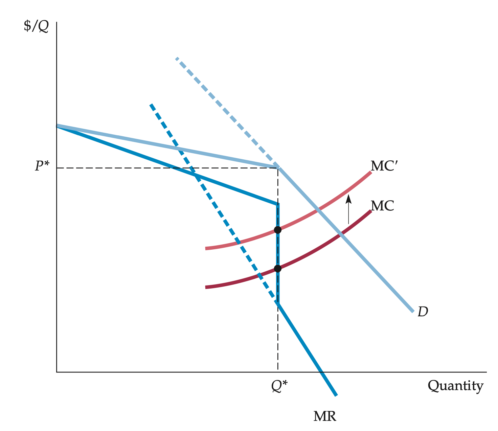

<style>

.center2 {
  margin: 0;
  position: absolute;
  top: 50%;
  left: 50%;
  -ms-transform: translate(-50%, -50%);
  transform: translate(-50%, -50%);
}

</style>

```{r setup, include = FALSE}
knitr::opts_chunk$set(echo = FALSE)
knitr::opts_chunk$set(warning = FALSE)
knitr::opts_chunk$set(message = FALSE)
knitr::opts_chunk$set(out.width = "70%")
knitr::opts_chunk$set(fig.align="center")

options(htmltools.dir.version = FALSE)
library(knitr)
library(tidyverse)
library(xaringanExtra)
library(ggplot2)
library(plotly)
library(googlesheets4)
library(dplyr)
library(knitr)
library(rtweet)

# set default options
opts_chunk$set(
  echo = FALSE,
  warnings = FALSE,
  collapse = TRUE,
  fig.width = 7.252,
  fig.height = 4,
  dpi = 300
)
# set engines
knitr::knit_engines$set("markdown")
xaringanExtra::use_tile_view()
xaringanExtra::use_panelset()
xaringanExtra::use_clipboard()
xaringanExtra::use_webcam()
xaringanExtra::use_broadcast()
xaringanExtra::use_share_again()
xaringanExtra::style_share_again(
  share_buttons = c("twitter", "linkedin", "pocket")
)

# Ensure Xaringan opens in RStudio Viewer instead of browser
options(servr.daemon = TRUE)
# xaringan::inf_mr()
```

```{r plotting-functions}
source("microII_plots.R")
source("chapter12_plots.R")
```

.center2[
# Introduction 
]


---
## Introduction

```{r}
knitr::include_graphics("https://delivery.twentythree.com/14462974/96576742/large?revision=10&domain=carlsberg-as.videomarketingplatform.co&Expires=1744876800&Signature=EZQgko9DgL5ap9fBiSgzrCbpTnmGDDoIqEbFWU69hJSnBbgeoJcq2v8uVRBcXHlKYJkPuVcIAaAzsqHk895vJF5GjhVUc%7eWpfHVcVF1U6xb9COquhcaewDNB1rslk0DmVYfaPSRIBi%2d3Bw5myxOtl8iiaN5RseqWnlGbm9PBv3vTCmc1ayaH1nrsbcgTxGEZf9SoYGkhlzomlXRzaVu8oztWCld4qRWGUGgVyuZczC%2dli7rTAsVONeJhAUGCPrTS3ifmzoLS1k8q5NNTSgqH%7eFNCjCVaG4F83wIXj0dInF0T61aTLH1KExD37ZwaUFZTVUkWGCNTywdDzcnMaRNpBQ%5f%5f&Key-Pair-Id=K2RKIY3YYBD5LB")
```

---
## Introduction

```{r out.width="40%"}
knitr::include_graphics("https://www.liberation.fr/resizer/9dbijksSyarISOVyhTB8f61hGDM=/1024x0/filters:format(jpg):quality(70)/cloudfront-eu-central-1.images.arcpublishing.com/liberation/HAY3RRYHLP53JOFAT3WS4IHCNU.jpg")
```


---
## Introduction

```{r out.width="60%"}
knitr::include_graphics("https://www.liberation.fr/resizer/5IaBX0Cn4qNDMpbxDOsmacFmKkw=/1024x0/filters:format(jpg):quality(70):focal(1033x954:1043x964)/cloudfront-eu-central-1.images.arcpublishing.com/liberation/VJI4TYEFO5FT7DKNIKD4UJCOPU.jpg")
```

---
## Introduction

```{r out.width="50%"}

```

---
## Introduction


**Monopolistic competition**: Market in which firms can enter freely, each producing its own brand or version of a differentiated product.

--

**Oligopoly**: Market in which only a few firms compete with one another, and entry by new firms is impeded.

--

**Cartel**: Market in which some or all firms explicitly collude, coordinating prices and output levels to maximize joint profits.

--

Analyse how firms set prices and quantities, what happens to their profits, how the take into account other firms' behavior, decide whether to collude or compete.

---
.center2[
# Monopolistic Competition
]

---
## Monopolistic Competition

In many industries, the products are differentiated.

The difference is partly flavor, partly consistency, and partly reputation --the consumer’s image (correct or incorrect).

  - Soda
  - Toothpaste
  - Beer
  - Pretty much many products in retail trade

--

**Monopolistically competitive market**:

1.  Firms compete by selling differentiated products that are highly substitutable for one another but not perfect substitutes. Cross-price elasticities of demand are large but not infinite.

2. There is free entry and exit

---
## Monopolistic Competition

Example: Beer vs. Cars

.pull-left[

]

.pull-right[

]

---
## Monopolistic Competition

Suppose the following cost function: $C(Q) = 142 + 5Q + 1/16 \cdot Q^2 + 1/24 \cdot Q^3$

--

```{r monop-comp01}
plot_data_sr <- 
  generate_monopoly_data(
    demand_intercept = 50, demand_slope = 1.5,
    cost_a = 142, cost_b = 5, cost_c = 1/16, cost_d = 1/24,
  )

p_sr <- round(mean(plot_data_sr$data$eq_P_monopoly), 1)
q_sr <- round(mean(plot_data_sr$data$eq_Q_monopoly), 1)  

monop_comp <- 
  tibble(
    q = seq(0, 25, by = .1),
  ) |> 
  mutate(
    mc = plot_data_sr$formulas$marginal_cost$intercept + plot_data_sr$formulas$marginal_cost$linear*q + plot_data_sr$formulas$marginal_cost$quadratic*(q^2),
    ac = plot_data_sr$formulas$average_cost$intercept/q +
      plot_data_sr$formulas$average_cost$linear + 
      plot_data_sr$formulas$average_cost$quadratic*(q) +
      plot_data_sr$formulas$average_cost$cubic*(q^2)
  )

plot_monop_comp <- 
  ggplot() +
  labs(x = "Quantity", y = "Price") +
  theme_chapter +
  coord_cartesian(clip = "off") +
  scale_x_continuous(limits = c(0, 25)) +
  scale_y_continuous(limits = c(0, 60)) +
  # Marginal cost 
  geom_line(data = monop_comp, aes(x = q, y = mc), color = red_chapter, size = 1.2) +
  annotate(
    "text", label = "MC",
    x = 21, y = 55,
    color = red_chapter, fontface = "italic", size = 3.5, hjust = -0.25
  ) +
  # Average cost
  geom_line(data = monop_comp, aes(x = q, y = ac), color = orange_chapter, size = 1.2) +
  annotate(
    "text", label = "AC",
    x = 24.5, y = 36,
    color = orange_chapter, fontface = "italic", size = 3.5, hjust = -0.25
  ) 

plot_monop_comp
```

$\Rightarrow AC = 142/Q + 5 + 1/16 \cdot Q + 1/24 \cdot Q^2 \quad$ and $\quad \Rightarrow MC = 5 + 1/8 \cdot Q + 1/8 \cdot Q^2$

---
## Monopolistic Competition: Short Run

Suppose the following firm’s demand curve in the short run: $P(Q)= 60 - 1.5 \cdot Q$

```{r monop-comp02}
# Add demand in the short run
monop_comp <- 
monop_comp |> 
  mutate(
    d1 = 50 - 1.5*q,
    mr1 = 50 -3*q
  )

plot_monop_comp <- 
plot_monop_comp +
  # Demand in short run
  geom_line(data = monop_comp, aes(x = q, y = d1), color = blue_chapter, size = 1.2) +
  annotate(
    "text", label = bquote(D["SR"]),
    x = 25, y = 15,
    color = blue_chapter, fontface = "italic", size = 3.5, hjust = -0.25
  ) +
  # MR in short run
  geom_line(data = monop_comp, aes(x = q, y = mr1), color = blue_chapter, size = 1.2, alpha = .5) +
  annotate(
    "text", label = bquote(MR["SR"]),
    x = 17, y = 2,
    color = blue_chapter, fontface = "italic", size = 3.5, hjust = -0.25, alpha = .5
  ) 

plot_monop_comp
```

Thus: $\Rightarrow MR = 60 - 3 \cdot Q$

---
## Monopolistic Competition: Short Run

Pricing with monopoly power: $Q^* \approx 10$ and $P^* \approx 34.7$

```{r monop-comp03}
# Add prices and quantities in equilibrium
plot_monop_comp <- 
plot_monop_comp +
  # Equilibrium
  geom_point(
    aes(q_sr, p_sr), size = 2.5
  ) +
  # Q
  geom_segment(aes(x = q_sr, xend = q_sr, y = 0, yend = p_sr), linetype = "dashed", color = "gray50") +
  annotate(
    "text",
    x = q_sr, y = 0,  
    label = bquote(Q["SR"] == .(q_sr)),  # Using bquote for dynamic value
    fontface = "italic", size = 2.4, hjust = -0.15
  ) +
  # P
  geom_segment(aes(x = 0, xend = q_sr, y = p_sr, yend = p_sr), linetype = "dashed", color = "gray50") +
  annotate(
    "text",
    x = 0, y = p_sr,  
    label = bquote(P["SR"] == .(p_sr)),  # Using bquote for dynamic value
    fontface = "italic", size = 2.4, vjust = -0.15
  )

plot_monop_comp
```

---
## Monopolistic Competition: Short Run

Pricing with monopoly power: $Q^* \approx 10$ and $P^* \approx 34.7$. Cost per unit $AC(Q^* \approx 10)  \approx 23.9$

```{r monop-comp04}
# Add profit
# monop_comp |> filter(round(q,1) == 10.1)

profit <- 
  tibble(
    x = c(0,0,10.2,10.2),
    y = c(23.9, 34.7, 34.7, 23.9)
  )

plot_monop_comp <- 
  plot_monop_comp +
  geom_polygon(
    data = profit,
    aes(x = x, y = y),
    fill = yellow_chapter, alpha = 0.5 
  ) +
  geom_segment(aes(x = 0, xend = q_sr, y = 23.9, yend = 23.9), linetype = "dashed", color = "gray50") +
  annotate(
    "text",
    x = 0, y = 23.9,  
    label = bquote(AC["SR"] == .(23.9)),  # Using bquote for dynamic value
    fontface = "italic", size = 2.4, vjust = -0.15
  ) +
  annotate(
    "text",
    x = mean(profit$x), y = mean(profit$y),  
    label = "Profit",  # Using bquote for dynamic value
    fontface = "italic", size = 3, vjust = -0.15
  )

plot_monop_comp
```

Because the corresponding price exceeds average cost, the firm earns a profit, as shown by the shaded rectangle in the figure.

---
## Monopolistic Competition: Medium Run

Since there is **free entry** and firms get profits, some new firms enter the market. 

--

The cost function of our firm in the analysis does not change. However, their market share decreases, thus the firm’s demand curve in the medium run also changes.

--

Firm’s demand curve in the medium run: $P(Q)= 45 - 1.65 \cdot Q$

---
## Monopolistic Competition: Medium Run

Since there is **free entry** and firms get profits, some new firms enter the market. 

```{r monop-comp05}
plot_data_mr <- 
  generate_monopoly_data(
    demand_intercept = 45, demand_slope = 1.65,
    cost_a = 142, cost_b = 5, cost_c = 1/16, cost_d = 1/24,
  )

p_mr <- round(mean(plot_data_mr$data$eq_P_monopoly), 1)
q_mr <- round(mean(plot_data_mr$data$eq_Q_monopoly), 1)  

monop_comp <- 
  tibble(
    q = seq(0, 30, by = .1),
  ) |> 
  mutate(
    mc = plot_data_mr$formulas$marginal_cost$intercept + plot_data_mr$formulas$marginal_cost$linear*q + plot_data_mr$formulas$marginal_cost$quadratic*(q^2),
    ac = plot_data_mr$formulas$average_cost$intercept/q +
      plot_data_mr$formulas$average_cost$linear + 
      plot_data_mr$formulas$average_cost$quadratic*(q) +
      plot_data_mr$formulas$average_cost$cubic*(q^2)
  )

plot_monop_comp <- 
  ggplot() +
  labs(x = "Quantity", y = "Price") +
  theme_chapter +
  coord_cartesian(clip = "off") +
  scale_x_continuous(limits = c(0, 25)) +
  scale_y_continuous(limits = c(0, 60)) +
  # Marginal cost 
  geom_line(data = monop_comp, aes(x = q, y = mc), color = red_chapter, size = 1.2) +
  annotate(
    "text", label = "MC",
    x = 21, y = 55,
    color = red_chapter, fontface = "italic", size = 3.5, hjust = -0.25
  ) +
  # Average cost
  geom_line(data = monop_comp, aes(x = q, y = ac), color = orange_chapter, size = 1.2) +
  annotate(
    "text", label = "AC",
    x = 24.5, y = 36,
    color = orange_chapter, fontface = "italic", size = 3.5, hjust = -0.25
  ) 

# Add demand 
monop_comp <- 
monop_comp |> 
  mutate(
    d1 = plot_data_mr$formulas$demand$intercept - plot_data_mr$formulas$demand$slope*q,
    mr1 = plot_data_mr$formulas$marginal_revenue$intercept - plot_data_mr$formulas$marginal_revenue$slope*q
  )

plot_monop_comp <- 
plot_monop_comp +
  # Demand 
  geom_line(data = monop_comp, aes(x = q, y = d1), color = blue_chapter, size = 1.2) +
  annotate(
    "text", label = bquote(D["MR"]),
    x = 25, y = 6,
    color = blue_chapter, fontface = "italic", size = 3.5, hjust = -0.25
  ) +
  # MR in short run
  geom_line(data = monop_comp, aes(x = q, y = mr1), color = blue_chapter, size = 1.2, alpha = .5) +
  annotate(
    "text", label = bquote(MR["MR"]),
    x = 14, y = 2,
    color = blue_chapter, fontface = "italic", size = 3.5, hjust = -0.25, alpha = .5
  ) 

# Add prices and quantities in equilibrium
plot_monop_comp <- 
plot_monop_comp +
  # Equilibrium
  geom_point(
    aes(q_mr, p_mr), size = 2.5
  ) +
  # Q
  geom_segment(aes(x = q_mr, xend = q_mr, y = 0, yend = p_mr), linetype = "dashed", color = "gray50") +
  annotate(
    "text",
    x = q_mr, y = 0,  
    label = bquote(Q["MR"] == .(q_mr)),  # Using bquote for dynamic value
    fontface = "italic", size = 2.4, hjust = -0.15
  ) +
  # P
  geom_segment(aes(x = 0, xend = q_mr, y = p_mr, yend = p_mr), linetype = "dashed", color = "gray50") +
  annotate(
    "text",
    x = 0, y = p_mr,  
    label = bquote(P["MR"] == .(p_mr)),  # Using bquote for dynamic value
    fontface = "italic", size = 2.4, vjust = -0.15
  )


# Add profit
quantities_mr <-  monop_comp |> filter(round(q,1) == q_mr)
quantities_mr_ac <- round(quantities_mr$ac, 1)

profit <- 
  tibble(
    x = c(0,0,q_mr,q_mr),
    y = c(quantities_mr_ac, p_mr, p_mr, quantities_mr_ac)
  )

plot_monop_comp <- 
  plot_monop_comp +
  geom_polygon(
    data = profit,
    aes(x = x, y = y),
    fill = yellow_chapter, alpha = 0.5 
  ) +
  geom_segment(aes(x = 0, xend = q_mr, y = quantities_mr_ac, yend = quantities_mr_ac), linetype = "dashed", color = "gray50") +
  annotate(
    "text",
    x = 0, y = quantities_mr_ac,  
    label = bquote(AC["MR"] == .(quantities_mr_ac)),  # Using bquote for dynamic value
    fontface = "italic", size = 2.4, vjust = -0.15
  ) +
  annotate(
    "text",
    x = mean(profit$x), y = mean(profit$y),  
    label = "Profit",  # Using bquote for dynamic value
    fontface = "italic", size = 3, vjust = -0.15
  )

plot_monop_comp
```

Firm’s demand curve in the medium run: $P(Q)= 45 - 1.65 \cdot Q$

---
## Monopolistic Competition: Medium Run

Since there is **free entry** and firms get profits, some new firms enter the market. 

```{r monop-comp06}
plot_data_mr <- 
  generate_monopoly_data(
    demand_intercept = 42.5, demand_slope = 1.725,
    cost_a = 142, cost_b = 5, cost_c = 1/16, cost_d = 1/24,
  )

p_mr <- round(mean(plot_data_mr$data$eq_P_monopoly), 1)
q_mr <- round(mean(plot_data_mr$data$eq_Q_monopoly), 1)  

monop_comp <- 
  tibble(
    q = seq(0, 30, by = .1),
  ) |> 
  mutate(
    mc = plot_data_mr$formulas$marginal_cost$intercept + plot_data_mr$formulas$marginal_cost$linear*q + plot_data_mr$formulas$marginal_cost$quadratic*(q^2),
    ac = plot_data_mr$formulas$average_cost$intercept/q +
      plot_data_mr$formulas$average_cost$linear + 
      plot_data_mr$formulas$average_cost$quadratic*(q) +
      plot_data_mr$formulas$average_cost$cubic*(q^2)
  )

plot_monop_comp <- 
  ggplot() +
  labs(x = "Quantity", y = "Price") +
  theme_chapter +
  coord_cartesian(clip = "off") +
  scale_x_continuous(limits = c(0, 25)) +
  scale_y_continuous(limits = c(0, 60)) +
  # Marginal cost 
  geom_line(data = monop_comp, aes(x = q, y = mc), color = red_chapter, size = 1.2) +
  annotate(
    "text", label = "MC",
    x = 21, y = 55,
    color = red_chapter, fontface = "italic", size = 3.5, hjust = -0.25
  ) +
  # Average cost
  geom_line(data = monop_comp, aes(x = q, y = ac), color = orange_chapter, size = 1.2) +
  annotate(
    "text", label = "AC",
    x = 24.5, y = 36,
    color = orange_chapter, fontface = "italic", size = 3.5, hjust = -0.25
  ) 

# Add demand 
monop_comp <- 
monop_comp |> 
  mutate(
    d1 = plot_data_mr$formulas$demand$intercept - plot_data_mr$formulas$demand$slope*q,
    mr1 = plot_data_mr$formulas$marginal_revenue$intercept - plot_data_mr$formulas$marginal_revenue$slope*q
  )

plot_monop_comp <- 
plot_monop_comp +
  # Demand 
  geom_line(data = monop_comp, aes(x = q, y = d1), color = blue_chapter, size = 1.2) +
  annotate(
    "text", label = bquote(D["MR"]),
    x = 25, y = 6,
    color = blue_chapter, fontface = "italic", size = 3.5, hjust = -0.25
  ) +
  # MR in short run
  geom_line(data = monop_comp, aes(x = q, y = mr1), color = blue_chapter, size = 1.2, alpha = .5) +
  annotate(
    "text", label = bquote(MR["MR"]),
    x = 14, y = 2,
    color = blue_chapter, fontface = "italic", size = 3.5, hjust = -0.25, alpha = .5
  ) 

# Add prices and quantities in equilibrium
plot_monop_comp <- 
plot_monop_comp +
  # Equilibrium
  geom_point(
    aes(q_mr, p_mr), size = 2.5
  ) +
  # Q
  geom_segment(aes(x = q_mr, xend = q_mr, y = 0, yend = p_mr), linetype = "dashed", color = "gray50") +
  annotate(
    "text",
    x = q_mr, y = 0,  
    label = bquote(Q["MR"] == .(q_mr)),  # Using bquote for dynamic value
    fontface = "italic", size = 2.4, hjust = -0.15
  ) +
  # P
  geom_segment(aes(x = 0, xend = q_mr, y = p_mr, yend = p_mr), linetype = "dashed", color = "gray50") +
  annotate(
    "text",
    x = 0, y = p_mr,  
    label = bquote(P["MR"] == .(p_mr)),  # Using bquote for dynamic value
    fontface = "italic", size = 2.4, vjust = -0.15
  )


# Add profit
quantities_mr <-  monop_comp |> filter(round(q,1) == q_mr)
quantities_mr_ac <- round(quantities_mr$ac, 1)

profit <- 
  tibble(
    x = c(0,0,q_mr,q_mr),
    y = c(quantities_mr_ac, p_mr, p_mr, quantities_mr_ac)
  )

plot_monop_comp <- 
  plot_monop_comp +
  geom_polygon(
    data = profit,
    aes(x = x, y = y),
    fill = yellow_chapter, alpha = 0.5 
  ) +
  geom_segment(aes(x = 0, xend = q_mr, y = quantities_mr_ac, yend = quantities_mr_ac), linetype = "dashed", color = "gray50") +
  annotate(
    "text",
    x = 0, y = quantities_mr_ac,  
    label = bquote(AC["MR"] == .(quantities_mr_ac)),  # Using bquote for dynamic value
    fontface = "italic", size = 2.4, vjust = -0.15
  ) +
  annotate(
    "text",
    x = mean(profit$x), y = mean(profit$y),  
    label = "Profit",  # Using bquote for dynamic value
    fontface = "italic", size = 3, vjust = -0.15
  )

plot_monop_comp
```

Firm’s demand curve in the medium run vol. II: $P(Q)= 42.5 - 1.725 \cdot Q$

---
## Monopolistic Competition: Medium Run

Since there is **free entry** and firms get profits, some new firms enter the market. 

```{r monop-comp07}
plot_data_mr <- 
  generate_monopoly_data(
    demand_intercept = 41.5, demand_slope = 1.75,
    cost_a = 142, cost_b = 5, cost_c = 1/16, cost_d = 1/24,
  )

p_mr <- round(mean(plot_data_mr$data$eq_P_monopoly), 1)
q_mr <- round(mean(plot_data_mr$data$eq_Q_monopoly), 1)  

monop_comp <- 
  tibble(
    q = seq(0, 30, by = .1),
  ) |> 
  mutate(
    mc = plot_data_mr$formulas$marginal_cost$intercept + plot_data_mr$formulas$marginal_cost$linear*q + plot_data_mr$formulas$marginal_cost$quadratic*(q^2),
    ac = plot_data_mr$formulas$average_cost$intercept/q +
      plot_data_mr$formulas$average_cost$linear + 
      plot_data_mr$formulas$average_cost$quadratic*(q) +
      plot_data_mr$formulas$average_cost$cubic*(q^2)
  )

plot_monop_comp <- 
  ggplot() +
  labs(x = "Quantity", y = "Price") +
  theme_chapter +
  coord_cartesian(clip = "off") +
  scale_x_continuous(limits = c(0, 25)) +
  scale_y_continuous(limits = c(0, 60)) +
  # Marginal cost 
  geom_line(data = monop_comp, aes(x = q, y = mc), color = red_chapter, size = 1.2) +
  annotate(
    "text", label = "MC",
    x = 21, y = 55,
    color = red_chapter, fontface = "italic", size = 3.5, hjust = -0.25
  ) +
  # Average cost
  geom_line(data = monop_comp, aes(x = q, y = ac), color = orange_chapter, size = 1.2) +
  annotate(
    "text", label = "AC",
    x = 24.5, y = 36,
    color = orange_chapter, fontface = "italic", size = 3.5, hjust = -0.25
  ) 

# Add demand 
monop_comp <- 
monop_comp |> 
  mutate(
    d1 = plot_data_mr$formulas$demand$intercept - plot_data_mr$formulas$demand$slope*q,
    mr1 = plot_data_mr$formulas$marginal_revenue$intercept - plot_data_mr$formulas$marginal_revenue$slope*q
  )

plot_monop_comp <- 
plot_monop_comp +
  # Demand 
  geom_line(data = monop_comp, aes(x = q, y = d1), color = blue_chapter, size = 1.2) +
  annotate(
    "text", label = bquote(D["MR"]),
    x = 25, y = 6,
    color = blue_chapter, fontface = "italic", size = 3.5, hjust = -0.25
  ) +
  # MR in short run
  geom_line(data = monop_comp, aes(x = q, y = mr1), color = blue_chapter, size = 1.2, alpha = .5) +
  annotate(
    "text", label = bquote(MR["MR"]),
    x = 14, y = 2,
    color = blue_chapter, fontface = "italic", size = 3.5, hjust = -0.25, alpha = .5
  ) 

# Add prices and quantities in equilibrium
plot_monop_comp <- 
plot_monop_comp +
  # Equilibrium
  geom_point(
    aes(q_mr, p_mr), size = 2.5
  ) +
  # Q
  geom_segment(aes(x = q_mr, xend = q_mr, y = 0, yend = p_mr), linetype = "dashed", color = "gray50") +
  annotate(
    "text",
    x = q_mr, y = 0,  
    label = bquote(Q["MR"] == .(q_mr)),  # Using bquote for dynamic value
    fontface = "italic", size = 2.4, hjust = -0.15
  ) +
  # P
  geom_segment(aes(x = 0, xend = q_mr, y = p_mr, yend = p_mr), linetype = "dashed", color = "gray50") +
  annotate(
    "text",
    x = 0, y = p_mr,  
    label = bquote(P["MR"] == .(p_mr)),  # Using bquote for dynamic value
    fontface = "italic", size = 2.4, vjust = -0.15
  )


# Add profit
quantities_mr <-  monop_comp |> filter(round(q,1) == q_mr)
quantities_mr_ac <- round(quantities_mr$ac, 1)

profit <- 
  tibble(
    x = c(0,0,q_mr,q_mr),
    y = c(quantities_mr_ac, p_mr, p_mr, quantities_mr_ac)
  )

plot_monop_comp <- 
  plot_monop_comp +
  geom_polygon(
    data = profit,
    aes(x = x, y = y),
    fill = yellow_chapter, alpha = 0.5 
  ) +
  geom_segment(aes(x = 0, xend = q_mr, y = quantities_mr_ac, yend = quantities_mr_ac), linetype = "dashed", color = "gray50") +
  annotate(
    "text",
    x = 0, y = quantities_mr_ac,  
    label = bquote(AC["MR"] == .(quantities_mr_ac)),  # Using bquote for dynamic value
    fontface = "italic", size = 2.4, vjust = -0.15
  ) +
  annotate(
    "text",
    x = mean(profit$x), y = mean(profit$y),  
    label = "Profit",  # Using bquote for dynamic value
    fontface = "italic", size = 3, vjust = -0.15
  )

plot_monop_comp
```

Firm’s demand curve in the medium run vol. III: $P(Q)= 41.5 - 1.75 \cdot Q$

---
## Monopolistic Competition: Long Run

New firms enter the market, **until profits are gone in the long run**

```{r monop-comp08}
plot_data_lr <- 
  generate_monopoly_data(
    demand_intercept = 40, demand_slope = 1.8,
    cost_a = 142, cost_b = 5, cost_c = 1/16, cost_d = 1/24,
  )

p_lr <- round(mean(plot_data_lr$data$eq_P_monopoly), 1)
q_lr <- round(mean(plot_data_lr$data$eq_Q_monopoly), 1)  

monop_comp <- 
  tibble(
    q = seq(0, 30, by = .1),
  ) |> 
  mutate(
    mc = plot_data_lr$formulas$marginal_cost$intercept + plot_data_lr$formulas$marginal_cost$linear*q + plot_data_lr$formulas$marginal_cost$quadratic*(q^2),
    ac = plot_data_lr$formulas$average_cost$intercept/q +
      plot_data_lr$formulas$average_cost$linear + 
      plot_data_lr$formulas$average_cost$quadratic*(q) +
      plot_data_lr$formulas$average_cost$cubic*(q^2)
  )

plot_monop_comp <- 
  ggplot() +
  labs(x = "Quantity", y = "Price") +
  theme_chapter +
  coord_cartesian(clip = "off") +
  scale_x_continuous(limits = c(0, 25)) +
  scale_y_continuous(limits = c(0, 60)) +
  # Marginal cost 
  geom_line(data = monop_comp, aes(x = q, y = mc), color = red_chapter, size = 1.2) +
  annotate(
    "text", label = "MC",
    x = 21, y = 55,
    color = red_chapter, fontface = "italic", size = 3.5, hjust = -0.25
  ) +
  # Average cost
  geom_line(data = monop_comp, aes(x = q, y = ac), color = orange_chapter, size = 1.2) +
  annotate(
    "text", label = "AC",
    x = 24.5, y = 36,
    color = orange_chapter, fontface = "italic", size = 3.5, hjust = -0.25
  ) 

# Add demand 
monop_comp <- 
monop_comp |> 
  mutate(
    d1 = plot_data_lr$formulas$demand$intercept - plot_data_lr$formulas$demand$slope*q,
    mr1 = plot_data_lr$formulas$marginal_revenue$intercept - plot_data_lr$formulas$marginal_revenue$slope*q
  )

plot_monop_comp <- 
plot_monop_comp +
  # Demand 
  geom_line(data = monop_comp, aes(x = q, y = d1), color = blue_chapter, size = 1.2) +
  annotate(
    "text", label = bquote(D["LR"]),
    x = 22.5, y = 3,
    color = blue_chapter, fontface = "italic", size = 3.5, hjust = -0.25
  ) +
  # MR in short run
  geom_line(data = monop_comp, aes(x = q, y = mr1), color = blue_chapter, size = 1.2, alpha = .5) +
  annotate(
    "text", label = bquote(MR["LR"]),
    x = 11.25, y = 2,
    color = blue_chapter, fontface = "italic", size = 3.5, hjust = -0.25, alpha = .5
  ) 

# Add prices and quantities in equilibrium
plot_monop_comp <- 
plot_monop_comp +
  # Equilibrium
  geom_point(
    aes(q_lr, p_lr), size = 2.5
  ) +
  # Q
  geom_segment(aes(x = q_lr, xend = q_lr, y = 0, yend = p_lr), linetype = "dashed", color = "gray50") +
  annotate(
    "text",
    x = q_lr, y = 0,  
    label = bquote(Q["LR"] == .(q_lr)),  # Using bquote for dynamic value
    fontface = "italic", size = 2.4, hjust = -0.15
  ) +
  # P
  geom_segment(aes(x = 0, xend = q_lr, y = p_lr, yend = p_lr), linetype = "dashed", color = "gray50") +
  annotate(
    "text",
    x = 0, y = p_lr,  
    label = bquote(P["LR"] == .(p_lr)),  # Using bquote for dynamic value
    fontface = "italic", size = 2.4, vjust = -0.15
  )


# Add profit
quantities_lr <-  monop_comp |> filter(round(q,1) == q_lr)
quantities_lr_ac <- round(quantities_lr$ac, 1)

profit <- 
  tibble(
    x = c(0,0,q_lr,q_lr),
    y = c(quantities_lr_ac, p_lr, p_lr, quantities_lr_ac)
  )

plot_monop_comp <- 
  plot_monop_comp +
  geom_polygon(
    data = profit,
    aes(x = x, y = y),
    fill = yellow_chapter, alpha = 0.5 
  ) +
  geom_segment(aes(x = 0, xend = q_lr, y = quantities_lr_ac, yend = quantities_lr_ac), linetype = "dashed", color = "gray50") +
  annotate(
    "text",
    x = 0, y = quantities_lr_ac,  
    label = bquote(AC["LR"] == .(quantities_lr_ac)),  # Using bquote for dynamic value
    fontface = "italic", size = 2.4, vjust = -0.15
  ) +
  annotate(
    "text",
    x = mean(profit$x), y = mean(profit$y),  
    label = "Profit",  # Using bquote for dynamic value
    fontface = "italic", size = 3, vjust = -0.15
  )

plot_monop_comp
```

Firm’s demand curve in the long run: $P(Q)= 40 - 1.8 \cdot Q$

---
## Monopolistic Competition: Long Run

New firms enter the market, **until profits are gone in the long run**

```{r monop-comp09}
plot_data_lr <- 
  generate_monopoly_data(
    demand_intercept = 40, demand_slope = 1.8,
    cost_a = 142, cost_b = 5, cost_c = 1/16, cost_d = 1/24,
  )

p_lr <- round(mean(plot_data_lr$data$eq_P_monopoly), 1)
q_lr <- round(mean(plot_data_lr$data$eq_Q_monopoly), 1)  

monop_comp <- 
  tibble(
    q = seq(0, 30, by = .1),
  ) |> 
  mutate(
    mc = plot_data_lr$formulas$marginal_cost$intercept + plot_data_lr$formulas$marginal_cost$linear*q + plot_data_lr$formulas$marginal_cost$quadratic*(q^2),
    ac = plot_data_lr$formulas$average_cost$intercept/q +
      plot_data_lr$formulas$average_cost$linear + 
      plot_data_lr$formulas$average_cost$quadratic*(q) +
      plot_data_lr$formulas$average_cost$cubic*(q^2)
  )

plot_monop_comp <- 
  ggplot() +
  labs(x = "Quantity", y = "Price") +
  theme_chapter +
  coord_cartesian(clip = "off") +
  scale_x_continuous(limits = c(0, 25)) +
  scale_y_continuous(limits = c(0, 60)) +
  # Marginal cost 
  geom_line(data = monop_comp, aes(x = q, y = mc), color = red_chapter, size = 1.2) +
  annotate(
    "text", label = "MC",
    x = 21, y = 55,
    color = red_chapter, fontface = "italic", size = 3.5, hjust = -0.25
  ) +
  # Average cost
  geom_line(data = monop_comp, aes(x = q, y = ac), color = orange_chapter, size = 1.2) +
  annotate(
    "text", label = "AC",
    x = 24.5, y = 36,
    color = orange_chapter, fontface = "italic", size = 3.5, hjust = -0.25
  ) 

# Add demand 
monop_comp <- 
  monop_comp |> 
  mutate(
    d1 = plot_data_lr$formulas$demand$intercept - plot_data_lr$formulas$demand$slope*q,
    mr1 = plot_data_lr$formulas$marginal_revenue$intercept - plot_data_lr$formulas$marginal_revenue$slope*q
  )

plot_monop_comp <- 
  plot_monop_comp +
  # Demand 
  geom_line(data = monop_comp, aes(x = q, y = d1), color = blue_chapter, size = 1.2)  +
  annotate(
    "text", label = bquote(D["LR"]),
    x = 22.5, y = 3,
    color = blue_chapter, fontface = "italic", size = 3.5, hjust = -0.25
  ) +
  # MR in short run
  geom_line(data = monop_comp, aes(x = q, y = mr1), color = blue_chapter, size = 1.2, alpha = .5) +
  annotate(
    "text", label = bquote(MR["LR"]),
    x = 11.25, y = 2,
    color = blue_chapter, fontface = "italic", size = 3.5, hjust = -0.25, alpha = .5
  ) 

# Add prices and quantities in equilibrium
plot_monop_comp <- 
  plot_monop_comp +
  # Equilibrium
  geom_point(
    aes(q_lr, p_lr), size = 2.5
  ) +
  # Q
  geom_segment(aes(x = q_lr, xend = q_lr, y = 0, yend = p_lr), linetype = "dashed", color = "gray50") +
  annotate(
    "text",
    x = q_lr, y = 0,  
    label = bquote(Q["LR"] == .(q_lr)),  # Using bquote for dynamic value
    fontface = "italic", size = 2.4, hjust = -0.15
  ) +
  # P
  geom_segment(aes(x = 0, xend = q_lr, y = p_lr, yend = p_lr), linetype = "dashed", color = "gray50") +
  annotate(
    "text",
    x = 0, y = p_lr,  
    label = bquote(P["LR"] == .(p_lr)),  # Using bquote for dynamic value
    fontface = "italic", size = 2.4, vjust = -0.15
  )

plot_monop_comp
```

The firm still has monopoly power. But the entry and competition of firms have driven its profits to zero.

---
## Monopolistic Competition and Economic Efficiency

**Competitive equilibrium in the long run** $\; \Rightarrow P = MC$

```{r monop-comp10}
plot_data_pc <- 
  generate_monopoly_data(
    demand_intercept = 23.5, demand_slope = 0.000001,
    cost_a = 142, cost_b = 5, cost_c = 1/16, cost_d = 1/24,
  )

# 
# plot_data_pc$data |>
#   mutate(
#     Average_Cost = round(Average_Cost, 2)
#   ) |> 
#   filter(Average_Cost == min(Average_Cost, na.rm = T))

p_pc <- round(mean(plot_data_pc$data$eq_P_monopoly), 1)
q_pc <- round(mean(plot_data_pc$data$eq_Q_monopoly), 1)  

competitive_eq <- 
  tibble(
    q = seq(0, 30, by = .1),
  ) |> 
  mutate(
    mc = plot_data_pc$formulas$marginal_cost$intercept + plot_data_pc$formulas$marginal_cost$linear*q + plot_data_pc$formulas$marginal_cost$quadratic*(q^2),
    ac = plot_data_pc$formulas$average_cost$intercept/q +
      plot_data_pc$formulas$average_cost$linear + 
      plot_data_pc$formulas$average_cost$quadratic*(q) +
      plot_data_pc$formulas$average_cost$cubic*(q^2)
  )

plot_competitive_eq <- 
  ggplot() +
  labs(x = "Quantity", y = "Price") +
  theme_chapter +
  coord_cartesian(clip = "off") +
  scale_x_continuous(limits = c(0, 25)) +
  scale_y_continuous(limits = c(0, 60)) +
  # Marginal cost 
  geom_line(data = competitive_eq, aes(x = q, y = mc), color = red_chapter, size = 1.2) +
  annotate(
    "text", label = "MC",
    x = 21, y = 55,
    color = red_chapter, fontface = "italic", size = 3.5, hjust = -0.25
  ) +
  # Average cost
  geom_line(data = competitive_eq, aes(x = q, y = ac), color = orange_chapter, size = 1.2) +
  annotate(
    "text", label = "AC",
    x = 24.5, y = 36,
    color = orange_chapter, fontface = "italic", size = 3.5, hjust = -0.25
  ) 

# Add demand 
competitive_eq <- 
  competitive_eq |> 
  mutate(
    d1 = plot_data_pc$formulas$demand$intercept - plot_data_pc$formulas$demand$slope*q,
    mr1 = plot_data_pc$formulas$marginal_revenue$intercept - plot_data_pc$formulas$marginal_revenue$slope*q
  )

plot_competitive_eq <- 
  plot_competitive_eq +
  # Demand 
  geom_line(data = competitive_eq, aes(x = q, y = d1), color = blue_chapter, size = 1.2)  +
  annotate(
    "text", label = "MR = D",
    x = 22.5, y = 21,
    color = blue_chapter, fontface = "italic", size = 3.5, hjust = -0.25
  ) 

# Add prices and quantities in equilibrium
plot_competitive_eq <- 
  plot_competitive_eq +
  # Equilibrium
  geom_point(
    aes(q_pc, p_pc), size = 2.5
  ) +
  # Q
  geom_segment(aes(x = q_pc, xend = q_pc, y = 0, yend = p_pc), linetype = "dashed", color = "gray50") +
  annotate(
    "text",
    x = q_pc, y = 0,  
    label = bquote(Q["LR"] == .(q_pc)),  # Using bquote for dynamic value
    fontface = "italic", size = 2.4, hjust = -0.15
  ) +
  # P
  geom_segment(aes(x = 0, xend = q_pc, y = p_pc, yend = p_pc), linetype = "dashed", color = "gray50") +
  annotate(
    "text",
    x = 0, y = p_pc,  
    label = bquote(P["LR"] == .(p_pc)),  # Using bquote for dynamic value
    fontface = "italic", size = 2.4, vjust = -0.15
  )

plot_competitive_eq
```

Each firm faces a horizontal demand curve, so the zero-profit point occurs at minimum average cost.

---
## Monopolistic Competition and Economic Efficiency

**Monopolistic Competition in the long run** $\; \Rightarrow P > MC$

```{r monop-comp11}
plot_monop_comp
```

Two sources of inefficiency: (1) $P > MC$, and (2) output is below that which minimizes average cost.

---
## Monopolistic Competition and Economic Efficiency

**Monopolistic Competition in the long run** $\; \Rightarrow P > MC$

```{r monop-comp11-1}
# MC = MR at Q = 7.5, wich evaluated in the curves is 13
# monop_comp |> filter(round(mc, 1) == round(mr1, 1))

dwl <- 
  tibble(
    x = c(q_lr, q_lr, round(comp_eq$Q, 1)),
    y = c(13, p_lr, round(comp_eq$Demand, 1))
  )

plot_monop_comp <- 
plot_monop_comp +
  geom_polygon(
    data = dwl,
    aes(x = x, y = y),
    fill = purple_chapter, alpha = 0.5 
  ) +
  annotate(
    "text",
    x = mean(dwl$x), y = mean(dwl$y),  
    label = "DWL",  # Using bquote for dynamic value
    fontface = "italic", size = 3, vjust = -0.15
  )

plot_monop_comp
```

Thus, there is a deadweight loss. As with any other market structure with monopoly power.

---
## Monopolistic Competition and Economic Efficiency

.pull-left[

### Competitive Equilibrium in the long run

```{r monop-comp12, out.width="110%"}
plot_competitive_eq
```
]

.pull-right[

### Monopolistic Competition in the long run

```{r monop-comp13, out.width="110%"}
plot_monop_comp
```
]

Entry of new firms drives profits to zero in both perfectly competitive and monopolistically competitive markets.

--

But monopolistic competition makes consumers worse off.

---
## Monopolistic Competition and Economic Efficiency

If monopolistic competition makes consumers worse off: should it be regulated?

--

Two reasons to not do so:

(1) In most monopolistically competitive markets, monopoly power is small.

- Since firms compete with sufficiently substitutable products, no single firm has much monopoly power. 

--

(2) Any inefficiency must be balanced against an important benefit from
monopolistic competition: **product diversity**


---
.center2[
# Oligopoly
]

---
## Oligopoly

In oligopolistic markets, only a **few firms dominate** production.

--

Products may be **differentiated** or **homogeneous** (e.g. steel vs. smartphones).

--

Key feature: **barriers to entry**  
- Scale economies  
- Patents or proprietary technology  
- Strategic behavior (e.g. flooding market to deter rivals)

--

Because few firms compete, **strategic interactions** matter:  
Each firm must **anticipate rivals' responses** when choosing output, price, advertising, etc.

--

Examples of oligopolies:  
- Automobiles  
- Airlines  
- Commercial steel & aluminum  
- Tech hardware (e.g. CPUs, GPUs)


---
## Equilibrium in an Oligopolistic Market

- Perfectly Competitive market: $P = MC = D \; \quad ; \; \pi = 0$.

- Monopoly: $MR = MC \; \quad ; \; \pi > 0$

- Monopolistic Competition: $MR = MC \; \quad ; \; \pi = 0$

--

Either take $P$ or $D$ as given, and ignore competitors.

--

> When a market is in equilibrium, firms are doing the best they can and have no reason to change their price or output.

--

**Nash equilibrium**

> Set of strategies or actions in which each firm does the best it can given its
competitors’ actions.

Strategic interactions

---
## Cournot Model

- French economist Augustin Cournot in 1838

- **Duopoly**: Market in which two firms compete with each other.

--

Each firm must **decide how much to produce**, and the two firms make their **decisions at the same time**


Each firm knows that its competitor is also deciding how much to produce, and the market price will depend on the total output of both firms.

Each firm treats the output level of its competitor as fixed when deciding how much to produce.

---
## Cournot Model

Each firm treats the output level of its competitor as fixed when deciding how much to produce.

Consider Firm 1. It has constant $MC=20$.

```{r cournot01}
mc <- 20
d_intercept <- 120
d_slope <- 1
mr_slope <- 2

cournot <- 
  tibble(
    q = seq(0, 100, by = .01),
  ) |> 
  mutate(
    mc = mc
  )
   
plot_cournot <- 
  ggplot() +
  labs(x = "Quantity", y = "Price") +
  theme_chapter +
  coord_cartesian(clip = "off") +
  scale_x_continuous(breaks = seq(0,100, 25), limits = c(0, 80)) +
  scale_y_continuous(limits = c(0, 120)) +
  # Marginal cost 
  geom_line(data = cournot, aes(x = q, y = mc), color = red_chapter, size = 1.2) +
  annotate(
    "text", label = "MC",
    x = 80, y = mc + 3,
    color = red_chapter, fontface = "italic", size = 3
  ) 

plot_cournot
```


---
## Cournot Model

Each firm treats the output level of its competitor as fixed when deciding how much to produce.

If Firm 1 thinks Firm 2 is not going to produce: Firm 1’s demand curve is the market demand curve.

```{r cournot02}
# Add demand 
cournot <- 
  cournot |> 
  mutate(
    d1 = d_intercept - d_slope*q,
    mr1 = d_intercept - mr_slope*q
  )

plot_cournot <- 
  plot_cournot +
  # Demand 
  geom_line(data = cournot, aes(x = q, y = d1), color = blue_chapter, size = 1.2)  +
  annotate(
    "text", label = bquote(D["1"]("0")),
    x = Inf, y = 46,
    color = blue_chapter, fontface = "italic", size = 3, hjust = 1
  ) +
  # MR in short run
  geom_line(data = cournot, aes(x = q, y = mr1), color = blue_chapter, size = 1.2, alpha = .5) +
  annotate(
    "text", label = bquote(MR["1"]("0")),
    x = 60, y = 2,
    color = blue_chapter, fontface = "italic", size = 3, hjust = -0.25, alpha = .5
  ) 

plot_cournot
```

---
## Cournot Model

Each firm treats the output level of its competitor as fixed when deciding how much to produce.

Firm 1’s profit maximizing output is 50 units: the point where $MR_1(0)$ intersects $MC_1$.

```{r cournot03}
# Add quantities in equilibrium
# cournot |> filter(round(mr1, 1) == mc) # Approx 50
q1 <- mean((cournot |> filter(round(mr1, 1) == mc))$q)

plot_cournot <- 
  plot_cournot +
  # Q
  geom_segment(aes(x = q1, xend = q1, y = 0, yend = mc), linetype = "dashed", color = "gray50")

plot_cournot
```

---
## Cournot Model

Each firm treats the output level of its competitor as fixed when deciding how much to produce.

If Firm 2 produces zero, Firm 1 should produce 50

```{r}
plot_cournot
```

---
## Cournot Model

Each firm treats the output level of its competitor as fixed when deciding how much to produce.

Suppose, instead, that Firm 1 thinks Firm 2 will produce 50 units. What happens?

```{r}
plot_cournot
```

---
## Cournot Model

Each firm treats the output level of its competitor as fixed when deciding how much to produce.

Then Firm 1’s demand curve is the market demand curve shifted to the left by 50: $D_1 (50)$.

```{r cournot04}
# Add demand when Q_2 = 50
cournot <- 
  cournot |> 
  mutate(
    d2 = (d_intercept-q1) - d_slope*q,
    mr2 = (d_intercept-q1) - mr_slope*q
  )

plot_cournot <- 
plot_cournot +
  # Demand 
  geom_line(data = cournot, aes(x = q, y = d2), color = turquoise_chapter, size = 1.2)  +
  annotate(
    "text", label = bquote(D["1"]("50")),
    x = 1, y = 75,
    color = turquoise_chapter, fontface = "italic", size = 3, hjust = -0.25
  ) +
  # MR in short run
  geom_line(data = cournot, aes(x = q, y = mr2), color = turquoise_chapter, size = 1.2, alpha = .5) +
  annotate(
    "text", label = bquote(MR["1"]("50")),
    x = 33, y = 6,
    color = turquoise_chapter, fontface = "italic", size = 3, hjust = -0.25, alpha = .5
  ) 

plot_cournot
```

---
## Cournot Model

Each firm treats the output level of its competitor as fixed when deciding how much to produce.

When $D_1 (50)$, $MR_1 (50) = MC = 25$. Firm 1’s profit-maximizing output is now
25 units.

```{r cournot05}
# Add quantities in equilibrium
# cournot |> filter(round(mr2, 1) == mc)
q2 <- mean((cournot |> filter(round(mr2, 1) == mc))$q)

plot_cournot <- 
  plot_cournot +
  # Q
  geom_segment(aes(x = q2, xend = q2, y = 0, yend = mc), linetype = "dashed", color = "gray50")

plot_cournot
```


---
## Cournot Model

Each firm treats the output level of its competitor as fixed when deciding how much to produce.

Now, suppose Firm 1 thinks that Firm 2 will produce 50 + 25 = 75 units. What happens?

```{r}
plot_cournot
```

---
## Cournot Model

Each firm treats the output level of its competitor as fixed when deciding how much to produce.

Firm 1’s demand curve is the market demand curve shifted to the left by another 25. 

```{r cournot06}
# Add demand when Q_2 = 76.7
cournot <- 
  cournot |> 
  mutate(
    d3 = (d_intercept-q1-q2) - d_slope*q,
    mr3 = (d_intercept-q1-q2) - mr_slope*q
  )

plot_cournot <- 
  plot_cournot +
  # Demand 
  geom_line(data = cournot, aes(x = q, y = d3), color = green_chapter, size = 1.2)  +
  annotate(
    "text", label = bquote(D["1"]("75")),
    x = 1, y = 48,
    color = green_chapter, fontface = "italic", size = 3, hjust = -0.25
  ) +
  # MR in short run
  geom_line(data = cournot, aes(x = q, y = mr3), color = green_chapter, size = 1.2, alpha = .5) +
  annotate(
    "text", label = bquote(MR["1"]("75")),
    x = 17, y = 10,
    color = green_chapter, fontface = "italic", size = 3, hjust = -0.25, alpha = .5
  ) 

plot_cournot
```


---
## Cournot Model

Each firm treats the output level of its competitor as fixed when deciding how much to produce.

Firm 1’s profit-maximizing output is now 12.5 units, the point where $MR_1(75)= MC_1$

```{r cournot07}
# Add quantities in equilibrium
q3 <- mean((cournot |> filter(round(mr3, 1) == mc))$q)

plot_cournot <- 
  plot_cournot +
  # Q
  geom_segment(aes(x = q3, xend = q3, y = 0, yend = mc), linetype = "dashed", color = "gray50")

plot_cournot
```

---
## Cournot Model

Each firm treats the output level of its competitor as fixed when deciding how much to produce.

If Firm 1 thinks that Firm 2 will produce 100 units or more, it should produce nothing.

```{r}
plot_cournot
```

---
## Cournot Model: Reaction (Best response) Curves

.pull-left[
```{r out.width="120%"}
plot_cournot
```
]

.pull-right[
```{r reactionc01, out.width="120%"}
reaction_curves <- 
  tibble(
    q = seq(0, 100, by = .01),
  ) |> 
  mutate(
    f2rc = 50 - .5*q,
    f1rc = 100 - 1.333*q
  )

reaction_curves_plot <- 
  ggplot() +
    labs(x = bquote(Q["2"]), y = bquote(Q["1"])) +
    theme_chapter +
    scale_x_continuous(breaks = seq(0,100, 25), limits = c(0,100)) +
    scale_y_continuous(breaks = seq(0,100, 25), limits = c(0,100))

reaction_curves_plot
```
]

---
## Cournot Model: Reaction (Best response) Curves

.pull-left[
```{r out.width="120%"}
plot_cournot
```
]

.pull-right[
```{r reactionc02, out.width="120%"}
reaction_curves_plot <- 
reaction_curves_plot +
  geom_point(aes(0,50), size = 2.5)

reaction_curves_plot
```
]

If Firm 1 thinks that Firm 2 will produce nothing, it will produce 50.

---
## Cournot Model: Reaction (Best response) Curves

.pull-left[
```{r out.width="120%"}
plot_cournot
```
]

.pull-right[
```{r reactionc03, out.width="120%"}
reaction_curves_plot <- 
reaction_curves_plot +
  geom_point(aes(50,25), size = 2.5)

reaction_curves_plot
```
]

If Firm 1 thinks that Firm 2 will produce 50, it will produce 25.

---
## Cournot Model: Reaction (Best response) Curves

.pull-left[
```{r out.width="120%"}
plot_cournot
```
]

.pull-right[
```{r reactionc04, out.width="120%"}
reaction_curves_plot <- 
reaction_curves_plot +
  geom_point(aes(75,12.5), size = 2.5)

reaction_curves_plot
```
]

If Firm 1 thinks that Firm 2 will produce 75, it will produce 12.5

---
## Cournot Model: Reaction (Best response) Curves

.pull-left[
```{r out.width="120%"}
plot_cournot
```
]

.pull-right[
```{r reactionc05, out.width="120%"}
reaction_curves_plot <- 
reaction_curves_plot +
  geom_point(aes(100,0), size = 2.5)

reaction_curves_plot
```
]

If Firm 1 thinks that Firm 2 will produce 100, it will produce 0

---
## Cournot Model: Reaction (Best response) Curves

.pull-left[
```{r out.width="120%"}
plot_cournot
```
]

.pull-right[
```{r reactionc06, out.width="120%"}
reaction_curves_plot <- 
  ggplot() +
    labs(x = bquote(Q["2"]), y = bquote(Q["1"])) +
    theme_chapter +
    scale_x_continuous(breaks = seq(0,100, 25), limits = c(0,100)) +
    scale_y_continuous(breaks = seq(0,100, 25), limits = c(0,100)) +
    geom_line(
      data = reaction_curves,
      aes(q, f2rc), lwd = 1.25, color = purple_chapter
    )
reaction_curves_plot
```
]

**Firm 1’s profit-maximizing output is thus a decreasing schedule of how much it thinks Firm 2 will produce.**

---
## Cournot Model: Reaction (Best response) Curves

**Firm's 1 Reaction curve** $Q^*_1 (Q_2)$:

Relationship between a firm’s profit-maximizing output and the amount it thinks its competitor will produce.

```{r reactionc07}
reaction_curves_plot
```

---
## Cournot Model: Reaction (Best response) Curves

**Firm's 2 Reaction curve**  $Q^*_2 (Q_1)$

Here we assume that $MC_2 \neq MC_1$ 

```{r reactionc08}
reaction_curves_plot <- 
reaction_curves_plot +
  geom_line(
  data = reaction_curves,
  aes(q, f1rc), lwd = 1.25, color = orange_chapter
) +
  annotate(
    "text", x = 30, y = 80, label = str_c("Firm's 2\nReaction Curve"),
    color = orange_chapter
  ) +
  annotate(
    "text", x = 80, y = 22.5, label = str_c("Firm's 1\nReaction Curve"),
    color = purple_chapter
  )
  
reaction_curves_plot
```

---
## Cournot Model: Equilibrium

How much will each firm produce? 

--
 In equilibrium, each firm chooses output based on its reaction curve, so the equilibrium occurs at the intersection of the two curves.

```{r reactionc09}
reaction_curves_plot <- 
  reaction_curves_plot +
    geom_point(
      aes(x = 60, y = 20), size = 3
    ) +
    annotate(
      "text", x = 55, y = 13, label = str_c("Cournot\nEquilibrium")
    )

reaction_curves_plot
```


---
## Cournot Model: Equilibrium

**Cournot equilibrium**: Equilibrium in which each firm correctly assumes how much its competitor will produce and sets its own production level accordingly.

```{r}
reaction_curves_plot
```

---
## Cournot Model: Equilibrium

**Cournot equilibrium**: Equilibrium in which each firm correctly assumes how much its competitor will produce and sets its own production level accordingly $\; \Rightarrow$ **Nash Equilibrium**

```{r}
reaction_curves_plot
```

Drawback: Cournot model says nothing about the dynamics of the adjustment process.

---
## Cournot Model: Example with a Linear Demand Curve

$$P = 30 -Q$$

where $Q = Q_1 + Q_2$

--

Suppose both firms have zero marginal cost: $MC_1 = MC_2 = 0$

--

Deriving Firm's 1 reaction curve. First, note that total revenue $R_1$ is:

$$R_1 = P \cdot Q_1 = (30 -Q) \cdot Q_1$$ 
--

$$R_1 = 30\cdot Q_1 - (Q_1 + Q_2) \cdot Q_1 \iff R_1 = 30\cdot Q_1 - Q_1^2 - Q_2 \cdot Q_1$$ 

--

$$\Rightarrow MR_1 = \Delta R_1 / \Delta Q_1 = 30 - 2Q_1 - Q_1$$ 

--

The optimality condition states $MR = MC$

$$30 - 2Q_1 - Q_1  = 0$$ 
--

$$\iff  Q_1^*  = (30 - Q_2)/2  = 15 - Q_2/2$$ 
--

Given the firms are identical:

$$Q_2^* = 15 - Q_1/2$$

---
## Cournot Model: Example with a Linear Demand Curve

Given $Q_1^* = 15 - Q_2/2$ and $Q_2^* = 15 - Q_1/2$.

--
 **Cournot Equilibrium**:

(1)	Substitute firm 2’s best response into firm 1’s:

$$
Q_1^* = 15 - \frac{1}{2}(15 - \frac{1}{2}Q_1)
$$

--

(2)	Simplify the expression:

$$
Q_1^* = 15 - \frac{1}{2}(15 - \frac{1}{2}Q_1)
= 15 - \frac{1}{2}(15) + \frac{1}{4}Q_1
= 15 - 7.5 + \frac{1}{4}Q_1
= 7.5 + \frac{1}{4}Q_1
$$

--
	
(3)	Solve for $Q_1$:

$$
Q_1 - \frac{1}{4}Q_1 = 7.5 \iff \frac{3}{4}Q_1 = 7.5 \iff Q_1^* = 10
$$


--

(4)	Plug back to get $Q_2$:

$$
Q_2^* = 15 - \frac{1}{2}(10) = 15 - 5 = 10
$$


---
## Cournot Model: Example with a Linear Demand Curve

Given $Q_1^* = 15 - Q_2/2$ and $Q_2^* = 15 - Q_1/2$. **Cournot Equilibrium**:  $(Q_1^*, Q_2^*) = (10, 10)$

(1)	Substitute firm 2’s best response into firm 1’s:

$$
Q_1^* = 15 - \frac{1}{2}(15 - \frac{1}{2}Q_1)
$$

(2)	Simplify the expression:

$$
Q_1^* = 15 - \frac{1}{2}(15 - \frac{1}{2}Q_1)
= 15 - \frac{1}{2}(15) + \frac{1}{4}Q_1
= 15 - 7.5 + \frac{1}{4}Q_1
= 7.5 + \frac{1}{4}Q_1
$$

(3)	Solve for $Q_1$:

$$
Q_1 - \frac{1}{4}Q_1 = 7.5 \iff \frac{3}{4}Q_1 = 7.5 \iff Q_1^* = 10
$$


(4)	Plug back to get $Q_2$:

$$
Q_2^* = 15 - \frac{1}{2}(10) = 15 - 5 = 10
$$


---
## Cournot Model: Example with a Linear Demand Curve

$Q_2^* = 15 - Q_1/2$

```{r cournot-example01}
reaction_curves <- 
  tibble(
    q = seq(0, 100, by = .01),
  ) |> 
  mutate(
    f2rc = 30 - 2*q,
    f1rc = 15 - 0.5*q
  )

reaction_curves_plot <- 
  ggplot() +
    labs(x = bquote(Q["2"]), y = bquote(Q["1"])) +
    theme_chapter +
    scale_x_continuous(breaks = seq(0,30, 5), limits = c(0,30)) +
    scale_y_continuous(breaks = seq(0,30, 5), limits = c(0,30))

reaction_curves_plot <- 
  reaction_curves_plot +
    geom_line(
      data = reaction_curves,
      aes(q, f2rc), lwd = 1.25, color = purple_chapter
    ) + 
    annotate(
      "text", x = 7.5, y = 25, label = str_c("Firm's 2\nReaction Curve"),
      color = purple_chapter
    )

reaction_curves_plot
```


---
## Cournot Model: Example with a Linear Demand Curve

$Q_1^* = 15 - Q_2/2$

```{r cournot-example02}
reaction_curves_plot <- 
  reaction_curves_plot +
  geom_line(
    data = reaction_curves,
    aes(q, f1rc), lwd = 1.25, color = orange_chapter
  ) + 
  annotate(
    "text", x = 25, y = 7.5, label = str_c("Firm's 1\nReaction Curve"),
    color = orange_chapter
  )

reaction_curves_plot
```

---
## Cournot Model: Example with a Linear Demand Curve

**Cournot Equilibrium**:  $(Q_1^*, Q_2^*) = (10, 10)$

```{r cournot-example03}
reaction_curves_plot <- 
reaction_curves_plot +
  geom_segment(aes(x = 0, xend = 10, y = 10, yend = 10), linetype = "dashed", color = "gray50") +
  geom_segment(aes(x = 10, xend = 10, y = 0, yend = 10), linetype = "dashed", color = "gray50") +
  geom_point(
    aes(x = 10, y = 10), size = 3
  ) +
  annotate(
    "text", x = 12, y = 12, label = str_c("Cournot\nEquilibrium")
  )

reaction_curves_plot
```

---
## Cournot Model: Example with a Linear Demand Curve

In **Cournot Equilibrium**, total output: $Q = Q_1^* + Q_2^* = 10 + 10 = 20$

```{r}
reaction_curves_plot
```

---
## Cournot Model: Example with a Linear Demand Curve

In **Cournot Equilibrium**, final price: $P = 30 - Q = 30 - 20 = 10$

```{r}
reaction_curves_plot
```

---
## Cournot Model: Example with a Linear Demand Curve

In **Cournot Equilibrium**, profit per firm: $\pi_i = P \cdot Q_i = (10)(10) = 100  \quad i \in \{1,2\}$

```{r}
reaction_curves_plot
```

---
## Cournot Model: Example with a Linear Demand Curve

Suppose that the antitrust laws were relaxed and the two firms could collude.

--

They would set their outputs to maximize total profit, and presumably they would split that profit evenly. 

--

Total revenue for the two firms is:

$$
R = PQ = (30 - Q)Q = 30Q - Q^2
$$

--

$$
\Rightarrow MR = \frac{\Delta R}{\Delta Q} = 30 - 2Q
$$

--

$$
\Rightarrow MR = MC \iff 0 = 30 - 2Q \iff Q = 15
$$

--

Any combination of outputs such that $Q_1 + Q_2 = 15$ maximizes total profit.  This is called the **collusion curve**.

--

If firms split output evenly:

$$
Q_1 = Q_2 = 7.5
$$

---
## Cournot Model: Example with a Linear Demand Curve

**Collusion eq.**: $(Q_1^{collusion}, Q_2^{collusion}) = (7.5,7.5)$

```{r cournot-example04}
reaction_curves <- 
reaction_curves |> 
  mutate(
    collusion = 15 - q
  )

reaction_curves_plot <- 
reaction_curves_plot +
  geom_line(
    data = reaction_curves,
    aes(q, collusion), lwd = 1.25, color = turquoise_chapter
  ) + 
  annotate(
    "text", x = 2, y = 17, label = str_c("Collusion\nCurve"),
    color = turquoise_chapter
  ) +
  annotate(
    "text", x = 5.5, y = 5.5, label = str_c("Collusive\nEquilibrium")
  ) +
  geom_segment(aes(x = 0, xend = 7.5, y = 7.5, yend = 7.5), linetype = "dashed", color = "gray50") +
  geom_segment(aes(x = 7.5, xend = 7.5, y = 0, yend = 7.5), linetype = "dashed", color = "gray50") +
  geom_point(
    aes(x = 7.5, y = 7.5), size = 3
  ) 

reaction_curves_plot
```


---
## Cournot Model: Example with a Linear Demand Curve

Suppose now that this is a competitive market.

--

In a perfectly competitive market, firms take price as given and produce where price equals marginal cost.

--

From the inverse demand curve:

$$
P = 30 - Q
$$

--

In perfect competition, $P = MC$ -- and since $MC = 0$:

$$
30 - Q = 0 \iff Q = 30
$$

--

So total output in the competitive market is:

$$
Q = Q_1 + Q_2 = 30
$$

--

If output is split evenly between firms:

$$
Q_1 = Q_2 = 15
$$

---
## Cournot Model: Example with a Linear Demand Curve

**Competitive eq.**: $(Q_1^{competitive}, Q_2^{competitive}) = (15,15)$

```{r cournot-example05}
reaction_curves_plot <- 
reaction_curves_plot +
  annotate(
    "text", x = 17, y = 17, label = str_c("Competitive\nEquilibrium")
  ) +
  geom_segment(aes(x = 0, xend = 15, y = 15, yend = 15), linetype = "dashed", color = "gray50") +
  geom_segment(aes(x = 15, xend = 15, y = 0, yend = 15), linetype = "dashed", color = "gray50") +
  geom_point(
    aes(x = 15, y = 15), size = 3
  ) 

reaction_curves_plot
```


---
## Stackelberg Model: First Mover Advantage

Now suppose Firm 1 sets its output first, and Firm 2 sets its output after observing Firm 1.

--

Firm 2’s reaction curve is: $Q_2 = 15 - \frac{1}{2}Q_1$

--

Firm 1 maximizes profit knowing Firm 2 will respond according to this curve. Total revenue for Firm 1 is:

$$
R_1 = P Q_1 = (30 - Q)Q_1 = 30Q_1 - Q^2_1 - Q_2 Q_1
$$

--

Substitute Firm 2’s reaction into Firm 1’s revenue:

$$
R_1 = 30Q_1 - Q_1^2 - Q_1\left(15 - \frac{1}{2}Q_1\right) = 30Q_1 - Q_1^2 - 15Q_1 + \frac{1}{2}Q_1^2
= 15Q_1 - \frac{1}{2}Q_1^2
$$

--

$$
\Rightarrow MR_1 = \frac{\Delta R_1}{\Delta Q_1} = 15 - Q_1 \quad \quad 15 - Q_1 = MC_1 = 0 \iff Q_1 = 15
$$

--

Plug into Firm 2’s reaction curve: $Q_2 = 15 - \frac{1}{2}(15) = 7.5$

--

**Stackelberg equilibrium:** $(Q_1^{Stack}, Q_2^{Stack}) = (15,7.5)$

Firm 1 produces twice as much as Firm 2: going first gives Firm 1 an advantage.

---
## Cournot vs. Stackelberg 

.pull-left[
**Cournot model**  
- Firms choose output **simultaneously**  
- Suitable for industries with **similar firms**  
- No firm has a clear leadership or strategic advantage  
- Common when firms behave symmetrically
]

.pull-right[
**Stackelberg model**  
- One firm chooses output **first**, the other **follows**  
- Suitable when one firm is a **market leader**  
- Models **first-mover advantage**  
- Example: **Apple** in the smartphone market
]

---
.center2[
# Price Competition
]

---
## Price Competition

In many oligopolistic markets, firms compete by **setting prices**, not quantities.

--

Example: Automobile, airline, or telecom industries -- firms choose prices **strategically**, considering how rivals will respond.

--

We analyze price competition using the concept of **Nash equilibrium**.

- First: with **homogeneous products** (Bertrand model)  
- Then: with **product differentiation**


---
## Bertrand Model: Price Competition with Homogeneous Products

- French economist Joseph Bertrand in 1838  
- Similar to Cournot, but firms **set prices** instead of quantities

--

Keeping with the previous example: $P = 30 - Q$, but now assume $MC_1 = MC_2 = 3$

--

(Follow the previous slides to get the Cournot equilibrium as a homework: result should be $(Q_1, Q_2) = (9, 9)$)

--

Now suppose that these two duopolists compete by simultaneously choosing a price instead of a quantity. What price will each firm choose, and how much profit will each earn?

--

Since the good is **homogeneous**, consumers will purchase only from the **lowest-price seller**  
$\Rightarrow$ **Lower-priced firm captures the entire market**

--

To build intuition, consider a simplified 2×2 game:

|               | Firm 2: $P = 5$ | Firm 2: $P = 3$ |
|---------------|----------------|----------------|
| **Firm 1: $P = 5$** | $(\pi_1 = 0, \pi_2 = 0)$  | $(\pi_1 = 0, \pi_2 = 0)$  |
| **Firm 1: $P = 3$** | $(\pi_1 = 0, \pi_2 = 0)$  | $(\pi_1 = 0, \pi_2 = 0)$  |

At $P = 5$, both firms would undercut to $P = 4.99$, then again... 
--
 until $P = MC = 3$


---
## Bertrand Model: Price Competition with Homogeneous Products

**Bertrand equilibrium**: $P_1 = P_2 = 3$ or $(P_1, P_2) = (3,3)$

- Total output: $Q = 27$
- Each firm produces 13.5 units
- **Zero economic profit**

--

$\Rightarrow$ Outcome mimics **perfect competition**, despite only two firms!

---
## Bertrand vs Cournot

| Feature               | **Cournot**                         | **Bertrand**                         |
|-----------------------|--------------------------------------|--------------------------------------|
| Strategic variable    | Quantity                             | Price                                |
| Outcome price         | $P = 12$                              | $P = 3$ (equal to $MC$)              |
| Firm output (each)    | 9 units                              | 13.5 units                           |
| Profit per firm       | $81$                                 | $0$                                  |
| Market efficiency     | Less efficient                       | Fully efficient                      |

--

.pull-left[
**Pros of Bertrand Model**:
- Shows how intense price competition can drive prices down to marginal cost  
- Useful benchmark for **price-setting behavior**
]

--

.pull-right[
**Critiques**:
- Firms may prefer **competing on quantity** in practice  
- Assumes **equal market share** if prices match — not always realistic  
- Less applicable with **product differentiation** or **capacity constraints**
]

--

Bertrand model highlights how the **choice of strategic variable** (price vs. quantity) shapes market outcomes.

---
## Price Competition with Differentiated Products

Oligopolistic markets often have at least some degree of product differentiation.

--

Suppose each of two duopolists has fixed costs of $20 but zero variable costs.

--

**Demand curves**:  $\quad$ Firm 1:  $Q_1 = 12 - 2P_1 + P_2$ $\qquad$ Firm 2: $Q_2 = 12 - 2P_2 + P_1$

Where $P_1$ and $P_2$ are the prices charged by firms 1 and 2.

--

- Each firm’s quantity **falls** when it raises its own price  
- Each firm’s quantity **rises** when its rival raises price

--


**Profit Function for Firm 1**: 

$$\pi_1 = P_1 Q_1 - 20   = 12P_1 - 2P_1^2 + P_1 P_2 - 20$$

--

At what price $P_1$ is this profit maximized? 


---
## Price Competition with Differentiated Products

**Profit Function for Firm 1**: 

$$\pi_1 = P_1 Q_1 - 20   = 12P_1 - 2P_1^2 + P_1 P_2 - 20$$

--

Firm 1’s profit is maximized when the incremental profit from a very small increase in its own price is just zero. **First-order condition**: 

$$\frac{\Delta \pi_1}{\Delta P_1} = 12 - 4P_1 + P_2 = 0$$

--

Solve for $P_1$: 

$$\Rightarrow  P_1 = 3 + \frac{1}{4}P_2$$

--

**Reaction (best response) curves**: $\quad$ Firm 1:  $P_1 = 3 + \frac{1}{4}P_2$ $\qquad$ Firm 2: $P_2 = 3 + \frac{1}{4}P_1$

---
## Price Competition with Differentiated Products

**Reaction (best response) curves**: $\quad$ Firm 1:  $P_1 = 3 + \frac{1}{4}P_2$ $\qquad$ Firm 2: $P_2 = 3 + \frac{1}{4}P_1$

--

(1) Plug Firm 2's best response into Firm 1's:

$$P_1 = 3 + \frac{1}{4}(3 + \frac{1}{4}P_1)$$


--

$$
\iff P_1 = 3 + \frac{1}{4} \cdot 3 + \frac{1}{4} \cdot \frac{1}{4}P_1
= 3 + \frac{3}{4} + \frac{1}{16}P_1 = \frac{15}{4} + \frac{1}{16}P_1
$$


--

(2) Solve for $P_1$:

$$\iff P_1 - \frac{1}{16}P_1 = \frac{15}{4}
\iff \frac{15}{16}P_1 = \frac{15}{4} \quad \Rightarrow P_1 = \frac{15}{4} \cdot \frac{16}{15} = 4$$

--

(3) Plug $P_1 = 4$ into Firm 2’s best response


$$
P_2 = 3 + \frac{1}{4}P_1 = 3 + \frac{1}{4}(4) = 4
$$

--

**Nash equilibrium**: $P_1 = P_2 = 4 \quad$  or $\quad (P_1, P_2) = (4,4)$

---
## Price Competition with Differentiated Products

**Reaction (best response) curves**: $\quad$ Firm 1:  $P_1 = 3 + \frac{1}{4}P_2$

```{r price-comp01}
reaction_curves <- 
  tibble(
    p = seq(0, 100, by = .01),
  ) |> 
  mutate(
    f2rc = -12 + 4*p,
    f1rc = 3 + 0.25*p
  )

reaction_curves_plot <- 
  ggplot() +
    labs(x = bquote(P["2"]), y = bquote(P["1"])) +
    theme_chapter +
    scale_x_continuous(breaks = seq(0,30, 2), limits = c(0,15)) +
    scale_y_continuous(breaks = seq(0,30, 2), limits = c(0,15))

reaction_curves_plot <- 
  reaction_curves_plot +
  geom_line(
    data = reaction_curves,
    aes(p, f1rc), lwd = 1.25, color = orange_chapter
  ) + 
  annotate(
    "text", x = 14, y = 4.5, label = str_c("Firm's 1\nReaction Curve"),
    color = orange_chapter
  )

reaction_curves_plot
```

---
## Price Competition with Differentiated Products

**Reaction (best response) curves**: $\quad$ Firm 2: $P_2 = 3 + \frac{1}{4}P_1$

```{r price-comp02}
reaction_curves_plot <- 
  reaction_curves_plot +
    geom_line(
      data = reaction_curves,
      aes(p, f2rc), lwd = 1.25, color = purple_chapter
    ) +
    annotate(
      "text", x = 4.5, y = 14, label = str_c("Firm's 2\nReaction Curve"),
      color = purple_chapter
    )

reaction_curves_plot
```

---
## Price Competition with Differentiated Products

**Nash equilibrium**: $P_1 = P_2 = 4 \quad$  or $\quad (P_1, P_2) = (4,4)$

```{r price-comp03}
reaction_curves_plot <- 
reaction_curves_plot +
  geom_segment(aes(x = 0, xend = 4, y = 4, yend = 4), linetype = "dashed", color = "gray50") +
  geom_segment(aes(x = 4, xend = 4, y = 0, yend = 4), linetype = "dashed", color = "gray50") +
  geom_point(
    aes(x = 4, y = 4), size = 3
  ) +
  annotate(
    "text", x = 2.5, y = 2.5, label = str_c("Nash\nEquilibrium")
  ) 

reaction_curves_plot
```

---
## Price Competition with Differentiated Products

In **Nash equilibrium**: $Q_1 = 12 - 2\cdot4 + 4 = 8 = Q_2$

```{r}
reaction_curves_plot
```

---
## Price Competition with Differentiated Products

In **Nash equilibrium**: $\pi_i = P_i Q_i - 20 = 4 \cdot 8 - 20 = 32-20 = 12 \quad \forall i \in \{1,2\}$

```{r}
reaction_curves_plot
```

---
## Price Competition with Differentiated Products

What if the firms collude? 
--
 Instead of setting prices independently, they agree to charge the price that maximizes joint profits.

--

Before
$\pi_i = P_i Q_i - 20 = 12P_i - 2P_i^2 + P_i P_j - 20 \quad \forall i \neq j \in \{1,2\}$


--

If $P_1 = P_2 = P$, then:

$$
\pi_T = \pi_1 + \pi_2 = 2(12P - P^2 - 20) = 24P - 2P^2 - 40
$$

--

Maximize total profit:

$$
\frac{d\pi_{T}}{dP} = 24 - 4P = 0 \Rightarrow P = 6
$$

--

**Collusive equilibrium**: $P_1 = P_2 = 6 \quad$ or $\quad (P_1,P_2) = (6,6)$

---
## Price Competition with Differentiated Products

**Collusive equilibrium**: $P_1 = P_2 = 6 \quad$ or $\quad (P_1,P_2) = (6,6)$

```{r price-comp04}
reaction_curves_plot <- 
reaction_curves_plot +
  geom_segment(aes(x = 0, xend = 6, y = 6, yend = 6), linetype = "dashed", color = "gray50") +
  geom_segment(aes(x = 6, xend = 6, y = 0, yend = 6), linetype = "dashed", color = "gray50") +
  geom_point(
    aes(x = 6, y = 6), size = 3
  ) +
  annotate(
    "text", x = 7, y = 7, label = str_c("Collusion\nEquilibrium")
  ) 

reaction_curves_plot
```

---
## Price Competition with Differentiated Products

In **Collusive equilibrium**: $Q_1 = Q_2 = 12 - 2P + P = 12 - 6 = 6$ 

```{r}
reaction_curves_plot
```

---
## Price Competition with Differentiated Products

In **Collusive equilibrium**: $\pi_1 = \pi_2 = 12P - P^2 -20 = 72 - 36 -20 = 16$ 

```{r}
reaction_curves_plot
```

$\Rightarrow$ Higher than the Nash equilibrium profit (12)

---
## Price Competition with Differentiated Products

**Collusive equilibrium**: $P_1 = P_2 = 6 \quad$ or $\quad (P_1,P_2) = (6,6)$

```{r}
reaction_curves_plot
```

Unlike Cournot, **first-mover disadvantage**: The firm that sets its price first is at a disadvantage because the second firm can undercut and capture more market share.

---
.center2[
# Competition vs. Collusion: The Prisoners' Dilemma
]

---
## Competition vs. Collusion: The Prisoners' Dilemma

**Nash equilibrium** is **noncooperative**

--

(**noncooperative game**: Game in which negotiation and enforcement of binding contracts are not possible)

--

Each firm makes the decisions that give it the highest possible profit, given the actions of its competitors. 
 
--

Profits are higher in NE than in PC, however lower than collusion (illegal).
--
 Why don’t firms cooperate without explicitly colluding? 

--

The catch? Your rival can undercut you and boost profits by lowering its price.
--
 Even if you stick to the collusive price, they win by breaking the deal.

---
## Competition vs. Collusion: The Prisoners' Dilemma

**Demand curves**:  $\quad$ Firm 1:  $Q_1 = 12 - 2P_1 + P_2$ $\qquad$ Firm 2: $Q_2 = 12 - 2P_2 + P_1$

--

.pull-left[
**Nash equilibrium**: 

$(P_1,P_2) = (4,4)$ with $\; (\pi_1, \pi_2) = (12,12)$
]

.pull-right[
**Collusive equilibrium**: 

$(P_1,P_2) = (6,6)$ with $\; (\pi_1, \pi_2) = (16,16)$
]

--

Now suppose the firms do not collude, but Firm 1 chooses the collusive price $P_1 = 6$, hoping Firm 2 does the same.

--

However, what if Firm 2 undercuts and charges $P_2 = 4$?

--

Firm 2's profit:

$$
\pi_2 = P_2 Q_2 - 20 = 4 \cdot [12 - 2(4) + 6] - 20 = 4 \cdot 11 - 20 = 44 - 20 = 24
$$

--

Firm 1's profit:

$$
\pi_1 = P_1 Q_1 - 20 = 6 \cdot [12 - 2(6) + 4] - 20 = 6 \cdot 4 - 20 = 24 - 20 = 4
$$


---
## Competition vs. Collusion: The Prisoners' Dilemma

**Payoff matrix**: Table showing profit (or payoff) to each firm given its decision and the decision of its competitor

--

|               | **Firm 2: Charge $4** | **Firm 2: Charge $6** |
|---------------|-----------------------|------------------------|
| **Firm 1: Charge $4** | $12, $12            | $20, $4               |
| **Firm 1: Charge $6** | $4, $20                | $16, $16           |


--

Each cell shows *(Firm 1 profit, Firm 2 profit)* or $(\pi_1, \pi_2)$

---
## Competition vs. Collusion: The Prisoners' Dilemma

**Payoff matrix**: Table showing profit (or payoff) to each firm given its decision and the decision of its competitor


|               | **Firm 2: Charge $4** | **Firm 2: Charge $6** |
|---------------|-----------------------|------------------------|
| **Firm 1: Charge $4** | $12, $12            | $20, $4               |
| **Firm 1: Charge $6** | $4, $20                | $16, $16           |


Each cell shows *(Firm 1 profit, Firm 2 profit)* or $(\pi_1, \pi_2)$

- Note that each firm always makes more money by charging 4, **no matter what its competitor does** $\Rightarrow \; P_i = 4 \; \forall i \in \{1,2\}$: **Dominant strategy**

--

- Cooperation yields **($6, $6) → ($16, $16)**, but is impossible as both have incentive to undercut
 - Firm 2 earns **more by deviating**: $(\pi_2 = 24 > 16)$  
 - Firm 1 earns **less when trusting**: $(\pi_1 = 4 < 16)$

--

$\Rightarrow$ **Nash Equilibrium:** $(P_1,P_2) = (4,4)$ with $\; (\pi_1, \pi_2) = (12,12)$

---
## Competition vs. Collusion: The Prisoners' Dilemma

**Payoff matrix**: Table showing profit (or payoff) to each firm given its decision and the decision of its competitor


<table>
  <tr>
    <th></th>
    <th><strong>Firm 2: Charge $4</strong></th>
    <th><strong>Firm 2: Charge $6</strong></th>
  </tr>
  <tr>
    <th><strong>Firm 1: Charge $4</strong></th>
    <td style="background-color:#cce5ff;"><strong>$12, $12</strong></td>
    <td>$20, $4</td>
  </tr>
  <tr>
    <th><strong>Firm 1: Charge $6</strong></th>
    <td>$4, $20</td>
    <td><strong>$16, $16</strong></td>
  </tr>
</table>

Each cell shows *(Firm 1 profit, Firm 2 profit)* or $(\pi_1, \pi_2)$

- Note that each firm always makes more money by charging 4, **no matter what its competitor does** $\Rightarrow \; P_i = 4 \; \forall i \in \{1,2\}$: **Dominant strategy**

- Cooperation yields **($6, $6) → ($16, $16)**, but is impossible as both have incentive to undercut
 - Firm 2 earns **more by deviating**: $(\pi_2 = 24 > 16)$  
 - Firm 1 earns **less when trusting**: $(\pi_1 = 4 < 16)$

$\Rightarrow$ **Nash Equilibrium:** $(P_1,P_2) = (4,4)$ with $\; (\pi_1, \pi_2) = (12,12)$

---
## The Prisoners' Dilemma

A classic example in game theory, called **the prisoners’ dilemma**, illustrates the problem faced by oligopolistic firms.

--

Game theory example in which two prisoners must decide separately whether to confess to a crime; 

- if a prisoner confesses, he will receive a lighter sentence and his accomplice will receive a heavier one
- but if neither confesses, sentences will be lighter than if both confess

--

<table style="border-collapse: collapse; text-align: center;">
  <tr>
    <th></th>
    <th style="padding: 8px;">Prisoner B: Confess</th>
    <th style="padding: 8px;">Prisoner B: Don’t confess</th>
  </tr>
  <tr>
    <th>Prisoner A: Confess</th>
    <td style="padding: 8px;">−5, −5</td>
    <td style="padding: 8px;">−1, −10</td>
  </tr>
  <tr>
    <th>Prisoner A: Don’t confess</th>
    <td style="padding: 8px;">−10, −1</td>
    <td style="padding: 8px;">−2, −2</td>
  </tr>
</table>

Each cell shows years in prison: (Prisoner A, Prisoner B)

---
## The Prisoners' Dilemma

A classic example in game theory, called **the prisoners’ dilemma**, illustrates the problem faced by oligopolistic firms.

Game theory example in which two prisoners must decide separately whether to confess to a crime; 

- if a prisoner confesses, he will receive a lighter sentence and his accomplice will receive a heavier one
- but if neither confesses, sentences will be lighter than if both confess

<table style="border-collapse: collapse; text-align: center;">
  <tr>
    <th></th>
    <th style="padding: 8px;">Prisoner B: Confess</th>
    <th style="padding: 8px;">Prisoner B: Don’t confess</th>
  </tr>
  <tr>
    <th>Prisoner A: Confess</th>
    <td style="padding: 8px; background-color: #e0f2ff;">−5, −5</td>
    <td style="padding: 8px;">−1, −10</td>
  </tr>
  <tr>
    <th>Prisoner A: Don’t confess</th>
    <td style="padding: 8px;">−10, −1</td>
    <td style="padding: 8px;">−2, −2</td>
  </tr>
</table>

Each cell shows years in prison: (Prisoner A, Prisoner B)

---
## The Prisoners' Dilemma

A classic example in game theory, called **the prisoners’ dilemma**, illustrates the problem faced by oligopolistic firms.

```{r, out.width="40%"}
knitr::include_graphics("https://s3.amazonaws.com/lowres.cartoonstock.com/animals-dog_owner-dog-blind_loyalty-loyals-canine_behaviour-toin346_low.jpg")
```

---
## The Prisoners' Dilemma

A classic example in game theory, called **the prisoners’ dilemma**, illustrates **many political economy and social interactions problems**.

```{r, out.width="55%"}
knitr::include_graphics("https://blogger.googleusercontent.com/img/b/R29vZ2xl/AVvXsEj3Q_Kr-lWWMlTJaaAuNFGsu4QVegB32GoFnP4eXWZnd5zVtljkdjO9gIS-Ms152vhOdPLiyASzVsJ5kk2rQ27ZQpti8HrghS5l1DXruReC5FrtlgmPoYyitOImEPCmVsmsxdw-Kg/s1600/Alan+Dunn+6+Nov+1948+prisoners+dilemma.jpg")
```

---
.center2[
# Implications of the Prisoner's Dilemma for Oligopolistic Pricing
]

---
## Implications of the PD for Oligopolistic Pricing

Is low profit inevitable for oligopolists caught in the prisoner’s dilemma?

--

Not necessarily. 

- Most firms set output and price multiple times
- Observe and adjust behavior
- Develop reputations

$\Rightarrow$ oligopolistic coordination and cooperation can sometimes prevail

--

Will depend on multiple factors

- Firms' owners and managers could understand each other, but implicit understandings are difficult
- Different costs and assessments of market demand


---
## Price Rigidity

**Price rigidity**: Firms are reluctant to change prices even if costs or demands change

- fear lower prices might send the wrong message

--

**Kinked demand curve model**: model in which each firm faces a demand
curve kinked at the currently prevailing price

- at higher prices demand is very elastic
- at lower prices it is inelastic.

Useful *description* of price rigidity rather than as an *explanation*

---
## Price Rigidity

**Kinked demand curve model**: model in which each firm faces a demand
curve kinked at the currently prevailing price

```{r out.width="50%"}

```

---
## Price Rigidity

Each firm faces a demand curve kinked at the currently prevailing price $P^*$

```{r out.width="50%"}

```

---
## Price Rigidity

At prices above $P^*$, the demand curve is very elastic: fear of raising its price above  $P^*$ will lead to losing sales and market share because rivals won’t follow.

```{r out.width="50%"}

```

---
## Price Rigidity

The firm expects that lowering its price below $P^*$ will trigger matching cuts from rivals trying to protect their market share.

```{r out.width="50%"}

```

---
## Price Rigidity


Because the firm’s demand curve is kinked, its marginal revenue curve is
discontinuous. 

```{r out.width="50%"}

```

---
## Price Rigidity

The firm’s costs can change without resulting in a change in price. 

```{r out.width="50%"}

```

---
## Price Rigidity

Useful *description* of price rigidity rather than as an *explanation*
 
```{r out.width="50%"}

```


---
## Price Signaling and Price Leadership

Difficult for firms to agree (without talking to each other) on what the price should be.

--

**Price signaling**: Implicit collusion where a firm announces a price increase
in the hope that other firms will follow suit

- if firms follow, then everyone gets higher prices
- needs reputation or someone coordinating

--

*Price leadership*: pricing strategy in which one firm regularly announces price
changes that other firms then match

--

At $t_0$,  **Nash Equilibrium**: $(P_1, P_2) = (4,4)$ — firms stay non-cooperative.

|               | **Leader: Charge $4** | **Leader: Charge $6** |
|---------------|-----------------------|------------------------|
| *Price followers: Charge $4** | $12, $12            | $20, $4               |
| **Price followers: Charge $6** | $4, $20                | $16, $16           |

---
## Price Signaling and Price Leadership

Difficult for firms to agree (without talking to each other) on what the price should be.

**Price signaling**: Implicit collusion where a firm announces a price increase
in the hope that other firms will follow suit

- if firms follow, then everyone gets higher prices
- needs reputation or someone coordinating

*Price leadership*: pricing strategy in which one firm regularly announces price
changes that other firms then match

At $t_1$, the leader sends a price signal (increases to $5)

|                               | **Leader: Charge $5** | **Leader: Charge $6** |
|-------------------------------|------------------------|-------------------------|
| *Followers: Charge $4*       | $8, $14              | $4, $20               |
| *Followers: Charge $6*       | $14, $8              | $16, $16              |


---
## Price Signaling and Price Leadership

Difficult for firms to agree (without talking to each other) on what the price should be.

**Price signaling**: Implicit collusion where a firm announces a price increase
in the hope that other firms will follow suit

- if firms follow, then everyone gets higher prices
- needs reputation or someone coordinating

*Price leadership*: pricing strategy in which one firm regularly announces price
changes that other firms then match

At $t_2$, the follower responds and matches the leader's price

|                               | **Leader: Charge $5** | **Leader: Charge $6** |
|-------------------------------|------------------------|-------------------------|
| *Followers: Charge $5*       | $14, $14             | $8, $20               |
| *Followers: Charge $6*       | $20, $8              | $16, $16              |

--

Might lead to an antitrust lawsuit.

---
## The Dominant Firm Model

**Dominant firm**: A large seller that sets price to maximize profit, considering smaller firms’ supply response.

--

$D$ is the market demand curve

```{r dominant-firm01}
# 1. Define a grid of prices
dominant_firm <- tibble(
  p = seq(0, 50, by = 0.1)
)

# 2. Use inverse demand and supply to compute quantities
dominant_firm <- dominant_firm |> 
  mutate(
    q_market = (65 - p) / 1.5,      # D: P = 65 - 1.5Q => Q = (65 - P)/1.5
    q_fringe = (p - 15) / 1.2,      # SF: P = 15 + 1.2Q => Q = (P - 15)/1.2
    q_dominant = q_market - q_fringe, # Q = (335 - 6*P)/9
    q_dominant = if_else(q_market - q_dominant < 0, q_market, q_dominant),
    
    q_dominant2 = (335-9*p)/6,
    q_dominant2 = if_else(q_market - q_dominant2 < 0, q_market, q_dominant2),
    q_mr = (335-9*p)/12,
  
    q_mc = (p - 5) / 0.8 # MC: P = 5 + .8Q => Q = (P - 5)/0.8
  )

dominant_firm_plot <- 
  ggplot() +
  labs(x = "Quantity", y = "Price") +
  lims(x = c(0, 50), y = c(0, 50)) +
  theme_chapter +
  
  # Market demand D
  geom_line(data = dominant_firm, aes(q_market, p), color = blue_chapter, lwd = 1.25) +
  annotate("text", x = 12, y = 50, label = "D", color = blue_chapter) 

dominant_firm_plot
```

---
## The Dominant Firm Model

**Dominant firm**: A large seller that sets price to maximize profit, considering smaller firms’ supply response.

$S_F$ is the supply curve (i.e., the aggregate marginal cost curve) of the smaller fringe firms.

```{r dominant-firm02}
dominant_firm_plot <- 
dominant_firm_plot +
  # Fringe supply SF
  geom_line(data = dominant_firm, aes(q_fringe, p), color = orange_chapter, lwd = 1.25) +
  annotate("text", x = 31, y = 50, label = expression(S[F]), color = orange_chapter) 

dominant_firm_plot
```

---
## The Dominant Firm Model

**Dominant firm**: A large seller that sets price to maximize profit, considering smaller firms’ supply response.

Dominant firm's demand curve $D_D$: the (horizontal) difference (in quantities) between $D$ and $S_F$

```{r dominant-firm03}
dominant_firm_plot <- 
dominant_firm_plot +
  # Dominant firm's demand
  geom_line(data = dominant_firm, aes(q_dominant2, p), color = purple_chapter, lwd = 1.25) +
  annotate("text", x = 1, y = 39, label = bquote(D["D"]), color = purple_chapter) 

dominant_firm_plot
```

---
## The Dominant Firm Model

**Dominant firm**: A large seller that sets price to maximize profit, considering smaller firms’ supply response.

Suppose we are at price $P_1$ such that $D=S_F$

```{r dominant-firm04}
# Find P1 ~ Q = 18.5, P=37.2
#dominant_firm |>  filter(round(q_fringe, 1) == round(q_market, 1))

dominant_firm_plot +
    geom_point(aes(18.5, 37.2), size = 2.5) +
    geom_segment(aes(x = 0, xend = 18.5, y = 37.2, yend = 37.2), linetype = "dashed", color = "gray50") +
    annotate(
      "text", x = 0, y = 37.2, label = bquote(P["1"]), hjust = 1.2, size = 3
    )
```

The dominant firm does not sell anything at this price

---
## The Dominant Firm Model

**Dominant firm**: A large seller that sets price to maximize profit, considering smaller firms’ supply response.

Suppose we are at price $P_2$

```{r dominant-firm05}
# Find P2 ~ Q = 33.3, P=15.1
# dominant_firm |> filter(q_fringe > 0)

dominant_firm_plot +
  geom_point(aes(33.3, 15.1), size = 2.5) +
  geom_segment(aes(x = 0, xend = 33.3, y = 15.1, yend = 15.1), linetype = "dashed", color = "gray50") +
  annotate(
    "text", x = 0, y = 15.1, label = bquote(P["2"]), hjust = 1.2, size = 3
  )
```

Fringe firms will not supply any of the good, so the dominant firm faces the market demand curve.

---
## The Dominant Firm Model

**Dominant firm**: A large seller that sets price to maximize profit, considering smaller firms’ supply response.

Dominant firm has its own $MC$ and $MR_D$

```{r dominant-firm06}
dominant_firm_plot <- 
dominant_firm_plot +
  # Dominant firm's MC
  geom_line(data = dominant_firm, aes(q_mc, p), color = red_chapter, lwd = 1.25)  +
  annotate("text", x = 50, y = 42, label = bquote(MC["D"]), color = red_chapter) +
  
  # Dominant firm's MR
  geom_line(data = dominant_firm, aes(q_mr, p), color = purple_chapter, lwd = 1.25, alpha = .5) +
  annotate("text", x = 30, y = 1, label = bquote(MR["D"]), color = purple_chapter, alpha = .5) 

dominant_firm_plot
```

---
## The Dominant Firm Model

**Dominant firm**: A large seller that sets price to maximize profit, considering smaller firms’ supply response.

Dominant firm set prices using monopoly power

```{r dominant-firm07}
dominant_firm_plot <- 
dominant_firm_plot +
  geom_segment(aes(x = 15.1, xend = 15.1, y = 0, yend = 27.2), linetype = "dashed", color = "gray50") +
  annotate(
    "text", x = 15.1, y = 1, label = bquote(Q["D"]), hjust = -0.8, size = 3, color = "gray50"
  ) +
  geom_segment(aes(x = 0, xend = 15.1, y = 27.2, yend = 27.2), linetype = "dashed", color = "gray50") + 
  annotate(
    "text", x = 0, y = 27, label = bquote(P^"*"), vjust = -0.8, size = 3, color = "gray50"
  ) +
  geom_point(aes(15.1, 27.2), size = 2.5)

dominant_firm_plot
```

---
## The Dominant Firm Model

**Dominant firm**: A large seller that sets price to maximize profit, considering smaller firms’ supply response.

$P^*$ becomes the price in the market

```{r dominant-firm08}
# At P = 27.2, total market demand: Q = 25.2
# dominant_firm |> filter(round(p,1) == 27.2)
dominant_firm_plot <- 
dominant_firm_plot +
  geom_segment(aes(x = 0, xend = 25.2, y = 27.2, yend = 27.2)) 

dominant_firm_plot
```

---
## The Dominant Firm Model

**Dominant firm**: A large seller that sets price to maximize profit, considering smaller firms’ supply response.

At $P^*$, other firms offer (together) $Q_F$. Total units: $Q_T = Q_D + Q_F$ 

```{r dominant-firm09}
# At P = 27.2, fringe firms supply: Q = 10.2
# dominant_firm |> filter(round(p,1) == 27.2)

dominant_firm_plot <- 
  dominant_firm_plot +
    geom_segment(aes(x = 10.2, xend = 10.2, y = 0, yend = 27.2), linetype = "dashed", color = "gray50") +
    annotate(
      "text", x = 10.2, y = 1, label = bquote(Q["F"]), hjust = -0.8, size = 3, color = "gray50"
    ) +
    geom_point(aes(10.2, 27.2), size = 2.5) +
    geom_segment(aes(x = 25.2, xend = 25.2, y = 0, yend = 27.2), linetype = "dashed", color = "gray50") +
    annotate(
      "text", x = 25.2, y = 1, label = bquote(Q["T"]), hjust = -0.8, size = 3, color = "gray50"
    ) +
    geom_point(aes(25.2, 27.2), size = 2.5) 
  
dominant_firm_plot
```

---
.center2[
# Cartels
]

---
## Cartels

Producers in a cartel explicitly agree to cooperate in setting prices and output levels. 

--

#### Conditions for cartel success

- A **stable organization** must form where members  
  **agree on price and output—and stick to it.**  
  - Difficult if members have **different costs**, **market assessments**, or **objectives**

--

- Each member may be tempted to **cheat**  
  by **slightly lowering price** to capture more market share  
  - This undermines the agreement unless there's a strong enough threat of returning to competition

--

- Cartels must have **monopoly power**  
  - If the demand is **highly elastic**, there’s **little room** to raise price  
  - Gains from collusion must be large enough to motivate cooperation


---
## Analysis of Cartel Pricing

Analyzing OPEC

```{r out.width="70%"}
knitr::include_graphics("https://www.reuters.com/resizer/v2/M7M2OPCNNZNNVICALC65H6AC6U.jpg?auth=59aa4ee60c00e21dd088f5d2331de7ff7beb0571fe65c0772d93c8a97415f55f&width=1200&quality=80")
```

---
## Analysis of Cartel Pricing

Analyzing OPEC

```{r out.width="80%"}
knitr::include_graphics("https://upload.wikimedia.org/wikipedia/commons/thumb/6/68/OPEC.svg/1600px-OPEC.svg.png")
```

---
## Analysis of Cartel Pricing

$TD$ is the total world demand curve for crude oil,

```{r cartels01}
# 1. Define a grid of prices
cartel <- tibble(
  p = seq(0, 100, by = 0.01)
)

# 2. Use inverse demand and supply to compute quantities
cartel <- cartel |> 
  mutate(
    q_market = (120 - p) / 2.75,
    q_fringe = (p - 2) / 1.5,
    q_dominant = q_market - q_fringe,
    q_dominant = if_else(q_market - q_dominant < 0, q_market, q_dominant),
    
    # Correct Marginal Revenue:
    q_mr = (43.35 - p)/1.94,
    
    q_mc = p / 0.25
  )

cartel_plot <- 
  ggplot() +
  labs(x = "Quantity", y = "Price") +
  lims(x = c(0, 50), y = c(0, 50)) +
  theme_chapter +
  # Market demand D
  geom_line(data = cartel, aes(q_market, p), color = blue_chapter, lwd = 1.25) +
  annotate("text", x = 24, y = 50, label = "TD", color = blue_chapter) 

cartel_plot
```

---
## Analysis of Cartel Pricing

$S_c$ competitive (non-OPEC) supply curve

```{r cartels02}
cartel_plot <- 
  cartel_plot +
  # Fringe supply SF
  geom_line(data = cartel, aes(q_fringe, p), color = orange_chapter, lwd = 1.25) +
  annotate("text", x = 33, y = 50, label = expression(S[c]), color = orange_chapter) 
  
cartel_plot
```

---
## Analysis of Cartel Pricing

Demand for OPEC oil, $D_{OPEC}$: (horizontal) difference (in quantities) between $TD$ and $S_c$

```{r cartels03}
cartel_plot <- 
  cartel_plot +
  # Dominant firm's demand
  geom_line(data = cartel, aes(q_dominant, p), color = purple_chapter, lwd = 1.25) +
  annotate("text", x = 1, y = 45, label = bquote(D["OPEC"]), color = purple_chapter) 

cartel_plot
```


---
## Analysis of Cartel Pricing

OPEC's $MR_{OPEC}$ and $MC_{OPEC}$: much lower production costs than other non-OPEC producer

```{r cartels04}
cartel_plot <- 
cartel_plot +
  # Dominant firm's MC
  geom_line(data = cartel, aes(q_mc, p), color = red_chapter, lwd = 1.25)  +
  annotate("text", x = 50, y = 14, label = bquote(MC["OPEC"]), color = red_chapter) +
  
  # Dominant firm's MR
  geom_line(data = cartel, aes(q_mr, p), color = purple_chapter, lwd = 1.25, alpha = .5) +
  annotate("text", x = 24, y = 1, label = bquote(MR["OPEC"]), color = purple_chapter, alpha = .5) 

cartel_plot
```

---
## Analysis of Cartel Pricing

OPEC's sets prices with monopoly power. Note that this is the international price for oil.

```{r cartels05}
# Find Mr == MC => Q = 19.8, P=4.95
# cartel |> filter(round(q_mr,1) == round(q_mc,1 ))

# At Q = 19.8  => Cartel's demand WTP = 24.4
# cartel |> filter(round(q_dominant,1) == 19.8)

cartel_plot <- 
cartel_plot +
  geom_segment(aes(x = 19.8, xend = 19.8, y = 0, yend = 24.4), linetype = "dashed", color = "gray50") +
  annotate(
    "text", x = 19.8, y = 1, label = bquote(Q["OPEC"]), hjust = 1.2, size = 3, color = "gray50"
  ) +
  geom_segment(aes(x = 0, xend = 19.8, y = 24.4, yend = 24.4), linetype = "dashed", color = "gray50") + 
  annotate(
    "text", x = 0, y = 24.4, label = bquote(P^"*"), vjust = -0.5, size = 3, color = "gray50"
  ) +
  geom_point(aes(19.8, 24.4), size = 2.5)

cartel_plot
```

---
## Analysis of Cartel Pricing

OPEC's sets prices with monopoly power. Note that this is the international price for oil.

```{r cartels06}
# At P = 24.4, total market demand: Q = 34.8
# cartel |> filter(round(p,1) == 24.4)
cartel_plot <- 
cartel_plot +
  geom_segment(aes(x = 0, xend = 34.8, y = 24.4, yend = 24.4)) 

cartel_plot
```

---
## Analysis of Cartel Pricing

OPEC's sets prices with monopoly power. Note that this is the international price for oil.

```{r cartels07}
# At P = 24.4 => fringe firms supply: Q = 14.9
# cartel |> filter(round(p,1) == 24.4)
cartel_plot <- 
  cartel_plot +
    geom_segment(aes(x = 14.9, xend = 14.9, y = 0, yend = 24.4), linetype = "dashed", color = "gray50") +
    annotate(
      "text", x = 14.9, y = 1, label = bquote(Q["F"]), hjust = 1.2, size = 3, color = "gray50"
    ) +
    geom_point(aes(14.9, 24.4), size = 2.5) +
    geom_segment(aes(x = 34.8, xend = 34.8, y = 0, yend = 24.4), linetype = "dashed", color = "gray50") +
    annotate(
      "text", x = 34.8, y = 1, label = bquote(Q["T"]), hjust = 1.2, size = 3, color = "gray50"
    ) +
    geom_point(aes(34.8, 24.4), size = 2.5) 
  
cartel_plot
```


---
## Analysis of Cartel Pricing

How would the the competitive price?

```{r}
cartel_plot
```

---
## Analysis of Cartel Pricing

Since total demand is inelastic $\Rightarrow$ Substantial monopoly power

```{r}
cartel_plot
```

---
.center2[
# TD
]
