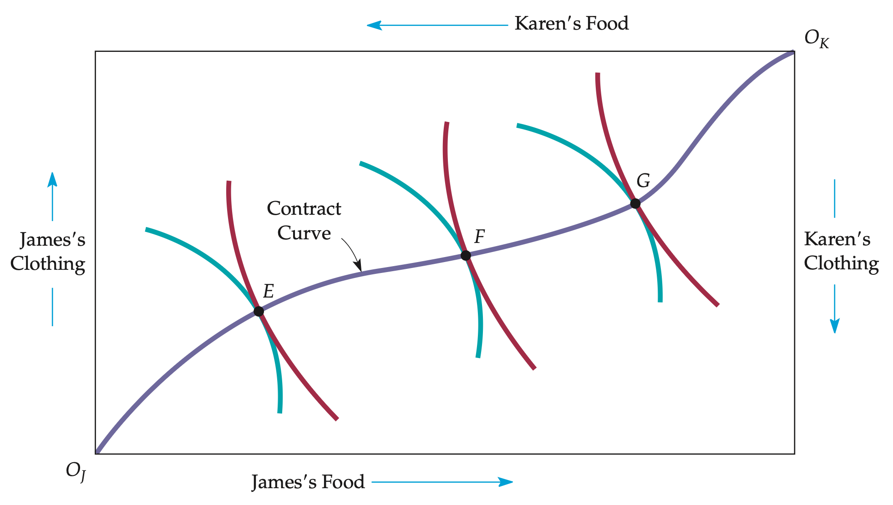
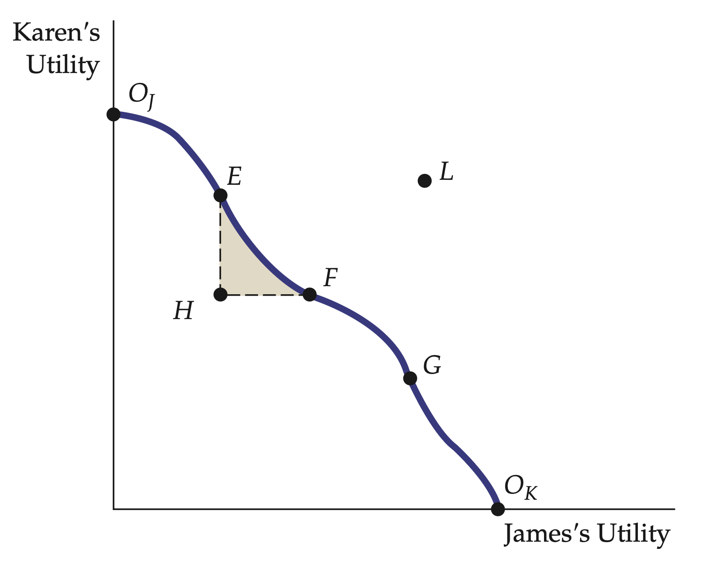
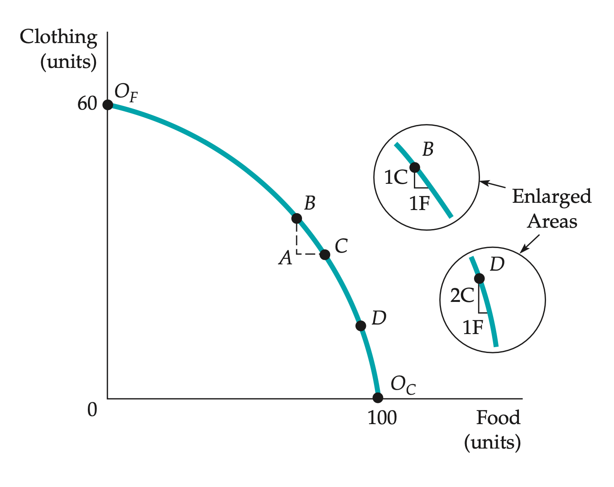
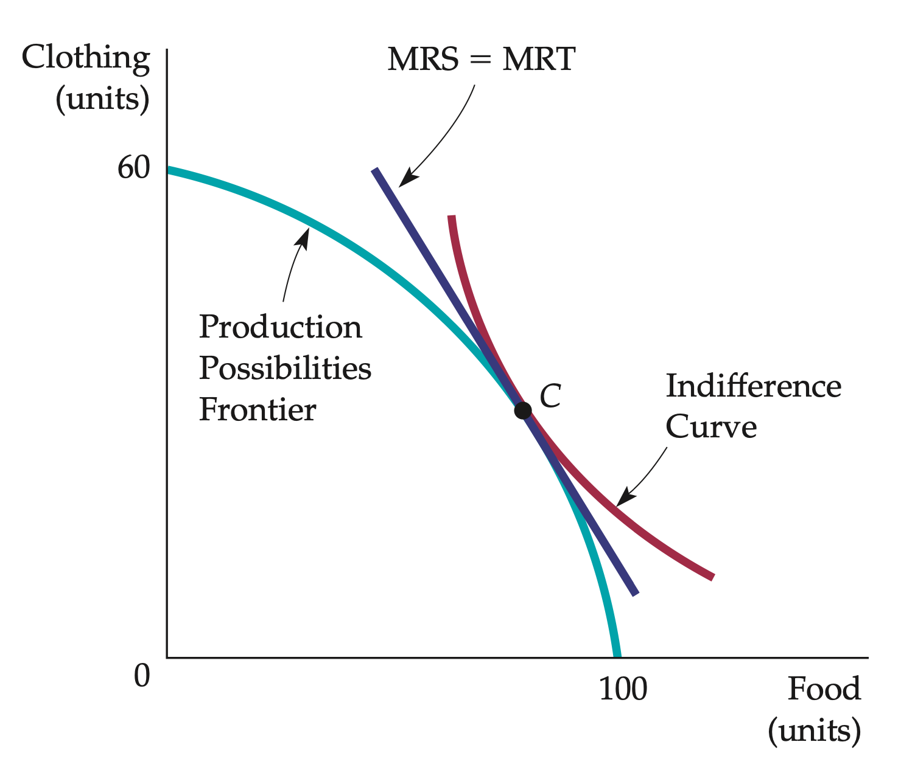

<style>

.center2 {
  margin: 0;
  position: absolute;
  top: 50%;
  left: 50%;
  -ms-transform: translate(-50%, -50%);
  transform: translate(-50%, -50%);
}

</style>

```{r setup, include = FALSE}
knitr::opts_chunk$set(echo = FALSE)
knitr::opts_chunk$set(warning = FALSE)
knitr::opts_chunk$set(message = FALSE)
knitr::opts_chunk$set(out.width = "70%")
knitr::opts_chunk$set(fig.align="center")

options(htmltools.dir.version = FALSE)
library(knitr)
library(tidyverse)
library(xaringanExtra)
library(ggplot2)
library(plotly)
library(googlesheets4)
library(dplyr)
library(knitr)

# set default options
opts_chunk$set(
  echo = FALSE,
  warnings = FALSE,
  collapse = TRUE,
  fig.width = 7.252,
  fig.height = 4,
  dpi = 300
)
# set engines
knitr::knit_engines$set("markdown")
xaringanExtra::use_tile_view()
xaringanExtra::use_panelset()
xaringanExtra::use_clipboard()
xaringanExtra::use_webcam()
xaringanExtra::use_broadcast()
xaringanExtra::use_share_again()
xaringanExtra::style_share_again(
  share_buttons = c("twitter", "linkedin", "pocket")
)

# Ensure Xaringan opens in RStudio Viewer instead of browser
options(servr.daemon = TRUE)
```

```{r plotting-functions}
source("microII_plots.R")
source("chapter16_plots.R")
```

.center2[
# Introduction 
]

---
## Intro

Today we will review **conceptual tools** by which economists assess the desirability of market outcomes and the welfare and distributional effects of government intervention

--

**Welfare economics**: provides the basis for judging the achievements of markets and policy makers in allocating resources (normative evaluation of markets and economic policy)

--

1) General Equilibrium (GE) Analysis $\Rightarrow$ **Markets are interdependent**: Conditions in one can affect prices and outputs in others

--

2) Efficiency in Exchange $\Rightarrow$ **First fundamental theorem in welfare econ**: The competitive equilibrium, maximizes social efficiency 

--

3) (Normative statements of) Efficiency and Equity $\Rightarrow$ **Second fundamental theorem in welfare econ**: under certain conditions, no conflict between efficiency and equity

--

4) Revise Efficiency in Production $\Rightarrow$ **efficient use of inputs** in the
production process + GE to find the **prices that equate supply and demand in every market**

--

5) Revise Efficiency in Trade $\Rightarrow$ account **comparative advantages** and potential gains of trade

--

6) Take stock 

--

7) What are the problems with the points above

---
.center2[
# General Equilibrium Analysis 
]

---
## General Equilibrium Analysis 

Before, we studied **partial equilibrium**: Determination of equilibrium prices and quantities in a market independent of effects from other markets.

--

**General equilibrium analysis**: 
--
 Simultaneous determination of the prices and quantities in all relevant markets, taking feedback effects into account.

--

In practice, a complete general equilibrium analysis, which evaluates the effects of a change in one market on all other markets, is not feasible. 
--
 Instead, we confine ourselves to two or three markets that are closely related
 
---
## Two Interdependent Markets 

Suppose we have to markets: Movie tickets and DVD rentals. Substitutes: Watch movies at home or at theater.

--

At (partial) equilibrium:

.pull-left[
#### **Movie theaters**: $P_M = 6$
```{r movies-01, out.width="150%"}
# Movie tickets market with feedback loops
set.seed(1234)
movie_market <- generate_supply_demand_data(
  eq_P = 6.00,
  eq_Q = 10,
  demand_elasticity = "inelastic",
  supply_elasticity = "inelastic",
  shift_supply = 1,     # To reach $6.82 eventually
  shift_demand = 1      # Final shift due to DVD feedback
)

plot_supply_demand(
  movie_market$data,
  show_shifted_supply = F,
  show_shifted_demand = F
) 

```

]

.pull-right[
#### DVD Rentals: $P_D = 3$

```{r dvd-01, out.width="150%"}
# DVD market responding to theater market
set.seed(1234)
dvd_market <- generate_supply_demand_data(
  eq_P = 3.00,
  eq_Q = 5,
  demand_elasticity = "elastic",
  supply_elasticity = "elastic",
  shift_demand = 0.58  # Final DVD price is 3.58
)

plot_supply_demand(
  dvd_market$data,
  show_shifted_demand = F
)
```
]

---
## Two Interdependent Markets 

Now suppose the government places a tax of $1 on each movie ticket purchased.

On partial equilibrium: supply curve for movies shifts upward by 1, from $S_M$ to $S^*_M$

.pull-left[
#### **Movie theaters**: $P_M = 6 \Rightarrow P'_M \approx 6.4$
```{r movies-02, out.width="150%"}
plot_supply_demand(
  movie_market$data,
  show_shifted_supply = T,
  show_shifted_demand = F
)
```

]

.pull-right[
#### DVD Rentals: $P_D = 3$

```{r dvd-02, out.width="150%"}
plot_supply_demand(
  dvd_market$data,
  show_shifted_demand = F
)
```
]

Is that it?

---
## Two Interdependent Markets 

Since the two markets are substitutes, the demand for DVDs will increase.

Higher movie price shifts the demand for DVDs from $D_V$ to $D'_V$

.pull-left[
#### **Movie theaters**: $P_M = 6 \Rightarrow P'_M \approx 6.4$
```{r movies-03, out.width="150%"}
plot_supply_demand(
  movie_market$data,
  show_shifted_supply = T,
  show_shifted_demand = F
)
```

]

.pull-right[
#### DVD Rentals: $P_D = 3 \Rightarrow P'_D \approx 3.4$

```{r dvd-03, out.width="150%"}
plot_supply_demand(
  dvd_market$data,
  show_shifted_demand = T
)
```
]

Is that it?

---
## Two Interdependent Markets 

Since the two markets are substitutes, the demand for movies will increase.

Higher DVD rental price shifts the demand for movies from $D_M$ to $D'_M$

.pull-left[
#### **Movie theaters**: $P'_M = \approx 6.4 \Rightarrow P''_M = 7$
```{r movies-04, out.width="150%"}
plot_supply_demand(
  movie_market$data,
  show_shifted_supply = T,
  show_shifted_demand = T
)
```

]

.pull-right[
#### DVD Rentals: $P_D = 3 \Rightarrow P'_D \approx 3.4$

```{r dvd-04, out.width="150%"}
plot_supply_demand(
  dvd_market$data,
  show_shifted_demand = T
)
```
]

---
## Reaching General Equilibrium


**General equilibrium requires simultaneous analysis of both markets**, Since changes in one market feed back into the other, affecting final prices and quantities.

.pull-left[
#### **Movie theaters**: $\Rightarrow \{P^*, Q^*\}$ such that $S^*_M = D^*_M$
```{r movies-05, out.width="150%"}
plot_supply_demand(
  movie_market$data,
  show_shifted_supply = T,
  show_shifted_demand = T
)
```

]

.pull-right[
#### DVD Rentals: $\Rightarrow \{P^*, Q^*\}$ such that $S^*_D = D^*_D$

```{r dvd-05, out.width="150%"}
plot_supply_demand(
  dvd_market$data,
  show_shifted_demand = T
)
```
]

--

- Partial equilibrium underestimates impacts, but GE analysis shows a larger increase due to intermarket feedback.

---
## Economic Efficiency

Competitive markets are economically efficient: they maximize aggregate consumer and producer surplus (Chapter 9).

```{r comp-mkt-efficiency-01}
eq_P = 5
eq_Q = 8
set.seed(13)
plot_data <- 
  generate_supply_demand_data(
    eq_P = 5, eq_Q = 8,
    demand_elasticity = "inelastic", 
    supply_elasticity = "inelastic"
  )

supply_data <- plot_data$formulas$supply
demand_data <- plot_data$formulas$demand

plot_data <- plot_data$data

# Define the coordinates of the triangle manually
producer_surplus <- tibble(
  x = c(0, 0, plot_data$eq_Q[1]),  # Adjust these values as needed
  y = c(plot_data$eq_P[1], min(plot_data$Supply), plot_data$eq_P[1])  # Adjust these values as needed
)

# Define the coordinates of the consumer surplus triangle manually
consumer_surplus <- tibble(
  x = c(0, 0, plot_data$eq_Q[1]),  
  y = c(plot_data$eq_P[1], max(plot_data$Demand), plot_data$eq_P[1])  
)

plot <- 
plot_supply_demand(plot_data) +
  # Consumer surplus
  geom_polygon(
    data = consumer_surplus,
    aes(x = x, y = y),
    fill = yellow_chapter, alpha = 0.4  # Yellow shading with transparency
  ) +
  geom_text(
    aes(x = mean(consumer_surplus$x), y = mean(consumer_surplus$y)),
    label = "Consumer\nSurplus", fontface = "italic", size = 3, color = "black"
  ) +
  # Producer surplus
  geom_polygon(
    data = producer_surplus,
    aes(x = x, y = y),
    fill = green_chapter, alpha = 0.4  # Yellow shading with transparency
  ) +
  geom_text(
    aes(x = mean(producer_surplus$x), y = mean(producer_surplus$y)),
    label = "Producer\nSurplus", fontface = "italic", size = 3, color = "black"
  )

plot
```

---
## Economic Efficiency

How does economic efficiency apply when considering the interconnected nature of markets across different systems—whether open or closed, free or regulated, or market-based or planned?

```{r comp-mkt-efficiency-02}
plot
```

---
.center2[
# Efficiency in Exchange 
]

---
## Efficiency in Exchange 

Consider an **exchange economy**: Market in which two or more consumers (countries) trade two goods among themselves.

--

The two goods are initially allocated so that both consumers can make themselves better off by trading with each other
--
: the initial allocation of goods is economically inefficient.

--

**Pareto efficient allocation**: Allocation of goods in which no one can be made better off unless someone else is made worse off.

--

 - Notice this is different than 'economic efficiency' as we previously studied
 
 - With Pareto efficiency, we know that there is no way to improve the well-being of both individuals (if we improve one, it will be at the expense of the other), but we cannot be assured that this arrangement will maximize the joint welfare of both individuals.


---
## The Advantages of Trade

Voluntary trade between two people or two countries is mutually beneficial.

--

Example: two-person exchange, assuming that exchange itself is costless. 
--
Suppose James and Karen have 10 units of food and 6 units of clothing between them.

--

| Individual | Initial Allocation |
|------------|--------------------|
| James      | 7F, 1C             |
| Karen      | 3F, 5C             |

--

To decide whether a trade would be advantageous, **we need to know their preferences for food and clothing**.

--

.pull-left[
Karen has a lot of clothing and little food:

Suppose she's willing to give up 3 units of clothing for 1 unit of food.

**Karen's MRS of food for clothing is 3**
]

--

.pull-right[
James has a loot of food and little clothing:

He will give up only 1/2 a unit of clothing to get 1 unit of food.

**James’s MRS of food for clothing is 1/2**
]

--

Trade is beneficial because James values clothing more, while Karen values food more.

---
## The Advantages of Trade

Voluntary trade between two people or two countries is mutually beneficial.

Suppose Karen offers James 1 unit of clothing for 1 unit of food, and James agrees. 

--

| Individual | Initial Allocation | Trade       |
|------------|--------------------|-------------|
| James      | 7F, 1C             | −1F, +1C     |
| Karen      | 3F, 5C             | +1F, −1C     |


---
## The Advantages of Trade

Voluntary trade between two people or two countries is mutually beneficial.

Suppose Karen offers James 1 unit of clothing for 1 unit of food, and James agrees. 

| Individual | Initial Allocation | Trade       | Final Allocation |
|------------|--------------------|-------------|------------------|
| James      | 7F, 1C             | −1F, +1C     | 6F, 2C           |
| Karen      | 3F, 5C             | +1F, −1C     | 4F, 4C           |

Both benefit from trade: James gains more clothing, and Karen gains more food, aligning with their preferences. 

When consumers have different MRS, trade improves efficiency; equal MRS indicate an efficient allocation.

---
## The Edgeworth Box Diagram

**Edgeworth box Diagram**: showing all possible allocations of either two goods between two people or of two inputs between two production processes.

--

```{r edgeworth01, out.width="80%"}
# Dimensiones de la caja (suma total de bienes)
total_food <- 10
total_clothing <- 6

# Edgeworth box
edgeworth_box <- 
ggplot() +
  theme_minimal() +
  scale_y_continuous(breaks = seq(0, total_clothing), limits = c(-0.3, total_clothing + .3)) +
  scale_x_continuous(breaks = seq(0, total_food), limits = c(-0.3, total_food + .3)) +
  labs(
    y = "Clothing", x = "Food"
  ) +
  geom_rect(aes(xmin = 0, xmax = total_food, ymin = 0, ymax = total_clothing), 
            fill = NA, color = "black") +
  coord_fixed(ratio = 1, clip = "off") +
  theme(
    axis.text = element_text(size = 10)
  )

edgeworth_box
```

Horizontal axis: number of units of food. Vertical axis: the units of clothing.

---
## The Edgeworth Box Diagram

**Edgeworth box Diagram**: showing all possible allocations of either two goods between two people or of two inputs between two production processes.

```{r edgeworth02, out.width="80%"}
edgeworth_box
```

Length of the box 10 units of food and 6 of clothing, total quantities available.

---
## The Edgeworth Box Diagram


```{r edgeworth03, out.width="80%"}
# James
edgeworth_box <- 
  edgeworth_box +
  annotate("text", x = -0.25, y = -0.25, label = "O[James]", hjust = .2, vjust = .25, parse = TRUE) +
  # Add the arrow under the box
  geom_segment(aes(x = 2.75, xend = 6, y = -0.225, yend = -0.225),
               arrow = arrow(length = unit(0.2, "cm")), color = "deepskyblue3", size = 0.8) +
  # Label for arrow
  annotate("text", x = 2, y = -0.15, label = "James's Food", vjust = 1, size = 3) +
  # Add the arrow under the box
  geom_segment(aes(x = -0.19, xend = -0.19, y = 3, yend = 5),
               arrow = arrow(length = unit(0.2, "cm")), color = "deepskyblue3", size = 0.8) +
  # Label for arrow
  annotate("text", x = -0.29, y = 2, label = "James's Clothing", vjust = 1, size = 3, angle = 90)

edgeworth_box
```

James’s holdings are read from the origin at $O_{James}$.

---
## The Edgeworth Box Diagram

```{r edgeworth04, out.width="80%"}
# Karen
edgeworth_box <- 
  edgeworth_box +
  annotate("text", x = 10.125, y = 6.125, label = "O[Karen]", hjust = .05, vjust = .05, parse = TRUE) +
  # Add the arrow under the box
  geom_segment(aes(x = 7.25, xend = 4, y = 6.175, yend = 6.175),
               arrow = arrow(length = unit(0.2, "cm")), color = "deepskyblue3", size = 0.8) +
  # Label for arrow
  annotate("text", x = 8, y = 6.275, label = "Karen's Food", vjust = 1, size = 3) +
  # Add the arrow under the box
  geom_segment(aes(x = 10.2, xend = 10.2, y = 3.35, yend = 1),
               arrow = arrow(length = unit(0.2, "cm")), color = "deepskyblue3", size = 0.8) +
  # Label for arrow
  annotate("text", x = 10.25, y = 4.25, label = "Karen's Clothing", size = 3, angle = 270)

edgeworth_box
```

Karens’s holdings are read in the reverse direction from the origin at $O_{Karen}$.

---
## The Edgeworth Box Diagram

```{r edgeworth05, out.width="80%"}
# Initial allocation
edgeworth_box <- 
edgeworth_box +
  geom_point(aes(x = 7, y = 1), size = 2) +
  annotate(
    "text", x = 7.25, y = 1.25, label = "italic(A)", parse = TRUE
  )
  
edgeworth_box
```

Initial allocation

---
## The Edgeworth Box Diagram

```{r edgeworth06, out.width="80%"}
# Initial food allocation
edgeworth_box <- 
  edgeworth_box +
  geom_segment(aes(x = 7, xend = 7, y = 0, yend = total_clothing), linetype = "dashed") +
  annotate("text", x = 7 + .25, y = 0 + 0.25, label = "7F", size = 3.5) +
  annotate("text", x = 7 - .25, y = total_clothing - 0.25, label = "3F", size = 3.5) 

edgeworth_box
```

Initial food allocation

---
## The Edgeworth Box Diagram

```{r edgeworth07, out.width="80%"}
# Initial clothing allocation
edgeworth_box <- 
  edgeworth_box +
  geom_segment(aes(x = 0, xend = total_food, y = 1, yend = 1), linetype = "dashed") +
  annotate("text", x = 0 + .25, y = 1 + 0.25, label = "1C", size = 3.5) +
  annotate("text", x = total_food - .25, y = 1 - 0.25, label = "5C", size = 3.5)

edgeworth_box
```

Initial clothing allocation

---
## The Edgeworth Box Diagram

```{r edgeworth08, out.width="80%"}
# Allocation after trade
edgeworth_box <- 
  edgeworth_box +
  geom_point(aes(x = 6, y = 2), size = 2) +
  annotate(
    "text", x = 6 - .25, y = 2 + .25, label = "italic(B)", parse = TRUE
  )

edgeworth_box
```

After trade 

---
## The Edgeworth Box Diagram

```{r edgeworth09, out.width="80%"}
# Food allocation after trade
edgeworth_box <- 
edgeworth_box +
  geom_segment(aes(x = 6, xend = 6, y = 0, yend = total_clothing), linetype = "dashed") +
  annotate("text", x = 6 + .25, y = 0 + 0.25, label = "6F", size = 3.5) +
  annotate("text", x = 6 - .25, y = total_clothing - 0.25, label = "4F", size = 3.5) +
  # Add trade arrows
  geom_segment(aes(x = 7-.125, xend = 6+.125, y = 1, yend = 1),
               arrow = arrow(length = unit(0.2, "cm")), color = "magenta", size = 0.8) +
  
  geom_segment(aes(x = 7-.125, xend = 6+.125, y = 2, yend = 2),
               arrow = arrow(length = unit(0.2, "cm")), color = "magenta", size = 0.8) 

edgeworth_box
```

Food allocation after trade 

---
## The Edgeworth Box Diagram

```{r edgeworth10, out.width="80%"}
# Clothing allocation after trade
edgeworth_box <- 
  edgeworth_box +
    geom_segment(aes(x = 0, xend = total_food, y = 2, yend = 2), linetype = "dashed") +
    annotate("text", x = 0 + .25, y = 2 + 0.25, label = "2C", size = 3.5) +
    annotate("text", x = total_food - .25, y = 2 - 0.25, label = "4C", size = 3.5) +
    # Add trade arrows
    geom_segment(aes(x = 7-.125, xend = 6+.125, y = 1, yend = 1),
                 arrow = arrow(length = unit(0.2, "cm")), color = "magenta", size = 0.8) +
    geom_segment(aes(x = 7-.125, xend = 6+.125, y = 2, yend = 2),
                 arrow = arrow(length = unit(0.2, "cm")), color = "magenta", size = 0.8) +
    geom_segment(aes(x = 6, xend = 6, y = 1+.125, yend = 2-+.125),
                 arrow = arrow(length = unit(0.2, "cm")), color = "magenta", size = 0.8) +
    geom_segment(aes(x = 7, xend = 7, y = 1+.125, yend = 2-+.125),
                 arrow = arrow(length = unit(0.2, "cm")), color = "magenta", size = 0.8) 
  

edgeworth_box
```

Clothing allocation after trade 

---
## The Edgeworth Box Diagram

| Individual | Initial Allocation | Trade       | Final Allocation |
|------------|--------------------|-------------|------------------|
| James      | 7F, 1C             | −1F, +1C     | 6F, 2C           |
| Karen      | 3F, 5C             | +1F, −1C     | 4F, 4C           |

---
## The Edgeworth Box Diagram

```{r edgeworth11, out.width="85%"}
edgeworth_box
```

---
## Efficient Allocations

A trade from *A* to *B* thus made both Karen and James better off.
--
 But is *B* an efficient allocation? The answer depends on both MRS.

--

```{r efficient-allocations01, out.width="80%"}
# Edgeworth box
edgeworth_box <- 
  ggplot() +
  theme_minimal() +
  scale_y_continuous(breaks = seq(0, total_clothing), limits = c(-0.3, total_clothing + .3)) +
  scale_x_continuous(breaks = seq(0, total_food), limits = c(-0.3, total_food + .3)) +
  labs(
    y = "Clothing", x = "Food"
  ) +
  geom_rect(aes(xmin = 0, xmax = total_food, ymin = 0, ymax = total_clothing), 
            fill = NA, color = "black") +
  coord_fixed(ratio = 1, clip = "off") +
  annotate("text", x = -0.25, y = -0.25, label = "O[James]", hjust = .2, vjust = .25, parse = TRUE) +
  # Add the arrow under the box
  geom_segment(aes(x = 2.75, xend = 6, y = -0.225, yend = -0.225),
               arrow = arrow(length = unit(0.2, "cm")), color = "deepskyblue3", size = 0.8) +
  # Label for arrow
  annotate("text", x = 2, y = -0.15, label = "James's Food", vjust = 1, size = 3.5) +
  # Add the arrow under the box
  geom_segment(aes(x = -0.19, xend = -0.19, y = 3, yend = 5),
               arrow = arrow(length = unit(0.2, "cm")), color = "deepskyblue3", size = 0.8) +
  # Label for arrow
  annotate("text", x = -0.29, y = 2, label = "James's Clothing", vjust = 1, size = 3.5, angle = 90)  +
  annotate("text", x = 10.125, y = 6.125, label = "O[Karen]", hjust = .05, vjust = .05, parse = TRUE) +
  # Add the arrow under the box
  geom_segment(aes(x = 7.25, xend = 4, y = 6.175, yend = 6.175),
               arrow = arrow(length = unit(0.2, "cm")), color = "deepskyblue3", size = 0.8) +
  # Label for arrow
  annotate("text", x = 8, y = 6.275, label = "Karen's Food", vjust = 1, size = 3.5) +
  # Add the arrow under the box
  geom_segment(aes(x = 10.2, xend = 10.2, y = 3.35, yend = 1),
               arrow = arrow(length = unit(0.2, "cm")), color = "deepskyblue3", size = 0.8) +
  # Label for arrow
  annotate("text", x = 10.25, y = 4.25, label = "Karen's Clothing", size = 3.5, angle = 270) 

edgeworth_box +
  geom_point(aes(x = 7, y = 1), size = 2) +
  annotate(
    "text", x = 7.25, y = 1.25, label = "italic(A)", parse = TRUE
  )
```

---
## Efficient Allocations

```{r utility-functions, include=F, echo=F}
# Define utility levels at point A
u_j <- sqrt(7 * 1)
u_k <- sqrt(3 * 5)

# Grid of food
food_seq <- seq(0.5, 9.5, length.out = 200)

# James's indifference curve through A
james_curve_A <- tibble(
  Food = food_seq,
  Clothing = u_j^2 / Food,
  Utility = "U[J]^A"
) |> 
  filter(Food < total_food, Clothing < total_clothing) |> 
  filter(Food > 0, Clothing > 0)

# Karen's indifference curve through A
karen_curve_A <- tibble(
  Food = food_seq,
  Clothing = 6 - (u_k^2 / (10 - food_seq)),
  Utility = "U[K]^A"
) |> 
  filter(Food < total_food, Clothing < total_clothing) |> 
  filter(Food > 0, Clothing > 0)
```


```{r efficient-allocations02, out.width="80%"}
# James first indifference curve at point A
edgeworth_box <- 
edgeworth_box +
  geom_line(data = james_curve_A, aes(x = Food, y = Clothing), color = "darkred", size = 1) +
  geom_text(data = james_curve_A %>% slice_tail(n = 1),
            aes(x = Food, y = Clothing, label = Utility), color = "darkred", parse = TRUE, hjust = -0.2) 
  
edgeworth_box +
  geom_point(aes(x = 7, y = 1), size = 2) +
  annotate(
    "text", x = 7.25, y = 1.25, label = "italic(A)", parse = TRUE
  )
```

At point *A*, James's indifference curve is $U_K^A$.

---
## Efficient Allocations

```{r efficient-allocations03, out.width="80%"}
# Karen first indifference curve at point A
edgeworth_box <- 
edgeworth_box +
  geom_line(data = karen_curve_A, aes(x = Food, y = Clothing), color = "darkcyan", size = 1) +
  geom_text(data = karen_curve_A %>% slice_head(n = 1),
            aes(x = Food, y = Clothing, label = Utility), color = "darkcyan", parse = TRUE, hjust = 1.2, vjust = -.5)
  
edgeworth_box +
  geom_point(aes(x = 7, y = 1), size = 2) +
  annotate(
    "text", x = 7.25, y = 1.25, label = "italic(A)", parse = TRUE
  )
```

At point *A*, Karen's indifference curve is $U_J^A$. Note: Karen’s indifference curves are rotated 180°, placing her origin at the top right of the box.

---
## Efficient Allocations

```{r efficient-allocations04, out.width="80%"}
# Mutually beneficial trades ----
# Choose more accurate overlap
food_range <- c(1.55, 7)

# Slice both curves
james_lens <- james_curve_A |> filter(Food >= food_range[1], Food <= food_range[2])
karen_lens <- karen_curve_A |> filter(Food >= food_range[1], Food <= food_range[2])

# Make sure to reverse Karen's portion for a proper polygon loop
lens_polygon <- bind_rows(
  james_lens,
  karen_lens |> arrange(desc(Food))
)

# Final plot with lens
edgeworth_box <- 
edgeworth_box +
  geom_polygon(data = lens_polygon, aes(x = Food, y = Clothing), fill = "orchid", alpha = 0.3) +
  geom_line(data = james_curve_A, aes(x = Food, y = Clothing), color = "darkred", size = 1) +
  geom_line(data = karen_curve_A, aes(x = Food, y = Clothing), color = "darkcyan", size = 1) +
  geom_point(aes(x = 7, y = 1), size = 2) +
  annotate("text", x = 7.25, y = 1.25, label = "italic(A)", parse = TRUE)

edgeworth_box
```

The shaded area shows all allocations that make both James and Karen better off than at A—i.e., all mutually beneficial trades.

---
## Efficient Allocations

```{r efficient-allocations05, out.width="80%"}
edgeworth_box
```

Any trade moving outside the shaded area from A would harm at least one consumer and should be avoided.

---
## Efficient Allocations

```{r efficient-allocations06, out.width="80%"}
# Karen first indifference curve at point A
edgeworth_box <- 
edgeworth_box +
  geom_line(data = karen_curve_A, aes(x = Food, y = Clothing), color = "darkcyan", size = 1) +
  geom_text(data = karen_curve_A %>% slice_head(n = 1),
            aes(x = Food, y = Clothing, label = Utility), color = "darkcyan", parse = TRUE, hjust = 1.2, vjust = -.5)
  
edgeworth_box +
  geom_point(aes(x = 7, y = 1), size = 2) +
  annotate(
    "text", x = 7.25, y = 1.25, label = "italic(A)", parse = TRUE
  ) +
  geom_point(aes(x = 6, y = 2), size = 2) +
  annotate(
    "text", x = 6 - .25, y = 2 + .25, label = "italic(B)", parse = TRUE
  )
```

What happens with trade? Point *B*.

---
## Efficient Allocations

```{r efficient-allocations07, out.width="80%"}
# Indifference curves at point B
u_j_B <- sqrt(6 * 2)   # James at (6, 2)
u_k_B <- sqrt(4 * 4)   # Karen at (4, 4)

# James's curve through B
james_curve_B <- tibble(
  Food = food_seq,
  Clothing = u_j_B^2 / Food,
  Utility = "U[J]^B"
) |> 
  filter(Food > 0, Clothing > 0) |> 
  filter(Food < total_food, Clothing < total_clothing)

# Karen's curve through B
karen_curve_B <- tibble(
  Food = food_seq,
  Clothing = 6 - (u_k_B^2 / (10 - food_seq)),
  Utility = "U[K]^B"
) |> 
  filter(Food > 0, Clothing > 0) |> 
  filter(Food < total_food, Clothing < total_clothing)

edgeworth_box <- 
edgeworth_box +
  geom_point(aes(x = 7, y = 1), size = 2) +
  annotate(
    "text", x = 7.25, y = 1.25, label = "italic(A)", parse = TRUE
  )

edgeworth_box <- 
edgeworth_box +
  geom_line(data = james_curve_B, aes(x = Food, y = Clothing), color = "darkred", size = 1) +
  geom_point(aes(x = 6, y = 2), size = 2) +
  annotate(
    "text", x = 6 - .25, y = 2 + .25, label = "italic(B)", parse = TRUE
  )

edgeworth_box
```

What happens with trade? At point *B*, James's indifference curve is $U_J^B$.

---
## Efficient Allocations

```{r efficient-allocations08, out.width="80%"}
edgeworth_box <- 
  edgeworth_box +
  geom_line(data = karen_curve_B, aes(x = Food, y = Clothing), color = "darkcyan", size = 1) +
  geom_point(aes(x = 6, y = 2), size = 2) +
  annotate(
    "text", x = 6 - .25, y = 2 + .25, label = "italic(B)", parse = TRUE
  )

edgeworth_box
```


What happens with trade? At point *B*, Karen's indifference curve is $U_K^B$.

---
## Efficient Allocations

```{r efficient-allocations09, out.width="80%"}
edgeworth_box
```

Moving from *A* to *B* is mutually beneficial, but it is not efficient because the indifference curves intersect.

---
## Efficient Allocations

```{r efficient-allocations10, out.width="80%"}
edgeworth_box
```

Starting at *B*, James is willing to trade food for clothing to improve or maintain his utility, and many such trades are possible.

---
## Efficient Allocations

```{r efficient-allocations11, out.width="80%"}
edgeworth_box
```

Starting at *B*, Karen is willing to trade clothing for food, with many options that would make her better off.

---
## Efficient Allocations

```{r efficient-allocations12, out.width="80%"}
edgeworth_box
```

**Even if a trade from an inefficient allocation makes both people better off, the new allocation is not necessarily efficient.**

---
## Efficient Allocations

```{r efficient-allocations13, out.width="80%"}
# Point C ----
# Coordinates of point C
f_c <- 5
c_c <- 2.5

# Utilities at C
u_j_C <- sqrt(f_c * c_c)               # James: sqrt(5 * 2.5)
u_k_C <- sqrt((10 - f_c) * (6 - c_c))  # Karen: sqrt(5 * 3.5)

# James's curve through C
james_curve_C <- tibble(
  Food = food_seq,
  Clothing = u_j_C^2 / Food,
  Utility = "U[J]^C"
) |> 
  filter(Food > 0, Clothing > 0) |> 
  filter(Food < total_food, Clothing < total_clothing)

# Karen's curve through C
karen_curve_C <- tibble(
  Food = food_seq,
  Clothing = 6 - (u_k_C^2 / (10 - food_seq)),
  Utility = "U[K]^C"
) |> 
  filter(Food > 0, Clothing > 0) |> 
  filter(Food < total_food, Clothing < total_clothing)

  
edgeworth_box +
  geom_line(data = james_curve_C, aes(x = Food, y = Clothing), color = "darkred", size = 1) +
  geom_line(data = karen_curve_C, aes(x = Food, y = Clothing), color = "darkcyan", size = 1) +
  geom_point(aes(x = f_c, y = c_c), size = 2) +
  annotate("text", x = f_c - 0.25, y = c_c + 0.25, label = "italic(C)", parse = TRUE)

```

Suppose that from B the additional trade is made, up to point *C*, where James giving uo another unit of food to get 1/2 clothing.

---
## Efficient Allocations

```{r efficient-allocations14, out.width="80%"}
edgeworth_box +
  geom_line(data = james_curve_C, aes(x = Food, y = Clothing), color = "darkred", size = 1) +
  geom_line(data = karen_curve_C, aes(x = Food, y = Clothing), color = "darkcyan", size = 1) +
  geom_point(aes(x = f_c, y = c_c), size = 2) +
  annotate("text", x = f_c - 0.25, y = c_c + 0.25, label = "italic(C)", parse = TRUE)

```

At point *C*, the indifference curves are tangent $\Rightarrow$ **Pareto efficient outcome**: one person cannot be made better off without making the other person worse off.

---
## The Contract Curve

**Contract curve**: Curve showing all efficient allocations of goods between two consumers, or of two inputs between two production functions.

--

```{r}

```

---
## The Contract Curve

.pull-left[

- Pareto efficiency means no one can be made better off without making someone else worse off.

  - a modest goal: we should make all mutually beneficial exchanges, but it does not say which exchanges are best.
	
  -	multiple outcomes can be efficient, but we can’t say which is better without knowing preferences (nor initial endowments).

- Efficiency doesn’t imply fairness or optimality, just that no mutual gains remain.
	
- Efficiency can still improve if harmful changes are paired with compensating ones.

]

.pull-right[
```{r, out.width="100%"}

```


The contract curve shows all efficient allocations where no further mutually beneficial trade is possible.

]

---
## Consumer Equilibrium in a Competitive Market

In a two-person exchange, the outcome can depend on the bargaining power of the two parties.

--

In competitive markets, numerous actual or potential buyers and sellers exist, and each accepts the market price as given, deciding only the quantity to buy or sell.

--

We can illustrate how competitive markets lead to efficient exchange using the Edgeworth box by assuming many individuals like James and Karen. This lets us treat each as a price taker, even in a two-person diagram.

---
## Consumer Equilibrium in a Competitive Market

```{r eq-competitive-mkt01, out.width="80%"}
# Edgeworth box
edgeworth_box <- 
  ggplot() +
  theme_minimal() +
  scale_y_continuous(breaks = seq(0, total_clothing), limits = c(-0.3, total_clothing + .3)) +
  scale_x_continuous(breaks = seq(0, total_food), limits = c(-0.3, total_food + .3)) +
  labs(
    y = "Clothing", x = "Food"
  ) +
  geom_rect(aes(xmin = 0, xmax = total_food, ymin = 0, ymax = total_clothing), 
            fill = NA, color = "black") +
  coord_fixed(ratio = 1, clip = "off") +
  annotate("text", x = -0.25, y = -0.25, label = "O[James]", hjust = .2, vjust = .25, parse = TRUE) +
  # Add the arrow under the box
  geom_segment(aes(x = 2.75, xend = 6, y = -0.225, yend = -0.225),
               arrow = arrow(length = unit(0.2, "cm")), color = "deepskyblue3", size = 0.8) +
  # Label for arrow
  annotate("text", x = 2, y = -0.15, label = "James's Food", vjust = 1, size = 3.5) +
  # Add the arrow under the box
  geom_segment(aes(x = -0.19, xend = -0.19, y = 3, yend = 5),
               arrow = arrow(length = unit(0.2, "cm")), color = "deepskyblue3", size = 0.8) +
  # Label for arrow
  annotate("text", x = -0.29, y = 2, label = "James's Clothing", vjust = 1, size = 3.5, angle = 90)  +
  annotate("text", x = 10.125, y = 6.125, label = "O[Karen]", hjust = .05, vjust = .05, parse = TRUE) +
  # Add the arrow under the box
  geom_segment(aes(x = 7.25, xend = 4, y = 6.175, yend = 6.175),
               arrow = arrow(length = unit(0.2, "cm")), color = "deepskyblue3", size = 0.8) +
  # Label for arrow
  annotate("text", x = 8, y = 6.275, label = "Karen's Food", vjust = 1, size = 3.5) +
  # Add the arrow under the box
  geom_segment(aes(x = 10.2, xend = 10.2, y = 3.35, yend = 1),
               arrow = arrow(length = unit(0.2, "cm")), color = "deepskyblue3", size = 0.8) +
  # Label for arrow
  annotate("text", x = 10.25, y = 4.25, label = "Karen's Clothing", size = 3.5, angle = 270) 

edgeworth_box
```


---
## Consumer Equilibrium in a Competitive Market

```{r eq-competitive-mkt02, out.width="80%"}
# Define utility levels at point A
u_j <- sqrt(7 * 1)
u_k <- sqrt(3 * 5)

# Grid of food
food_seq <- seq(0.5, 9.5, length.out = 200)

# James's indifference curve through A
james_curve_A <- tibble(
  Food = food_seq,
  Clothing = u_j^2 / Food,
  Utility = "U[J]^A"
) |> 
  filter(Food < total_food, Clothing < total_clothing) |> 
  filter(Food > 0, Clothing > 0)

# Karen's indifference curve through A
karen_curve_A <- tibble(
  Food = food_seq,
  Clothing = 6 - (u_k^2 / (10 - food_seq)),
  Utility = "U[K]^A"
) |> 
  filter(Food < total_food, Clothing < total_clothing) |> 
  filter(Food > 0, Clothing > 0)

# Indifference curves at point A
edgeworth_box <- 
  edgeworth_box +
  geom_line(data = james_curve_A, aes(x = Food, y = Clothing), color = "darkred", size = 1) +
  geom_text(data = james_curve_A %>% slice_tail(n = 1),
            aes(x = Food, y = Clothing, label = Utility), color = "darkred", parse = TRUE, hjust = -0.2) +
  geom_line(data = karen_curve_A, aes(x = Food, y = Clothing), color = "darkcyan", size = 1) +
  geom_text(data = karen_curve_A %>% slice_head(n = 1),
            aes(x = Food, y = Clothing, label = Utility), color = "darkcyan", parse = TRUE, hjust = 1.2, vjust = -.5) 

edgeworth_box +
  geom_point(aes(x = 7, y = 1), size = 2) +
  annotate("text", x = 7.25, y = 1.25, label = "italic(A)", parse = TRUE) 
```

Opportunities for trade when we start at the allocation given by point *A*.

---
## Consumer Equilibrium in a Competitive Market

```{r eq-competitive-mkt03, out.width="80%"}
# Coordinates of point C
f_c <- 5
c_c <- 2.5

# Utilities at C
u_j_C <- sqrt(f_c * c_c)               # James: sqrt(5 * 2.5)
u_k_C <- sqrt((10 - f_c) * (6 - c_c))  # Karen: sqrt(5 * 3.5)

# James's curve through C
james_curve_C <- tibble(
  Food = food_seq,
  Clothing = u_j_C^2 / Food,
  Utility = "U[J]^C"
) |> 
  filter(Food > 0, Clothing > 0) |> 
  filter(Food < total_food, Clothing < total_clothing)

# Karen's curve through C
karen_curve_C <- tibble(
  Food = food_seq,
  Clothing = 6 - (u_k_C^2 / (10 - food_seq)),
  Utility = "U[K]^C"
) |> 
  filter(Food > 0, Clothing > 0) |> 
  filter(Food < total_food, Clothing < total_clothing)

# Create the price line passing through points A (7,1) and C (5,2.5)
price_line <- tibble(
  Food = seq(0, 10, length.out = 200)
) |> 
  mutate(
    Clothing = -0.75 * (Food - 7) + 1
  ) |> 
  filter(Clothing >= 0, Clothing <= total_clothing)

edgeworth_box +
  geom_line(data = james_curve_C, aes(x = Food, y = Clothing), color = "darkred", size = 1) +
  geom_line(data = karen_curve_C, aes(x = Food, y = Clothing), color = "darkcyan", size = 1) +
  # geom_line(data = price_line, aes(x = Food, y = Clothing), color = purple_chapter, lwd = 1.25) +
  # annotate("text", x = 2.2, y = 4.8, label = "Price Line", size = 3.5, angle = atan(-0.75) * 180 / pi, color = purple_chapter) +
  geom_point(aes(x = 7, y = 1), size = 2) +
  annotate("text", x = 7.25, y = 1.25, label = "italic(A)", parse = TRUE) +
  geom_point(aes(x = f_c, y = c_c), size = 2) +
  annotate("text", x = f_c - 0.25, y = c_c + 0.25, label = "italic(C)", parse = TRUE) 
```

Suppose they want to achieve allocation *C* under trade, and increase their satisfaction by moving to higher indifference curves.

---
## Consumer Equilibrium in a Competitive Market

```{r eq-competitive-mkt04, out.width="80%"}
edgeworth_box <- 
edgeworth_box +
  geom_line(data = james_curve_C, aes(x = Food, y = Clothing), color = "darkred", size = 1) +
  geom_line(data = karen_curve_C, aes(x = Food, y = Clothing), color = "darkcyan", size = 1) +
  geom_line(data = price_line, aes(x = Food, y = Clothing), color = purple_chapter, lwd = 1.25) +
  annotate("text", x = 2.2, y = 4.8, label = "Price Line", size = 3.5, angle = atan(-0.75) * 180 / pi, color = purple_chapter) +
  geom_point(aes(x = 7, y = 1), size = 2) +
  annotate("text", x = 7.25, y = 1.25, label = "italic(A)", parse = TRUE) +
  geom_point(aes(x = f_c, y = c_c), size = 2) +
  annotate("text", x = f_c - 0.25, y = c_c + 0.25, label = "italic(C)", parse = TRUE) 

edgeworth_box
```

We need (relative) prices so that the quantity of food demanded by
each Karen is equal to the quantity of food that each James wishes to sell.

---
## Consumer Equilibrium in a Competitive Market

```{r eq-competitive-mkt05, out.width="80%"}
edgeworth_box
```

Note: The actual prices do not matter; what matters is the price of food relative to the price of clothing (in this example, $-0.75$, different than the example in the book).

---
## Consumer Equilibrium in a Competitive Market

```{r eq-competitive-mkt06, out.width="80%"}
edgeworth_box
```

**An equilibrium is a set of prices at which the quantity demanded equals the quantity supplied in every market.** This is also a **competitive equilibrium** because all are price takers.

---
## Consumer Equilibrium in a Competitive Market

```{r eq-competitive-mkt07, out.width="80%"}
edgeworth_box
```

Not all prices are consistent with equilibrium.

---
## Consumer Equilibrium in a Competitive Market

```{r eq-competitive-mkt08, out.width="80%"}
# Excess demand line: flatter slope (e.g., -0.4)
price_line_excess_demand <- tibble(
  Food = seq(0, 10, length.out = 200)
) |> 
  mutate(
    Clothing = -0.4 * (Food - 7) + 1
  ) |> 
  filter(Clothing >= 0, Clothing <= total_clothing)

# Excess supply line: steeper slope (e.g., -1.2)
price_line_excess_supply <- tibble(
  Food = seq(0, 10, length.out = 200)
) |> 
  mutate(
    Clothing = -1.2 * (Food - 7) + 1
  ) |> 
  filter(Clothing >= 0, Clothing <= total_clothing)

# Excess demand price line
edgeworth_box +
  geom_line(data = price_line_excess_demand, aes(x = Food, y = Clothing), color = "forestgreen", linetype = "dashed", lwd = 1) +
  annotate("text", x = 1, y = 3.2, label = "Excess Demand", size = 3.5, angle = atan(-0.37) * 180 / pi, color = "forestgreen") +

  geom_point(aes(x = 7, y = 1), size = 2) +
  annotate("text", x = 7.25, y = 1.25, label = "italic(A)", parse = TRUE) +
  geom_point(aes(x = f_c, y = c_c), size = 2) +
  annotate("text", x = f_c - 0.25, y = c_c + 0.25, label = "italic(C)", parse = TRUE)

```

The flatter price line implies a low relative price of food, causing excess demand for food and excess supply of clothing. This puts upward pressure on the price of food.

---
## Consumer Equilibrium in a Competitive Market

```{r eq-competitive-mkt09, out.width="80%"}
# Excess supply price line
edgeworth_box +
  geom_line(data = price_line_excess_supply, aes(x = Food, y = Clothing), color = "firebrick", linetype = "dashed", lwd = 1) +
  annotate("text", x = 4.15, y = 4.75, label = "Excess Supply", size = 3.5, angle = atan(-1.25) * 180 / pi, color = "firebrick") +
  
  geom_point(aes(x = 7, y = 1), size = 2) +
  annotate("text", x = 7.25, y = 1.25, label = "italic(A)", parse = TRUE) +
  geom_point(aes(x = f_c, y = c_c), size = 2) +
  annotate("text", x = f_c - 0.25, y = c_c + 0.25, label = "italic(C)", parse = TRUE)
```

The steeper price line implies a high relative price of food, leading to excess supply of food and excess demand for clothing. This pushes the price of food downward.

---
## The Economic Efficiency of Competitive Markets

We can now understand one of the fundamental results of microeconomic analysis. 

--

```{r eq-eff01, out.width="70%"}
edgeworth_box
```

*Invisible Hand* or **first theorem of welfare economics**: **An allocation in a competitive equilibrium is Pareto efficient**
 
---
## The Economic Efficiency of Competitive Markets

*Invisible Hand* or **first theorem of welfare economics**: **An allocation in a competitive equilibrium is Pareto efficient**

```{r eq-eff02, out.width="70%"}
edgeworth_box
```

Note: *theoretical result* 
--
, holds in an exchange framework and in a general equilibrium setting in which all markets are perfectly competitive. 

---
## The Economic Efficiency of Competitive Markets

*Invisible Hand* or **first theorem of welfare economics**: **An allocation in a competitive equilibrium is Pareto efficient**


.pull-left[
> If everyone trades in the competitive marketplace, all mutually beneficial trades will be completed and the resulting equilibrium allocation of resources will be Pareto efficient.

1. Because the indifference curves are tangent, all marginal rates of substitution between consumers are equal.

2. Because each indifference curve is tangent to the price line, each person’s MRS of clothing for food is equal to the ratio of the prices of the two goods

]

.pull-right[
```{r eq-eff03, out.width="120%"}
edgeworth_box
```

$$MRS^J_{FC} = P_F / P_C = MRS^K_{FC}$$ 
]

---
.center2[
# Equity and Efficiency
]

---
## Equity and Efficiency

- Different efficient allocations of goods are possible

- Perfectly competitive economy generates a Pareto efficient allocations

- A Pareto efficient allocation means no one can be made better off without making someone else worse off

- There are many Pareto efficient allocations

--

**How do we decide what is the most equitable allocation?**

--

```{r, out.width="50%"}
knitr::include_graphics("https://ywcaspokane.org/wp-content/uploads/2024/04/equity-vs-equality-1-1.jpg")
```

---
## The Utility Possibilities Frontier

Recall the contract curve:

```{r}

```

---
## The Utility Possibilities Frontier

Curve showing all efficient allocations of resources measured in terms of the utility levels of two individuals.

```{r, out.width="47.5%"}

```

Edgeworth box in a different form: James’s utility is measured on the horizontal axis and Karen’s on the vertical axis. 

---
## The Utility Possibilities Frontier

Curve showing all efficient allocations of resources measured in terms of the utility levels of two individuals.

```{r, out.width="47.5%"}

```

Point $O_J$ is one extreme at which James has no goods and therefore zero utility.

---
## The Utility Possibilities Frontier

Curve showing all efficient allocations of resources measured in terms of the utility levels of two individuals.

```{r, out.width="47.5%"}

```

Point $O_K$ is the opposite extreme at which Karen has no goods.

---
## The Utility Possibilities Frontier

Curve showing all efficient allocations of resources measured in terms of the utility levels of two individuals.

```{r, out.width="47.5%"}

```

Because all other points on the frontier (*E*, *F*, and *G*) correspond to points on the contract curve, one person cannot be made better off without making the other worse off.

---
## The Utility Possibilities Frontier

Curve showing all efficient allocations of resources measured in terms of the utility levels of two individuals.

```{r, out.width="47.5%"}

```

Point *H* is inefficient because any trade within the shaded area would improve the well-being of one or both individuals.

---
## The Utility Possibilities Frontier

Curve showing all efficient allocations of resources measured in terms of the utility levels of two individuals.

```{r, out.width="47.5%"}

```

Point *L* would make both individuals better off, but it is unattainable because the available resources are insufficient to reach the utility levels it represents.


---
## The Utility Possibilities Frontier

Compare point *H* with *F* and *E*.

```{r, out.width="45%"}

```

Both *F* and *E* are efficient. Moving from *H* to each makes one person better off without making the other worse off.

Thus, it might be inequitable for James, Karen, or both to get *H* instead of *F* or *E*.

---
## The Utility Possibilities Frontier

Now suppose *H* and *G* are the only possible allocations. Is *G* more equitable than *H*?

```{r, out.width="45%"}

```

Depends on personal tastes.

Note: **one Pareto inefficient allocation of resources may be more equitable than another Pareto efficient allocation.**

---
## Social Welfare Functions

In economics, we often use a **social welfare function** to describe the well-being of society as a whole in terms of utilities of individual members. 

> Measure describing the well-being of society as a whole in
terms of the utilities of individual members.

--

1. Egalitarian - all members of society receive equal amounts of goods

2. Rawlsian - maximize the utility of the least-well-off person: $SWF = min(U_1, U_2, \cdots, U_N)$

3. Utilitarian - maximize the total utility of all members of society: $SWF = U_1 + U_2 + \cdots + U_N$

4. Market - oriented—the market outcome is the most equitable

---
## Equity and Perfect Competition

A competitive equilibrium leads to a Pareto efficient outcome that may or may not be equitable.

```{r, out.width="42.5%"}

```

Efficient allocations aren’t always equitable, so governments often intervene to promote equity through income redistribution, taxes, or public services: 1) progressive income or wealth tax, 2) redistribution programs, or 3) provide public services

---
## Equity and Perfect Competition


.pull-left[
**second theorem of welfare economics**:

> If individual preferences are convex, then every Pareto efficient allocation (every point on the contract curve) is a competitive equilibrium for some initial allocation of goods.

Any equilibrium deemed to be equitable can be achieved by a suitable distribution of resources among individuals and that such a distribution need not in itself generate inefficiencies. 

]

.pull-right[
```{r out.width="120%"}
edgeworth_box
```

Reallocate initial endowments
]

Unfortunately, there are behavioral responses to governmental intervention. Then, one must choose between equity and efficiency. 

--

Economics try to provide causal estimates of the actual cost of these trade-offs to inform policy. [See lessons on unconditional cash transfers](https://voxdev.org/topic/social-protection/what-broad-lessons-have-we-learned-115-studies-unconditional-cash-transfers).

---
## Illustration of 2nd Welfare Theorem Fallacy

Suppose the following economy: 50% disabled (unable to work, earn 0), 50% able (can work and earn 100)

--

**Free Market Outcome:** Disabled: 0, Able: 100

--

#### 2nd Welfare Theorem Assumption:

Government can **distinguish disabled from able** (even if able do not work)

- Tax able by $50 (regardless of work status)  
- Transfer $50 to each disabled person  
- Able people continue working (if not, they still owe 50 with 0 income)

--

Real World Limitation: Government **cannot easily distinguish** disabled from non-working able

- 50 tax on workers + 50 transfer to non-workers affects work incentives  
- Government **cannot fully redistribute**  
- **Trade-off** between equity and size of the pie

---
.center2[
# Efficiency in Production
]

---
## Efficiency in Production

We have described the conditions required to achieve an efficient allocation in the exchange of two goods.

--

We now study the efficient use of inputs in the production process.

--

We assume that:

- there are fixed total supplies of two inputs, **labor** and **capital**, which are needed to produce the same two products, food and clothing

- many consumers own the inputs to production (including labor) and earn income by selling them

- the income, in turn, is allocated between the two goods

--

Not a new concept; we studied that a production function represents the maximum output that can be achieved with a given set of inputs. 
--
 Here we extend the concept to the production of two goods rather than one.

---
## Input Efficiency

Various combinations of inputs that can be used to produce each of the two outputs.

--

A particular allocation of inputs into the production process is **technically efficient** if the output of one good cannot be increased without decreasing the output of another good. 

--

.pull-left[
#### Labor markets

If competitive $\Rightarrow$ wage rate $w$ will be the same in all industries

]

.pull-right[
#### Capital markets

If competitive $\Rightarrow$ rental rate of capital $r$ will be the same whether capital is used in the food or clothing industry

]

--

If producers of food and clothing minimize production costs, will use combinations of labor and capital such that:

$$\frac{MP_L}{MP_K} = w/r = MRTS_{LK}$$

where  MRTS stands for Marginal Rate of Technical Substitution of labor for capital.

Remember this is the slope of a firm's isoquant.


---
## The Production Possibilities Frontier

**production possibilities frontier**: Curve showing the combinations of two goods that can be produced with fixed quantities of inputs.

--

```{r out.width="45%"}

```

--

Each point on both the contract curve and the production possibilities frontier describes an efficiently produced level of both food and clothing.

---
## The Production Possibilities Frontier

**production possibilities frontier**: Curve showing the combinations of two goods that can be produced with fixed quantities of inputs.

```{r out.width="45%"}

```

Point $O_F$ represents one extreme, in which only clothing is produced.

---
## The Production Possibilities Frontier

**production possibilities frontier**: Curve showing the combinations of two goods that can be produced with fixed quantities of inputs.

```{r out.width="45%"}

```

Point $O_C$ represents the other extreme, in which only food is produced.

---
## The Production Possibilities Frontier

**production possibilities frontier**: Curve showing the combinations of two goods that can be produced with fixed quantities of inputs.

```{r out.width="45%"}

```

Points *B*, *C*, and *D* correspond to points at which both food and clothing are efficiently produced.

---
## The Production Possibilities Frontier

**production possibilities frontier**: Curve showing the combinations of two goods that can be produced with fixed quantities of inputs.

```{r out.width="45%"}

```

Point *A*, representing an inefficient allocation, lies inside the production possibilities frontier.

---
## The Production Possibilities Frontier

The production possibilities frontier is concave (bowed out)

```{r out.width="45%"}

```

**marginal rate of transformation (MRT)** Amount of one good that must be given up to produce one additional unit of a second good.

---
## The Production Possibilities Frontier

**marginal rate of transformation (MRT)** Amount of one good that must be given up to produce one additional unit of a second good.

```{r out.width="45%"}

```

The MRT measures how much clothing must be given up to produce one additional unit of food. 

---
## The Production Possibilities Frontier

**marginal rate of transformation (MRT)** Amount of one good that must be given up to produce one additional unit of a second good.

```{r out.width="45%"}

```

At *B* on the frontier, the MRT is 1 because 1 unit of clothing must be given up to obtain 1 additional unit of food.

---
## The Production Possibilities Frontier

**marginal rate of transformation (MRT)** Amount of one good that must be given up to produce one additional unit of a second good.

```{r out.width="45%"}

```

At *D*, the MRT is 2 because 2 units of clothing must be given up to obtain 1 more unit of food.

---
## The Production Possibilities Frontier

**marginal rate of transformation (MRT)** Amount of one good that must be given up to produce one additional unit of a second good.

```{r out.width="45%"}

```

As we increase the production of food by moving along the production possibilities frontier, the MRT increases.

---
## The Production Possibilities Frontier

**marginal rate of transformation (MRT)** Amount of one good that must be given up to produce one additional unit of a second good.

```{r out.width="45%"}

```

This increase occurs because the productivity of labor and capital differs depending on whether the inputs are used to produce more food or clothing.

---
## The Production Possibilities Frontier

We can also describe the shape of the production possibilities frontier in terms of the costs of production.

```{r out.width="42.5%"}

```

The slope measures the marginal cost of producing one good relative to the marginal cost of producing the other

$$MRT = MC_F / MC_C$$ 

---
## The Production Possibilities Frontier

The slope measures the marginal cost of producing one good relative to the marginal cost of producing the other

$$MRT = MC_F / MC_C$$ 

```{r out.width="42.5%"}

```

At point *B*, the MRT is 1, meaning switching inputs between goods trades 1 unit for 1. If each unit costs 100 to produce, the marginal cost ratio is also 1.

---
## The Production Possibilities Frontier

The slope measures the marginal cost of producing one good relative to the marginal cost of producing the other

$$MRT = MC_F / MC_C$$ 

```{r out.width="42.5%"}

```

At point *D*, if food costs 160 per unit and yields 2 units of clothing, the clothing’s marginal cost is 80. The marginal cost ratio is 2, matching the MRT.

---
## Output Efficiency

For an economy to be efficient, goods must not only be produced at minimum cost; 
--
 **goods must also be produced in combinations that match people’s willingness to pay for them.**
 
--

.pull-left[
**marginal rate of substitution (MRS):** 

measures the consumer’s willingness to pay for an additional unit of food by consuming less clothing

]

.pull-right[
**marginal rate of transformation (MRT):** 

measures the cost of an additional unit of food in terms of producing less clothing.

]

--

An economy produces output efficiently only if, for each consumer:
$$MRS = MRT$$

---
## Output Efficiency

```{r out.width="50%"}

```

Note that *C* is the only point on the production possibilities frontier that maximizes the consumer’s satisfaction.


---
## Output Efficiency

```{r out.width="50%"}

```

Although all points on the production frontier are technically efficient, not all involve the most efficient production of goods from the consumer’s perspective.

---
## Efficiency in Output Markets

Suppose we have the following production possibilities frontier:

```{r competition-efficiency-01, out.width="75%"}
# Grid
food <- seq(0.01, 10, length.out = 200)

# Production Possibility Frontier (PPF): assume a concave curve
ppf <- tibble(
  Food = food,
  Clothing = 10 - 0.015 * food^2.75  # arbitrary concave shape
)

# Given points
point_a <- tibble(x = 4.57829146, y = 9.015931)    # On the PPF
point_c <- tibble(x = 8.2931658, y = 4.958355)     # Tangency point
point_b <- tibble(x = 10, y = 6)

# Price line 1 (A ↔ B)
slope_ab <- (point_b$y - point_a$y) / (point_b$x - point_a$x)
intercept_ab <- point_a$y - slope_ab * point_a$x

# Price line 2 (tangent at C)
# Estimate PPF slope at C via finite differences
idx_c <- which.min(abs(ppf$Food - point_c$x))
dy_dx <- with(ppf, (Clothing[idx_c + 1] - Clothing[idx_c - 1]) / 
                (Food[idx_c + 1] - Food[idx_c - 1]))
slope_c <- dy_dx
intercept_c <- point_c$y - slope_c * point_c$x

# Add indiference curves
# Distinct preferences
alpha_b <- 0.535  # B: clothing-loving, steeper curve
alpha_c <- 0.7  # C: food-loving, flatter curve

# Utilities
u_b <- point_b$x^alpha_b * point_b$y^(1 - alpha_b)
u_c <- point_c$x^alpha_c * point_c$y^(1 - alpha_c)

# Food range
food_grid <- seq(0.5, 11, length.out = 200)

# Indifference curves
indiff_b <- tibble(
  Food = food_grid,
  Clothing = (u_b / food_grid^alpha_b)^(1 / (1 - alpha_b))
)

indiff_c <- tibble(
  Food = food_grid,
  Clothing = (u_c / food_grid^alpha_c)^(1 / (1 - alpha_c))
)

plot_comp_eff <- 
  ggplot() +
  theme_chapter +
  scale_x_continuous(breaks = seq(0, 10, 2), limits = c(0, 12)) +
  scale_y_continuous(breaks = seq(0, 10, 2), limits = c(0, 12)) +
  labs(x = "Food (units)", y = "Clothing (units)") +
  
  # PPF
  geom_line(data = ppf, aes(x = Food, y = Clothing), size = 1, color = turquoise_chapter, lwd = 1.25) 

plot_comp_eff
```

---
## Efficiency in Output Markets

Suppose the market generates a price ratio of $P_F^1 / P_C^1$ 

```{r competition-efficiency-02, out.width="75%"}
plot_comp_eff <- 
  plot_comp_eff +
  # Price lines
  geom_abline(slope = slope_ab, intercept = intercept_ab, color = purple_chapter, alpha = .75, lwd = 1) +
  annotate(
    "text", x = 2, y = 11,
    label = expression(P[F]^1 / P[C]^1), color = purple_chapter
  )

plot_comp_eff
```

---
## Efficiency in Output Markets

With $P_F^1 / P_C^1$, efficient producers choose point *A*, where the price ratio equals the MRT.

```{r competition-efficiency-03, out.width="75%"}
plot_comp_eff <- 
  plot_comp_eff +
  geom_point(data = point_a, aes(x = x, y = y), size = 3) +
  annotate("text", x = point_a$x, y = point_a$y, label = "A", vjust = 1.5, hjust = 1.5) +
  # Vertical dashed segment up to point A
  geom_segment(aes(x = point_a$x, xend = point_a$x, y = 0, yend = point_a$y), linetype = "dashed") +
  annotate("text", x = point_a$x +  0.5, y = 0.125, label = expression(F[1]), size = 3.5) +
  # Horizontal dashed segment up to point A
  geom_segment(aes(x = 0, xend = point_a$x, y = point_a$y, yend = point_a$y), linetype = "dashed") +
  annotate("text", x = 0.125, y = point_a$y - 0.5, label = expression(C[1]), size = 3.5) 

plot_comp_eff
```

---
## Efficiency in Output Markets

At $P_F^1 / P_C^1$, consumers would like to consume at *B*, at a higher indifference curve

```{r competition-efficiency-04, out.width="75%"}
plot_comp_eff <- 
  plot_comp_eff +
  # Indifference curves (with distinct shapes)
  geom_line(data = indiff_b, aes(x = Food, y = Clothing), color = red_chapter, lwd = 1, alpha = .7) +
  # Point B
  geom_point(data = point_b, aes(x = x, y = y), size = 3) +
  annotate("text", x = point_b$x, y = point_b$y, label = "B", vjust = -1.15, hjust = -1.15) 
 
plot_comp_eff
```

---
## Efficiency in Output Markets

However, at the price ratio $P_F^1 / P_C^1$, producers will not produce the combination of food and clothing at *B*

```{r competition-efficiency-05, out.width="75%"}
plot_comp_eff <- 
  plot_comp_eff +
  # Vertical dashed segment up to point B
  geom_segment(aes(x = point_b$x, xend = point_b$x, y = 0, yend = point_b$y), linetype = "dashed") +
  annotate("text", x = point_b$x +  0.5, y = 0.125, label = expression(F[2]), size = 3.5) +
  # Horizontal dashed segment up to point B
  geom_segment(aes(x = 0, xend = point_b$x, y = point_b$y, yend = point_b$y), linetype = "dashed") +
  annotate("text", x = 0.125, y = point_b$y - 0.5, label = expression(C[2]), size = 3.5)  

plot_comp_eff
```


---
## Efficiency in Output Markets

There will be an excess demand in food: production of $F1$ units, while consumers want to buy $F2$ 

```{r, out.width="75%"}
plot_comp_eff
```

---
## Efficiency in Output Markets

There will be an excess supply of clothing: consumers wish to buy $C_2$ while producers want to sell $C_1$.

```{r, out.width="75%"}
plot_comp_eff
```

---
## Efficiency in Output Markets

Prices in the market will then adjust: The price of food will rise and that of clothing will fall. 

```{r, out.width="75%"}
plot_comp_eff
```

---
## Efficiency in Output Markets

As price ratio $P_F / P_C$ increases, the price line will move along the production frontier.

```{r competition-efficiency-06, out.width="75%"}
plot_comp_eff <- 
  plot_comp_eff +
  geom_abline(slope = slope_c, intercept = intercept_c, color = purple_chapter, lwd = 1.125) +
  annotate(
    "text", x = 11, y = 1.75,
    label = expression(P["F"]^"*" / P["C"]^"*"),
    color = purple_chapter
  )
  
plot_comp_eff
```

---
## Efficiency in Output Markets

An equilibrium results when the price ratio is $P^*_F / P^*_C$ at *C*.

```{r competition-efficiency-07, out.width="75%"}
plot_comp_eff <- 
  plot_comp_eff +
  # Indifference curve
  geom_line(data = indiff_c, aes(x = Food, y = Clothing), color = red_chapter, lwd = 1, alpha = 1) +
  geom_point(data = point_c, aes(x = x, y = y), size = 3) +
  geom_text(data = point_c, aes(x = x + 0.3, y = y + 0.3), label = "C") +
  # Vertical dashed segment up to point C
  geom_segment(aes(x = point_c$x, xend = point_c$x, y = 0, yend = point_c$y), linetype = "dashed") +
  annotate("text", x = point_c$x +  0.5, y = 0.125, label = expression(F^"*"), size = 3.5) +
  # Horizontal dashed segment up to point C
  geom_segment(aes(x = 0, xend = point_c$x, y = point_c$y, yend = point_c$y), linetype = "dashed") +
  annotate("text", x = 0.125, y = point_c$y - 0.5, label = expression(C^"*"), size = 3.5)  

plot_comp_eff
```


---
## Efficiency in Output Markets

In equilibrium, there is no way to make a consumer better off without making another consumer worse off.

```{r, out.width="75%"}
plot_comp_eff
```

$\Rightarrow$ **This equilibrium is Pareto efficient.**

---
## Efficiency in Output Markets

Moreover, producers want to sell $F^*$ units of food and $C^*$ units of clothing; consumers want to buy the same amounts. 

```{r, out.width="80%"}
plot_comp_eff
```

$\Rightarrow \quad MRT = MRS$ **the competitive equilibrium is output efficient.**

---
.center2[
# The Gains from Free Trade
]

---
## The Gains from Free Trade

We have seen that two persons or two countries can benefit by trading to reach a point on the contract curve.

--

Think about whole economies: 

--

There are additional gains from trade when the economies of two countries differ so that one country has a **comparative advantage** in producing one good while the other has a **comparative advantage** in producing another.

---
## Comparative Advantage

Country 1 has a **comparative advantage** over Country 2 in producing a good if the cost of producing that good, relative to the cost of producing other goods in 1, is lower than the cost of producing the good in 2, relative to the cost of producing other goods in 2

--

```{r out.width="60%"}
knitr::include_graphics("https://media1.giphy.com/media/v1.Y2lkPTc5MGI3NjExb3hqcWFzdmdyMTR4engwYnlqZ3c5eHZ5Zms5aXhoZmt2ajl1NzAxaSZlcD12MV9pbnRlcm5hbF9naWZfYnlfaWQmY3Q9Zw/WRQBXSCnEFJIuxktnw/giphy.gif")
```


---
## Comparative Advantage

Formally, if there are two goods $x$ and $y$, and 2 countries, $i$ and $j$, we say that country $i$ has a comparative  advantage in the production of good $x$ if:
$$\frac{a_x^i}{a_y^i} <  \frac{a_x^j}{a_y^j}$$
where $a_x$ is the cost of producing good $x$ in country $i$.

--

| Country | Cheese (1 lb) | Wine (1 gal) |
|---------|---------------|--------------|
| Holland | 1 hours       | 2 hours      |
| Italy   | 6 hours       | 3 hours      |

---
## Comparative Advantage

Formally, if there are two goods $x$ and $y$, and 2 countries, $i$ and $j$, we say that country $i$ has a comparative  advantage in the production of good $x$ if:
$$\frac{a_x^i}{a_y^i} <  \frac{a_x^j}{a_y^j}$$
where $a_x$ is the cost of producing good $x$ in country $i$.

| Country | Cheese (1 lb) | Wine (1 gal) |
|---------|---------------|--------------|
| Holland | 1 hours       | 2 hours      |
| Italy   | 6 hours       | 3 hours      |

In Holland:

- To make 1 lb of cheese: 1 hour $\Rightarrow$ in that time, you could have made 0.5 gal of wine (since wine takes 2 hours).

- Opportunity cost of cheese in Holland = 0.5 wine

---
## Comparative Advantage

Formally, if there are two goods $x$ and $y$, and 2 countries, $i$ and $j$, we say that country $i$ has a comparative  advantage in the production of good $x$ if:
$$\frac{a_x^i}{a_y^i} <  \frac{a_x^j}{a_y^j}$$
where $a_x$ is the cost of producing good $x$ in country $i$.

| Country | Cheese (1 lb) | Wine (1 gal) |
|---------|---------------|--------------|
| Holland | 1 hours       | 2 hours      |
| Italy   | 6 hours       | 3 hours      |

In Italy:

- To make 1 lb of cheese: 6 hours $\Rightarrow$ in that time, you could have made 2 gal of wine (since wine takes 3 hours).

- Opportunity cost of cheese in Italy = 2 wine

---
## Comparative Advantage

Formally, if there are two goods $x$ and $y$, and 2 countries, $i$ and $j$, we say that country $i$ has a comparative  advantage in the production of good $x$ if:
$$\frac{a_x^i}{a_y^i} <  \frac{a_x^j}{a_y^j}$$
where $a_x$ is the cost of producing good $x$ in country $i$.

| Country | Cheese (1 lb) | Wine (1 gal) |
|---------|---------------|--------------|
| Holland | 1 hours       | 2 hours      |
| Italy   | 6 hours       | 3 hours      |

What’s the cost of producing cheese?

Holland has a lower opportunity cost of producing cheese $\Rightarrow$ Holland has a comparative advantage in cheese.

---
## Comparative Advantage

Formally, if there are two goods $x$ and $y$, and 2 countries, $i$ and $j$, we say that country $i$ has a comparative  advantage in the production of good $x$ if:
$$\frac{a_x^i}{a_y^i} <  \frac{a_x^j}{a_y^j}$$
where $a_x$ is the cost of producing good $x$ in country $i$.

| Country | Cheese (1 lb) | Wine (1 gal) |
|---------|---------------|--------------|
| Holland | 1 hours       | 2 hours      |
| Italy   | 6 hours       | 3 hours      |


What’s the cost of producing wine?

- Holland: 2 hours for 1 wine $\Rightarrow$ in that time, you could have made 2 lbs of cheese
- Italy: 3 hours for 1 wine $\Rightarrow$ in that time, you could have made 0.5 lb of cheese

Italy has a lower opportunity cost of producing wine: $\Rightarrow$ Italy has a comparative advantage in wine.

---
## Comparative vs. Absolute Advantage


**absolute advantage** Situation in which Country 1 has an advantage over Country 2 in producing a good because the cost of producing the good in 1 is lower than the cost of producing it in 2.

| Country | Cheese (1 lb) | Wine (1 gal) |
|---------|---------------|--------------|
| Holland | 1 hours       | 2 hours      |
| Italy   | 6 hours       | 3 hours      |

$\Rightarrow$  Holland has the absolute advantage in both goods.

--

However, there are still gains from trade because **each country should specialize in the good where they have the lowest opportunity cost — that’s the power of comparative advantage.**

---
## An Expanded Production Possibilities Frontier

When there is comparative advantage, international trade has the effect of allowing a country to consume outside its production possibilities frontier. 


---
## An Expanded Production Possibilities Frontier

A production possibilities frontier for Holland:

```{r trade-ppf-01, out.width="77.5%"}
# Grid
food <- seq(0.01, 10, length.out = 200)

# Production Possibility Frontier (PPF): assume a concave curve
ppf <- tibble(
  Food = food,
  Clothing = 10 - 0.015 * food^2.75  # arbitrary concave shape
)

# Given points
point_a <- tibble(x = 4.57829146, y = 9.015931)    # On the PPF
point_c <- tibble(x = 8.2931658, y = 4.958355)     # Tangency point
point_b <- tibble(x = 10, y = 6)

# Price line 1 (A ↔ B)
slope_ab <- (point_b$y - point_a$y) / (point_b$x - point_a$x)
intercept_ab <- point_a$y - slope_ab * point_a$x

# Price line 2 (tangent at C)
# Estimate PPF slope at C via finite differences
idx_c <- which.min(abs(ppf$Food - point_c$x))
dy_dx <- with(ppf, (Clothing[idx_c + 1] - Clothing[idx_c - 1]) / 
                (Food[idx_c + 1] - Food[idx_c - 1]))
slope_c <- dy_dx
intercept_c <- point_c$y - slope_c * point_c$x

# Add indiference curves
# Distinct preferences
alpha_b <- 0.535  # B: clothing-loving, steeper curve
alpha_c <- 0.7  # C: food-loving, flatter curve

# Utilities
u_b <- point_b$x^alpha_b * point_b$y^(1 - alpha_b)
u_c <- point_c$x^alpha_c * point_c$y^(1 - alpha_c)

# Food range
food_grid <- seq(0.5, 11, length.out = 200)

# Indifference curves
indiff_b <- tibble(
  Food = food_grid,
  Clothing = (u_b / food_grid^alpha_b)^(1 / (1 - alpha_b))
)

indiff_c <- tibble(
  Food = food_grid,
  Clothing = (u_c / food_grid^alpha_c)^(1 / (1 - alpha_c))
)

plot_comp_eff <- 
  ggplot() +
  theme_chapter +
  scale_x_continuous(labels = NULL, limits = c(0, 12)) +
  scale_y_continuous(labels = NULL, limits = c(0, 12)) +
  labs(x = "Wine (gallons)", y = "Cheese (pounds)") +
  
  # PPF
  geom_line(data = ppf, aes(x = Food, y = Clothing), size = 1, color = turquoise_chapter, lwd = 1.25) 

plot_comp_eff
```

---
## An Expanded Production Possibilities Frontier

Suppose initially that Holland has been prevented from trading with Italy because of a protectionist trade barrier. What is the outcome of the competitive process in Holland?

```{r, out.width="77.5%"}
plot_comp_eff
```


---
## An Expanded Production Possibilities Frontier

Production is at point *A*, on indifference curve $U_1$, where the MRT and the pre-trade price of wine is twice the price of cheese. 

```{r trade-ppf-02, out.width="77.5%"}
plot_comp_eff <- 
  plot_comp_eff +
  # Indifference curve
  geom_line(data = indiff_c, aes(x = Food, y = Clothing), color = red_chapter, lwd = 1, alpha = 1) +
  # Pre-trade prices
  geom_abline(slope = slope_c, intercept = intercept_c, color = purple_chapter, lwd = 1.125) +
  annotate(
    "text", x = 11.75, y = 1,
    label = "Pre-trade\nprices",
    color = purple_chapter
  ) +
  geom_point(data = point_c, aes(x = x, y = y), size = 3) +
  geom_text(data = point_c, aes(x = x + 0.3, y = y + 0.3), label = "A") 


plot_comp_eff
```

---
## An Expanded Production Possibilities Frontier

Suppose now that the trade barrier is dropped and Holland and Italy are both open to trade with world competitive prices. 

```{r trade-ppf-03, out.width="77.5%"}
plot_comp_eff <- 
  plot_comp_eff +
  # Price lines
  geom_abline(slope = slope_ab, intercept = intercept_ab, color = purple_chapter, alpha = .75, lwd = 1) +
  annotate(
    "text", x = 2.5, y = 11,
    label = "World Prices", color = purple_chapter
  )

plot_comp_eff
```

---
## An Expanded Production Possibilities Frontier

Given its comparative advantage, Holland finds advantageous to produce at point *B*

```{r trade-ppf-04, out.width="77.5%"}
plot_comp_eff <- 
  plot_comp_eff+
  geom_point(data = point_a, aes(x = x, y = y), size = 3) +
    annotate("text", x = point_a$x, y = point_a$y, label = "B", vjust = 1.5, hjust = 1.5) +
    # Vertical dashed segment up to point B
    geom_segment(aes(x = point_a$x, xend = point_a$x, y = 0, yend = point_a$y), linetype = "dashed") +
    annotate("text", x = point_a$x +  0.5, y = 0.125, label = expression(W[B]), size = 3.5) +
    # Horizontal dashed segment up to point B
    geom_segment(aes(x = 0, xend = point_a$x, y = point_a$y, yend = point_a$y), linetype = "dashed") +
    annotate("text", x = 0.125, y = point_a$y - 0.5, label = expression(C[B]), size = 3.5) 

plot_comp_eff
```


---
## An Expanded Production Possibilities Frontier

With trade, however, consumption will occur at point D, at which a higher indifference curve is tangent to the trade price line. 

```{r trade-ppf-05, out.width="77.5%"}
plot_comp_eff <- 
  plot_comp_eff +
  # Indifference curves (with distinct shapes)
  geom_line(data = indiff_b, aes(x = Food, y = Clothing), color = red_chapter, lwd = 1, alpha = .7) +
  # Point D
  geom_point(data = point_b, aes(x = x, y = y), size = 3) +
  annotate("text", x = point_b$x, y = point_b$y, label = "D", vjust = -1.15, hjust = -1.15)  +
  # Vertical dashed segment up to point B
  geom_segment(aes(x = point_b$x, xend = point_b$x, y = 0, yend = point_b$y), linetype = "dashed") +
  annotate("text", x = point_b$x +  0.5, y = 0.125, label = expression(W[D]), size = 3.5) +
  # Horizontal dashed segment up to point B
  geom_segment(aes(x = 0, xend = point_b$x, y = point_b$y, yend = point_b$y), linetype = "dashed") +
  annotate("text", x = 0.125, y = point_b$y - 0.5, label = expression(C[D]), size = 3.5) 

plot_comp_eff
```

---
## An Expanded Production Possibilities Frontier

Holland will import $W_D - W_B$ units of wine and export $C_B - C_D$ units of cheese.

```{r trade-ppf-06, out.width="77.5%"}
plot_comp_eff <- 
  plot_comp_eff +
  # Wine Imports 
  geom_segment(
    aes(x = point_b$x - 0.25, xend = point_a$x + 0.25, y = 1, yend = 1),
    arrow = arrow(length = unit(0.2, "cm"), ends = "both"),
    color = "deepskyblue3",
    size = 0.8
  ) +
  annotate(
    "text", x = 7.35, y = 1.5, label = "Imports"
  ) +
  # Cheese exports 
  geom_segment(
    aes(y = point_b$y + 0.25, yend = point_a$y - 0.25, x = .375, xend = .375),
    arrow = arrow(length = unit(0.2, "cm"), ends = "both"),
    color = "deepskyblue3",
    size = 0.8
  ) +
  annotate(
    "text", x = 1, y = 7.35, label = "Exports"
  )

plot_comp_eff
```

---
## An Expanded Production Possibilities Frontier

With trade, each country will undergo a number of important adjustments.

```{r out.width="60%"}
plot_comp_eff
```

As Holland imports wine:

- the production of domestic wine will fall, as will employment in the wine industry

- cheese production will increase, however, as will the number of jobs in that industry

---
## An Expanded Production Possibilities Frontier

With trade, each country will undergo a number of important adjustments.

```{r out.width="60%"}
plot_comp_eff
```

Workers with job-specific skills may find it difficult to change employment. Not everyone will, therefore, gain as the result of free trade

---
## An Expanded Production Possibilities Frontier

With trade, each country will undergo a number of important adjustments.

```{r out.width="60%"}
plot_comp_eff
```

Although consumers will clearly be better off, producers of wine and workers in the wine industry are likely to be worse off, at least temporarily.

---
.center2[
# An Overview—The Efficiency of Competitive Markets
]

---
## Taking stock: **general equilibrium** and **economic efficiency**

--

.pull-left[

1) For any initial allocation of resources, **a competitive process of exchange** among individuals, whether through exchange, input markets, or output markets $\Rightarrow$ **a Pareto efficient outcome**

**First theorem of welfare economics**:

 >  a competitive system, building on the self-interested goals of consumers and producers and on the ability of market prices to convey information to both parties, will achieve a Pareto efficient allocation of resources.

]

--

.pull-right[

2) With indifference curves that are convex, any efficient allocation of resources can be achieved by a competitive process with a suitable redistribution of those resources. 

**Second theorem of welfare economics**:

> under certain (admittedly ideal) conditions, issues of equity and efficiency can be treated distinctly from one another. 

The implication is that any desired Pareto optimal outcome can be supported; Pareto efficiency can be achieved with any redistribution of initial wealth.

]

--

Both theorems of welfare economics depend crucially on the assumption that markets are competitive. 

--

We thus list the conditions required for economic efficiency in exchange, in input markets, and in output markets.

---
## Taking stock: **general equilibrium** and **economic efficiency**

1) **Efficiency in exchange:** All allocations must lie on the exchange contract curve so that every consumer’s marginal rate of substitution of food for clothing is the same:
$$MRS^J_{FC} = MRS^K_{FC}$$

--

A competitive market achieves efficiency as consumers choose where the budget line is tangent to the highest attainable indifference curve:

$$MRS^J_{FC} = P_F / P_C = MRS^K_{FC}$$


--

2) **Efficiency in the use of inputs in production**: Every producer’s marginal rate of technical substitution of labor for capital is equal in the production of both goods:
$$MRTS^F_{LK} = MRTS^C_{LK}$$
--

A competitive market achieves technical efficiency as each producer maximizes profit by equating the input price ratio to the marginal rate of technical substitution:

$$MRTS^F_{LK} = w / r = MRTS^C_{LK}$$

---
## Taking stock: **general equilibrium** and **economic efficiency**

3) **Efficiency in the output market**: The mix of outputs must be chosen so that the marginal rate of transformation between outputs is equal to consumers’ marginal rates of substitution:

$$MRT_{FC} = MRS_{FC} \quad \textit{(for all consumers)}$$
--

A competitive market achieves this efficient outcome because profit-maximizing producers increase their output to the point at which marginal cost equals price:
$$P_F = MC_F, \quad P_C = MC_C$$
--
Then: 
$$MRT_{FC} =  MC_F / MC_P = P_F / P_C$$

--
But consumers maximize their satisfaction in competitive markets only if:
$$P_F / P_C = MRS_{FC} \quad \textit{(for all consumers)}$$

--

Therefore: 
$$MRT_{FC} = MRS_{FC}$$

Efficiency also requires producing goods in combinations and at costs that reflect consumers’ willingness to pay.

---
.center2[
# Why Markets Fail (and why we care about all of this)
]

---
## Why Markets Fail (and why we care about all of this)

Two interpretations of the conditions required for efficiency:

--

.pull-left[
1) **Competitive markets work** + we ought to ensure that the prerequisites for competition hold, so that resources can be efficiently allocated
]


--

.pull-right[
2) **the prerequisites for competition are unlikely to hold**: it tells us that we ought to concentrate on ways of dealing with market failures.
]

--

We have extensively studied one reason why markets fail:
--
 **Market power**

--

.pull-left[

Suppose that the producer of food in our Edgeworth box diagram has monopoly power. 

- Quantity such that $MR = MC$ (rather than $MC = P$) and sells less output at a higher price

- The lower output will mean a lower $MC$ of food production, creating distortions

- The freed-up production inputs (labor, capital) will be allocated to produce clothing, whose marginal cost will increase

]

.pull-right[
```{r, out.width="120%"}
edgeworth_box
```
]

---
## Why Markets Fail (and why we care about all of this)

Two interpretations of the conditions required for efficiency:

.pull-left[
1) **Competitive markets work** + we ought to ensure that the prerequisites for competition hold, so that resources can be efficiently allocated
]


.pull-right[
2) **the prerequisites for competition are unlikely to hold**: it tells us that we ought to concentrate on ways of dealing with market failures.
]

We have extensively studied one reason why markets fail: **Market power**


.pull-left[

Suppose that the producer of food in our Edgeworth box diagram has monopoly power. 

- Quantity such that $MR = MC$ (rather than $MC = P$) and sells less output at a higher price

- The lower output will mean a lower $MC$ of food production, creating distortions

- The freed-up production inputs (labor, capital) will be allocated to produce clothing, whose marginal cost will increase

]

.pull-right[
```{r, out.width="80%"}

```
]

---
## Why Markets Fail (and why we care about all of this)

Two interpretations of the conditions required for efficiency:

.pull-left[
1) **Competitive markets work** + we ought to ensure that the prerequisites for competition hold, so that resources can be efficiently allocated
]

.pull-right[
2) **the prerequisites for competition are unlikely to hold**: it tells us that we ought to concentrate on ways of dealing with market failures.
]

We have extensively studied one reason why markets fail: **Market power**

--

Unfortunately, the course finishes here. 

--
 But you will continue studying three other sources of market failure next semester:
--
 **Incomplete information**, **Externalities**, and **Public Goods**
 
--

Keep it on! It was my pleasure to have you as students :)
