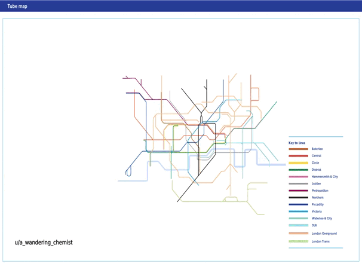

<style>

.center2 {
  margin: 0;
  position: absolute;
  top: 50%;
  left: 50%;
  -ms-transform: translate(-50%, -50%);
  transform: translate(-50%, -50%);
}

</style>

```{r setup, include = FALSE}
knitr::opts_chunk$set(echo = FALSE)
knitr::opts_chunk$set(out.width = "90%")
knitr::opts_chunk$set(fig.align="center")

options(htmltools.dir.version = FALSE)
library(knitr)
library(tidyverse)
library(xaringanExtra)
library(ggplot2)
library(plotly)
library(googlesheets4)
library(dplyr)
library(knitr)

# set default options
opts_chunk$set(
  echo = FALSE,
  warnings = FALSE,
  collapse = TRUE,
  fig.width = 7.252,
  fig.height = 4,
  dpi = 300
)
# set engines
knitr::knit_engines$set("markdown")
xaringanExtra::use_tile_view()
xaringanExtra::use_panelset()
xaringanExtra::use_clipboard()
xaringanExtra::use_webcam()
xaringanExtra::use_broadcast()
xaringanExtra::use_share_again()
xaringanExtra::style_share_again(
  share_buttons = c("twitter", "linkedin", "pocket")
)
# uncomment the following lines if you want to use the NHS-R theme colours by default
# scale_fill_continuous <- partial(scale_fill_nhs, discrete = FALSE)
# scale_fill_discrete <- partial(scale_fill_nhs, discrete = TRUE)
# scale_colour_continuous <- partial(scale_colour_nhs, discrete = FALSE)
# scale_colour_discrete <- partial(scale_colour_nhs, discrete = TRUE)
```

---
.center2[
# Welcome
]

---
# Presentation 

--

.pull-left[
- Guillermo (Billy) Woo-Mora
- From Mexico 🇲🇽
- 4th year PhD candidate at PSE
- 📧 guillermo.woo-mora@psemail.eu
- Research interests:
  - Political economy of development
  - Historical economics
  - Social/Cultural economics
]

--

.pull-right[
- *Durable or persistent inequalities*:

Long-term impacts of segregation policies

```{r, out.width="80%"}
knitr::include_graphics("imgs/IoR1.png")
```

]

---
# Presentation 

.pull-left[
- Guillermo (Billy) Woo-Mora
- From Mexico 🇲🇽
- 4th year PhD candidate at PSE
- 📧 guillermo.woo-mora@psemail.eu
- Research interests:
  - Political economy of development
  - Historical economics
  - Social/Cultural economics
]

.pull-right[
- *Durable or persistent inequalities*:

Long-term impacts of segregation policies

```{r, out.width="90%"}

```

]

---
# Presentation 

.pull-left[
- Guillermo (Billy) Woo-Mora
- From Mexico 🇲🇽
- 4th year PhD candidate at PSE
- 📧 guillermo.woo-mora@psemail.eu
- Research interests:
  - Political economy of development
  - Historical economics
  - Social/Cultural economics
]

.pull-right[
- *Durable or persistent inequalities*:

Between-group (skin tone) disparities and discrimination 
```{r, out.width="90%"}

```

]

---
# Presentation 

.pull-left[
- Guillermo (Billy) Woo-Mora
- From Mexico 🇲🇽
- 4th year PhD candidate at PSE
- 📧 guillermo.woo-mora@psemail.eu
- Research interests:
  - Political economy of development
  - Historical economics
  - Social/Cultural economics
]

.pull-right[
- *Populism: origins and consequences*:

Populist policies and populist leaders economic effects
```{r, out.width="90%"}

```

]

---
# Presentation 

.pull-left[
- Guillermo (Billy) Woo-Mora
- From Mexico 🇲🇽
- 4th year PhD candidate at PSE
- 📧 guillermo.woo-mora@psemail.eu
- Research interests:
  - Political economy of development
  - Historical economics
  - Social/Cultural economics
- A funny story or a interesting fact...
]

--
.center[
### Now, your turn 😃
]

---
# Microeconomics

--

.center[
#### Behavior and decision-making processes of individual agents in an economy, including their strategic interactions and the resulting economic outcomes
]

--

- Preferences
- Incentives
- Scarcity or constrains
- Optimization: be in the best possible scenario

.center[
### Trade-offs
]

--

```{r, out.width="40%"}
knitr::include_graphics("https://media.licdn.com/dms/image/v2/D5612AQEorukOyNaZ6w/article-cover_image-shrink_720_1280/article-cover_image-shrink_720_1280/0/1728490927733?e=2147483647&v=beta&t=PiEp2HBIiMMMl35veBHY9AUDvjuFuOhmPSIze8I47Bc")
```


---
# Microeconomics I and II

.pull-left[
### Micro I (First semester)

Decision-making of **consumers** and **producers** and the determination of **prices** in a **competitive economy**. 

**Partial equilibrium** analysis of **competitive markets**.

]

--

.pull-right[
### Micro II (Second semester)

1. **Effects of public policies** supporting prices and production on the **welfare of consumers and producers**. 

2. **Imperfectly competitive market structures**: how decisions of producers and consumers who have **market power** and can influence prices.

3. **General equilibrium**: markets interact with each other and **efficiency**.
]

--

.center[
#### Pindyck and Rubinfeld's *Microeconomics* (2020), Ninth Edition.
]

---
# Microeconomics II

.center[
#### Pindyck and Rubinfeld's *Microeconomics* (2020), Ninth Edition.
]

 - Chapter 8: Profit maximization and competitive supply (Short recap)
 - Chapter 9: The Analysis of Competitive Markets
 - Chapter 10: Market Power: Monopoly and Monopsony
 - Chapter 11: Pricing with Market Power
 - Chapter 12: Monopolistic Competition and Oligopoly
 - Chapter 16: General Equilibrium and Economic Efficiency
 - Chapter 18: Externalities and Public Goods*

--

Approx. two classes per chapter, with 45-60 minutes per chapter to solve exercises.

Will try to have a short break (10 min.) per class if time allows.

--

📆 [Google calendar with course's dates](https://calendar.google.com/calendar/u/0?cid=MTIxNjNhYWM4OTIxYzIzMjU1NDBiNTIxNmIzMjVmOTkxOTAzMzJmZDFlNTk4M2IwY2JlOTRjYTU0NTUzZDU4ZUBncm91cC5jYWxlbmRhci5nb29nbGUuY29t)

📄 [Syllabus with content by date](https://github.com/woomora/psl-micro-II/blob/2df329b771c0b37b702cebb2a46cf7d4dd5b64c4/PSL%202025%20Spring%20%E2%80%93%20Micro%20II.pdf)

---

# Course policies

--

## Grading

1. Final exam 70%
2. TD and surprise quizzes 15%
3. Paper summary 15%

--

## Policies

- Respect your classmates and instructor. Harassment of any kind will not be tolerated.
- **No electronic devices (computers, cellphones, tablets) are allowed during lectures.** Want evidence? [Read this](https://www.nytimes.com/2017/11/22/business/laptops-not-during-lecture-or-meeting.html?rref=collection%2Fsectioncollection%2Fbusiness&action=click&contentCollection=business&region=rank&module=package&version=highlights&contentPlacement=12&pgtype=sectionfront).
- Academic integrity is mandatory. Cite all sources properly. **Cheating during exams or using ChatGPT as a substitute rather than a complement will result in strict penalties.**
- If the classroom environment becomes disruptive (e.g., excessive noise), the class will be terminated, and the subject will be considered complete.


---
.center2[
# Microeconomics 
]

---
# Models

```{r, out.width="60%"}

```

---

```{r out.width="100%", fig.align='center'}
knitr::include_graphics("imgs/montorgueil1.png")
```

---

```{r out.width="100%", fig.align='center'}

```

---

```{r out.width="80%", fig.align='center'}
knitr::include_graphics("imgs/montorgueil3.png")
```

---

```{r out.width="45%", fig.align='center'}

```

La Rue Montorgueil. Claude Monet.

--

### Like impressionist paintings, the economy is made up of individual different actions.

---
# Micro is a useful tool

```{r, out.width="70%"}
knitr::include_graphics("imgs/meme1.jpeg")
```

---
# Beware of *Market fundamentalist* ! (Basu, 2010)

```{r, out.width="50%"}
knitr::include_graphics("imgs/economix.png")
```

---
.center2[
# Recap: Demand
]

---
# Demand

```{r, out.width="50%"}

```

---
# Demand

$$ max \; U(x_1, x_2) \quad s.t. \; p_1 \cdot x_1 + p_2 \cdot x_2 = I $$

```{r, include=F}
# Load necessary libraries
library(ggplot2)
library(dplyr)
library(scales)

# Given data with relative price
data <- tibble(
  x1 = c(4, 12, 20),
  x2 = c(6, 4, 5),
  p1 = c(2, 1, 0.5),
  p2 = rep(2, 3),
  I = rep(20, 3)
) |> 
  mutate(rel_price = p1 / p2)  # Compute relative price

# Generate budget lines using relative price
budget_lines <- data %>%
  rowwise() %>%
  mutate(
    budget_x1 = list(seq(0, 25, length.out = 100)),
    budget_x2 = list((I / p2) - rel_price * budget_x1)  # Using rel_price instead of p1
  ) %>%
  unnest(c(budget_x1, budget_x2))

# Indifference Curve Function (Cobb-Douglas Approximation)
indifference_curve <- function(x1, U, alpha = 0.5) {
  return((U / (x1^alpha))^(1/(1-alpha)))
}

# Compute utility levels based on Cobb-Douglas
data <- data %>%
  mutate(U = round(x1^0.5 * x2^0.5))

# Generate Indifference Curves
indiff_curves <- data %>%
  rowwise() %>%
  mutate(
    indiff_x1 = list(seq(1, 25, length.out = 100)),
    indiff_x2 = list(indifference_curve(indiff_x1, U))
  ) %>%
  unnest(c(indiff_x1, indiff_x2))
```


---
# Demand

$$ max \; U(x_1, x_2) \quad s.t. \; \textbf{1} \cdot x_1 + \textbf{2} \cdot x_2 = \textbf{20} $$
```{r, out.width="65%", warning=F}
# 1. Initial prices ----
base_plot <- 
  ggplot() +
  labs(
    title = "Price-Consumption Curve",
    x = "Quantity X1", y = "Quantity X2"
  ) +
  theme_classic() +
  scale_y_continuous(limits = c(0, 12), labels = label_number(accuracy = 1)) +
  scale_x_continuous(limits = c(0, 25)) 

base_plot +
  # Budget constrain
  geom_line(
    data = budget_lines |> filter(rel_price == 0.5), 
    aes(x = budget_x1, y = budget_x2), color = "#008ac4", lwd = 1.25, alpha = .5
  ) 
```

---
# Demand

$$ max \; U(x_1, x_2) \quad s.t. \; \textbf{1} \cdot x_1 + \textbf{2} \cdot x_2 = \textbf{20} $$

```{r, out.width="65%", warning=F}
# 2. Add utility and maximization ----

base_plot_u1 <- 
  base_plot +
  # Budget constraint
  geom_line(
    data = budget_lines |> filter(rel_price %in% c(0.5)), 
    aes(x = budget_x1, y = budget_x2), color = "#008ac4", lwd = 1.25, alpha = .5
  ) +
  # Utility curve
  geom_line(
    data = indiff_curves |> filter(rel_price %in% c(0.5)), 
    aes(x = indiff_x1, y = indiff_x2), color = "#af1a44", lwd = 1.5, alpha = .5
  ) +
  # Point (optimal consumption bundle)
  geom_point(
    data = data |> filter(rel_price %in% c(0.5)), 
    aes(x = x1, y = x2), color = "black", size = 3
  ) 

base_plot_u1 +
  # Vertical dashed line from x-axis to (x1, x2)
  geom_segment(
    data = data |> filter(rel_price %in% c(0.5)), aes(x = x1, xend = x1, y = 0, yend = x2),
    linetype = "dashed", color = "gray50"
  ) +
  # Horizontal dashed line from y-axis to (x1, x2)
  geom_segment(
    data = data |> filter(rel_price %in% c(0.5)), aes(x = 0, xend = x1, y = x2, yend = x2),
    linetype = "dashed", color = "gray50"
  ) +
  # Annotate text next to x-axis (Quantity of Good 1)
  geom_label(
    data = data |> filter(rel_price %in% c(0.5)), 
    aes(x = x1, y = 0.5, label = round(x1, 0)),
    color = "black", vjust = 1.2, size = 3
  ) +
  # Annotate text next to y-axis (Quantity of Good 2)
  geom_label(
    data = data |> filter(rel_price %in% c(0.5)), 
    aes(x = 0, y = x2, label = round(x2, 0)),
    color = "black", hjust = 1.2, size = 3
  )

```

```{r, warning=F}
# Create the demand curve plot
plot_demand <- 
ggplot() +
  theme_classic() +
  scale_y_continuous(limits = c(0, 2.5), breaks = seq(0, 2.5, 0.5)) +
  scale_x_continuous(limits = c(0, 25)) +
  labs(title = "Individual Demand Curve", x = "Quantity X1", y = "Price of X1") 
```


---
# Demand

$$ max \; U(x_1, x_2) \quad s.t. \; \textbf{1} \cdot x_1 + \textbf{2} \cdot x_2 = \textbf{20} $$

.pull-left[
```{r, out.width="100%", warning=F}
# 2. Add utility and maximization ----

base_plot_u1 <- 
  base_plot +
  # Budget constraint
  geom_line(
    data = budget_lines |> filter(rel_price %in% c(0.5)), 
    aes(x = budget_x1, y = budget_x2), color = "#008ac4", lwd = 1.25, alpha = .5
  ) +
  # Utility curve
  geom_line(
    data = indiff_curves |> filter(rel_price %in% c(0.5)), 
    aes(x = indiff_x1, y = indiff_x2), color = "#af1a44", lwd = 1.5, alpha = .5
  ) +
  # Point (optimal consumption bundle)
  geom_point(
    data = data |> filter(rel_price %in% c(0.5)), 
    aes(x = x1, y = x2), color = "black", size = 3
  ) 

base_plot_u1 +
  # Vertical dashed line from x-axis to (x1, x2)
  geom_segment(
    data = data |> filter(rel_price %in% c(0.5)), aes(x = x1, xend = x1, y = 0, yend = x2),
    linetype = "dashed", color = "gray50"
  ) +
  # Horizontal dashed line from y-axis to (x1, x2)
  geom_segment(
    data = data |> filter(rel_price %in% c(0.5)), aes(x = 0, xend = x1, y = x2, yend = x2),
    linetype = "dashed", color = "gray50"
  ) +
  # Annotate text next to x-axis (Quantity of Good 1)
  geom_label(
    data = data |> filter(rel_price %in% c(0.5)), 
    aes(x = x1, y = 0.5, label = round(x1, 0)),
    color = "black", vjust = 1.2, size = 3
  ) +
  # Annotate text next to y-axis (Quantity of Good 2)
  geom_label(
    data = data |> filter(rel_price %in% c(0.5)), 
    aes(x = 0, y = x2, label = round(x2, 0)),
    color = "black", hjust = 1.2, size = 3
  )

```

]

.pull-right[
```{r, out.width="100%", warning=F}
plot_demand <- 
plot_demand +
  # Vertical dashed line from x-axis to (x1, x2)
  geom_segment(
    aes(x = 12, xend = 12, y = 0, yend = 1),
    linetype = "dashed", color = "gray50"
  ) +
  # Annotate text next to x-axis
  geom_text(
    aes(x = 12, xend = 12, y = 0, yend = 1),
    label = 12,
    color = "black", vjust = 1.2, size = 3
  ) +
  # Horizontal dashed line from y-axis to (x1, x2)
  geom_segment(
     aes(x = 0, xend = 12, y = 1, yend = 1),
    linetype = "dashed", color = "gray50"
  ) +
  # Annotate text next to y-axis
  geom_text(
    aes(x = 0, xend = 12, y = 1, yend = 1),
    label = 1,
    color = "black", hjust = 1.2, size = 3
  ) +
  # Point 1
  geom_point(aes(x = 12, y = 1), color = "black", size = 3) 

plot_demand

```
]

---
# Demand

$$ max \; U(x_1, x_2) \quad s.t. \; \textbf{2} \cdot x_1 + \textbf{2} \cdot x_2 = \textbf{20} $$

.pull-left[
```{r, out.width="100%", warning=F}
# 3. Price increase ----

base_plot_u1 +
  # Budget constrain
  geom_line(
    data = budget_lines |> filter(rel_price %in% c(1)), 
    aes(x = budget_x1, y = budget_x2), color = "#00a1d1", lwd = 1.25, alpha = .5
  ) 

```

]

.pull-right[
```{r, out.width="100%", warning=F}
plot_demand
```

]

.center[
Price increase
]

---
# Demand

$$ max \; U(x_1, x_2) \quad s.t. \; \textbf{2} \cdot x_1 + \textbf{2} \cdot x_2 = \textbf{20} $$

.pull-left[
```{r, out.width="100%", warning=F}
# 4. Utility after Price increase ----

base_plot_u2 <- 
base_plot_u1 +
  # Budget constrain
  geom_line(
    data = budget_lines |> filter(rel_price %in% c(1)), 
    aes(x = budget_x1, y = budget_x2), color = "#00a1d1", lwd = 1.25, alpha = .5
  ) +
  # Utility
  geom_line(
    data = indiff_curves |> filter(rel_price %in% c(1)), 
    aes(x = indiff_x1, y = indiff_x2), color = "#e0566a", lwd = 1.5, alpha = .5
  ) +
  # Point
  geom_point(
    data = data |> filter(rel_price %in% c(1)), 
    aes(x = x1, y = x2), color = "black", size = 3
  )

base_plot_u2 +
  # Vertical dashed line from x-axis to (x1, x2)
  geom_segment(
    data = data |> filter(rel_price %in% c(1)), aes(x = x1, xend = x1, y = 0, yend = x2),
    linetype = "dashed", color = "gray50"
  ) +
  # Horizontal dashed line from y-axis to (x1, x2)
  geom_segment(
    data = data |> filter(rel_price %in% c(1)), aes(x = 0, xend = x1, y = x2, yend = x2),
    linetype = "dashed", color = "gray50"
  ) +
  # Annotate text next to x-axis (Quantity of Good 1)
  geom_label(
    data = data |> filter(rel_price %in% c(1)), 
    aes(x = x1, y = 0.5, label = round(x1, 0)),
    color = "black", vjust = 1.2, size = 3
  ) +
  # Annotate text next to y-axis (Quantity of Good 2)
  geom_label(
    data = data |> filter(rel_price %in% c(1)), 
    aes(x = 0, y = x2, label = round(x2, 0)),
    color = "black", hjust = 1.2, size = 3
  )
```
]

.pull-right[
```{r, out.width="100%", warning=F}
plot_demand_2 <- 
  plot_demand +
  # Vertical dashed line from x-axis to (x1, x2)
  geom_segment(
    aes(x = 4, xend = 4, y = 0, yend = 2),
    linetype = "dashed", color = "gray50"
  ) +
  # Annotate text next to x-axis
  geom_text(
    aes(x = 4, xend = 4, y = 0, yend = 2),
    label = 4,
    color = "black", vjust = 1.2, size = 3
  ) +
  # Horizontal dashed line from y-axis to (x1, x2)
  geom_segment(
    aes(x = 0, xend = 4, y = 2, yend = 2),
    linetype = "dashed", color = "gray50"
  ) +
  # Annotate text next to y-axis
  geom_text(
    aes(x = 0, xend = 4, y = 2, yend = 2),
    label = 2,
    color = "black", hjust = 1.2, size = 3
  ) +
  # Point 1
  geom_point(aes(x = 4, y = 2), color = "black", size = 3) 

plot_demand_2
```
]

.center[
Price increase
]

---
# Demand

$$ max \; U(x_1, x_2) \quad s.t. \; \textbf{0.5} \cdot x_1 + \textbf{2} \cdot x_2 = \textbf{20} $$

.pull-left[
```{r, out.width="100%", warning=F}
# 5. Price decrease ----

base_plot_u2 +
  # Budget constrain
  geom_line(
    data = budget_lines |> filter(rel_price %in% c(0.25)), 
    aes(x = budget_x1, y = budget_x2), color = "#74b7d8", lwd = 1.25, alpha = .5
  ) 

```
]

.pull-right[
```{r, out.width="100%", warning=F}
plot_demand_2
```
]

.center[
Price decrease
]

---
# Demand

$$ max \; U(x_1, x_2) \quad s.t. \; \textbf{0.5} \cdot x_1 + \textbf{2} \cdot x_2 = \textbf{20} $$

.pull-left[
```{r, out.width="100%", warning=F}
# 6. Utility after Price increase ----

base_plot_u3 <- 
  base_plot_u2 +
  # Budget constrain
  geom_line(
    data = budget_lines |> filter(rel_price %in% c(0.25)), 
    aes(x = budget_x1, y = budget_x2), color = "#74b7d8", lwd = 1.25, alpha = .5
  ) +
  # Utility
  geom_line(
    data = indiff_curves |> filter(rel_price %in% c(0.25)), 
    aes(x = indiff_x1, y = indiff_x2), color = "#e0566a", lwd = 1.5, alpha = .5
  ) +
  # Point
  geom_point(
    data = data |> filter(rel_price %in% c(0.25)), 
    aes(x = x1, y = x2), color = "black", size = 3
  )

base_plot_u3 +
  # Vertical dashed line from x-axis to (x1, x2)
  geom_segment(
    data = data |> filter(rel_price %in% c(0.25)), aes(x = x1, xend = x1, y = 0, yend = x2),
    linetype = "dashed", color = "gray50"
  ) +
  # Horizontal dashed line from y-axis to (x1, x2)
  geom_segment(
    data = data |> filter(rel_price %in% c(0.25)), aes(x = 0, xend = x1, y = x2, yend = x2),
    linetype = "dashed", color = "gray50"
  ) +
  # Annotate text next to x-axis (Quantity of Good 1)
  geom_label(
    data = data |> filter(rel_price %in% c(0.25)), 
    aes(x = x1, y = 0.5, label = round(x1, 0)),
    color = "black", vjust = 1.2, size = 3
  ) +
  # Annotate text next to y-axis (Quantity of Good 2)
  geom_label(
    data = data |> filter(rel_price %in% c(0.25)), 
    aes(x = 0, y = x2, label = round(x2, 0)),
    color = "black", hjust = 1.2, size = 3
  )


```
]

.pull-right[
```{r, out.width="100%", warning=F}
plot_demand_3 <- 
  plot_demand_2 +
  # Vertical dashed line from x-axis to (x1, x2)
  geom_segment(
    aes(x = 20, xend = 20, y = 0, yend = 0.5),
    linetype = "dashed", color = "gray50"
  ) +
  # Annotate text next to x-axis
  geom_text(
    aes(x = 20, xend = 20, y = 0, yend = 0.5),
    label = 20,
    color = "black", vjust = 1.2, size = 3
  ) +
  # Horizontal dashed line from y-axis to (x1, x2)
  geom_segment(
    aes(x = 0, xend = 20, y = 0.5, yend = 0.5),
    linetype = "dashed", color = "gray50"
  ) +
  # Annotate text next to y-axis
  geom_text(
    aes(x = 0, xend = 20, y = 0.5, yend = 0.5),
    label = .5,
    color = "black", hjust = 1.2, size = 3
  ) +
  # Point 1
  geom_point(aes(x = 20, y = 0.5), color = "black", size = 3) 
plot_demand_3
```
]

.center[
Price decrease
]

---
# Demand

$$Q_D = Q_D(P) $$

```{r, out.width="75%", warning=F}
plot_demand_3 +
  # Line joining (4,2) to (12,1)
  geom_segment(
    aes(x = 4, xend = 12, y = 2, yend = 1),
    color = "#008ac4", lwd = 1.2, alpha = .5
  ) +
  # Line joining (12,1) to (20,0.5)
  geom_segment(
    aes(x = 12, xend = 20, y = 1, yend = 0.5),
    color = "#008ac4", lwd = 1.2, alpha = .5
  )
```


---
.center2[
# Recap: Supply
]

---
# Supply

```{r, out.width="50%"}

```

.center[
### Firms can set either **Price** or **Quantity** depending on the market structure
]


---
# Supply

```{r, out.width="50%"}

```

$$ max \; \Pi = P \cdot Q - C(Q) \quad s.t. \; Q = Q(P) \; or \; P = P(Q) $$
---
# (Competitive) Supply

.center[
### Firms are price takes
]

$$ max_{Q} \; \Pi = P \cdot Q - C(Q) \quad s.t. \; P = P(Q) $$

---
# (Competitive) Supply

**Price-taking firms** cannot benefit from choosing a different price from the market price, and cannot influence the market price.

--

```{r out.width="50%", fig.align='center'}

```

A bakery has an increasing MC curve. On the AC curve, profit is zero. When MC > AC, the AC curve slopes upward. The other isoprofit curves represent higher levels of profit, and MC passes through the lowest points of all the isoprofit curves.

---
# (Competitive) Supply

**Price-taking firms** cannot benefit from choosing a different price from the market price, and cannot influence the market price.

```{r out.width="50%", fig.align='center'}

```

The bakery is a price-taker. The market price is $P^*$ = 2.35. If you choose a higher price, customers will go to other bakeries. Your feasible set of prices and quantities is the area below the horizontal line at $P^*$.

---
# (Competitive) Supply

**Price-taking firms** cannot benefit from choosing a different price from the market price, and cannot influence the market price.

```{r out.width="50%", fig.align='center'}

```

The point of highest profit in the feasible set is point A, where the 80 isoprofit curve is tangent to the feasible set. You should make 120 loaves per day, and sell them at the market price, 2.35 each. 

---
# (Competitive) Supply

**Price-taking firms** cannot benefit from choosing a different price from the market price, and cannot influence the market price.

```{r out.width="50%", fig.align='center'}

```

Your profit-maximizing quantity, $Q^*$ = 120, is found at the point where $P^*$ = MC: the marginal cost of the 120th loaf is equal to the market price.

$$MC=P \iff (\textit{slope of isoprofit} = 0)$$

---
# (Competitive) Supply

```{r out.width="65%", fig.align='center'}

```

When the market price is 2.35, you supply 120 loaves. **Note**: Firm chooses quantity, not price.

What would you do if the price changed? 

---
# (Competitive) Supply

```{r out.width="65%", fig.align='center'}

```

If $P^*$ were to rise to 3.20, you could reach a higher isoprofit curve. To maximize profit you should produce 163 loaves per day.

---
# (Competitive) Supply

```{r out.width="65%", fig.align='center'}

```

If the price falls to 1.52 you could reach only the lightest blue curve. Your best choice would be 66 loaves, and your economic profit would be zero. 

---
# (Competitive) Supply

```{r out.width="65%", fig.align='center'}

```

In each case, you choose the point on your marginal cost curve where **MC = market price**. Your **marginal cost curve** is your **supply curve**.

---
# (Competitive) Supply

```{r out.width="65%", fig.align='center'}

```

There are 50 bakeries, all with the same cost functions. If the market price is €2.35, each bakery will produce 120 loaves.

---
# (Competitive) Supply

```{r out.width="65%", fig.align='center'}

```

When P = 2.35, each bakery supplies 120 loaves, and the market supply is 50 × 120 = 6,000 loaves.

---
# (Competitive) Supply

```{r out.width="65%", fig.align='center'}

```

At a price of 1.52 they each supply 66 loaves, and market supply is 3,300. The market supply curve looks like the firm’s supply curve, but the scale on the horizontal axis is different.

---
# (Competitive) Supply

```{r out.width="65%", fig.align='center'}

```

If the bakeries had different cost functions, then at a price of 2.35 some bakeries would produce more loaves than others, but we could still add them together to find market supply.

---
.center2[
# Recap: Competitive equilibrium
]

---
.center[
## Perfectly competitive markets 
]

.pull-left[

A hypothetical market in which:

1. The good or service being exchanged is homogeneous
2. Very large number of potential buyers and sellers
3. Buyers and sellers all act independently of one another
4. Price information easily available to buyers and sellers

]

--

.pull-right[

Some characteristics:

- **Law of One Price**: All transactions take place at a **single price**.
- At that price, **the market clears (supply = demand)**.
- Buyers and sellers are all **price-takers**.
- All potential **gains from trade** are realized.

]


---
# Does this model holds in reality?

--

.center[
Perfect competition may not hold completely in reality, but can be a good approximation to actual firm behaviour.
]

--

.center[
### Let's falsify the theory
]

```{r, out.width="50%"}
knitr::include_graphics("https://m.wsj.net/video/20150706/070615traders2/070615traders2_1280x720.jpg")
```

Hear the instructions.

---

See how you behaved in a perfectly competitive setting:

```{r, echo=F, warning=F, out.width="90%", message=F}
# Load data from Google Sheets
sheet_url <- "https://docs.google.com/spreadsheets/d/1GVUXbQ1DbXyjjo2ShqqHXb4QiUV2hq8_DkwWGj43ymU/edit?usp=sharing"
mrkt_pit <- read_sheet(sheet_url) |> janitor::clean_names()
  
# Aggregate the supply
supply <- 
  mrkt_pit |> 
  select(budget)  |>  
  group_by(budget)  |>  
  summarise(
    q = n()
  )  |>  
  ungroup()  |>  
  rename(
    price = budget
  )  |>  
  bind_rows(
    tibble(
      price = c(1,2,4),
      q = rep(0,3),
    )
  )  |>  
  arrange(price)

# Aggregate the supply
demand <- 
  mrkt_pit  |>  
  select(cost)  |>  
  group_by(cost)  |>  
  summarise(
    q = n()
  )  |>  
  ungroup()  |>  
  rename(
    price = cost
  )  |>  
  bind_rows(
    tibble(
      price = c(9,10),
      q = rep(0,2),
    )
  )  |>  
  arrange(price)

# Market equilibrium
mkt_eq <- 
  demand  |>  
  mutate(
    type = "WTP",
    type2 = "Demand"
  )  |>  
  bind_rows(
    supply |>  
      mutate(
        type = "WTS",
        type2 = "Supply"
      ) 
  )  |>  
  mutate(
    prince = as.integer(price)
  )

# Plot of WTP and WTS
mkt_eq  |>  
  ggplot(aes(q, price, color = type)) +
  geom_point(size = 2.5) +
  labs(
    x = "Quantity",
    y = "Price (P)",
    color = ""
  ) +
  scale_y_continuous(breaks = seq(1,10)) +
  scale_color_manual(values = c("#008ac4", "#af1a44")) +
  geom_smooth(method = "lm", formula = 'y ~ x', se = F, lwd = 1.25, alpha = .25) +
  facet_wrap(~type) +
  theme_classic()

```

---

See how you behaved in a perfectly competitive setting:

```{r, echo=F, warning=F, out.width="90%", message=F}
# Plot of supply and demand
mkt_eq  |>  
  ggplot(aes(q, price, color = type2)) +
  geom_point(size = 2.5) +
  labs(
    x = "Quantity (Q)",
    y = "Price (P)",
    color = ""
  ) +
  scale_y_continuous(breaks = seq(1,10)) +
  scale_color_manual(values = c("#008ac4", "#af1a44")) +
  geom_smooth(method = "lm", formula = 'y ~ x', se = F, lwd = 1.25, alpha = .25) +
  theme_classic()

```

Which would be the price in competitive equilibrium?

---

See how you behaved in a perfectly competitive setting:

```{r, echo=F, warning=F, out.width="80%", message=F}
# Histogram with market equilibrium price
mrkt_pit  |>  
  ggplot(aes(price)) +
  geom_histogram(color = "grey50", fill = "grey50") +
  scale_x_continuous(breaks = seq(0, 15, .5)) +
  labs(
    x = "Price (P)",
    y = "Number of transactions (Q)",
  ) +
  theme_classic()
```

Most transactions are near the predicted price in competitive equilibrium.


---
# What happens in other contexts?

.pull-left[
### One or few suppliers
```{r, out.width="90%"}
knitr::include_graphics("https://images.theconversation.com/files/211745/original/file-20180323-54898-1dnsu0o.png?ixlib=rb-4.1.0&rect=700%2C0%2C2514%2C1255&q=45&auto=format&w=1356&h=668&fit=crop")
```
]

.pull-right[
### One or few buyers
```{r, out.width="90%"}
knitr::include_graphics("https://www.francetvinfo.fr/pictures/rCVg3RGLSXobECMSL0T27N_pvB8/0x293:4096x2580/1500x843/2013/02/26/03381534_1.jpg")
```
]


---
# What about considering some policies?

.pull-left[
### Tariffs
```{r, out.width="90%"}
knitr::include_graphics("imgs/trump_tariffs.png")
```
]

.pull-right[
### Capped prices
```{r, out.width="90%"}

```
]

---
# Summary

- Competitive markets work under a specific set of assumptions
- Firm behavior varies substantially with market structure
- Policies have implications for welfare and efficiency
- Need to understand all of the above to inform and design policy